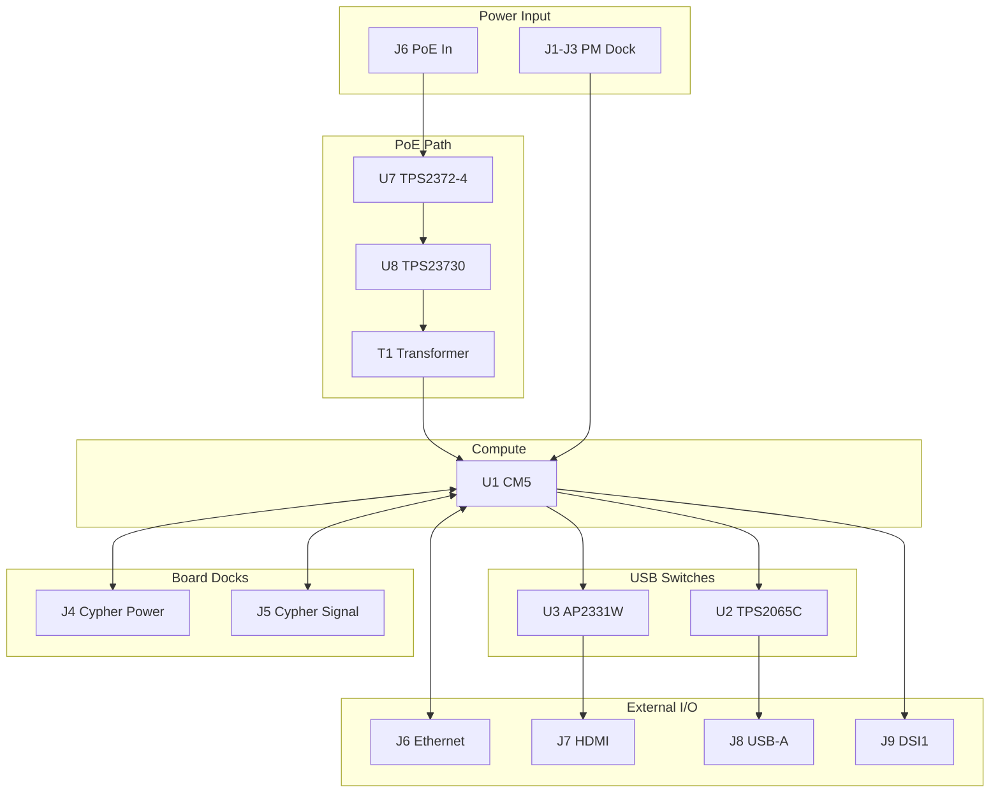

# Controller Board (V1.0) Design Specification

**Status:** In Review
**Project:** Enigma-NG
**Author:** Izzyonstage & GitHub Copilot
**Version:** v.0.1.0
**Associated Hardware Revision:** Rev A
**Last Updated:** 2026-09-17

---

## 1. Overview

The Controller Board is a custom carrier board for the Raspberry Pi Compute Module 5 (CM5), providing the
central processing and supervisory function for the Enigma-NG system. It is the fixed mechanical
motherboard of the enclosure: the removable Power Module and the Cypher Board both dock into the
Controller, and all enclosure-edge I/O is grouped on the Controller side.

* **Module:** Raspberry Pi Compute Module 5 (CM5).
* **Role:** Master traffic controller for power, external I/O, and encryption logic.
* **Stackup:** 6-Layer / 2oz Finished Copper per `design/Standards/Global_Routing_Spec.md §2.3.3` (required for 5Gbps differential pair integrity).
* **Shielding:** High-speed signals (Ethernet, USB 3.0, HDMI, USB 2.0) routed as Striplines on L2–L5,
  with GND copper pours on all layers providing inter-layer shielding; L1 and L6 outer layers carry
  SMT components, power fills, and JTAG/silkscreen respectively.
* **RJ45 / PoE:** Ethernet entry, magnetics, ESD, and the PoE front-end are hosted locally on the Controller.
  The PoE front-end delivers its regulated auxiliary output to the Power Module over `J2`.
* **Power from PM:** The Controller receives `5V_MAIN` and `3V3_ENIG` from the Power Module over `J1`.
* **Status LED:** The Controller can override the PM status LED with full-colour control via the I2C connection over `J3`.

### GND_CHASSIS Single-Point Bond

Per `design/Standards/Global_Routing_Spec.md §5`, the Controller implements a local
`GND_CHASSIS` net tied to its mounting hardware, connector-shield / EMI landing features, and any
other deliberate enclosure-contact points, but it does **not** implement a local
GND-to-GND_CHASSIS bond. The system's only galvanic GND ↔ GND_CHASSIS bond remains on the Power
Module at the common power-entry point immediately before the eFuse, regardless of which input
source is active.

### Functional & Design Requirements

#### Functional Requirements

| ID | Functional Requirement | Notes | Satisfied By / Cross-Ref |
| :--- | :--- | :--- | :--- |
| FR-CTL-01 | Host the Raspberry Pi Compute Module 5 as the system master processor | CM5 runs the Linux OS and all application logic | BOM U1 (CM5) |
| FR-CTL-02 | Receive regulated rails from the Power Module and distribute them to the CM5, Cypher Board, and local peripherals | Via PM dock `J1` and Cypher power dock `J4` | §2 Dock Interfaces; BOM J1-J3, J4 |
| FR-CTL-03 | Provide the system's enclosure-edge external I/O interfaces | GbE / PoE entry, HDMI, USB 3.0 | §7 Connectivity; BOM J6, J7, J8 |
| FR-CTL-04 | Route CM5 USB 2.0 D+/D- to the Cypher Board's native USB-JTAG bridge | Via Cypher signal dock `J5` | §7 Connectivity; BOM J5 |
| FR-CTL-05 | Monitor system power and PM status via I²C, with only essential direct PM handshakes kept as dedicated pins | Telemetry: LTC3350 @ 0x09, STUSB4500 @ 0x28, PCA9534A @ 0x3F, INA219 x2 (PM U10 @ 0x40 on `I2C0`; Cypher U2 @ 0x40 on `I2C1` — same address, independent buses, see DEC-101); Direct handshakes: `PWR_GD`, `ROTOR_EN_N`, `PWR_BUT_N`, `LED_PWR_N` | §3 Telemetry & Logic; §5 CM5 GPIO Mapping Matrix |
| FR-CTL-06 | Maintain RTC operation across power cycles using a CR2032 backup battery | Non-rechargeable; service by disassembly | §5 RTC Backup Battery; BOM BT1, D1 (BAT54) |
| FR-CTL-07 | Provide six independent CM5 I²C bus instances: one PM-dedicated bus plus five routed to the Cypher Board (two active, three reserved for future expansion) | `I2C0` (PM-dedicated) via PM dock `J3`; `I2C1` (Cypher-local devices) + `I2C2` (Cypher-peripherals / USM / HID lighting) + `I2C3`/`I2C4`/`I2C6` (reserved) via Cypher signal dock `J5` | §3.1 I²C Bus Topology; §7 Connectivity; BOM J3, J5 |
| FR-CTL-08 | Provide DSI1 display interface connector for optional lid-mounted touchscreen add-on | DSI1 4-lane FPC connector (J9) on Controller Board, routed to CM5 MIPI1; display add-on board to be designed separately | §7 Connectivity; BOM J9 |
| FR-CTL-09 | Reserve CM5 PWM and GPCLK channels for future peripheral expansion | 4x `PWM0` channels + `GPCLK[0]`/`GPCLK[1]`, routed to the Cypher Board's bare test pads via Cypher signal dock `J5`; no active devices populated at this time | §5 CM5 GPIO Mapping Matrix; §7 Connectivity; BOM J5 |

#### Design Requirements

| ID | Design Requirement | Specification | Satisfied By / Cross-Ref |
| :--- | :--- | :--- | :--- |
| DR-CTL-01 | PCB stackup | Stackup per `design/Standards/Global_Routing_Spec.md §2.3.3` | §8 PCB Fabrication & Stackup |
| DR-CTL-02 | CM5 module | Raspberry Pi Compute Module 5. Multiple current CM5 variants are acceptable. Minimum spec: 4 GB RAM and 8 GB eMMC; on-board Wi-Fi may be fitted or omitted. CM5 Lite (no onboard eMMC) is NOT permitted. BOM reference: various CM5 SKUs. | BOM U1 |
| DR-CTL-03 | Controller-to-Power-Module dock connectors | `J1/J2/J3` = TE `1-1674231-1` 10-position 2.5mm receptacles | BOM J1-J3 |
| DR-CTL-04 | Controller-to-Cypher power dock connector | `J4` = Molex `2195630015` hybrid receptacle (CTL) / `2195620015` hybrid plug (Cypher); power-only, zero signal contacts: 5x power-pitch contacts = `GND`; 8x signal-pitch contacts = `5V_MAIN`; 7x signal-pitch contacts = `3V3_ENIG`. `GND` is carried on the larger power-pitch contacts so it mates first. See DEC-098. | §7.2; BOM J4 |
| DR-CTL-05 | USB current limit | 1.6 A via TPS2065C; fault output to GPIO 19 (USB_FAULT_N) | BOM U2 (TPS2065C); §6 GPIO Mapping (GPIO 19) |
| DR-CTL-06 | RTC battery holder | BT1 = Keystone 3034TR (SMD horizontal CR2032 retainer; `TR` = tape-reel packaging) | §5 RTC Backup Battery; BOM BT1 (Keystone 3034TR) |
| DR-CTL-07 | RTC protection | D1 = BAT54 Schottky diode (blocks PMIC VBAT charge path) | §5 RTC Backup Battery; BOM D1 (BAT54) |
| DR-CTL-08 | RTC bypass capacitor | C6 = 100 nF 0402 on CM5 VBAT (Pin 76, Hirose DF40 200-pin) | §5 RTC Backup Battery; BOM C6 |
| DR-CTL-09 | PM status / SW1 LED interface | Controller must expose the shared `I2C0` bus plus one optional interrupt input (`PM_IO_INT_N`) to the PM-local `PCA9534A @ 0x3F`, which virtualises `POE_STAT`, `USB_STAT`, `BATT_PRES_N`, `SYS_FAULT`, and runtime `SW_LED_R/G/B + SW_LED_CTRL`. | §3.1 I²C Bus Topology; §5 CM5 GPIO Mapping Matrix |
| DR-CTL-10 | OS/firmware configuration | All firmware configuration requirements (including RTC charging disable) are specified in the Linux OS design spec. See `design/Software/Linux_OS/`. | design/Software/Linux_OS/ |
| DR-CTL-11 | DSI1 connector | J9 = Amphenol F52Q-1A7H1-11015, 15-pin 1.0mm pitch right-angle ZIF/FPC connector; routed to CM5 MIPI1 (not MIPI0 — see DEC-099): DSI1 4-lane = `MIPI1_C_P`/`MIPI1_C_N` (CM5 200-pin DF40 pins 189/187), `MIPI1_D0_P`/`MIPI1_D0_N` (177/175), `MIPI1_D1_P`/`MIPI1_D1_N` (183/181), `MIPI1_D2_P`/`MIPI1_D2_N` (195/193), `MIPI1_D3_P`/`MIPI1_D3_N` (196/194) = 10 differential signals; 100 Ω differential impedance; route on L3 (stripline, same as HDMI); capacitive touch I²C may share `I2C6` (see DR-CTL-13) when the deferred display add-on is defined | §7 Connectivity; BOM J9 |
| DR-CTL-12 | Controller-to-Cypher signal dock connector | `J5` = Samtec `QSS-025-01-L-D-A-GP-K` (CTL, vertical female) mating Cypher `J2` `QTS-025-01-L-D-RA-P` (right-angle male); signal-only, zero power rails; 50-pin map per `Board_Layout.md §2`: `PWM0[0-3]`, `GPCLK[0]`/`GPCLK[1]`, `USB_D_PLUS`/`USB_D_MINUS`, `I2C1_SDA`/`SCL` (active), `I2C2`/`I2C3`/`I2C4`/`I2C6` `SDA`/`SCL` (reserved), all remaining pins `GND`. See DEC-098. | §7.3; BOM J5 |
| DR-CTL-13 | CM5 I²C bus architecture | Six independent RP1 I²C controller instances allocated: `I2C0` (GPIO8/9) PM-dedicated, routed via PM dock `J3`; `I2C1` (GPIO2/3) active Cypher-peripherals bus (existing wiring, unchanged), routed via Cypher signal dock `J5`; `I2C2` (GPIO4/5), `I2C3` (GPIO6/7), `I2C4` (GPIO34/35), `I2C6` (GPIO38/39) reserved/NC on the Cypher Board for future expansion, also routed via `J5`. `I2C6` requires DSI1 (`J9`) to be routed to CM5 MIPI1 rather than MIPI0 (see DR-CTL-11), since `I2C6`'s GPIO pair is shared silicon with the MIPI0 control bus and is only free when MIPI0 is unused. See §3.1, §5, DEC-099. | §3.1 I²C Bus Topology; §5 CM5 GPIO Mapping Matrix; BOM J3, J5 |
| DR-CTL-14 | Power switch Vcc bypass capacitors | U2 (TPS2065CDBVR) and U3 (AP2331W-7) shall each have a dedicated 100nF X7R 50V 0402 bypass capacitor on their Vcc pin, placed within 1mm of the IC per `design/Standards/Global_Routing_Spec.md §3.2` | BOM: C13 (U2 bypass), C14 (U3 bypass) |
| DR-CTL-15 | PoE IC bypass capacitors | U7 (TPS2372-4RGWR) and U8 (TPS23730RMTR) shall each have a dedicated 100nF X7R 50V 0402 bypass capacitor on their VCC pin, placed within 1mm of the IC per `design/Standards/Global_Routing_Spec.md §3.2`. BOM: C18 (U7 bypass), C19 (U8 bypass) | BOM C18, C19 |
| DR-CTL-16 | CM5 PWM/GPCLK reservation | `PWM0[0]`-`PWM0[3]` (GPIO12-15) and `GPCLK[0]`/`GPCLK[1]` (GPIO20/18) are routed to the Cypher signal dock `J5`, terminating at bare test-pad loops (`TP1`-`TP6`, each with an adjacent `GND` test-pad loop `TP7`-`TP12`) on the Cypher Board. No active devices are populated at this time. Any future production use of these signals requires local buffering/re-driving at each downstream board entry point — routing an unbuffered CM5 clock or PWM signal over a long backplane trace is not acceptable (see DEC-022 precedent, where this exact failure mode was found for the JTAG Module's clock source). See DEC-099. | §5 CM5 GPIO Mapping Matrix; BOM J5 |
| DR-CTL-17 | PoE ACF primary-side clamp capacitor | C17 (22nF X7R 200V 0805) shall be placed in the U8 (TPS23730RMTR) primary-side active-clamp circuit as the Cclamp energy-storage capacitor. A 200V voltage rating is specified: worst-case Vclamp = Vin×D/(1−D) = 36×0.667/0.333 = 72V; at 72V/100V = 72% of a 100V-rated part, X7R DC bias derating reduces effective capacitance to approximately 15–18nF, well below the 19.9nF minimum. A 200V part at 72V/200V = 36% of rating derates by only ~5%, giving effective capacitance ≈21nF. Package is 0805 minimum to achieve 22nF at 200V in X7R. Value derived from Cclamp_min = Llk × Ipk² / ΔVclamp_max²: at Vin=57V, Llk=0.18µH (TDK B82806D0060A120), Ipk≈1.375A, ΔVclamp=10% of Vclamp≈41.4V → Cclamp_min≈19.9nF; standard 22nF selected. Selected: Kemet C0805C223K2RACAUTO. See DEC-062, DEC-064 and `design/Electronics/Controller/PoE_Power_Analysis.md`. | BOM C17; §6.1 PoE Front-End Passive Components |
| DR-CTL-18 | Chassis mounting holes | MH1–MH4 shall be M3 PTH (Ø3.2 mm drill) mounting holes bonded to `GND_CHASSIS` per `design/Standards/Global_Routing_Spec.md §4`. Placement follows GRS §4.3 Pattern A (rectangular board): MH1 bottom-left, MH2 bottom-right, MH3 top-right, MH4 top-left — all at 7 mm inset from both nearest edges. No purchasable BOM entry — plain chassis mounting holes; no components to fit. Exact XY positions TBD at PCB layout. | `design/Standards/Global_Routing_Spec.md §4.3`; `design/Electronics/Controller/Board_Layout.md` |
| DR-CTL-19 | PoE output filter capacitor | C20 shall be 4× TDK CGA9N1X7R1V476M230KC (47µF 35V X7R 2220 MLCC, AEC-Q200) placed in parallel on the `VIN_POE_12V` rail at the ACF Forward secondary output LC filter (with L1, DR-CTL-22). Value derived from ACF Forward output ripple formula: Cout_min = ΔiL / (8 × fsw × Vripple), where ΔiL is set by L1. At L1=33µH, Vin=57V (D=0.42), ΔiL≈1.05A, Vripple=120mV: Cout_min ≈ 5.5µF. 4× 47µF in parallel = 188µF nominal; with DC bias derating (~10% at 12V / 35V rated) and ±20% tolerance, worst-case effective capacitance ≥103µF — well above the minimum. ESR ≤2.5mΩ total (4 chips in parallel at 200kHz switching frequency). No electrolytics or tantalum — ceramic X7R only per project certification standard. See `.copilot/discussions/ctl-t1-poe-transformer-investigation.md`. | BOM: C20; §6.1 |
| DR-CTL-20 | PoE ACF primary switch MOSFET | Q1 shall be a 150V N-channel MOSFET, ≥5A continuous drain current, ≤20nC total gate charge (Qg), SMT package. Q1 is driven by the TPS23730RMTR GATE_P pin as the primary switch in the ACF Forward topology. 150V minimum Vds is required by: Vds_peak ≈ Vin / (1-D); at worst-case Vin=36V (D=0.667): Vds_peak ≈ 108V; 200V rated part recommended. Selected: STMicroelectronics STD25NF20 — 200V Vds, 18A Id, 125mΩ Rds(on) max, DPAK (TO-252), AEC-Q101. Qg = 28nC at formal test conditions (160V/20A); estimated ~15nC at actual ACF operating conditions under ZVS at Vin≈57V. | BOM: Q1; §6.1 |
| DR-CTL-21 | PoE ACF clamp switch MOSFET | Q2 shall be a 150V N-channel MOSFET, ≥5A continuous drain current, ≤20nC total gate charge (Qg), SMT package — same specification as Q1 (DR-CTL-20). Q2 is driven by the TPS23730RMTR GATE_C pin as the active clamp switch in the ACF Forward topology. Same MPN as Q1 is acceptable. Selected: STMicroelectronics STD25NF20 — same MPN as Q1. | BOM: Q2; §6.1 |
| DR-CTL-22 | PoE ACF Forward output inductor | L1 shall be a 33µH shielded ferrite SMT power inductor, ≥6A saturation current (7A preferred), DCR ≤50mΩ nominal; procurement-constrained exception accepted for Yageo PA4343.333NLT (48mΩ typ / 58mΩ max — typ compliant; max exceeds limit as accepted exception per DEC-063), rated for 200kHz operation. No iron-powder cores. L1 is required by the ACF Forward topology: energy is transferred to the secondary during switch ON time, requiring a buck-style LC output filter to smooth the secondary waveform (L1 + C20 on `VIN_POE_12V`). Value derived from L = Vout × (1-D) / (ΔiL × fsw); at worst-case Vin=57V (D=0.42) and ΔiL=30%×Iout=1.5A: L_min=23.2µH; 33µH selected (next standard value) for ≥28% ripple margin at all operating points. Selected: Yageo PA4343.333NLT — 33µH ±20%, Isat=11A @30% inductance drop, DCR typ 48mΩ / max 58mΩ, Irms 8A, 13.5×12.5×6.2mm, shielded ferrite SMT, AEC-Q200. DigiKey: 553-3457-1-ND; Mouser: 673-PA4343.333NLT; JLCPCB: C2453886. Note: DCR specification is ≤50mΩ; the selected part meets this at typical (48mΩ) but the manufacturer maximum (58mΩ) slightly exceeds the limit — accepted as a procurement-constrained exception; this is the best available option at current procurement time. See DEC-063 and `.copilot/discussions/ctl-t1-poe-transformer-investigation.md`. | BOM: L1; §6.1 |

### Component Block Diagram

## 2. Dock Interfaces

The Controller is the fixed motherboard of the enclosure and carries both removable-board docks.

### 2.1. Controller ↔ Power Module Dock

The Controller connects to the Power Module through the `J1` / `J2` / `J3` TE dock set.
See §7.1 for the connector family, link allocations, reference PDFs, and the `J2`
current-sharing rationale.

### 2.2. Controller ↔ Cypher Dock

The Controller connects to the Cypher Board through a split power/signal dock pair: `J4` (Molex
hybrid, power-only) and `J5` (Samtec QSS/QTS-025, signal-only). See §7.2/§7.3 for the connector
families, link allocations, and reference PDFs.

### 2.3. CM5 Module Under-Body Placement Envelope

The area directly beneath the mounted CM5 module (55mm x 40mm footprint) shall observe a
**height-limited placement envelope** rather than a total component keep-out:

* Low-profile **passive components only** may be placed within the CM5 shadow area.
* Maximum installed component height beneath the CM5: **2.0mm** above the Controller PCB surface.
* Active components, connectors, test points, tall features, and exposed via pads are prohibited within
  this area.
* Copper fills, signal routing, and power planes are permitted beneath the module.
* The mechanical envelope beneath the CM5 remains **2.5mm** using Amphenol `10164227-1004A1RLF`
  (4.0mm stack height). The 2.0mm component-height rule preserves ~0.5mm assembly margin within that
  official clearance.
* The CM5 footprint shadow should still be shown in KiCad on `User.Courtyard`, but as a placement
  reference boundary for the height rule rather than as a hard no-component keep-out.
* **CM5 mounting standoffs:** MH13–MH16 = four `9774040151R` (Wurth Elektronik M2.5×4.0mm SMT
  standoffs) set the 4.0mm stack height for the Amphenol CM5 carrier sockets (J13–J14). Pads are connected
  to `GND` — **not** `GND_CHASSIS`. See `design/Standards/Global_Routing_Spec.md` for module
  mounting hole grounding rules.

### 2.4. Physical Connector Placement

1. **Top Edge:** Order from Left to Right
    * **Cypher Dock:** `J4` (power) + `J5` (signal) connectors to the removable Cypher Board.
    * **PM Dock:** `J1` + `J2` + `J3` TE 10-position connectors to the removable Power Module.
2. **Right Edge:** Order from Top to Bottom to follow CM5 pinout flow:
    * **RJ45 / PoE Entry:** Long-body magnetics jack. The PoE front-end is local to the Controller.
    * **USB 3.0:** Dual-Stacked Type-A (Molex 48406-0003).
    * **HDMI:** Full-Size Type-A (TE 2007435-1).

**Right-edge support circuitry note:** The USB and HDMI current-limit switches, the edge-I/O ESD
protection network, and the `USB_FAULT_N` telemetry path are all local support circuitry for these
interfaces, but they are not enclosure-protruding connectors and do not define the external connector
order.

**External-face note:** Controller right-edge external connectors follow the global **2.0mm nominal
overhang** rule defined in `design/Standards/Global_Routing_Spec.md §4.1`.

## 3. Telemetry & Logic (INA219 + SMBus)

Current monitoring for both rails is managed via I²C and is
implemented on the respective boards - not on the Controller:

* **INA219 U10 (0x40) - 5V_MAIN monitor:** Power Module. See `design/Electronics/Power_Module/Design_Spec.md §3 Telemetry`.
* **INA219 U2 (0x40) - Rotor-stack monitor:** Cypher Board. Same address as PM's `U10` — safe reuse
  since the two devices sit on independent I²C buses (`I2C0` vs `I2C1`). See DEC-101 and
  `design/Electronics/Cypher/Design_Spec.md §7 Power Telemetry`.

For DT bindings and driver configuration for both INA219 devices, see
`design/Software/Linux_OS/Power_Management.md §INA219 Rotor Stack Current Monitor`.

### 3.1. I²C Bus Topology

The Controller now exposes six independent I²C bus instances (see §6 and DR-CTL-13): `I2C0` is
PM-dedicated, routed via PM dock `J3`; `I2C1` is the active Cypher-local bus on the Cypher Board; `I2C2` is the active Cypher-peripherals
bus feeding USM and HID lighting; `I2C3`/`I2C4`/`I2C6` remain reserved for future expansion, all
via Cypher signal dock `J5`.

| Bus | Address | Device | Location | Function |
| :--- | :--- | :--- | :--- | :--- |
| `I2C0` | 0x09 | LTC3350 | Power Module | Supercap charger/monitor |
| `I2C0` | 0x0B | Smart Battery | Power Module | SMBus battery monitoring |
| `I2C0` | 0x28 | STUSB4500 | Power Module | USB-C PD controller |
| `I2C0` | 0x3F | PCA9534A (U14) | Power Module | PM-local status inputs + SW1 RGB handoff control |
| `I2C0` | 0x40 | INA219 (U10) | Power Module | 5V_MAIN current/power telemetry |
| `I2C1` | 0x20 | MCP23017 (U6) | Cypher Board | ENC_IN/ENC_OUT monitoring (16 GPIO) |
| `I2C1` | 0x21 | MCP23017 (U7) | Cypher Board | Virtual keypress injection, SOURCE_SEL, CPLD_RESET_N, spare GPIO |
| `I2C1` | 0x22 | MCP23017 (U8) | Cypher Board | CPLD config output driver (DEC-032) |
| `I2C2` | 0x38 | PCA9534A (U4) | Cypher-Input (all variants) | Single fixed address; variant identified via `BOARD_ROLE_ID_IN[3:0]`, not I2C address; Space + Enter GPIO where populated |
| `I2C2` | 0x39 | Colour-value store (`U1`, TBD) | User Settings Module | Reserved address for the shared HID colour-value store / drive logic |
| `I2C1` | 0x40 | INA219 (U2) | Cypher Board | Rotor stack current/power telemetry. Same address as PM's `I2C0` INA219 (`U10`) — deliberate reuse of the INA219 default (A0/A1 both GND), safe since the two devices are on independent buses. See DEC-101. |

> **MCP23017 configuration cross-reference:** Full GPIO pin assignments, port-function tables, and
> address-selection wiring for U6 (0x20), U7 (0x21), and U8 (0x22) are defined in
> `design/Electronics/Cypher/Design_Spec.md §3` and the Cypher Board BOM. This table lists I²C
> addresses and high-level functions only.
> **TPS25751 (PM U4) is intentionally absent from this I²C address map.** The TPS25751 is operated in
> fixed passive PD emulator mode with its USB-C PDO profile stored in internal NVM. No I²C connection to
> U4 is required or used in this design. See PM `Design_Spec.md §5` and DEC-012.

## 4. RTC Backup Battery

The CM5's MXL7704 PMIC contains an integrated RTC. To maintain timekeeping through power cycles,
a 3V coin cell is required on the CM5's VBAT pin (**Pin 76** on the CM5 Hirose DF40 200-pin connector).

### 4.1. Circuit Design

* **Battery (BT1):** Keystone 3034TR CR2032 SMD horizontal retainer (`TR` = tape-reel packaging). CR2032 = 3.0V, 220mAh.
  Estimated service life >25 years at <1µA RTC quiescent draw.
* **Protection Diode (D1):** BAT54 Schottky diode (SOT-23, 30V, 200mA).
  Connected in series: BT1(+) → D1(anode), D1(cathode) → CM5 VBAT (Pin 76). Vf ≈ 0.3V @ 100µA; delivers
  ~2.7V to VBAT pin (within MXL7704 VBAT operating range). **This diode is mandatory with a CR2032 -
  it physically prevents the PMIC charging circuit from reaching the battery.**
* **Bypass Cap (C6):** 100nF X7R 0402 (Samsung CL05B104KB5NNNC) from VBAT to GND, placed within 5mm
  of the CM5 DF40 connector Pin 76.

> ⚠️ **Do NOT substitute ML2032 for CR2032 without removing D1.** The ML2032 is rechargeable and
> must connect directly to VBAT (no diode). The software charging-disable note in
> `design/Software/Linux_OS/Power_Management.md` also applies.
>
### 4.2. Placement

* **BT1:** Left edge of board, minimum 20mm from any high-speed trace (GbE pairs, USB 3.0, HDMI).
  Orient so the battery ejects away from the board centre for service access.
* **Battery replacement:** Classified as a **service-by-disassembly** task - not field-replaceable in-situ.
  Expected interval: >25 years under normal use. See `design/Guides/Maintenance_Guide.md`.

## 5. CM5 GPIO Mapping Matrix (Enigma-NG)

All GPIOs are referenced to **3V3_ENIG**. BCM2712 silicon limit: 50mA aggregate per GPIO bank.

> **CM5 VDD_GPIO_REF:** The CM5 module VDD_GPIO_REF pin on the Hirose DF40 200-pin module connector
> must be connected to **3V3_ENIG** (not to the CM5-internal `CM5 3V3` rail, which is not used as a
> logic reference on this board). This ensures GPIO logic levels match all 3V3_ENIG-powered peripherals
> (CPLDs, FT232H VCCIO, etc.). Failure to connect VDD_GPIO_REF to 3V3_ENIG will result in incorrect
> GPIO logic levels for the entire system.

| GPIO | Function | Type | Logic Level | Description |
| :--- | :--- | :--- | :--- | :--- |
| **2 / 3** | **I2C1_SDA/SCL** | I2C | 3.3V | Active Cypher-peripherals bus (Bank 1) shared with the devices listed in §3.1. Routed on `J5`. |
| **4 / 5** | **I2C2_SDA/SCL** | I2C | 3.3V | Active Cypher-peripherals bus for USM and HID lighting. Routed on `J5`. See DR-CTL-13. |
| **6 / 7** | **I2C3_SDA/SCL** | I2C | 3.3V | Reserved/NC on the Cypher Board (Bank 3, future expansion). Routed on `J5`. See DR-CTL-13. |
| **8 / 9** | **I2C0_SDA/SCL** | I2C | 3.3V | PM-dedicated bus (Bank 0). Routed on `J3`. See DR-CTL-13. |
| **12** | **PWM0[0]** | Output | 3.3V | Reserved for future peripheral use; routed to Cypher Board bare test pad `TP1` via `J5`. No active devices populated. See DR-CTL-16. |
| **13** | **PWM0[1]** | Output | 3.3V | Reserved for future peripheral use; routed to Cypher Board bare test pad `TP2` via `J5`. No active devices populated. See DR-CTL-16. |
| **14** | **PWM0[2]** | Output | 3.3V | Reserved for future peripheral use; routed to Cypher Board bare test pad `TP3` via `J5`. No active devices populated. See DR-CTL-16. |
| **15** | **PWM0[3]** | Output | 3.3V | Reserved for future peripheral use; routed to Cypher Board bare test pad `TP4` via `J5`. No active devices populated. See DR-CTL-16. |
| **16** | **ROTOR_EN_N** | Output | 3.3V | Active-low: drive LOW to enable Power Module `3V3_ENIG` for sequenced rotor-stack power-up; held HIGH by R52 (10kΩ to 3V3_MAIN) pull-up on PM until CM5 asserts. PM provides this pull-up; CTL does not carry a pull-up on this signal — it is an Output-only CM5 GPIO. Routed on `J3`. |
| **17** | **PM_IO_INT_N** | Input | 3.3V | Optional interrupt input from the PM-local `PCA9534A @ 0x3F`, used to wake the power-management daemon for PM status changes. |
| **18** | **GPCLK[1]** | Output | 3.3V | Reserved for future peripheral use; routed to Cypher Board bare test pad `TP6` via `J5`. No active devices populated. See DR-CTL-16. |
| **19** | **USB_FAULT_N** | Input | 3.3V | Active Low: USB power fault from on-board TPS2065C (local to Controller; no BtB pin required). |
| **20** | **GPCLK[0]** | Output | 3.3V | Reserved for future peripheral use; routed to Cypher Board bare test pad `TP5` via `J5`. No active devices populated. See DR-CTL-16. |
| **24** | **PWR_GD** | Input | 3.3V | Direct PM rail-health telemetry only - HIGH while `5V_MAIN` ≥ 4.50V; does NOT trigger shutdown. Routed on `J3`. |
| **34 / 35** | **I2C4_SDA/SCL** | I2C | 3.3V | Reserved/NC on the Cypher Board (Bank 4, future expansion). Routed on `J5`. See DR-CTL-13. |
| **38 / 39** | **I2C6_SDA/SCL** | I2C | 3.3V | Reserved/NC on the Cypher Board (Bank 6, spare/HID-future). Routed on `J5`. Requires DSI1 (`J9`) on CM5 MIPI1 rather than MIPI0 — see DR-CTL-11/DR-CTL-13. |

> **GPIO matrix scope note:** `PWR_BUT_N` and `LED_PWR_N` are **not** CM5 GPIO signals and are
> deliberately absent from this table. `PWR_BUT_N` connects directly to the CM5 PMIC dedicated
> hardware power-key input pin (internal 10 kΩ pull-up; brief GND press/LOW pulse initiates orderly shutdown); active-LOW, confirmed by FR-PM-07.
> `LED_PWR_N` is a dedicated CM5 hardware output (pin 95) that drives the PM SW2 green LED circuit
> over J3. Neither signal requires GPIO direction, pull, or interrupt configuration.
> **Actuation is triggered directly by the Cypher Board's own CPLD** as part of the
> `ACTUATE_REQUEST_IN_N`/`ACTUATE_REQUEST_OUT_N` round-trip chain (see DEC-093, DEC-097). The
> Controller carries no Actuation Module and no actuation-request GPIO.

### 5.1 CM5 Dedicated Hardware Pin Name Mapping

Where the CM5 exposes dedicated hardware signals (not GPIOs) using a naming convention other than
the Enigma-NG GRS `_N` active-low suffix, the design net is renamed. The original CM5 pin name is
preserved here for traceability (cross-ref: `design/Standards/Global_Routing_Spec.md §10`).

| CM5 Pin Name | CM5 Pin No. | Signal Type | Design Net Name | Notes |
| :--- | :--- | :--- | :--- | :--- |
| `LED_nPWR` | 95 (Hirose DF40 200-pin) | Dedicated hardware output | `LED_PWR_N` | Active-low power-state indicator; CM5 uses `n` prefix rather than `_N` suffix |
| `PWR_BUT` | 92 (Hirose DF40 200-pin, bottom) | Dedicated HW power-key input | `PWR_BUT_N` | CM5 datasheet name is `PWR_BUT`; renamed to `PWR_BUT_N` to follow GRS active-low `_N` suffix convention. Active-LOW; brief GND pulse initiates orderly CM5 shutdown; internal 10 kΩ pull-up to 5 V; idle HIGH |

## 6. Protection & EMI

* **External Links:** The CM5-facing status inputs `PM_IO_INT_N`, `USB_FAULT_N`, and `PWR_GD` each include
  a 10kΩ series resistor to limit transient current into the GPIO bank. These are R1 (`PM_IO_INT_N`),
  R2 (`USB_FAULT_N`), and R3 (`PWR_GD`).
* **Voltage:** 5V signals are strictly forbidden on: CM5 GPIO pins, I²C SDA/SCL lines, JTAG (TDI/TDO/TCK/TMS), and all low-speed PM / Stator dock signals.
* **ESD Protection:** [TPD4E05U06QDQARQ1](https://www.ti.com) (AEC-Q100 automotive-qualified TVS array;
  5.5V DC working voltage; 6.4–8.7V breakdown voltage; 10V clamping voltage (V_CLAMP at 1A TLP pulse,
  I/O to GND); ±12kV contact discharge / ±15kV air-gap discharge, IEC 61000-4-2 Level 4; 0.5 pF per
  channel; USON-10 package) on Layer 1:
  * **U4:** USB-A interface + HDMI interface ESD protection arrays (4-channel device covers both
    connector clusters).
  * **U5:** Gigabit Ethernet differential pairs A+B ESD protection.
  * **U6:** Gigabit Ethernet differential pairs C+D ESD protection.
  * U5 and U6 together protect all four GbE differential pairs. All three devices are placed on
    Layer 1 at the connector entry to minimise stub length, per
    `design/Standards/Global_Routing_Spec.md`. The same TPD4E05U06QDQARQ1 (USON-10) is used on the
    Cypher Board at U9–U12 per `design/Electronics/Cypher/Design_Spec.md §8`.
* **5V_MAIN Bulk Entry:** 5x 10µF X7R 25V at the `J1` `5V_MAIN` entry region per `design/Standards/Global_Routing_Spec.md §3` Bulk Entry Bank Rule.
* **3V3_ENIG Tap Decoupling:** The `J1` `3V3_ENIG` entry on the Controller shall follow the
  global bulk-entry bank rule: **5x 10uF X7R 25V** placed at the tap node in a
  **symmetrical star/spoke pattern** per `design/Standards/Global_Routing_Spec.md §3`.
  This applies because `3V3_ENIG` is the Controller's canonical logic rail; the
  CM5-local `CM5 3V3` rail is not used as the board logic reference.

### 6.1. PoE Front-End Passive Components

The PoE front-end (U7 TPS2372-4RGWR, U8 TPS23730RMTR, T1 TDK B82806D0060A120) requires application-circuit
support capacitors in addition to the per-IC VCC bypass capacitors specified in DR-CTL-15 (C18 for U7,
C19 for U8).

* **C17 (22nF X7R 200V 0805) — ACF Clamp Capacitor (Cclamp):** Placed in the U8 (TPS23730RMTR)
  primary-side active-clamp circuit. In ACF operating mode (selected by DEC-019), Cclamp stores and
  recycles transformer leakage inductance energy each switching cycle. A 200V 0805 rating is required:
  worst-case Vclamp reaches 72V and X7R DC bias derating at 100V reduces effective capacitance below the
  19.9nF minimum — see DR-CTL-17. Value 22nF derived from TDK B82806D0060A120 leakage inductance
  (Llk=0.18µH); see DR-CTL-17 and `design/Electronics/Controller/PoE_Power_Analysis.md`.
* **C12, C15, C16 (100nF X7R 50V 0402) — PoE Application Circuit Support Capacitors:** Three additional
  local decoupling and application-circuit filter capacitors within the U7/U8 PoE subsystem, distinct
  from the per-IC VCC bypass capacitors C18 (U7) and C19 (U8) specified in DR-CTL-15. C12 decouples
  the secondary output on `VIN_POE_12V`; C15 decouples the VAUX auxiliary supply output (U7,
  TPS2372-4); C16 decouples the VS auxiliary-winding sense input (U8, TPS23730).
* **Q1 (STD25NF20) — ACF Primary Switch:** ACF Forward primary switch driven by TPS23730RMTR GATE_P.
  STMicroelectronics STD25NF20: 200V Vds, 18A Id, 125mΩ Rds(on) max, DPAK (TO-252), AEC-Q101.
  See DR-CTL-20.
* **Q2 (STD25NF20) — ACF Clamp Switch:** ACF Forward active clamp switch driven by TPS23730RMTR GATE_C.
  Same MPN as Q1 (STD25NF20). See DR-CTL-21.
* **L1 (Yageo PA4343.333NLT, 33µH shielded ferrite inductor) — ACF Forward Output Inductor:** Buck-style output
  inductor on `VIN_POE_12V`, forming the LC filter together with C20. Required by the ACF Forward
  topology; not present in flyback designs. Value 33µH selected for ≤28% peak-to-peak current ripple
  at all Vin/Iout operating points (200kHz, 12V/5A, Vin=36–57V).
  Specification: ≥6A Isat, DCR 48mΩ typ / 58mΩ max (procurement-constrained exception — best available; typ compliant with DR-CTL-22 ≤50mΩ, max accepted), shielded ferrite core. See DR-CTL-22, DEC-063.
* **C20 (4× TDK CGA9N1X7R1V476M230KC, 47µF 35V X7R 2220) — PoE Output Filter:** 4× in parallel on `VIN_POE_12V`
  rail. Forms the LC output filter together with L1 (ACF Forward topology). 188µF nominal, ≥103µF
  effective worst-case (DC bias + tolerance + temperature). ESR ≤2.5mΩ total at 200kHz. See DR-CTL-19.

## 7. Connectivity

### 7.1. Controller ↔ Power Module Dock

The Power Module dock uses three copies of the TE 10-position 2.5 mm connector family:

* **Controller side:** `1-1674231-1`
* **Power Module side:** `1123684-7`

**Reference datasheets:** [`TE-1-1674231-1-datasheet.md`](design/Datasheets/TE-1-1674231-1-datasheet.md),
[`TE-1123684-7-datasheet.md`](design/Datasheets/TE-1123684-7-datasheet.md)

| Link | Allocation | Description |
| :--- | :--- | :--- |
| `J1` | `3 x 5V_MAIN`, `2 x 3V3_ENIG`, `5 x GND` | Main regulated rails from PM to Controller |
| `J2` | `3 x VIN_POE_12V`, `7 x GND` | Regulated PoE-derived auxiliary feed from Controller PoE front-end into PM OR-ing stage |
| `J3` | `I2C0_SDA`, `I2C0_SCL`, `PM_IO_INT_N`, `PWR_GD`, `ROTOR_EN_N`, `PWR_BUT_N`, `LED_PWR_N`, `3 x GND` | Low-speed control / telemetry connector; `I2C0_SDA`/`SCL` is the PM-dedicated I²C bus (Bank 0) — see DR-CTL-13 |

`5V_MAIN` and `3V3_ENIG` both enter the Controller on `J1`. The Controller then distributes those rails
to the CM5, local peripherals, and the Cypher power dock.

`J2` intentionally uses only three positive `VIN_POE_12V` contacts because the TE dock family is rated
at 6 A/contact and the regulated PoE auxiliary feed is a 60 W / 12 V class source (~5 A worst case).
The positive side is therefore already heavily overprovisioned, while the additional ground contacts
reduce return impedance and spread the shared current path into the PM OR-ing stage.

### 7.2. Controller ↔ Cypher Power Dock (J4)

The Cypher power dock uses the Molex EXTreme Guardian HD hybrid pair, carrying power and `GND`
only — no signal contacts. See DEC-098.

* **Controller side:** `2195630015` receptacle
* **Cypher side:** `2195620015` plug

**Reference datasheets:** [`Molex-2195630015-datasheet.md`](design/Datasheets/Molex-2195630015-datasheet.md),
[`Molex-2195630015-drawings.md`](design/Datasheets/Molex-2195630015-drawings.md),
[`Molex-2195620015-datasheet.md`](design/Datasheets/Molex-2195620015-datasheet.md),
[`Molex-2195620015-drawings.md`](design/Datasheets/Molex-2195620015-drawings.md),
[`Molex-ExtremeGuardianHD-2141130000-PS-000-specification.md`](design/Datasheets/Molex-ExtremeGuardianHD-2141130000-PS-000-specification.md)

| Link | Allocation | Description |
| :--- | :--- | :--- |
| `J4` | `5 x GND` (power-pitch blades), `8 x 5V_MAIN` (signal-pitch), `7 x 3V3_ENIG` (signal-pitch) | Power-only dock; zero signal contacts |

`GND` is carried on the larger power-pitch blades so that it mates first on connector insertion.
`5V_MAIN` and `3V3_ENIG` are each carried on signal-pitch contacts rated 4.5A/contact per the Molex
`2141130000-PS-000` product specification — 8 contacts gives 36A theoretical `5V_MAIN` capacity and 7
contacts gives 31.5A theoretical `3V3_ENIG` capacity, both far exceeding the system's actual worst-case
demand (see `Power_Budgets.md`). This split moves the previous JTAG/I²C signal field entirely onto the
dedicated signal-only `J5` dock (§7.3), so `J4` carries power and return only. See DEC-098.

### 7.3. Controller ↔ Cypher Signal Dock (J5)

The Cypher signal dock uses the Samtec QSS/QTS-025 family (the same connector family already used
between the Cypher Board and its Stack-Input/Stack-Output/HID interconnects), carrying signals and
`GND` only — no power rails. See DEC-098.

* **Controller side:** `QSS-025-01-L-D-A-GP-K` (vertical female receptacle)
* **Cypher side:** `QTS-025-01-L-D-RA-P` (right-angle male plug)

**Reference datasheets:** [`Samtec-QSS-Qualification_test-Report.md`](design/Datasheets/Samtec-QSS-Qualification_test-Report.md),
[`Samtec-QSS-QTS-RA-Characterisation-Test-Report.md`](design/Datasheets/Samtec-QSS-QTS-RA-Characterisation-Test-Report.md),
[`Samtec-QSS-QTS-RA-Power-Test-Report.md`](design/Datasheets/Samtec-QSS-QTS-RA-Power-Test-Report.md)

`J5` carries `USB_D_PLUS`/`USB_D_MINUS` (to the Cypher Board's native FT232H USB-JTAG bridge),
`I2C1_SDA`/`SCL` (active Cypher-local bus), `I2C2_SDA`/`SCL` (active USM / HID lighting bus), and
reserved `I2C3`/`I2C4`/`I2C6` pairs. `I2C0` is PM-dedicated on `J3`; see
DR-CTL-13), `PWM0[0-3]`, and `GPCLK[0]`/`GPCLK[1]` (reserved, terminating at bare test pads on the
Cypher Board — see DR-CTL-16). All remaining pins are `GND`.

> **Full 50-pin map:** see `Board_Layout.md §2`.

### 7.4. Fan Connector (J10)

* **Part:** JST SM04B-SRSS-TB(LF)(SN) - 4-pin JST SH 1.0mm pitch right-angle header
* **Mating Part:** JST SHR-04V-S (female crimp housing)
* **JLCPCB:** C160404 | **Mouser:** 306-SM04BSRSSTBLFSN | **DigiKey:** 455-SM04B-SRSS-TBCT-ND
* **Pinout:**

| Pin | Signal | Source |
| --- | ------ | ------ |
| 1 | 5V_MAIN | Controller 5V_MAIN rail |
| 2 | GND | Controller GND |
| 3 | FAN_TACH | CM5 module connector Pin 16 |
| 4 | FAN_PWM | CM5 module connector Pin 19 |

* FAN_TACH and FAN_PWM connect directly from the CM5 module DF40 connector (dedicated BCM2712 fan controller interface). No GPIO allocation required.
* Mating fan cable: JST SHR-04V-S housing with 4x JST SSH-003T-P0.2 crimp terminals.

### 7.5. DSI1 Display Connector (J9)

* **DSI1 Display (J9):** Amphenol **F52Q-1A7H1-11015** 15-pin 1.0mm pitch ZIF/FPC connector.
  Breaks out DSI1
  4-lane interface from CM5 MIPI1 (see DR-CTL-11) for optional lid-mounted touchscreen add-on.
  Display add-on board design is deferred (see DEC-033). Connector placed near CM5 mezzanine socket
  on L1. Touch I²C may share `I2C6` (reserved bank) — see DR-CTL-13.
* **Interface:** MIPI DSI1 - 4-lane differential (CLK+/-, D0+/-, D1+/-, D2+/-, D3+/-), routed to CM5
  MIPI1.
* **Impedance:** 100 Ω differential; route on L3 (stripline) - same rule as HDMI/Ethernet.
* **Pin assignment:** The J9 pin-to-signal assignment (DSI1 CLK±, data lanes D0–D3±, GND, and power
  pins) follows the CM5 MIPI1 pinout on the Hirose DF40 200-pin module connector (pins 175/177,
  181/183, 187/189, 193/195, 194/196 — see DR-CTL-11), per the
  [Raspberry Pi CM5 Datasheet](https://datasheets.raspberrypi.com/cm5/cm5-datasheet.pdf). These
  assignments are not a board design choice and must follow the CM5 DSI1/MIPI1 interface definition
  exactly; any deviation would break CM5 module compatibility.
* **MPN:** Amphenol **F52Q-1A7H1-11015**. See `design/Electronics/Consolidated_BOM.md` and
  `design/Datasheets/amphenol_ffc_fpc_100mm_f52q_f52r-datasheet.md`.
* **Power / deferred scope boundary:** `J9` is the only Controller-side display connector fixed in
  the current design scope. No separate display power header is defined on the Controller at this
  stage; any future display power and touch-side auxiliary wiring stays deferred with the display
  add-on definition.

## 8. PCB Fabrication & Stackup

### 8.1. PCB Fabrication (JLCPCB Specs)

* **Layers:** **6-Layer** per `design/Standards/Global_Routing_Spec.md §2.3.3`.
  JLCPCB Controlled Impedance (CI) service **required** for all production runs: TDR-verified trace widths
  for USB 3.0 SS (100Ω diff stripline), USB 2.0 (100Ω diff stripline), HDMI (100Ω diff stripline),
  Ethernet BI_D (100Ω diff stripline), and DSI1 (100Ω diff stripline, J9 `F52Q-1A7H1-11015`) on inner layers L2–L5.
* **Finish:** **ENIG (Gold)** for all pads.
* **Solder Mask:** **Dark Green** (Vintage Industrial Lacquer aesthetic).
* **Silkscreen:** White, Typewriter-style font, Bilingual (ALL-CAPS GERMAN / Sentence-case English).

### 8.2. Advanced Layer Stackup (6-Layer / 2oz) [GRS §2.3.3]

Physical stackup properties: see `design/Production/JLCPCB_Manufacturing.md §1.2` and `design/Standards/Global_Routing_Spec.md §2.3.3`.

**Layer signal assignments:**

| Layer | Role | Primary Signals |
| :--- | :--- | :--- |
| **L1 (Top outer)** | SMT components + GND/power copper fills | Power control GPIOs, I2C, passive components |
| **L2 (Inner signal)** | High-speed stripline group A | USB 3.0 SS Port 1 TX+/TX−/RX+/RX−; Ethernet BI_DB diff pairs |
| **L3 (Inner signal)** | High-speed stripline group B | USB 2.0 D+/D−; HDMI diff pairs; DSI1 primary lanes |
| **L4 (Inner signal)** | High-speed stripline group C | DSI1 continued; secondary high-speed signal routing |
| **L5 (Inner signal)** | High-speed stripline group D | USB 3.0 SS Port 2 TX+/TX−/RX+/RX−; Ethernet BI_DC diff pairs |
| **L6 (Bottom outer)** | GND/power copper fills + silkscreen | Data Plate silkscreen |

**Ethernet BI_DB crossover rationale:** The Würth 7499111121A RJ45 connector physically places the BI_DC
pairs (pins 4 & 5) between the BI_DB pairs (pins 3 & 6) on the PCB landing, making a same-layer non-crossing
layout geometrically impossible. The crossover is resolved by assigning BI_DB to L2 and BI_DC to L5, with via
transitions at the connector pads.

**USB 3.0 dual-stack isolation rationale:** The Molex 48406-0003 dual-stack Type-A connector carries two
independent SuperSpeed pairs (Port 1 and Port 2). Routing both on the same layer requires crossovers and
increases crosstalk risk. Port 1 SS is assigned to L2, Port 2 SS to L5, for physical isolation.

**J8 (Molex 48406-0003) THT assembly note:**
The Molex 48406-0003 drawing specifies a 1.2 mm PCB; the CTL board is a 6-layer JLC061621-3313 design with a
finished thickness of ~1.60 mm. Tail protrusion below board: nominal 2.67 − 1.60 = **1.07 mm**; minimum
2.37 − 1.60 = **0.77 mm**. Both exceed the IPC-A-610 minimum protrusion of 0.50 mm; wave solder or
selective solder is feasible on the 1.6 mm CTL board. ✅

**J8 mounting hole routing clearance:**
The two ⌀2.30 mm Molex 48406-0003 mounting holes pass through all layers on the 6-layer CTL board.
No CI signal routing is permitted within ≥0.5 mm of any mounting hole edge on any inner layer.

### 8.3. Trace Widths & Impedance

All controlled-impedance values are JLCPCB-calculator-authoritative for the stackup defined in `design/Standards/Global_Routing_Spec.md §2.3.3` (non-coplanar).
JLCPCB CI service is **required** for all production runs of the Controller Board.

| Net Class | Target Impedance | Trace Width | Spacing | Layer | Type |
| :--- | :--- | :--- | :--- | :--- | :--- |
| **3V3_ENIG power** | N/A (Power) | per GRS §1.1 | — | L1 + L6 copper fill | Power trace |
| **5V_MAIN power rail** | N/A (Power) | per GRS §1.1 | — | L1 + L6 copper fill | Power trace |
| **USB 3.0 SS diff pairs (Port 1)** | 100Ω Differential | **per GRS §2.3.3 / JLCPCB_Manufacturing.md §1.2** | **per GRS §2.3.3 / JLCPCB_Manufacturing.md §1.2** | L2 | Diff stripline |
| **Ethernet BI_DB diff pairs** | 100Ω Differential | **per GRS §2.3.3 / JLCPCB_Manufacturing.md §1.2** | **per GRS §2.3.3 / JLCPCB_Manufacturing.md §1.2** | L2 | Diff stripline |
| **USB 2.0 D+/D−** | 100Ω Differential | **per GRS §2.3.3 / JLCPCB_Manufacturing.md §1.2** | **per GRS §2.3.3 / JLCPCB_Manufacturing.md §1.2** | L3 | Diff stripline |
| **HDMI diff pairs** | 100Ω Differential | **per GRS §2.3.3 / JLCPCB_Manufacturing.md §1.2** | **per GRS §2.3.3 / JLCPCB_Manufacturing.md §1.2** | L3 | Diff stripline |
| **USB 3.0 SS diff pairs (Port 2)** | 100Ω Differential | **per GRS §2.3.3 / JLCPCB_Manufacturing.md §1.2** | **per GRS §2.3.3 / JLCPCB_Manufacturing.md §1.2** | L5 | Diff stripline |
| **Ethernet BI_DC diff pairs** | 100Ω Differential | **per GRS §2.3.3 / JLCPCB_Manufacturing.md §1.2** | **per GRS §2.3.3 / JLCPCB_Manufacturing.md §1.2** | L5 | Diff stripline |
| **DSI1 diff pairs (J9)** | 100Ω Differential | **per GRS §2.3.3 / JLCPCB_Manufacturing.md §1.2** | **per GRS §2.3.3 / JLCPCB_Manufacturing.md §1.2** | L3/L4 | Diff stripline |
| **Logic / I2C** | N/A | per GRS §1.1 | — | L1 | General routing |

### 8.4. Via Design Rules

**CM5 Amphenol connector (via-in-pad):**
The CM5 underside connector mates with the Amphenol `10164227-1004A1RLF` 100-pin carrier sockets (J13/J14). Many CM5
signal pads require via-in-pad construction to route high-density 0.4mm-pitch signals to inner layers.
All via-in-pad holes on the CM5 connector footprint shall be:

* **Type VII (IPC-4761):** Resin-filled and capped (epoxy fill + copper cap).
* **Stub resonance:** Via stubs from L1 to L2 in the `design/Standards/Global_Routing_Spec.md §2.3.3` stackup resonate at approximately
  27 GHz — well above the 5 Gbps USB 3.0 Nyquist (2.5 GHz). Back-drilling is **not required**.
* **Anti-pad:** GND copper pour shall include an anti-pad clearance of drill diameter + 0.2–0.3 mm
  around all CI signal vias to prevent unintended GND shorting.

**ESD TVS placement (Ethernet/PoE++):**
This board implements two tiers of ESD protection on the Ethernet/PoE front-end:

* **Power-side (D2):** Bourns `1.5SMBJ36CA` bidirectional TVS (DO-214AA, CA suffix = bidirectional) placed between the primary winding
  of the integrated magnetics in J8 (Würth 7499111121A) and the TPS23730 PD controller (U8). This clamps
  PoE++ overvoltage transients before reaching the PD controller and ACF forward converter.
* **Data-side (U4–U6):** Texas Instruments `TPD4E05U06QDQARQ1` 4-channel ESD arrays placed **line-side** —
  between the RJ45 connector pads and the primary winding of the magnetics — to clamp ESD transients on
  the Ethernet differential pairs before the transformer primary.

## 9. Thermal & Branding

### 9.1. Thermal

Estimated Controller-local power dissipation at system peak load:

| Component | Normal Dissipation | Worst Case | Notes |
| :--- | :--- | :--- | :--- |
| U7 TPS2372-4 + U8 TPS23730 + T1 TDK B82806D0060A120 | ~5.1W | ~5.7W | Controller-owned PoE ACF Forward front-end. Loss is dominated by the PoE ACF stage / transformer path at ~51-57W PoE load; see `design/Electronics/Controller/PoE_Power_Analysis.md §3.5`. |
| **Total** | **~5.1W** | **~5.7W** | Fixed Controller-local dissipation only; excludes the CM5 SOM and any optional fan load because those depend on the fitted module SKU and runtime workload. |

* **PM Dock Power Entry:** `J1` carries the grouped regulated rail entry for the Controller. Add a **"Caution: High Current"** silkscreen label adjacent to the PM dock cluster.
* **CM5 Module Thermal Management:**
  * **Heatsink:** Mount the [Raspberry Pi CM5 Cooler](https://www.raspberrypi.com/products/cm5-cooler/)
    (SC1144, passive aluminium heatsink, ~41x56x12.7mm, conductive silicone pad) directly onto the CM5 module.
    Fasten with the four corner mounting screws for secure thermal contact.
  * **Active Fan Header (J10):** A 4-pin JST SH (1.0mm pitch) fan connector is provided on the Controller
    board, matching the CM5IO J14 standard. Supports 5V PWM-controlled fans.
    See §7.4 for the connector pinout and mating-cable definition. FAN_TACH and FAN_PWM connect
    directly to the dedicated BCM2712 fan-controller pins on the CM5 module connector - no GPIO
    allocation required.

### 9.2. Aesthetics

* **Silkscreen:** Dark Green mask with White Bilingual Typewriter font. Silkscreen legend must label each pad individually.
* **Branding:** Top-left 10mm "Enigma-NG" shielded gold emblem (Exposed ENIG Gold tied to GND_CHASSIS).
* **Data Plate:** Per `design/Standards/Global_Routing_Spec.md §6` on Layer L6, Revision Block text: `LEITWERK [Controller] V1.0`.

## 10. Bill of Materials

| RefDes | Specification | MPN | Manufacturer | DigiKey PN | Mouser PN | JLCPCB PN | Alt Supplier + PN | Notes | Footprint Available | Footprint Downloaded | Qty |
| --- | --- | --- | --- | --- | --- | --- | --- | --- | --- | --- | --- |
| BT1 | CR2032 holder SMD horizontal | 3034TR | Keystone Electronics | 36-3034CT-ND | 534-3034TR | C5213768 | - | - | Yes* | Yes* | 1 |
| C1-C5, C7-C11 | 10µF X7R 50V 1206 | CL31B106KBK6PJE | Samsung | 1276-CL31B106KBK6PJECT-ND | 187-CL31B106KBK6PJE | C43935922 | – | – | ✔ | ✔ | 10 |
| C6, C12-C16, C18, C19 | 100nF X7R 50V 0402 | CL05B104KB5NNNC | Samsung | 1276-CL05B104KB5NNNCCT-ND | 187-CL05B104KB5NNNC | C960916 | - | - | ✔ | ✔ | 8 |
| C17 | 22nF 200V X7R 0805 | C0805C223K2RACAUTO | Kemet | 399-17630-1-ND | 80-C0805C223K2RAUTO | C3843023 | - | Supersedes C0402C103K1RACAUTO (10nF 100V 0402). Package/voltage upgraded 0402/100V→0805/200V for DC bias derating margin. See DR-CTL-17, DEC-064. | ✔ | ✔ | 1 |
| C20 | 47µF 35V X7R 2220 | CGA9N1X7R1V476M230KC | TDK | 445-CGA9N1X7R1V476M230KCCT-ND | 810-CGA9N1X7R1V476M2 | C3873016 | - | 4× in parallel for ACF output filter — see DR-CTL-19. | ✔ | ✔ | 4 |
| D1 | Schottky SOT-23 | BAT54 | Vishay | 4878-BAT54CT-ND | 637-BAT54 | C49435667 | - | - | ✔ | ✔ | 1 |
| D2 | 36V 1500W TVS DO-214AA | 1.5SMBJ36CA | Bourns | 118-1.5SMBJ36CACT-ND | 652-1.5SMBJ36CA | C5439937 | - | - | ✔ | ✔ | 1 |
| J1-J3 | 10-pos 2.5mm receptacle 10-pos vert | 1-1674231-1 | TE Connectivity | A119250-ND | 571-1-1674231-1 | C3683260 | - | - | ✔ | ✔ | 3 |
| J4 | 5-pwr+15-sig press-fit receptacle hybrid | 2195630015 | Molex | 900-2195630015-ND | 538-219563-0015 | Global sourcing / consignment | Global sourcing | Power-only Cypher dock (5x GND power-pitch, 8x 5V_MAIN + 7x 3V3_ENIG signal-pitch); mating Cypher plug 2195620015 | ✔ | ✔ | 1 |
| J5 | 50-contact 0.635mm vertical female SMT | QSS-025-01-L-D-A-GP-K | Samtec | QSS-025-01-L-D-A-GP-K-ND | 200-QSS02501LDAGPK | C6632602 | - | Signal-only Cypher dock; mating Cypher plug QTS-025-01-L-D-RA-P | ✔ | ✔ | 1 |
| J6 | USB 3.0 Type-A dual-stack | 48406-0003 | Molex | WM10420-ND | 538-48406-0003 | C565298 | - | - | ✔ | ✔ | 1 |
| J7 | HDMI Type-A full-size | 2007435-1 | TE Connectivity | A141617-ND | 571-2007435-1 | C195051 | - | - | ✔ | ✔ | 1 |
| J8 | RJ45 w/ magnetics/PoE long-body THT | 7499111121A | Wurth Elektronik | 1297-1070-5-ND | 710-7499111121A | C5523983 | - | - | ✔ | ✔ | 1 |
| J9 | DSI1 15-pin 1.0mm ZIF | F52Q-1A7H1-11015 | Amphenol | 609-F52Q-1A7H1-11015CT-ND | 649-F52Q-1A7H1-11015 | C3169095 | - | - | ✔ | ✔ | 1 |
| J10 | 4-pin SH 1.0mm fan SMT | SM04B-SRSS-TB(LF)(SN) | JST | 455-SM04B-SRSS-TBCT-ND | 306-SM04BSRSSTBLFSN | C160404 | - | - | ✔ | ✔ | 1 |
| J13-J14 | 100-pin CM5 carrier socket 4.0mm stack height | 10164227-1004A1RLF | Amphenol | 609-10164227-1004A1RLFCT-ND | 649-101642271004RLF | C7435219 | - | - | ✔ | ✔ | 2 |
| L1 | 33µH ≥6A Isat ≤50mΩ DCR shielded SMT ferrite power inductor | PA4343.333NLT | Yageo | 553-3457-1-ND | 673-PA4343.333NLT | C2453886 | - | DCR spec ≤50mΩ; typ 48mΩ compliant, max 58mΩ exceeds limit — accepted procurement-constrained exception (best available at current procurement time). KiCAD footprint zip downloaded to temp folder. See DR-CTL-22, DEC-063. | ✔ | ✔ | 1 |
| MH13-MH16 | M2.5x4.0mm SMT standoff | 9774040151R | Wurth Elektronik | 732-7089-1-ND | 710-9774040151R | C5182034 | - | - | ✔ | ✔ | 4 |
| Q1 | 200V 18A N-ch MOSFET DPAK | STD25NF20 | STMicroelectronics | 497-13749-1-ND | 511-STD25NF20 | C388326 | - | - | ✔ | ✔ | 1 |
| Q2 | 200V 18A N-ch MOSFET DPAK | STD25NF20 | STMicroelectronics | 497-13749-1-ND | 511-STD25NF20 | C388326 | - | - | ✔ | ✔ | 1 |
| R1-R3 | 10kΩ 1% 0603 | ERJ-3EKF1002V | Panasonic | P10.0KHCT-ND | 667-ERJ-3EKF1002V | C191124 | - | - | ✔ | ✔ | 3 |
| T1 | ACF Forward PoE transformer 60W 1500V 12-pin SMT | B82806D0060A120 | TDK | 495-76653-1-ND | 871-B82806D0060A120 | C7218686 | - | Replaces Coilcraft POE600F-12L. ACF Forward topology; 2:1:1 turns ratio (Np:Ns:Naux); Lm=100µH; Llk=0.18µH. See DEC-062. PCB layout note: TDK datasheet permits solder bridges between pins 1–2 and pins 7–8 (intra-group within same net only; not primary-to-secondary). Confirm against footprint drawing during PCB layout phase. | ✔ | ✔ | 1 |
| U1 | CM5 module | CM5 | Raspberry Pi Ltd | N/A - source from RPi distributors | various CM5 SKUs | N/A - not stocked at JLCPCB | - | - | N/A | N/A | 1 |
| U2 | USB power switch SOT-23-5 | TPS2065CDBVR | Texas Instruments | 296-39353-1-ND | 595-TPS2065CDBVR | C353882 | - | - | ✔ | ✔ | 1 |
| U3 | HDMI power switch SC59 | AP2331W-7 | Diodes Inc | AP2331W-7DICT-ND | 621-AP2331W-7 | C460346 | - | - | ✔ | ✔ | 1 |
| U4-U6 | 4-ch ESD ±15kV 0.5pF U-DFN-10 | TPD4E05U06QDQARQ1 | Texas Instruments | 296-40696-1-ND | 595-PD4E05U06QDQARQ1 | C81353 | - | - | ✔ | ✔ | 3 |
| U7 | PoE PD interface VQFN-20 5x5mm | TPS2372-4RGWR | Texas Instruments | 296-45285-1-ND | 595-TPS2372-4RGWR | C470955 | - | - | ✔ | ✔ | 1 |
| U8 | PoE auxiliary controller VQFN-45 7x5mm | TPS23730RMTR | Texas Instruments | 296-TPS23730RMTRCT-ND | 595-TPS23730RMTR | C3189530 | - | - | ✔ | ✔ | 1 |

### BOM Notes

**BT1 (Keystone 3034TR) footprint note:** The "Yes*" entries in the Footprint Available and Footprint Downloaded columns indicate this part uses the standard KiCAD library battery holder footprint,
so there is no custom zip download is required. The asterisk (*) denotes a library-standard footprint was used directly.

Telemetry shunt specifications and Kelvin-sensing notes are detailed in §3. Protection, ESD, and bulk
decoupling are detailed in §6; PoE front-end passive assignments
including the ACF clamp capacitor C17, application-circuit support capacitors C12, C15, C16, ACF
Forward primary and clamp switch MOSFETs Q1 and Q2, ACF Forward output inductor L1, and PoE output
filter C20 are in §6.1 and DR-CTL-17/19/20/21/22.
Dock-connector ownership and mating-part specifications are in §7. The matching PM dock plugs are
`TE 1123684-7`; the matching Cypher power dock plug is `Molex 2195620015`; the matching Cypher
signal dock plug is `Samtec QTS-025-01-L-D-RA-P`.

The Controller also owns the Ethernet / PoE front-end (`TPS2372-4RGWR` U7, `TPS23730RMTR` U8, `B82806D0060A120` T1, power-side TVS D2 `1.5SMBJ36CA`, and
the Ethernet-entry ESD arrays U4–U6 - TPD4E05U06QDQARQ1, one per pair of GbE differential pairs, placed between J8 and the integrated magnetics). Those parts are tracked as Controller-owned in
`design/Electronics/Consolidated_BOM.md`; connector and local ESD rows are also repeated here for completeness.

T1 selected: TDK B82806D0060A120 (ACF Forward PoE transformer, 60W, 2:1:1). Q1/Q2 selected:
STMicroelectronics STD25NF20 (200V N-ch MOSFET, DPAK, AEC-Q101). C20 selected: 4× TDK CGA9N1X7R1V476M230KC.
C17 confirmed: Kemet C0805C223K2RACAUTO (22nF 200V X7R 0805). L1 confirmed: Yageo PA4343.333NLT (33µH shielded ferrite). See DEC-063, DEC-064.
See `.copilot/discussions/ctl-t1-poe-transformer-investigation.md` for full analysis. See DEC-062.
