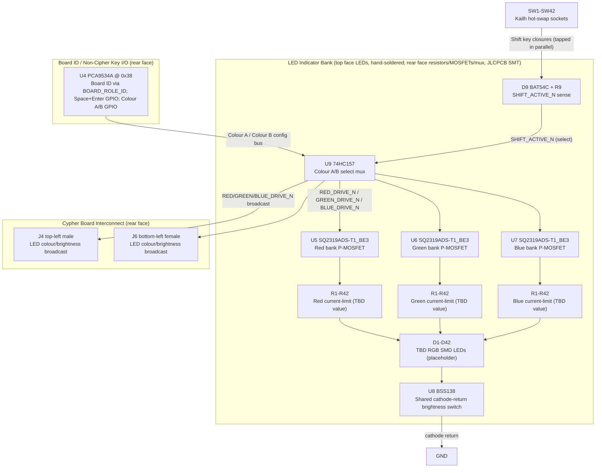

# Cypher-Input Board - 64-Character Variant Design Specification

**Status:** Draft
**Project:** Enigma-NG
**Version:** v.0.1.0
**Associated Hardware Revision:** Rev A
**Last Updated:** 2026-08-16
**Parent Document:** `design/Electronics/Cypher-Input/Design_Spec.md`

---

## 1. Overview

This document specifies the **64-Character** variant of the Enigma-NG Cypher-Input Board. It
supports the extended Enigma-NG cipher alphabet: 26 letters + 10 digits + 2 base64-extra symbols
(`+`/`/`), realised via Shift for uppercase (RFC 4648 base64 alphabet: `A-Z`, `a-z`, `0-9`, `+`,
`/`). Space and Enter are present for CM5 UI input clarity but are **not** part of the cipher
alphabet.

All three Cypher-Input variants (26-Char Classic, 64-Character, 10-Numeric) share an identical
circuit topology (ENC module mount, LED indicator bank, brightness control, Cypher Board
interconnect, board-identification strap plus a shared non-cipher-key/LED-colour I2C expander) -
see `design/Electronics/Cypher-Input/Design_Spec.md`. Only key count/layout, LED/resistor/socket
quantities, `plain-bits` allocation, and `BOARD_ROLE_ID` value differ between variants.

---

## 2. Key Layout and Character Set

* **Layout:** QWERTY-style. 26 letters + 10 digits + 2 base64-extra symbols (`+`, `/`) + 2 Shift
  (Left/Right) + Space + Enter.
* **Key count:** 42 total (40 cipher-path + 2 non-cipher: Space, Enter).
* **Character set composition:** the 64-character (base64) cipher alphabet is realised as 26
  physical letter keys (doubling as uppercase via Shift = 52 letter values) + 10 physical digit
  keys (case-invariant) + 2 physical base64-extra symbol keys (case-invariant) = 64 cipher values,
  driven by 40 cipher-path signals on the ENC module `plain-bits` bus. Space and Enter are read via
  the on-board I2C GPIO expander (U4), not the `plain-bits` bus, so they never enter the cipher
  pipeline.

> **Placeholder layout (provisional):** the arrangement below is an initial placeholder only,
> to be superseded once the user's own mock layout and renders (produced with an external
> keyboard-layout tool) are added to the repository. Key positions, row groupings, and Shift/Space/
> Enter placement are all subject to change.

```text
  1   2   3   4   5   6   7   8   9   0   +   /
    Q   W   E   R   T   Y   U   I   O   P
      A   S   D   F   G   H   J   K   L
  SHIFT   Z   X   C   V   B   N   M   SHIFT
              [ SPACE ]         [ENTER]
```

---

## 3. `plain-bits` Allocation

| Range | Assignment |
| :--- | :--- |
| PB[0:25] | 26 letter keys (case realised via Shift - see Shift rows below) |
| PB[26:35] | 10 digit keys (case-invariant) |
| PB[36:37] | 2 base64-extra symbol keys: `+` and `/` (case-invariant; RFC 4648 base64 alphabet) |
| PB[38:39] | 2 Shift keys (Left/Right) - also tapped in parallel into the local `SHIFT_ACTIVE_N` sense network (D9/R9, §5); this tap is entirely independent of the `plain-bits` connection |
| PB[40:63] | Unused - spare plain-bit positions |

> Provisional pending Quartus pin-planning and PCB layout on the ENC module side. See
> `Design_Spec.md §3` for the common ENC module interface and full J1 zig-zag pin map
> (`Board_Layout.md §1`). Space and Enter are **not** part of this bus - see §4 below. **LED
> colour selection never uses any `plain-bits` position** - see §5.

---

## 4. Board Identification and Non-Cipher Key I/O

* **`BOARD_ROLE_ID[3:0]` strap value:** `0b0111` (Characters + Numbers + Special; bit3 Custom
  not populated on this board - see `Cypher/Board_Layout.md §4` encoding table and
  `Cypher/Design_Spec.md §3a`).
* **U4 (PCA9534A) I2C address:** `0x38`, the single fixed address shared by all Cypher-Input
  variants (see `Design_Spec.md §3a`). 8 of 8 GPIO used: 2 for Space/Enter, 6 for the two
  software-configured RGB colour codes (Colour A / Colour B) driving the local colour-select mux -
  see §5.

---

## 5. LED Indicator Behaviour

This is the only Cypher-Input variant with a Shift key, so it is the only variant that switches
between two software-configured colours in real time. See `Design_Spec.md §5` for the common
colour-selection architecture (U4 GPIO, drive topology, MOSFETs) shared by all variants - this
section covers the full variant-specific circuit that adds real-time Shift-triggered switching on
top of that common architecture.

| Condition | Active colour |
| :--- | :--- |
| Shift NOT held | Colour A (software-configured via U4 GPIO) |
| Shift held (either key) | Colour B (software-configured via U4 GPIO) |

Switching is triggered directly by the Shift keys via local hardware (U9 mux, selected by
`SHIFT_ACTIVE_N`) - never by CPLD firmware or per-keystroke I2C writes. Mutually exclusive: exactly
one colour active at any instant. Both Shift keys trigger the same Colour-B-active behaviour. LED
count matches total physical keyswitches (42: 40 cipher-path + Space + Enter), so Space and Enter
also carry a colour-indicator LED even though they are not part of the cipher pipeline.

### Colour-Select Mux and Shift-Sense Circuit

U4 drives two independent 3-bit RGB codes - "Colour A" (non-shifted) and "Colour B" (shifted). A
local hardware mux (U9, `74HC157PW-Q100,118` - same part already used as U4/U5 on the Cypher
Board for keyboard-source select) picks between them in real time:

* U9's "A" inputs = Colour B (shifted) config bus; U9's "B" inputs = Colour A (non-shifted)
  config bus (deliberately cross-wired so the mux Select pin can be driven directly by
  `SHIFT_ACTIVE_N` without an inverter - see below).
* Select = `SHIFT_ACTIVE_N`: a local, hardware-only sense signal generated by D9
  (`BAT54C`, dual common-cathode Schottky diode) diode-ORing both Shift key switch nodes
  (tapped in parallel with their existing `plain-bits` connections) into one node, pulled up to
  `3V3_ENIG` via R9 (10 kOhm). Shift NOT held -> node pulled HIGH -> `SHIFT_ACTIVE_N` = HIGH ->
  U9 selects its B-inputs = Colour A. Either Shift key held -> node pulled LOW through D9 ->
  `SHIFT_ACTIVE_N` = LOW -> U9 selects its A-inputs = Colour B.
* `E` (mux enable, active-low) tied GND - always enabled, matching the existing Cypher Board U4/U5 mux
  convention. Only 3 of U9's 4 channels are used (1 spare).
* U9's outputs are the final `RED_DRIVE_N`/`GREEN_DRIVE_N`/`BLUE_DRIVE_N` signals feeding the LED
  bank MOSFETs (U5-U7, `Design_Spec.md §5` Drive Topology) - the same 3 signals are also
  broadcast to `J4`/`J6` for the future Cypher-Output board (`Design_Spec.md §7`).
* GPIO budget: 6 of U4's 8 GPIO (3 per colour code), plus 2 for Space/Enter = 8 of 8 used (see §4
  above).

### Component Block Diagram (64-Character Variant, Full Circuit)

> This diagram shows this variant's full circuit, including the colour-select mux (U9) and
> Shift-key sense network (D9/R9) that are only populated on this variant. See
> `Design_Spec.md` "Component Block Diagram" for the baseline circuit common to all variants.



---

## 6. Bill of Materials (64-Char Variant-Specific Components)

Variant-specific components for the 64-Character variant. Common components shared across all
Cypher-Input variants are listed in **`design/Electronics/Cypher-Input/Design_Spec.md` §11**.

| RefDes | Specification | MPN | Manufacturer | DigiKey PN | Mouser PN | JLCPCB PN | Alt Supplier + PN | Notes | Footprint Available | Footprint Downloaded | Qty |
| --- | --- | --- | --- | --- | --- | --- | --- | --- | --- | --- | --- |
| D1-D42 | RGB SMD LED (placeholder - MPN TBD, pending user confirmation of a part that fits under Cherry MX2A-71NB) | TBD | TBD | - | - | - | - | One per key; colour is software-configured (see `Design_Spec.md §5`); this is the only variant that switches between two colours (Shift-triggered); top face - **not populated in PCBA**, hand-soldered by the user after delivery (see `Design_Spec.md §2` Architecture) | - | - | 42 |
| R1-R42 (Red) | 0402, value TBD pending LED part confirmation | TBD | TBD | - | - | - | - | Red channel current-limit | - | - | 42 |
| R1-R42 (Green) | 0402, value TBD pending LED part confirmation | TBD | TBD | - | - | - | - | Green channel current-limit | - | - | 42 |
| R1-R42 (Blue) | 0402, value TBD pending LED part confirmation | TBD | TBD | - | - | - | - | Blue channel current-limit | - | - | 42 |
| U9 | Quad 2-to-1 mux, TSSOP-16 | 74HC157PW-Q100,118 | Nexperia | 1727-74HC157PW-Q100,118CT-ND | 771-74HC157PWQ100118 | C546614 | - | Colour A/B select mux; same part as Cypher Board U4/U5 (keyboard-source select); only 3 of 4 channels used; see §5 | ✔ | ✔ | 1 |
| D9 | Dual common-cathode Schottky diode, SOT-23 | BAT54C | Diotec (or equiv.) | - | - | - | - | Diode-ORs both Shift key switch nodes into `SHIFT_ACTIVE_N`; same family as the already-approved BAT54 (PM D5/D6, CTL D1) - exact supplier PN to be confirmed at schematic capture; see §5 | - | - | 1 |
| R9 | 10 kOhm 1% 0402 | ERJ-2RKF1002X | Panasonic | P10.0KLCT-ND | 667-ERJ-2RKF1002X | C191123 | - | `SHIFT_ACTIVE_N` pull-up; same part used widely elsewhere in the BOM; see §5 | ✔ | ✔ | 1 |
| SW1-SW42 | Mechanical keyswitch hot-swap socket, THT (rear-mount) | PG151101S11 | Kailh | - | - | C41430893 (consignment) | - | Hot-swap socket for Cherry MX2A-71NB (not populated - see below) | ✔ | ✔ | 42 |

> **Sourcing status:** U9 and R9 have confirmed sourcing. **One item remains pending exact
> supplier PN confirmation at schematic capture:** D9 (BAT54C) - a well-established, widely
> second-sourced part number already precedented in this design (PM/CTL BAT54), but a specific
> DigiKey/Mouser/JLCPCB catalogue entry has not yet been selected.

**Not part of the PCBA (sourced and installed separately):**

| Item | MPN | Manufacturer | DigiKey PN | Mouser PN | Notes | Qty |
| --- | --- | --- | --- | --- | --- | --- |
| Mechanical keyswitch | MX2A-71NB | Cherry | 1644-MX2A-71NB-ND | 540-MX2A-71NB | Snap-fit into hot-swap sockets; JLCPCB global sourcing/consignment or Amazon (prototyping) | 42 |
