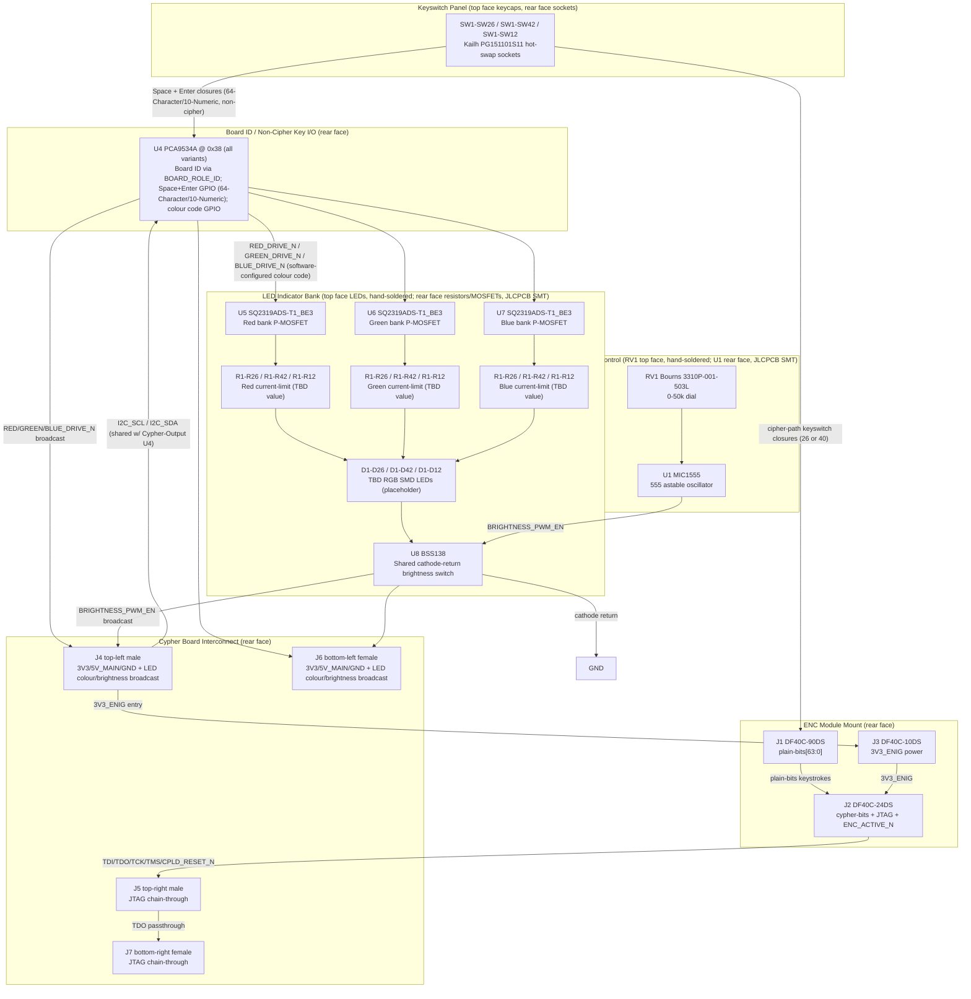

# Cypher-Input Board (V1.0) Design Specification

**Status:** Draft
**Project:** Enigma-NG
**Author:** Izzyonstage & GitHub Copilot
**Version:** v.0.1.0
**Associated Hardware Revision:** Rev A
**Last Updated:** 2026-08-16

## 1. Overview

The Cypher-Input Board is the physical keyboard input panel of the Enigma-NG system. It hosts one
ENC module in its **keyboard (encoder)** cipher role and connects to the Cypher Board `J5`
connector as the `KBD_ENC` cipher pipeline entry point. This specification documents **three board
variants** sharing an identical circuit topology (ENC module mount, LED indicator bank,
brightness control, Cypher Board interconnect, board-identification strap plus a shared
non-cipher-key/LED-colour I2C expander); only key count/layout, LED/resistor/socket quantities,
`plain-bits` allocation, and
`BOARD_ROLE_ID[3:0]` strap value differ between them. Variant-specific detail lives in a dedicated
document per variant, mirroring the Rotor board's common-spec/variant-file split:

- `design/Electronics/Cypher-Input/Cypher_Input_26_Char_Design.md`
- `design/Electronics/Cypher-Input/Cypher_Input_64_Char_Design.md`
- `design/Electronics/Cypher-Input/Cypher_Input_10_Numeric_Design.md`

| Variant | Layout | Keys | `BOARD_ROLE_ID[3:0]` | Notes |
| :--- | :--- | :--- | :--- | :--- |
| **64-Character** | QWERTY-style, 26 letters + 10 digits + 2 base64-extra symbols + 2 Shift + Space + Enter | 42 | 0b0111 | Custom extended cipher set (base64 alphabet: `A-Z`, `a-z`, `0-9`, `+`, `/` - RFC 4648). Space and Enter are UI-only, not part of the cipher alphabet. Capability bits: Characters + Numbers + Special (bit3 Custom is not populated on this board - see §3a and DEC-089; it is the Cypher-Output board's own custom-support switch that sets bit3 in `BOARD_ROLE_ID_OUT[3:0]`). |
| **26-Char Classic** | QWERTZ, 26 letters only | 26 | 0b0001 | Mimics the original German Enigma machine keyboard. No Shift, digits, symbols, Space, or Enter. Capability bits: Characters only. |
| **10-Numeric** | Common number-pad grid, 10 digits + Space + Enter | 12 | 0b0010 | Dedicated numeric-entry keyboard. No Shift - digits have no case distinction. Space and Enter present for CM5 UI input clarity, same non-cipher role as on the 64-Character variant. Capability bits: Numbers only. |

> **Capability bitmask encoding (`ID[3]:ID[2]:ID[1]:ID[0]`) - see `Cypher/Design_Spec.md §3a`:**
> bit0 = Characters, bit1 = Numbers, bit2 = Special, bit3 = Custom. Cypher-Input boards never
> populate bit3 themselves (it is only ever set on a Cypher-Output board via its own
> user-accessible custom-support switch - see DEC-089); a Cypher-Input board's own `BOARD_ROLE_ID`
> is therefore always the fixed capability value for its variant, with bit3 = 0.
>
> **I2C address vs. variant identification:** all three variants share a single fixed I2C address
> for U4 (`0x38` - see §3a). Variant identification is carried **only** by the hardwired
> `BOARD_ROLE_ID[3:0]` strap on the Cypher Board interconnect (`J4`/`J6`, per
> `Cypher/Board_Layout.md §4`), not by the I2C
> address.
> **Board family / interface contract:** the Cypher Board `J5` connector (Samtec
> QSS-025-01-L-D-RA-K mating female, per `Cypher/Board_Layout.md §4`) plus the ENC module DF40C
> BtB mount standard (owned by `Encoder_Module/Board_Layout.md §1a-1c`; reproduced for layout
> reference in this board's own `Board_Layout.md §1-3`) form the fixed hardware interface that
> any keyboard front-end board must honour. Fully custom keyboard designs are supported as long as
> they use this same interface; each such board reuses the same shared `0x38` I2C address for its
> U4-equivalent (see §3a) - the I2C address identifies the *device role* (keyboard/HID expander),
> not the specific board - and instead needs its own distinct `BOARD_ROLE_ID[3:0]` value to
> identify itself as a new variant, with bit3 (Custom) set to signal a non-standard capability
> combination to the Cypher Board's compatibility comparator (see `Cypher/Design_Spec.md §3a`).
> The reserved capability combinations not covered by the three variants defined in this document
> (or any custom keyboard's own choice of bit0/bit1/bit2 values) are intended for exactly this: a
> custom board's own CPLD image, mapped in software to its own distinct capability value, so the
> system can recognise and configure for it without colliding with the three variants defined in
> this document.

| Circuit Responsibility | Board Role | Key Component |
| :--- | :--- | :--- |
| **Keyboard cipher entry** | Hosts one ENC module (keyboard/encoder role); forwards keystroke plain-bits to the module and receives cipher-bits/JTAG back | J1-J3 - DF40C BtB mount |
| **Mechanical keyswitch panel** | 26 (Classic), 42 (64-Character), or 12 (10-Numeric) hot-swap keyswitch positions | SW1-SW26 / SW1-SW42 / SW1-SW12 - Kailh PG151101S11 |
| **Key indicator LEDs** | RGB LED per key (part TBD - pending user confirmation of footprint fit under Cherry MX keyswitches); software-configurable colour(s), generated locally on this board and also broadcast to the Cypher-Output board via `J4`/`J6` - see §5; qty matches variant key count | D1-D26 / D1-D42 / D1-D12 - TBD RGB SMD (placeholder) |
| **LED colour selection** | 3-line `RED_DRIVE_N`/`GREEN_DRIVE_N`/`BLUE_DRIVE_N`, generated entirely on this board; software-defined via U4 GPIO into a single configurable colour per variant. Variants with more than one colour-source key (e.g. Shift) may add local hardware to switch between multiple configured colours in real time - see that variant's own design file | U4 (PCA9534A) - see §5; any per-variant switching hardware is documented in that variant's own design file |
| **Brightness control** | Single panel-mount rotary dial (on this board only) sets a shared PWM duty cycle via a 555 astable oscillator; the resulting `BRIGHTNESS_PWM_EN` gates a common low-side switch at the LED bank's cathode return (downstream of colour selection) so one dial dims every LED on both this board and the future Cypher-Output board | RV1 - Bourns 3310P-001-503L; U1 - MIC1555YM5-TR; U8 - BSS138 (cathode-return switch) |
| **Board ID / non-cipher key I/O** | I2C expander at a single fixed address shared by all variants (variant identity is carried by `BOARD_ROLE_ID[3:0]`, not I2C address); on the 64-Character and 10-Numeric variants it also reads Space and Enter (not part of the cipher pipeline) | U4 - PCA9534A @ 0x38 |
| **Cypher Board interconnect** | 4 connectors (2 male top, 2 female bottom) to whichever HID board is closest to the Cypher Board, either order | J4-J7 - Samtec QTS/QSS-025 family |

The top face (L1) carries only the LED bank (D1-Dxx) and the brightness potentiometer (RV1);
RV1 sits in the keyless region that corresponds to a number-pad area on a conventional keyboard,
off to the side of the main keyswitch cluster. **Neither is part of the JLCPCB PCBA order** -
both are hand-soldered by the user after the bare-assembled board is delivered, the same way the
keyswitches and keycaps already are (see below). This keeps JLCPCB's automated SMT assembly
**single-sided** (rear face only), consistent with the standard PCBA service constraint in
`design/Production/JLCPCB_Manufacturing.md §3.1` (dual-sided SMT is only available on Economic
PCBA with limitations) - the top face is never part of the machine-placed SMT pass at all.
The rear face (L4) carries everything else: the ENC module mount (J1-J3) - positioned directly
beneath RV1, in that same keyless region, since no keyswitches occupy that area on the top face -
the Cypher Board interconnect (J4-J7), the I2C GPIO expander (U4), the 555 oscillator (U1), the
LED current-limit resistors (R1-Rxx, one per colour channel per LED), the three LED bank P-MOSFET
switches (U5, U6, U7) plus the shared cathode-return switch (U8), any variant-specific local
colour-switching hardware (e.g. the 64-Character variant's mux/Shift-sense circuit - see that
variant's own design file), the Kailh hot-swap sockets (quantity per variant - see the per-variant
design files), and local decoupling - all fully populated by JLCPCB's standard single-sided SMT
PCBA pass. Mechanical switches and keycaps are **not** part of the PCBA either; they are sourced
and fitted separately (JLCPCB post-PCBA or end-user), plugging down through the top face into the
rear-mounted hot-swap sockets.

> **Character set composition:** each variant's key layout and cipher-alphabet composition is
> defined in its own design file (`Cypher_Input_26_Char_Design.md`,
> `Cypher_Input_64_Char_Design.md`, `Cypher_Input_10_Numeric_Design.md` §1-§2). Space and Enter
> (present on the 64-Character and 10-Numeric variants) are never part of a cipher alphabet -
> they exist only for CM5 UI input clarity and are read via the on-board I2C GPIO expander (U4),
> not via the ENC module plain-bits bus. **LED colour selection is entirely local to this board
> and never touches the ENC module or the `plain-bits` bus** - see §5 for the full circuit. All 64
> `plain-bits` lines are reserved exclusively for keyswitch/cipher-path use across every variant
> (see §3), including headroom for a possible future variant using all 64 lines as one signal per
> character.

### Functional Requirements

| ID | Functional Requirement | Notes | Satisfied By / Cross-Ref |
| :--- | :--- | :--- | :--- |
| FR-CYPI-01 | Host one ENC module in the keyboard (encoder) cipher role | DF40C BtB mount; `plain-bits[63:0]` carry the variant's cipher-path keyswitch inputs only - no LED signals ever share this bus - see per-variant design files §3 | §3 ENC Module Interface; BOM J1-J3 |
| FR-CYPI-02 | Provide 26 (Classic), 42 (64-Character), or 12 (10-Numeric) hot-swappable mechanical keyswitch positions | Kailh PG151101S11 hot-swap sockets, rear face; switches/keycaps sourced separately | §4 Keyswitch Panel; BOM SW1-SW26 / SW1-SW42 / SW1-SW12 |
| FR-CYPI-03 | Provide one RGB LED indicator per key with software-configurable colour(s) | On the 64-Character variant, two software-configured colours are selected in real time by the Shift keys (local hardware logic, no CPLD/firmware involvement); Classic/10-Numeric variants show one fixed (but still software-configurable) colour, since they have no Shift key; qty matches variant key count (26, 42, or 12) | §5 LED Indicator Circuit; BOM D1-D26 / D1-D42 / D1-D12 |
| FR-CYPI-04 | Provide a single panel-mount hardware dial controlling LED brightness for both this board and the future Cypher-Output board, independent of CPLD firmware | 555 astable oscillator output gates a shared cathode-return switch downstream of colour selection; broadcast to Cypher-Output via `J4`/`J6` | §6 Brightness Control; BOM RV1, U1, U8 |
| FR-CYPI-05 | Connect to the Cypher Board as the `KBD_ENC` cipher pipeline entry point | J4-J7 = Samtec QTS/QSS-025 family (2 male top, 2 female bottom); mates whichever of Cypher Board / Cypher-Output is closest, either order | §7 Interconnects; BOM J4-J7 |
| FR-CYPI-06 | Forward selected keyboard-source activity state to the Cypher Board | `ENC_ACTIVE_INPUT_N`; pin 24 on `J5`/`J7`, tied both connectors; consumed by Cypher-Output (LED activation) and the Cypher Board's I2C expander (rotor-actuation trigger) | §7 Interconnects |
| FR-CYPI-07 | Protect no connector on this board with TVS/ESD suppression | All connectors (J1-J7) are internal BtB/dock connectors, not hot-swapped or externally accessible, per `design/Standards/Global_Routing_Spec.md §9` | §9 Thermal & ESD |
| FR-CYPI-08 | Identify which board variant is connected via `BOARD_ROLE_ID[3:0]`, and (64-Character and 10-Numeric variants only) read Space and Enter key state without entering the cipher pipeline | `BOARD_ROLE_ID[3:0]` strap carries variant identity as a 4-bit capability bitmask; local I2C GPIO expander (U4) at a single fixed address shared by all variants; not part of the ENC module plain-bits bus | §3a Non-Cipher Key I/O; BOM U4 |

### Design Requirements

| ID | Design Requirement | Specification | Satisfied By / Cross-Ref |
| :--- | :--- | :--- | :--- |
| DR-CYPI-01 | PCB stackup | 4-layer standard per `design/Standards/Global_Routing_Spec.md §2.3.1` | §8 PCB Fabrication & Stackup |
| DR-CYPI-02 | ENC module mount connectors | J1 = DF40C-90DS-0.4V(51) (plain-bits[63:0]); J2 = DF40C-24DS-0.4V(51) (cypher-bits + JTAG + ENC_ACTIVE_N); J3 = DF40C-10DS-0.4V(51) (3V3_ENIG power); pin mapping owned by `Encoder_Module/Board_Layout.md §1a-1c`, reproduced in this board's `Board_Layout.md §1-3` | §3 ENC Module Interface; BOM J1-J3 |
| DR-CYPI-03 | Cypher Board interconnect | J4 (TL, male), J5 (TR, male) = QTS-025-01-L-D-RA-P; J6 (BL, female), J7 (BR, female) = QSS-025-01-L-D-RA-K; left pair (J4/J6) = 3V3_ENIG/GND/5V_MAIN/LED colour+brightness broadcast/`BOARD_ROLE_ID[3:0]`; right pair (J5/J7) = shared JTAG chain-through template per `Cypher/Board_Layout.md §4`; pin mapping per `Board_Layout.md §4` | §7 Interconnects; BOM J4-J7 |
| DR-CYPI-04 | Keyswitch hot-swap sockets | SW1-SW26 (Classic), SW1-SW42 (64-Character), or SW1-SW12 (10-Numeric) = Kailh PG151101S11; JLCPCB consignment part C41430893; rear face (L4); no hand-soldering | §4 Keyswitch Panel; BOM SW1-SW26 / SW1-SW42 / SW1-SW12 |
| DR-CYPI-05 | Mechanical switches and keycaps | Cherry MX2A-71NB; **not populated in PCBA** - sourced separately (Mouser 540-MX2A-71NB, DigiKey 1644-MX2A-71NB-ND, JLCPCB global sourcing/consignment, or Amazon for prototyping); installed post-PCBA by JLCPCB or end-user | §4 Keyswitch Panel |
| DR-CYPI-06 | LED bank | D1-D26 / D1-D42 / D1-D12 = **TBD RGB SMD LED (placeholder)** - pending user confirmation of a part that physically fits under Cherry MX2A-71NB keyswitches; every variant supports software-configurable colour, not just fixed Yellow/Green | §5 LED Indicator Circuit; BOM D1-D26 / D1-D42 / D1-D12 |
| DR-CYPI-07 | LED current-limit resistors | One resistor per LED per colour channel (Red/Green/Blue); values TBD pending the RGB LED part's V_F per channel (see DR-CYPI-06); target 10mA drive per channel | §5 LED Indicator Circuit; BOM R1-R26 / R1-R42 / R1-R12 (each colour) |
| DR-CYPI-08 | LED bank drive topology | P-channel MOSFET high-side switch per colour bank: U5 (Red), U6 (Green), U7 (Blue); gated by `RED_DRIVE_N`/`GREEN_DRIVE_N`/`BLUE_DRIVE_N`, generated entirely on this board (never by the ENC module or its `plain-bits` bus) - see §5; active-LOW gate drive; same circuit on all variants | §5 LED Indicator Circuit; BOM U5-U7 |
| DR-CYPI-09 | LED bank MOSFET rating | SQ2319ADS-T1_BE3 (SOT-23, single P-channel; same part as USM Q19-Q30) for U5-U7; I_D = -4.6A, R_DS(on) = 0.145 Ohm @ V_GS = -4.5V; comfortably exceeds a 10mA-per-channel-per-LED bank load on any variant | §5 LED Indicator Circuit; BOM U5-U7 |
| DR-CYPI-10 | Brightness dial | RV1 = Bourns 3310P-001-503L (0-50 kOhm linear panel-mount potentiometer); feeds 555 astable R_A leg | §6 Brightness Control; BOM RV1 |
| DR-CYPI-11 | 555 astable oscillator | U1 = MIC1555YM5-TR (SOT23-5, same part as Power Module U9/U13); R_A = RV1 (0-50 kOhm); R_B = R81 (1 kOhm, discharge limiter); C = C1 (10nF, timing); C_CV = C2 (100nF, pin 5 noise bypass); output drives U8 gate (`BRIGHTNESS_PWM_EN`) | §6 Brightness Control; BOM U1, R81, C1, C2 |
| DR-CYPI-11a | Brightness termination switch | U8 = BSS138 (N-channel MOSFET, SOT-23; same part family as the User Settings Module's colour-rail sink stage, DEC-034); common low-side switch at the LED bank's shared cathode return, downstream of all colour selection; gated by `BRIGHTNESS_PWM_EN` from U1; broadcast to the future Cypher-Output board via `J4`/`J6` so a single dial dims every LED on both boards | §6 Brightness Control; BOM U8 |
| DR-CYPI-12 | Brightness frequency range | f_high ~= 72 kHz (RV1 at 0 Ohm, practical wiper-contact limited); f_low ~= 2.8 Hz (RV1 at 50 kOhm - dim glow, never full-off, indicates system powered) | §6 Brightness Control |
| DR-CYPI-13 | 555 VCC bypass | C3 = 100nF X7R 0402 per `design/Standards/Global_Routing_Spec.md §3.2` | §8 PCB Fabrication; BOM C3 |
| DR-CYPI-14 | 3V3_ENIG entry decoupling bank | C4-C8 (5x 10uF X7R 50V 1206) at J4/J6 3V3_ENIG entry per `design/Standards/Global_Routing_Spec.md §3` Bulk Entry Bank Rule (single rail on this board) | §7 Power; BOM C4-C8 |
| DR-CYPI-15 | Mounting holes | MH1-MH4: M3 PTH (3.2mm drill) tied to GND_CHASSIS per GRS §4; placement per GRS §4.3 Pattern A (standard rectangular board). No BOM entry. | §8 PCB Fabrication; GRS §4.3 |
| DR-CYPI-16 | ESD protection | Not required. J1-J7 are internal BtB/dock connectors, not hot-swapped and not externally accessible during normal servicing, per `design/Standards/Global_Routing_Spec.md §9` | §9 Thermal & ESD |
| DR-CYPI-17 | Board-ID / non-cipher key I/O expander | U4 = PCA9534A @ 0x38, the single fixed address shared by all Cypher-Input variants; same IC family already used in the system (Power Module PCA9534A @ 0x3F); variant is identified by the `BOARD_ROLE_ID[3:0]` strap on `J4`/`J6`, not by I2C address (see §3a); GPIO budget (of 8 total) varies by variant, including whether any local colour-switching hardware is populated - see each variant's own design file §4; connects to `I2C_SDA`/`I2C_SCL` on `J5`/`J7` pins 27/28 (shared with the future Cypher-Output board's own expander, which will need its own address from the reserved I2C block - not a pure passthrough) | §3a Non-Cipher Key I/O; §5 LED Indicator Circuit; BOM U4 |

### Component Block Diagram

> This diagram shows the baseline circuit common to **all** Cypher-Input variants. It does
> **not** include any variant-specific local colour-switching hardware (e.g. the 64-Character
> variant's mux/Shift-sense circuit) - see that variant's own design file for its full circuit
> including that hardware.



## 2. Architecture

- **PCB:** 4-layer standard per `design/Standards/Global_Routing_Spec.md §2.3.1`. ENIG Gold.
  2.0mm filleted corners.
- **Assembly:** Single-sided JLCPCB SMT (rear face, L4, only) - required to stay within the
  standard PCBA service constraint (`design/Production/JLCPCB_Manufacturing.md §3.1`: dual-sided
  SMT is only available on Economic PCBA, with limitations). Top face (L1): LED bank (D1-Dxx) and
  the brightness potentiometer (RV1) only - RV1 positioned in the keyless region corresponding to
  a number-pad area, off to the side of the main keyswitch cluster; keyswitches occupy the rest of
  this face via rear-mounted hot-swap sockets. **Neither the LEDs nor RV1 are part of the JLCPCB
  PCBA order** - both are hand-soldered by the user after the bare-assembled board is delivered.
  Rear face (L4, fully populated by JLCPCB's single-sided SMT pass): ENC module mount (J1-J3),
  positioned directly beneath RV1 in that same keyless region; Cypher Board interconnect (J4-J7);
  I2C GPIO expander (U4); 555 oscillator (U1); LED current-limit resistors (R1-Rxx, one per colour
  channel per LED); LED bank P-MOSFET switches (U5, U6, U7); shared cathode-return switch (U8);
  any variant-specific local colour-switching hardware (e.g. the 64-Character variant's
  mux/Shift-sense circuit - see that variant's own design file); Kailh hot-swap sockets (quantity
  per variant - see the per-variant design files); local decoupling.
  No components are placed above rear-side sockets (mechanical clearance for switch stems and
  keycaps).
- **Manufacturer:** JLCPCB (standard 4-layer; single-sided SMT PCBA, rear face only; consignment
  stock for Kailh sockets, part C41430893, in the same automated rear-side assembly pass).

### GND_CHASSIS Single-Point Bond

Per `design/Standards/Global_Routing_Spec.md §5`: this board implements a local `GND_CHASSIS`
net tied to its mounting holes, but does **not** implement a local GND to GND_CHASSIS bond. The
system's only galvanic GND to GND_CHASSIS bond remains on the Power Module.

## 3. ENC Module Interface

The Cypher-Input Board hosts one ENC module in the keyboard (encoder) cipher role via three
Hirose DF40C BtB receptacle sets, per the connector topology defined in
`.copilot/discussions/cypher-system-discussion/extension-mechanical-usage.md` Entry 16.

| Connector | MPN | Pins | Content |
| :--- | :--- | :--- | :--- |
| J1 | DF40C-90DS-0.4V(51) | 90 (2x45) | plain-bits[63:0] (64 signals) + GND (26); zig-zag distributed |
| J2 | DF40C-24DS-0.4V(51) | 24 (2x12) | cypher-bits[5:0] (6) + JTAG (TCK, RST_N/CPLD_RESET_N, TMS, TDI, TDO) + ENC_ACTIVE_N (1) + GND (12); full zig-zag |
| J3 | DF40C-10DS-0.4V(51) | 10 (2x5) | 3V3_ENIG (5) + GND (5); power only |

> **Pinout:** see `Board_Layout.md §1-3` for the full per-pin zig-zag GND distribution tables.
> This board is the documentation owner of the ENC-module BtB pin-mapping standard; the Cypher
> Board's own J7-J18 ENC mounts and the future Cypher-Output Board follow the same pin map.

### plain-bits[63:0] Allocation on This Board

All 64 `plain-bits` positions are reserved **exclusively for cipher-path keyswitch inputs** on
every variant - LED colour selection never uses this bus (see §5). Per-variant `plain-bits`
allocation (which PB[] positions carry which cipher-path keys) is defined in each variant's own
design file:

- `Cypher_Input_26_Char_Design.md §3`
- `Cypher_Input_64_Char_Design.md §3`
- `Cypher_Input_10_Numeric_Design.md §3`

> Provisional pending Quartus pin-planning and PCB layout on the ENC module side (per Entry 17).
> Space and Enter (64-Character and 10-Numeric variants) are **not** part of this bus - see §3a. A
> future variant could use all 64 lines as one signal per character, since none are reserved for
> anything other than keyswitches.

### ENC_ACTIVE_N Bidirectionality

In this board's keyboard (encoder) role, the ENC module CPLD **drives** `ENC_ACTIVE_N` (output,
active-low keypress notification) via J2. This board forwards it to the Cypher Board interconnect
(J5/J7) as `ENC_ACTIVE_INPUT_N`.

## 3a. Board ID / Non-Cipher Key I/O

Every Cypher-Input board variant carries an I2C GPIO expander (U4) at a **single fixed address**
shared by all variants, since variant identity is already carried by the `BOARD_ROLE_ID[3:0]`
hardwired strap on the Cypher Board interconnect (`Cypher/Board_Layout.md §4`) - U4's address does
**not** vary by variant. On the 64-Character and 10-Numeric variants, this same expander also
reads Space and Enter, which exist only for CM5 UI input clarity and are **not** part of the
cipher alphabet - they are read via U4 rather than the ENC module plain-bits bus, so they never
enter the cipher pipeline. U4 also drives the software-configurable LED colour code(s) for this
board's own LED bank (see §5), fully allocating U4's GPIO headroom to LED colour configuration.

- **U4 = PCA9534A** (same family already used elsewhere in the system - Power Module carries a
  PCA9534A @ 0x3F; chosen over MCP23017 since MCP23017's fixed `0100xxx` address prefix gives only
  0x20-0x27, which is entirely consumed by existing devices (Stator/Cypher U6-U8, USM U1-U3),
  leaving no room for other board types. PCA9534A's fixed `0111xxx` prefix gives a separate
  0x38-0x3F block instead).
- **Bus:** connects directly to `I2C_SDA`/`I2C_SCL` on the Cypher Board interconnect (`J5`/`J7`
  pins 27/28). This is **not** a pure passthrough - the equivalent GPIO expander on the future
  Cypher-Output board shares the same bus but takes its own address.
- **I2C address (single, shared by all Cypher-Input variants; see `Controller/Design_Spec.md**
  **§4.1` for the full system-wide I2C address table):**

  | I2C Address | A2/A1/A0 | Applies To | Pin usage |
  | :--- | :--- | :--- | :--- |
  | **0x38** | LOW/LOW/LOW (base 0x38 \| 0b000) | All Cypher-Input variants | Up to 8 GPIO; exact allocation (Space/Enter, colour config, any local switching hardware) varies by variant - see each variant's own design file §4 |

- **Variant identification:** carried solely by `BOARD_ROLE_ID[3:0]` (see
  `Cypher/Board_Layout.md §4` encoding table and each variant's own design file §4) - **not** by
  I2C address. A keyboard board only ever needs one identification mechanism, and
  `BOARD_ROLE_ID[3:0]` already exists for that purpose on the shared Cypher Board interconnect.
- **Reserved block for further custom keyboard board types** (PCA9534A's 0x38-0x3F range, with
  0x3F already taken by the Power Module's own PCA9534A): 0x39-0x3E remain free for any future
  board type that is not a Cypher-Input variant (e.g. the future Cypher-Output board, or a fully
  custom keyboard board outside this family) - each such board type takes its own address,
  assigned when that board is designed. Cypher-Input variants never consume additional addresses
  from this block, since `BOARD_ROLE_ID[3:0]` handles variant identification instead.

## 4. Keyswitch Panel

- **Hot-swap sockets:** SW1-SW26 (Classic), SW1-SW42 (64-Character), or SW1-SW12 (10-Numeric) = Kailh
  PG151101S11, rear face (L4), placed in a keyboard grid layout matching the physical keycap
  layout - see each variant's own design file §2 for the exact layout. ~19.05mm between centres
  for MX-style switches. JLCPCB consignment stock (part C41430893), automated bottom-side
  assembly.
- **Mechanical switches and keycaps:** Cherry MX2A-71NB. **Not part of the PCBA** - sourced
  separately and installed post-PCBA (JLCPCB or end-user), snap-fit into the hot-swap sockets with
  zero-force insertion; no hand-soldering.
- **Routing:** Through-hole socket pads route to front-layer (L1) signals: cipher-path keys (26,
  40, or 10) to J1 (plain-bits); on the 64-Character and 10-Numeric variants, 2 non-cipher keys
  (Space, Enter) to U4 (I2C GPIO expander); on variants with a Shift key, the Shift keys are
  additionally tapped in parallel into that variant's own local Shift-sense hardware (if any) -
  see that variant's own design file for detail.
- **Keepout:** No components placed above rear-side sockets - mechanical clearance for switch
  stems and keycaps.

## 5. LED Indicator Circuit

One RGB LED per key, quantity matching the variant's key count (26 for Classic, 42 for 64-Character,
12 for 10-Numeric). Colour selection is generated **entirely on this board**, driven off local
hardware and software-configurable state - it never touches the ENC module or its `plain-bits`
bus (superseding the original design, which piggybacked 2 spare `plain-bits` positions per
variant - see DEC-087).

### LED Specification (placeholder - part TBD)

> **Open item:** the LED part is not yet finalised. The user needs to confirm a specific SMD RGB
> LED that physically fits under the Cherry MX2A-71NB keyswitch (approximately a "0403"-class
> footprint, to be confirmed against the switch's LED cutout). Do not source this part without
> explicit user confirmation. Current-limit resistor values below are placeholders and must be
> recalculated once the real part's per-channel V_F is known.

| Parameter | Red | Green | Blue |
| :--- | :--- | :--- | :--- |
| Package | TBD | TBD | TBD |
| V_F typ | TBD | TBD | TBD |
| I_F max | TBD | TBD | TBD |

### Current-Limit Resistors (placeholder values)

One series resistor per LED per colour channel, target 10mA drive per channel (same target as
the previous bicolour design) - exact values to be recalculated once the LED part is confirmed:

- R1-R26 / R1-R42 / R1-R12 (Red): value TBD.
- R1-R26 / R1-R42 / R1-R12 (Green): value TBD.
- R1-R26 / R1-R42 / R1-R12 (Blue): value TBD.

### Colour Selection Architecture

Colour is defined by software via U4 (PCA9534A) GPIO outputs, driving
`RED_DRIVE_N`/`GREEN_DRIVE_N`/`BLUE_DRIVE_N` directly - one software-configured 3-bit RGB code per
variant, common to every Cypher-Input board regardless of key layout:

- GPIO budget: 3 of U4's 8 GPIO for the colour code, plus 2 more for Space/Enter on variants that
  have those keys. The remaining GPIO headroom (if any) is available for a variant to add local
  hardware that switches between multiple configured colours in real time (e.g. a Shift-triggered
  mux), without any CPLD firmware or per-keystroke I2C writes involved - see that variant's own
  design file for whether it implements this, and the full circuit if so.
- On variants with no such switching hardware, U4 drives
  `RED_DRIVE_N`/`GREEN_DRIVE_N`/`BLUE_DRIVE_N` straight to the LED bank MOSFETs (below) - a single
  software-configured colour, never switched in real time.

### Drive Topology - P-Channel MOSFET High-Side Switching

Each colour bank (26, 42, or 12 parallel LEDs, depending on variant) is switched at the anode side
by one dedicated P-channel MOSFET (SOT-23):

- U5 (Red bank): gate driven by `RED_DRIVE_N` (directly from U4, or from that variant's own local
  switching hardware if populated - see §5 Colour Selection Architecture).
- U6 (Green bank): gate driven by `GREEN_DRIVE_N` (same source pattern as U5).
- U7 (Blue bank): gate driven by `BLUE_DRIVE_N` (same source pattern as U5); reserved for future
  use until the RGB LED part and its Blue-channel use are confirmed.
- Active-LOW gate drive: driver output LOW -> MOSFET ON -> LEDs light (subject to the shared
  brightness switch, §6). Driver output HIGH -> MOSFET OFF -> LEDs dark.
- No external gate resistors required at these switching frequencies (~100-300 Hz).
- No external pull-down resistors required - the driving GPIO/logic outputs hold a defined state
  from power-up.

**MOSFET selection:** SQ2319ADS-T1_BE3 (Vishay Siliconix, SOT-23, single P-channel - same part
already used on the User Settings Module, Q19-Q30) for U5-U7. I_D = -4.6A, R_DS(on) = 0.145 Ohm @
V_GS = -4.5V - comfortably exceeds a worst-case 420mA per-channel load (42 keys x 10mA, 64-Character
variant) with wide margin; the 26-key Classic and 12-key 10-Numeric variant loads (260mA and
120mA) are even further within margin.

## 6. Brightness Control

A single panel-mount rotary dial (RV1) on this board controls LED brightness for **both this
board and the future Cypher-Output board** - one dimmer for the whole Cypher system. RV1 feeds a
555 astable oscillator (U1), whose PWM output (`BRIGHTNESS_PWM_EN`) gates U8 (BSS138, N-channel
MOSFET - same part family as the User Settings Module's colour-rail sink stage, DEC-034), a
shared low-side switch common to every LED's cathode return, placed downstream of all colour
selection so brightness applies uniformly regardless of which colour(s) are currently active.
`BRIGHTNESS_PWM_EN` is broadcast to `J4`/`J6` so the future Cypher-Output board's own equivalent
cathode-return switch can be gated by the same signal (§7). Brightness control is fully
independent of the ENC module CPLD.

### 555 Astable Component Values

| Ref | Component | Value | Notes |
| :--- | :--- | :--- | :--- |
| RV1 | Rotary pot (R_A) | 0-50 kOhm | Bourns 3310P-001-503L; panel-mount brightness dial |
| R81 | Fixed resistor (R_B) | 1 kOhm 0402 | Discharge path limiter; prevents short when RV1 -> 0 |
| C1 | Timing capacitor (C) | 10nF X7R 0402 | Sets oscillation period with RV1 + R81 |
| C2 | Noise-bypass capacitor (C_CV) | 100nF X7R 0402 | U1 pin 5 (CV) to GND; suppresses supply noise on duty cycle |
| C3 | VCC bypass | 100nF X7R 0402 | Per GRS §3.2 per-IC bypass rule |

### Frequency Range

```text
f_high ~= 1.44 / ((RV1_min + 2 x R81) x C1) ~= 72 kHz  (practical pot wiper-contact limited)
f_low  ~= 1.44 / ((RV1_max + 2 x R81) x C1) ~= 2.8 Hz  (very dim glow at dial minimum)
```

> The 555 astable never produces zero duty cycle; at dial minimum the LEDs produce a very dim
> glow, indicating the system is powered and active. Full-off behaviour can be implemented in a
> future update if required (e.g. an additional software-controlled enable via U4).

### 555 Oscillator Circuit

```text
   3V3_ENIG
       |
       +--[RV1 0-50k pot]--+--[R81 1k]--+-- Pin 7 (DISCHARGE)
       |                   |            |
       |                (wiper)         +-- Pin 6 (THRESHOLD)
       |                   |                    |
       |                   +------- Pin 2 (TRIGGER)
       |                                    [C1 10nF]
       |                                        |
       |   Pin 8 (VCC)   -- 3V3_ENIG           GND
       |   Pin 4 (RESET) -- 3V3_ENIG (tie HIGH - always running)
       |   Pin 1 (GND)   -- GND
       |   Pin 5 (CV)    -- [C2 100nF] -- GND (noise bypass)
       |
       +-- Pin 3 (OUTPUT) ------------------------------> U8 (BSS138) gate: BRIGHTNESS_PWM_EN
```

## 7. Interconnects

### J1-J3 - ENC Module Mount

See §3 ENC Module Interface for connector definitions. Pinout: `Board_Layout.md §1-3`.

### J4-J7 - Cypher Board Interconnect (`KBD_ENC` role)

**Connector definition owner: this board (physical placement/gender); pin-level JTAG template
owned by Cypher Board `Board_Layout.md §4`.**

- **Architecture:** 4 connectors: J4 (top-left, male), J5 (top-right, male) - mounted flush with
  the board's top edge so the connector face sits flush with the enclosure lid's edge once cased;
  J6 (bottom-left, female), J7 (bottom-right, female) - mounted protruding past the board's
  bottom edge far enough to span the enclosure gap and fully mate with the neighbouring board's
  flush-mounted male connector. Top connectors mate upward - directly to the Cypher Board if
  this board is closest to it, or to the other HID board's bottom connectors if this board is
  not closest. Bottom connectors mate downward - to the other HID board's top connectors, or to
  a future Plugboard board. This lets Cypher-Input and Cypher-Output attach to the Cypher Board
  in either order.
- **MPN:** J4/J5 = QTS-025-01-L-D-RA-P (Samtec 50-contact 0.635mm right-angle male SMT); J6/J7 =
  QSS-025-01-L-D-RA-K (Samtec 50-contact 0.635mm right-angle female SMT).
- **J4/J6 (left pair):** mates the Cypher Board's own `J5` template (`Cypher/Board_Layout.md §4`)
  - `3V3_ENIG` (pins 1-4), `5V_MAIN` (pins 5-8; final downstream consumption depends on the LED
  component selected in `merge-missing-components.md`), GND (pins 9-12), this board's LED
  colour/brightness broadcast -
  `RED_DRIVE_N` (14), `GREEN_DRIVE_N` (16) on the bottom row (top row 13/15 is GND), and this
  board's own `BOARD_ROLE_ID_IN[3:0]` variant-ID strap on pins 17/19/21/23 (top row; bottom row
  18/20/22/24 is GND) (see §3a/table above for values) - all generated by this board, tied both
  J4 and J6. Pins 25/26 are the connector's fixed center GND bar. On the far side of the bar,
  pins 28/30/32/34 (bottom row) carry `BOARD_ROLE_ID_OUT[3:0]` - a straight passthrough relaying
  Cypher-Output's own `BOARD_ROLE_ID_OUT[3:0]` value (top row 27/29/31/33 is GND); pins 35/37 (top
  row) carry `BRIGHTNESS_PWM_EN`/`BLUE_DRIVE_N` (bottom row 36/38 is GND) - generated by this board,
  consumed only by the future Cypher-Output board's own LED bank/cathode-return switch. Pins
  39-42 are GND, pins 43-50 are `5V_MAIN` (43-46) and `3V3_ENIG` (47-50), matching the Cypher
  Board's own J5 template. The physical
  plugboard patch-jack harness does **not** route through this connector -
  it wires directly to the Cypher Board's own spade terminal bank (`J20+`) instead, per DEC-088.
- **J5/J7 (right pair):** share the Cypher Board's board-agnostic HID Interconnect pin template
  (`Cypher/Board_Layout.md §4`, its own `J6`) - `TTD` (JTAG serial data, unified name per hop),
  `TCK`, `TMS`, `CPLD_RESET_N` (broadcast, unchained; single pin - pin 23 only), plus
  `ENC_DATA[5:0]`, `I2C_SDA`/`I2C_SCL`, `ENC_ACTIVE_INPUT_N`. Pins 17-22 are GND on this
  template - `BOARD_ROLE_ID[3:0]` is carried on the `J4`/`J6` left pair. Pins
  30/32 are unused (NC) on this template - LED
  colour/brightness broadcast is carried on `J4`/`J6`, since it is generated
  entirely on this board and never touches the ENC module's JTAG/cypher-bits connector at all.
  This board's own wiring at J5/J7 (full pin numbers per `Board_Layout.md §4`):
  - Pin 37 (J5 active, NC on J7) -> ENC module CPLD TDI (this board's own real TDI, single-sided)
  - Pin 36 (J5 & J7, tied) -> ENC module CPLD TDO (this board's own real TDO, broadcast so it
    reaches whichever neighbour needs it as its own TDI)
  - Pin 40 (J5 <-> J7) - direct passthrough wire, not connected to the ENC module CPLD; carries
    the *other* HID board's TDO back up toward the Cypher Board's `J6` pin 40 (`TTD_RETURN`) when
    this board is not the one directly beneath the Cypher Board
  - `TMS`/`TCK` (pins 43/44, 47/48) - broadcast, tied on both J5 and J7, both rows
  - `CPLD_RESET_N` (pin 23 only, tied J5 & J7) - broadcast, tied on both J5 and J7
  - `ENC_ACTIVE_INPUT_N` (pin 24, tied J5 & J7) - this board's own generated keypress-activity
    signal (matches the Cypher Board's internal `ENC_ACTIVE_INPUT_N` net)
  - Top row `ENC_DATA[5:0]` (pins 3/5/7/9/11/13) - this board's own generated cipher data (from
    ENC module `CB[0:5]`, tied both J5 and J7); bottom row (4/6/8/10/12/14) - straight passthrough
    only, relays Cypher-Output's own data
  - `I2C_SDA`/`I2C_SCL` (pins 27/28, tied both J5 and J7) - connects to this board's own U4
    (PCA9534A); shared multidrop bus, no row distinction

> **Pinout:** see `Board_Layout.md §4` for the full connector definitions and this board's
> pin-level wiring, including the JTAG chain-through wiring between this board's ENC module JTAG
> TDI/TDO and the Cypher Board interconnect. See `Cypher/Design_Spec.md §3` JTAG Hub for the full
> 37-device chain order.

## 8. PCB Fabrication & Stackup

- **Stackup:** 4-layer standard per `design/Standards/Global_Routing_Spec.md §2.3.1`.
- **Manufacturer:** JLCPCB. Single-sided SMT PCBA (rear face, L4, only - ENC mount, Cypher
  interconnect, brightness/colour ICs and MOSFETs, LED current-limit resistors, and Kailh
  hot-swap sockets, consignment part C41430893). Top face (L1: LEDs and RV1) is hand-soldered by
  the user after PCBA delivery, not part of the JLCPCB order - see §2 Architecture.
- **Fillets:** 2.0mm rounded PCB corners.
- **Mounting Holes:** MH1-MH4, M3 PTH (3.2mm drill), tied to GND_CHASSIS per GRS §4. Placement
  per GRS §4.3 Pattern A (standard rectangular board, 7mm inset from both nearest edges at each
  corner). No BOM entry.
- **Decoupling:** per `design/Standards/Global_Routing_Spec.md §3`.

## 9. Thermal & ESD

- **Thermal:** No active cooling required. U1 (MIC1555), U5-U7 (SQ2319ADS-T1_BE3), and U8
  (BSS138) dissipate well below 100mW combined. Any variant-specific switching ICs (see each
  variant's own design file) are equally low-power.
- **ESD:** No TVS/ESD protection required. J1-J4 are internal BtB/dock connectors that are not
  hot-swapped and not externally accessible during normal servicing, per
  `design/Standards/Global_Routing_Spec.md §9`.

## 10. Branding & Traceability

- **Data Plate:** Per GRS §6 on Layer L4 (bottom/rear face), placed in a quiet zone clear of the
  Kailh socket keepout area. Revision block: `CHIFFRIER-EINGABE-26 [Cypher-Input] V1.0` (Classic
  variant), `CHIFFRIER-EINGABE-64 [Cypher-Input] V1.0` (64-Character variant), or
  `CHIFFRIER-EINGABE-10N [Cypher-Input] V1.0` (10-Numeric variant), matching the Rotor board's
  `WALZE-{variant}` naming convention.
- **Connector Pin-1 Markers:** J1-J4 silkscreen pin-1 markers required per GRS §7.1.

## 11. Bill of Materials

> This BOM lists only components common to **all** Cypher-Input variants (fixed quantity,
> independent of variant) - connectors, brightness control, decoupling, LED drive electronics, and
> the board-ID expander. Variant-specific components (LED bank, current-limit resistors, hot-swap
> sockets, mechanical keyswitches, and any local colour-switching hardware such as the
> 64-Character variant's mux/Shift-sense circuit) with their per-variant quantities are listed in
> each variant's own design file §6 (`Cypher_Input_26_Char_Design.md`,
> `Cypher_Input_64_Char_Design.md`, `Cypher_Input_10_Numeric_Design.md`), mirroring the Rotor
> board's common/variant BOM split. **One open sourcing item remains:** the RGB LED part itself
> (variant files) is a placeholder pending user confirmation of a part that fits under the Cherry
> MX2A-71NB keyswitch - do not source this without explicit user approval.

| RefDes | Specification | MPN | Manufacturer | DigiKey PN | Mouser PN | JLCPCB PN | Alt Supplier + PN | Notes | Footprint Available | Footprint Downloaded | Qty |
| --- | --- | --- | --- | --- | --- | --- | --- | --- | --- | --- | --- |
| C1 | 10nF X7R 50V 0402 | CL05B103KB5NNNC | Samsung | 1276-1008-1-ND | 187-CL05B103KB5NNNC | C15195 | - | 555 timing capacitor; same part as Power Module C49 | ✔ | ✔ | 1 |
| C2, C3 | 100nF X7R 50V 0402 | CL05B104KB5NNNC | Samsung | 1276-CL05B104KB5NNNCCT-ND | 187-CL05B104KB5NNNC | C960916 | - | C2: 555 CV noise bypass (pin 5); C3: U1 VCC bypass per GRS §3.2 | ✔ | ✔ | 2 |
| C4-C8 | 10uF X7R 50V 1206 | CL31B106KBK6PJE | Samsung | 1276-CL31B106KBK6PJECT-ND | 187-CL31B106KBK6PJE | C43935922 | - | 3V3_ENIG entry decoupling bank at J4 | ✔ | ✔ | 5 |
| J1 | 90-pin 0.4mm pitch BtB receptacle | DF40C-90DS-0.4V(51) | Hirose | 26-DF40C-90DS-0.4V(51)CT-ND | 798-DF40C90DS0.4V51 | C2911197 | - | ENC module mount - plain-bits connector | ✔ | ✔ | 1 |
| J2 | 24-pin 0.4mm pitch BtB receptacle | DF40C-24DS-0.4V(51) | Hirose | H11621CT-ND | 798-DF40C24DS0.4V51 | C424640 | - | ENC module mount - cypher-bits + JTAG + ENC_ACTIVE_N | ✔ | ✔ | 1 |
| J3 | 10-pin 0.4mm pitch BtB receptacle | DF40C-10DS-0.4V(51) | Hirose | H11617CT-ND | 798-DF40C10DS0.4V51 | C424636 | - | ENC module mount - 3V3_ENIG power | ✔ | ✔ | 1 |
| J4, J5 | 50-contact 0.635mm right-angle male SMT | QTS-025-01-L-D-RA-P | Samtec | QTS-025-01-L-D-RA-P-ND | 200-QTS02501LDRAP | C7267889 | - | Cypher Board interconnect, top edge (KBD_ENC role); J4=left (power + LED broadcast + BOARD_ROLE_ID), J5=right (JTAG chain-through); mates whichever board is above, either order; same part as Stack-Input J1 | ✔ | ✔ | 1 |
| J6, J7 | 50-contact 0.635mm right-angle female SMT | QSS-025-01-L-D-RA-K | Samtec | QSS-025-01-L-D-RA-K-ND | 200-QSS02501LDRAK | C6156774 | - | Cypher Board interconnect, bottom edge (KBD_ENC role); J6=left (power + LED broadcast + BOARD_ROLE_ID), J7=right (JTAG chain-through); mates whichever board is below, either order; same part as Stack-Input/Stack-Output J2 | ✔ | ✔ | 1 |
| R81 | 1 kOhm 1% 0402 | ERJ-2RKF1001X | Panasonic | P1.00KLCT-ND | 667-ERJ-2RKF1001X | C242161 | - | 555 discharge path limiter (R_B); same part used widely elsewhere in the BOM (e.g. PM R24-R26/R30-R31, USM R12-R17/R54-R65) | ✔ | ✔ | 1 |
| RV1 | 0-50 kOhm linear rotary potentiometer, panel-mount | 3310P-001-503L | Bourns | 3310P-001-503L-ND | 652-3310P-001-503L | C5891432 | - | Brightness dial; feeds 555 R_A leg; top face - **not populated in PCBA**, hand-soldered by the user after delivery (see §2 Architecture) | ✔ | ✔ | 1 |
| U1 | 555 astable oscillator, SOT23-5 | MIC1555YM5-TR | Microchip Technology | 576-2576-1-ND | 998-MIC1555YM5TR | C145373 | - | Brightness PWM oscillator; same part as Power Module U9/U13 | ✔ | ✔ | 1 |
| U5-U7 | P-channel MOSFET, SOT-23 | SQ2319ADS-T1_BE3 | Vishay Siliconix | 742-SQ2319ADS-T1_BE3CT-ND | 78-SQ2319ADS-T1_BE3 | C3280190 | - | U5: Red bank switch; U6: Green bank switch; U7: Blue bank switch; same part as User Settings Module Q19-Q30 | ✔ | ✔ | 3 |
| U8 | N-channel MOSFET, SOT-23 | BSS138 | onsemi (or equiv.) | - | - | - | - | Shared LED-bank cathode-return brightness switch, gated by `BRIGHTNESS_PWM_EN`; same part family as User Settings Module colour-rail sink stage (Q1-Q6, DEC-034) - exact supplier PN to be confirmed at schematic capture | ✔ | - | 1 |
| U4 | 8-bit I2C GPIO expander, TSSOP-16 | PCA9534APWR | NXP Semiconductors | 296-21760-1-ND | 595-PCA9534APWR | C2871127 | - | Board-ID expander; single fixed address 0x38 across all variants (variant identity carried by `BOARD_ROLE_ID[3:0]`, not I2C address); also drives software-configured LED colour code(s), see §5; same part as Power Module U14 (@ 0x3F, different address) | ✔ | ✔ | 1 |

> **Sourcing status:** most components in this BOM have confirmed sourcing (either from the source
> discussion directly, or reused from an already-approved part elsewhere in the design). **One
> item remains pending exact supplier PN confirmation at schematic capture:** U8 (BSS138) - a
> well-established, widely second-sourced part number already precedented in this design (User
> Settings Module colour-rail sinks), but a specific DigiKey/Mouser/JLCPCB catalogue entry has not
> yet been selected. The RGB LED part itself (variant files) is a placeholder pending user
> confirmation - see §5. Any variant-specific components (e.g. the 64-Character variant's mux/
> Shift-sense circuit) have their own sourcing status noted in that variant's own BOM.
