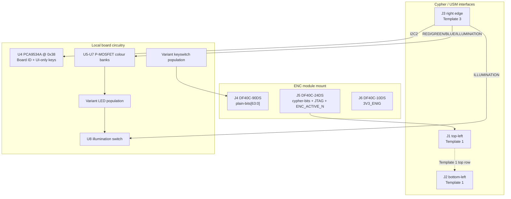

# Cypher-Input Board (V1.0) Design Specification

**Status:** Draft
**Project:** Enigma-NG
**Author:** Izzyonstage & GitHub Copilot
**Version:** v.0.1.0
**Associated Hardware Revision:** Rev A
**Last Updated:** 2026-09-17

## 1. Overview

The Cypher-Input Board is the physical keyboard input panel of the Enigma-NG system. It hosts one
ENC module in the keyboard cipher role, drives the Template 1 top-row HID signals, receives shared
lighting control from the User Settings Module over a dedicated right-edge connector, and presents
its variant identity through `BOARD_ROLE_ID_IN[3:0]`.

Variant-specific detail lives in:

- `design/Electronics/Cypher-Input/Cypher_Input_26_Char_Design.md`
- `design/Electronics/Cypher-Input/Cypher_Input_64_Char_Design.md`
- `design/Electronics/Cypher-Input/Cypher_Input_10_Numeric_Design.md`

| Variant | Layout | Keys | `BOARD_ROLE_ID_IN[3:0]` | Notes |
| :--- | :--- | :--- | :--- | :--- |
| **64-Character** | QWERTY-style, 26 letters + 10 digits + 2 base64-extra symbols + 2 Shift + Space + Enter | 42 | `0b0111` | Space and Enter remain UI-only keys read by `U4` |
| **26-Char Classic** | QWERTZ, 26 letters only | 26 | `0b0001` | Characters-only keyboard |
| **10-Numeric** | Number-pad style, 10 digits + Space + Enter | 12 | `0b0010` | Space and Enter remain UI-only keys read by `U4` |

| Circuit Responsibility | Board Role | Key Component |
| :--- | :--- | :--- |
| Keyboard cipher entry | Hosts one ENC module in the input role | `J4`-`J6` |
| Mechanical keyswitch panel | Variant-specific hot-swap keyboard | Variant `SW1+` |
| Local LED drive stage | Preserves the existing board-local high-current RGB drive circuitry | `U5`-`U8` |
| Shared lighting / JTAG / I2C intake | Receives USM lighting control, `I2C2`, and the Input-side JTAG path | `J3` |
| Board ID / UI-only key readback | Fixed `BOARD_ROLE_ID_IN[3:0]` plus Space / Enter readback where populated | `U4` |
| Cypher left-pair interface | Drives the Template 1 top-row HID signals and relays the Output-side bottom row | `J1`, `J2` |

### Functional Requirements

| ID | Functional Requirement | Notes | Satisfied By / Cross-Ref |
| :--- | :--- | :--- | :--- |
| FR-CYPI-01 | Host one ENC module in the keyboard cipher role | `plain-bits[63:0]` remain cipher-path keys only | Section 3; BOM `J4`-`J6` |
| FR-CYPI-02 | Provide 26, 42, or 12 hot-swappable mechanical keyswitch positions depending on variant | Variant files define the exact matrix and positions | Section 4 |
| FR-CYPI-03 | Provide one RGB LED indicator per key using the existing board-local drive stage | LED part selection remains open; high-current switching remains local to this board | Section 5 |
| FR-CYPI-04 | Receive shared lighting control, `I2C2`, and JTAG from USM | `J3` is the only USM-facing connector on this board | Section 6; BOM `J3` |
| FR-CYPI-05 | Connect to Cypher through the left-pair connector template | `J1` / `J2` implement Template 1 | Section 7; BOM `J1`, `J2` |
| FR-CYPI-06 | Drive the Input-role HID signals on Template 1 | `ENC_DATA_IN[5:0]`, `ENC_ACTIVE_INPUT_N`, and `BOARD_ROLE_ID_IN[3:0]` originate on this board | Section 7 |
| FR-CYPI-07 | Protect no connector on this board with TVS / ESD suppression | All connectors remain internal | Section 9 |
| FR-CYPI-08 | Keep `U4` for board identification and UI-only key readback | `U4` remains at `0x38`; Space / Enter stay off the cipher path | Section 3a; BOM `U4` |

### Design Requirements

| ID | Design Requirement | Specification | Satisfied By / Cross-Ref |
| :--- | :--- | :--- | :--- |
| DR-CYPI-01 | PCB stackup | 4-layer standard per `design/Standards/Global_Routing_Spec.md §2.3.1` | Section 8 |
| DR-CYPI-02 | ENC module mount connectors | `J4` = `DF40C-90DS-0.4V(51)`; `J5` = `DF40C-24DS-0.4V(51)`; `J6` = `DF40C-10DS-0.4V(51)` | Section 3; BOM `J4`-`J6` |
| DR-CYPI-03 | Cypher-facing connectors | `J1` = `QTS-025-01-L-D-RA-P`; `J2` = `QSS-025-01-L-D-RA-K`; both use Template 1 | Section 7; BOM `J1`, `J2` |
| DR-CYPI-04 | USM-facing connector | `J3` = `QTS-025-01-L-D-RA-P`; right edge; Template 3 | Section 6; BOM `J3` |
| DR-CYPI-05 | Keyswitch hot-swap sockets | Variant-specific Kailh `PG151101S11` population remains unchanged | Section 4 |
| DR-CYPI-06 | LED bank | Variant-specific RGB LED population remains placeholder-only pending `.copilot/todos/cypher-input-led-independent-rgb-pwm-review.md` | Section 5 |
| DR-CYPI-07 | LED current-limit resistors | Variant-specific one-per-channel resistor population remains placeholder-only pending final LED selection | Section 5 |
| DR-CYPI-08 | Local LED drive topology | `U5`/`U6`/`U7` remain the board-local colour-bank P-MOSFETs and `U8` remains the shared low-side illumination switch; their drive inputs now come from `J3` | Section 5; BOM `U5`-`U8` |
| DR-CYPI-09 | `U4` role and bus | `U4` = `PCA9534APWR` at `0x38` on `I2C2`; variant ID stays on `BOARD_ROLE_ID_IN[3:0]`, not in the address | Section 3a; BOM `U4` |
| DR-CYPI-10 | Rail entry decoupling | `C4-C8` (`3V3_ENIG`) and `C9-C13` (`5V_MAIN`) remain the entry bulk banks | Section 8; BOM `C4-C13` |
| DR-CYPI-11 | Mounting holes | `MH1`-`MH4`: M3 PTH tied to `GND_CHASSIS` per GRS Section 4 | Section 8 |
| DR-CYPI-12 | ESD protection | No TVS devices on `J1`-`J3`, `J4`-`J6` | Section 9 |

### Component Block Diagram

## 2. Architecture

- **Top face:** keyswitches and the variant LED population.
- **Rear face:** ENC mount, `U4`, entry decoupling, local LED drive parts, and the three external
  board-to-board connectors.
- **Lighting architecture:** colour and illumination source signals come from USM; the board-local
  high-current drive stage remains on this PCB.
- **Mechanical scope:** variant key layout, keepouts, and user-facing geometry remain in the
  variant files.

## 3. ENC Module Interface

`J4`-`J6` retain the existing ENC-module mounting standard. Cipher-path keys continue to use the
ENC module `plain-bits` interface only.

### 3a. Board ID / Non-Cipher Key I/O

`U4` remains `PCA9534APWR` at `0x38`. It stays dedicated to board identity support and UI-only key
readback (Space / Enter on the variants that populate them). The device now sits on the dedicated
`I2C2` Cypher-peripherals bus via `J3`, not on the Cypher local `I2C1` bus.

## 4. Keyswitch Panel

Variant-specific keyswitch placement, `plain-bits` allocation, and hot-swap socket quantities are
unchanged and remain in the variant documents.

## 5. LED Indicator Circuit

This board keeps the existing local analog RGB drive stage:

- `U5` / `U6` / `U7` remain the Red / Green / Blue colour-bank P-MOSFETs.
- `U8` remains the shared low-side illumination switch.
- The active control inputs to that stage are now received from USM on `J3` as
  `RED_DRIVE_N`, `GREEN_DRIVE_N`, `BLUE_DRIVE_N`, and `ILLUMINATION_DRIVE_N`.
- The LED part and any future independent per-channel redesign remain open in
  `.copilot/todos/cypher-input-led-independent-rgb-pwm-review.md`.

## 6. User Settings Module Interface

### J3 - USM Right-Edge Connector

> **Connector Definition Owner:** `User_Settings_Module/Board_Layout.md` (its own `J3`/`J4` left
> connectors). Full 50-pin template defined there.

This board occupies the Template 3 **top row** (Input role):

- `TDI_INPUT` -> ENC module TDI.
- `TDO_INPUT` -> ENC module TDO.
- `TDI_OUTPUT` / `TDO_OUTPUT` are NC on this board (Output-role pins).
- `I2C_SDA` / `I2C_SCL` -> `U4` (`I2C2`).
- `RED_DRIVE_N` / `GREEN_DRIVE_N` / `BLUE_DRIVE_N` -> local colour-bank drive inputs.
- `ILLUMINATION_DRIVE_N` -> local `U8` gate input.
- `TCK`, `TMS`, and `CPLD_RESET_N` -> ENC module JTAG pins.

## 7. Interconnects

### J4-J6 - ENC Module Mount

The ENC mount remains unchanged; pin-1/signal definitions are owned by
`Encoder_Module/Board_Layout.md §1a-1c`. See `Board_Layout.md §3` for a placeholder table pending
sign-off on how each ENC module signal routes onward to `J1`-`J3`.

### J1 / J2 - Cypher Left Pair Template

> **Connector Definition Owner:** `Cypher/Board_Layout.md §4` (its own `J5`). Full 50-pin template
> defined there.

This board drives / uses the Template 1 **top row** locally and straight-passes the **bottom row**:

- `ENC_ACTIVE_INPUT_N` is driven from the local ENC module activity output.
- `ENC_DATA_IN[5:0]` is driven from the local ENC module cipher-data outputs.
- `BOARD_ROLE_ID_IN[3:0]` carries this board's hardwired variant strap.
- `ENC_DATA_OUT[5:0]`, `ENC_ACTIVE_OUTPUT_N`, and `BOARD_ROLE_ID_OUT[3:0]` are straight-through
  relay traces on this board and are not tapped locally.
- `5V_MAIN` and GND are continuous entry / distribution rails for the local LED drive stage.

> **Note:** `ENC_ACTIVE_INPUT_N`/`ENC_ACTIVE_OUTPUT_N` originate from and terminate at the Cypher
> Board only. This board never taps `ENC_ACTIVE_OUTPUT_N` locally, even while relaying it through
> to Cypher - these signals are timing-sensitive against the Rotor/Stack encoder chain's
> propagation delay, so no HID board other than Cypher may intercept or buffer them.

## 8. PCB Fabrication & Stackup

- **Stackup:** 4-layer standard per `design/Standards/Global_Routing_Spec.md §2.3.1`.
- **Bulk-entry decoupling:** `C4-C8` at `3V3_ENIG`; `C9-C13` at `5V_MAIN`.
- **Mounting holes:** `MH1`-`MH4`, M3 PTH, tied to `GND_CHASSIS`.

## 9. Thermal & ESD

- **Thermal:** no active cooling required.
- **ESD:** `J1`-`J3` and `J4`-`J6` are internal connectors; no TVS devices are required.

## 10. Branding & Traceability

- **Data Plate:** per GRS Section 6 on the rear face.
- **Connector Pin-1 Markers:** `J1`-`J3` and `J4`-`J6` require pin-1 markers per GRS Section 7.1.

## 11. Bill of Materials

| RefDes | Specification | MPN | Manufacturer | DigiKey PN | Mouser PN | JLCPCB PN | Alt Supplier + PN | Notes | Footprint Available | Footprint Downloaded | Qty |
| --- | --- | --- | --- | --- | --- | --- | --- | --- | --- | --- | --- |
| `C4-C8` | 10uF X7R 50V 1206 | CL31B106KBK6PJE | Samsung | 1276-CL31B106KBK6PJECT-ND | 187-CL31B106KBK6PJE | C43935922 | - | `3V3_ENIG` entry decoupling bank | ✔ | ✔ | 5 |
| `C9-C13` | 10uF X7R 50V 1206 | CL31B106KBK6PJE | Samsung | 1276-CL31B106KBK6PJECT-ND | 187-CL31B106KBK6PJE | C43935922 | - | `5V_MAIN` entry decoupling bank | ✔ | ✔ | 5 |
| `J4` | 90-pin 0.4mm pitch BtB receptacle | DF40C-90DS-0.4V(51) | Hirose | 26-DF40C-90DS-0.4V(51)CT-ND | 798-DF40C90DS0.4V51 | C2911197 | - | ENC module mount - plain-bits connector | ✔ | ✔ | 1 |
| `J5` | 24-pin 0.4mm pitch BtB receptacle | DF40C-24DS-0.4V(51) | Hirose | H11621CT-ND | 798-DF40C24DS0.4V51 | C424640 | - | ENC module mount - cypher-bits + JTAG + ENC_ACTIVE_N | ✔ | ✔ | 1 |
| `J6` | 10-pin 0.4mm pitch BtB receptacle | DF40C-10DS-0.4V(51) | Hirose | H11617CT-ND | 798-DF40C10DS0.4V51 | C424636 | - | ENC module mount - 3V3_ENIG power | ✔ | ✔ | 1 |
| `J1, J3` | 50-contact 0.635mm right-angle male SMT | QTS-025-01-L-D-RA-P | Samtec | QTS-025-01-L-D-RA-P-ND | 200-QTS02501LDRAP | C7267889 | - | `J1` Cypher left-pair top connector; `J3` USM connector | ✔ | ✔ | 2 |
| `J2` | 50-contact 0.635mm right-angle female SMT | QSS-025-01-L-D-RA-K | Samtec | QSS-025-01-L-D-RA-K-ND | 200-QSS02501LDRAK | C6156774 | - | Cypher left-pair bottom connector | ✔ | ✔ | 1 |
| `U4` | 8-bit I2C GPIO expander, TSSOP-16 | PCA9534APWR | NXP Semiconductors | 296-21760-1-ND | 595-PCA9534APWR | C2871127 | - | Board ID + UI-only key readback at `0x38` on `I2C2` | ✔ | ✔ | 1 |
| `U5-U7` | P-channel MOSFET, SOT-23 | SQ2319ADS-T1_BE3 | Vishay Siliconix | 742-SQ2319ADS-T1_BE3CT-ND | 78-SQ2319ADS-T1_BE3 | C3280190 | - | Local Red / Green / Blue colour-bank switches | ✔ | ✔ | 3 |
| `U8` | N-channel MOSFET, SOT-23 | BSS138 | onsemi (or equiv.) | - | - | - | - | Shared local illumination switch; gate driven from `ILLUMINATION_DRIVE_N` | ✔ | - | 1 |
