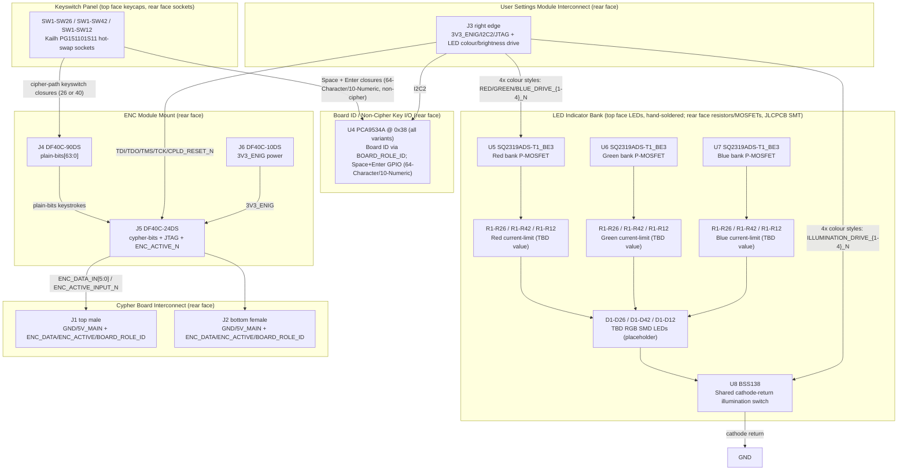

# Cypher-Input Board (V1.0) Design Specification

**Status:** Draft
**Project:** Enigma-NG
**Author:** Izzyonstage & GitHub Copilot
**Version:** v.0.1.0
**Associated Hardware Revision:** Rev A
**Last Updated:** 2026-09-21

## 1. Overview

The Cypher-Input Board is the physical keyboard input panel of the Enigma-NG system. It hosts one
ENC module in its **keyboard (encoder)** cipher role and connects to the Cypher Board's shared
left-pair connector as the `KBD_ENC` cipher pipeline entry point. This specification documents
**three board variants** sharing an identical circuit topology (ENC module mount, LED indicator
bank, Cypher Board interconnect, USM interconnect, board-identification strap plus a shared
non-cipher-key I2C expander); only key count/layout, LED/resistor/socket quantities, `plain-bits`
allocation, and
`BOARD_ROLE_ID[3:0]` strap value differ between them. Variant-specific detail lives in a dedicated
document per variant, mirroring the Rotor board's common-spec/variant-file split:

- `design/Electronics/Cypher-Input/Cypher_Input_26_Char_Design.md`
- `design/Electronics/Cypher-Input/Cypher_Input_64_Char_Design.md`
- `design/Electronics/Cypher-Input/Cypher_Input_10_Numeric_Design.md`

| Variant | Layout | Keys | `BOARD_ROLE_ID[3:0]` | Notes |
| :--- | :--- | :--- | :--- | :--- |
| **64-Character** | QWERTY-style, 26 letters + 10 digits + 2 base64-extra symbols + 2 Shift + Space + Enter | 42 | 0b0111 | Custom extended cipher set (base64 alphabet: `A-Z`, `a-z`, `0-9`, `+`, `/` - RFC 4648). Space and Enter are UI-only, not part of the cipher alphabet. Capability bits: Characters + Numbers + Special (bit3 Custom is not populated on this board - see §3a and DEC-089; it is the Cypher-Output board's own custom-support switch that sets bit3 in `BOARD_ROLE_ID_OUT[3:0]`). |
| **26-Char Classic** | QWERTZ, 26 letters only | 26 | 0b0001 | Mimics the original German Enigma machine keyboard. No Shift, digits, symbols, Space, or Enter. Capability bits: Characters only. |
| **10-Numeric** | Common number-pad grid, 10 digits + Space + Enter | 12 | 0b0010 | Dedicated numeric-entry keyboard. No Shift - digits have no case distinction. Space and Enter present for CM5 UI input clarity, same non-cipher role as on the 64-Character variant. Capability bits: Numbers only. |

> **Capability bitmask encoding (`ID[3]:ID[2]:ID[1]:ID[0]`) - see `Cypher/Design_Spec.md §3a`:**
> bit0 = Characters, bit1 = Numbers, bit2 = Special, bit3 = Custom. Cypher-Input boards never
> populate bit3 themselves (it is only ever set on a Cypher-Output board via its own
> user-accessible custom-support switch - see DEC-089); a Cypher-Input board's own `BOARD_ROLE_ID`
> is therefore always the fixed capability value for its variant, with bit3 = 0.
>
> **I2C address vs. variant identification:** all three variants share a single fixed I2C address
> for U4 (`0x38` - see §3a). Variant identification is carried **only** by the hardwired
> `BOARD_ROLE_ID[3:0]` strap on the Cypher Board interconnect (`J1`/`J2`, per
> `Cypher/Board_Layout.md §4`), not by the I2C
> address.
> **Board family / interface contract:** the Cypher Board's own left-pair connector (Samtec
> QSS-025-01-L-D-RA-K mating female, per `Cypher/Board_Layout.md §4`) plus the ENC module DF40C
> BtB mount standard (owned by `Encoder_Module/Board_Layout.md §1a-1c`; reproduced for layout
> reference in this board's own `Board_Layout.md §3`) form the fixed hardware interface that
> any keyboard front-end board must honour. Fully custom keyboard designs are supported as long as
> they use this same interface; each such board reuses the same shared `0x38` I2C address for its
> U4-equivalent (see §3a) - the I2C address identifies the *device role* (keyboard/HID expander),
> not the specific board - and instead needs its own distinct `BOARD_ROLE_ID[3:0]` value to
> identify itself as a new variant, with bit3 (Custom) set to signal a non-standard capability
> combination to the Cypher Board's compatibility comparator (see `Cypher/Design_Spec.md §3a`).
> The reserved capability combinations not covered by the three variants defined in this document
> (or any custom keyboard's own choice of bit0/bit1/bit2 values) are intended for exactly this: a
> custom board's own CPLD image, mapped in software to its own distinct capability value, so the
> system can recognise and configure for it without colliding with the three variants defined in
> this document.

| Circuit Responsibility | Board Role | Key Component |
| :--- | :--- | :--- |
| **Keyboard cipher entry** | Hosts one ENC module (keyboard/encoder role); forwards keystroke plain-bits to the module and receives cipher-bits/JTAG back | J4-J6 - DF40C BtB mount |
| **Mechanical keyswitch panel** | 26 (Classic), 42 (64-Character), or 12 (10-Numeric) hot-swap keyswitch positions | SW1-SW26 / SW1-SW42 / SW1-SW12 - Kailh PG151101S11 |
| **Key indicator LEDs** | RGB LED per key (part TBD - pending user confirmation of footprint fit under Cherry MX keyswitches); colour/brightness values sourced from the User Settings Module via `J3`, applied locally by this board's own drive stage - see §5; qty matches variant key count | D1-D26 / D1-D42 / D1-D12 - TBD RGB SMD (placeholder) |
| **LED drive stage** | Local high-current colour-bank and illumination switches, driven by whichever of the four received colour styles this board's own local logic selects | U5-U8 - see §5 |
| **Board ID / non-cipher key I/O** | I2C expander at a single fixed address shared by all variants (variant identity is carried by `BOARD_ROLE_ID[3:0]`, not I2C address); on the 64-Character and 10-Numeric variants it also reads Space and Enter (not part of the cipher pipeline) | U4 - PCA9534A @ 0x38 |
| **Cypher Board interconnect** | 2 connectors (top male, bottom female) to whichever HID board is closest to the Cypher Board, either order | J1/J2 - Samtec QTS/QSS-025 family |
| **User Settings Module interconnect** | 1 connector carrying `3V3_ENIG`, `I2C2`, JTAG, and the LED colour/brightness drive signals | J3 - Samtec QTS-025 family |

The top face (L1) carries only the LED bank (D1-Dxx). **It is not part of the JLCPCB PCBA order** -
it is hand-soldered by the user after the bare-assembled board is delivered, the same way the
keyswitches and keycaps already are (see below). This keeps JLCPCB's automated SMT assembly
**single-sided** (rear face only), consistent with the standard PCBA service constraint in
`design/Production/JLCPCB_Manufacturing.md §3.1` (dual-sided SMT is only available on Economic
PCBA with limitations) - the top face is never part of the machine-placed SMT pass at all.

> **Open item - LED mounting face is provisional, pending LED part selection:** a reverse-mount
> addressable candidate is under evaluation (`merge-missing-components.md`) that could mount on
> the **rear face** instead (via light-pipe cutouts through the board), which would remove the
> LED bank from this board's own hand-soldered top-face list entirely. This has **not** been
> decided - do not assume rear-face mounting until the LED part and its mounting orientation are
> confirmed; the same open item applies to Cypher-Output's own LED bank
> (`Cypher-Output/Design_Spec.md §2`), which uses the same part.

The rear face (L4) carries everything else: the ENC module mount (J4-J6) - positioned in the
keyless region that corresponds to a number-pad area on a conventional keyboard, off to the side
of the main keyswitch cluster - the Cypher Board interconnect (J1/J2), the User Settings Module
interconnect (J3), the I2C GPIO expander (U4), the LED current-limit resistors (R1-Rxx, one per
colour channel per LED), the three LED bank P-MOSFET switches (U5, U6, U7) plus the shared
cathode-return switch (U8), any variant-specific local hardware, the Kailh hot-swap sockets
(quantity per variant - see the per-variant design files), and local decoupling - all fully
populated by JLCPCB's standard single-sided SMT PCBA pass. Mechanical switches and keycaps are
**not** part of the PCBA either; they are sourced and fitted separately (JLCPCB post-PCBA or
end-user), plugging down through the top face into the rear-mounted hot-swap sockets.

> **Character set composition:** each variant's key layout and cipher-alphabet composition is
> defined in its own design file (`Cypher_Input_26_Char_Design.md`,
> `Cypher_Input_64_Char_Design.md`, `Cypher_Input_10_Numeric_Design.md` §1-§2). Space and Enter
> (present on the 64-Character and 10-Numeric variants) are never part of a cipher alphabet -
> they exist only for CM5 UI input clarity and are read via the on-board I2C GPIO expander (U4),
> not via the ENC module plain-bits bus. **LED colour/brightness values are sourced entirely from
> the User Settings Module and never touch the ENC module or the `plain-bits` bus** - see §5 for
> the full circuit. All 64 `plain-bits` lines are reserved exclusively for keyswitch/cipher-path
> use across every variant (see §3), including headroom for a possible future variant using all
> 64 lines as one signal per character.

### Functional Requirements

| ID | Functional Requirement | Notes | Satisfied By / Cross-Ref |
| :--- | :--- | :--- | :--- |
| FR-CYPI-01 | Host one ENC module in the keyboard (encoder) cipher role | DF40C BtB mount; `plain-bits[63:0]` carry the variant's cipher-path keyswitch inputs only - no LED signals ever share this bus - see per-variant design files §3 | §3 ENC Module Interface; BOM J4-J6 |
| FR-CYPI-02 | Provide 26 (Classic), 42 (64-Character), or 12 (10-Numeric) hot-swappable mechanical keyswitch positions | Kailh PG151101S11 hot-swap sockets, rear face; switches/keycaps sourced separately | §4 Keyswitch Panel; BOM SW1-SW26 / SW1-SW42 / SW1-SW12 |
| FR-CYPI-03 | Provide one RGB LED indicator per key, coloured/lit using values sourced from the User Settings Module | Colour/brightness values arrive via `J3`; local drive stage (U5-U8) applies them; qty matches variant key count (26, 42, or 12) | §5 LED Indicator Circuit; BOM D1-D26 / D1-D42 / D1-D12 |
| FR-CYPI-04 | Receive shared LED colour/brightness drive signals and JTAG/I2C from the User Settings Module | `J3` is the only USM-facing connector on this board | §6 User Settings Module Interface; BOM J3 |
| FR-CYPI-05 | Connect to the Cypher Board as the `KBD_ENC` cipher pipeline entry point | J1/J2 = Samtec QTS/QSS-025 family (top male, bottom female); mates whichever of Cypher Board / Cypher-Output is closest, either order | §7 Interconnects; BOM J1, J2 |
| FR-CYPI-06 | Drive the Input-role signals on the Cypher Board interconnect | `ENC_DATA_IN[5:0]`, `ENC_ACTIVE_INPUT_N`, and `BOARD_ROLE_ID_IN[3:0]` originate on this board | §7 Interconnects |
| FR-CYPI-07 | Protect no connector on this board with TVS/ESD suppression | All connectors (J1-J6) are internal BtB/dock connectors, not hot-swapped or externally accessible, per `design/Standards/Global_Routing_Spec.md §9` | §9 Thermal & ESD |
| FR-CYPI-08 | Identify which board variant is connected via `BOARD_ROLE_ID[3:0]`, and (64-Character and 10-Numeric variants only) read Space and Enter key state without entering the cipher pipeline | `BOARD_ROLE_ID[3:0]` strap carries variant identity as a 4-bit capability bitmask; local I2C GPIO expander (U4) at a single fixed address shared by all variants; not part of the ENC module plain-bits bus | §3a Non-Cipher Key I/O; BOM U4 |

### Design Requirements

| ID | Design Requirement | Specification | Satisfied By / Cross-Ref |
| :--- | :--- | :--- | :--- |
| DR-CYPI-01 | PCB stackup | 4-layer standard per `design/Standards/Global_Routing_Spec.md §2.3.1` | §8 PCB Fabrication & Stackup |
| DR-CYPI-02 | ENC module mount connectors | J4 = DF40C-90DS-0.4V(51) (plain-bits[63:0]); J5 = DF40C-24DS-0.4V(51) (cypher-bits + JTAG + ENC_ACTIVE_N); J6 = DF40C-10DS-0.4V(51) (3V3_ENIG power); pin mapping owned by `Encoder_Module/Board_Layout.md §1a-1c`, reproduced in this board's `Board_Layout.md §3` | §3 ENC Module Interface; BOM J4-J6 |
| DR-CYPI-03 | Cypher Board interconnect | J1 (top, male) = QTS-025-01-L-D-RA-P; J2 (bottom, female) = QSS-025-01-L-D-RA-K; pin-level template owned by `Cypher/Board_Layout.md §4` (its own `J5`) | §7 Interconnects; BOM J1, J2 |
| DR-CYPI-03a | User Settings Module interconnect | J3 = QTS-025-01-L-D-RA-P; pin-level template owned by `User_Settings_Module/Board_Layout.md` (its own left connectors) | §6 User Settings Module Interface; BOM J3 |
| DR-CYPI-04 | Keyswitch hot-swap sockets | SW1-SW26 (Classic), SW1-SW42 (64-Character), or SW1-SW12 (10-Numeric) = Kailh PG151101S11; JLCPCB consignment part C41430893; rear face (L4); no hand-soldering | §4 Keyswitch Panel; BOM SW1-SW26 / SW1-SW42 / SW1-SW12 |
| DR-CYPI-05 | Mechanical switches and keycaps | Cherry MX2A-71NB; **not populated in PCBA** - sourced separately (Mouser 540-MX2A-71NB, DigiKey 1644-MX2A-71NB-ND, JLCPCB global sourcing/consignment, or Amazon for prototyping); installed post-PCBA by JLCPCB or end-user | §4 Keyswitch Panel |
| DR-CYPI-06 | LED bank | D1-D26 / D1-D42 / D1-D12 = **TBD RGB SMD LED (placeholder)** - pending user confirmation of a part that physically fits under Cherry MX2A-71NB keyswitches | §5 LED Indicator Circuit; BOM D1-D26 / D1-D42 / D1-D12 |
| DR-CYPI-07 | LED current-limit resistors | One resistor per LED per colour channel (Red/Green/Blue); values TBD pending the RGB LED part's V_F per channel (see DR-CYPI-06); target 10mA drive per channel | §5 LED Indicator Circuit; BOM R1-R26 / R1-R42 / R1-R12 (each colour) |
| DR-CYPI-08 | LED bank drive topology | P-channel MOSFET high-side switch per colour bank, sourced from `5V_MAIN`: U5 (Red), U6 (Green), U7 (Blue); gated by whichever colour style's `RED_DRIVE_{n}_N`/`GREEN_DRIVE_{n}_N`/`BLUE_DRIVE_{n}_N` this board's own local logic selects from the four received via `J3` - see §5; active-LOW gate drive; same circuit on all variants | §5 LED Indicator Circuit; BOM U5-U7 |
| DR-CYPI-09 | LED bank MOSFET rating | SQ2319ADS-T1_BE3 (SOT-23, single P-channel; same part as USM Q19-Q30) for U5-U7; I_D = -4.6A, R_DS(on) = 0.145 Ohm @ V_GS = -4.5V; comfortably exceeds a 10mA-per-channel-per-LED bank load on any variant (each MOSFET only ever carries its own channel's current - see §5 Drive Topology for the combined `5V_MAIN` rail figure across all 3 channels) | §5 LED Indicator Circuit; BOM U5-U7 |
| DR-CYPI-11a | Illumination termination switch | U8 = BSS138 (N-channel MOSFET, SOT-23; same part family as the User Settings Module's colour-rail sink stage, DEC-034); common low-side switch at the LED bank's shared cathode return, downstream of all colour selection; gated by whichever `ILLUMINATION_DRIVE_{n}_N` signal this board's own local logic selects from the four received via `J3` | §5 LED Indicator Circuit; BOM U8 |
| DR-CYPI-14 | 3V3_ENIG entry decoupling bank | C4-C8 (5x 10uF X7R 50V 1206) at `J3` `3V3_ENIG` entry per `design/Standards/Global_Routing_Spec.md §3` Bulk Entry Bank Rule | §7 Power; BOM C4-C8 |
| DR-CYPI-14a | 5V_MAIN entry decoupling bank | C9-C13 (5x 10uF X7R 50V 1206) at `J1`/`J2` `5V_MAIN` entry per `design/Standards/Global_Routing_Spec.md §3` Bulk Entry Bank Rule (second distinct rail present on this board, alongside 3V3_ENIG - see DR-CYPI-14); required because the LED bank's colour banks (U5-U7) switch on `5V_MAIN`, not `3V3_ENIG` - see §5 Drive Topology and `Power_Budgets.md` 5V_MAIN Load Analysis for the worst-case 1.26A (64-Character variant) this rail must support | §7 Power; BOM C9-C13 |
| DR-CYPI-15 | Mounting holes | MH1-MH4: M3 PTH (3.2mm drill) tied to GND_CHASSIS per GRS §4; placement per GRS §4.3 Pattern A (standard rectangular board). No BOM entry. | §8 PCB Fabrication; GRS §4.3 |
| DR-CYPI-16 | ESD protection | Not required. J1-J6 are internal BtB/dock connectors, not hot-swapped and not externally accessible during normal servicing, per `design/Standards/Global_Routing_Spec.md §9` | §9 Thermal & ESD |
| DR-CYPI-17 | Board-ID / non-cipher key I/O expander | U4 = PCA9534A @ 0x38, the single fixed address shared by all Cypher-Input variants; same IC family already used in the system (Power Module PCA9534A @ 0x3F); variant is identified by the `BOARD_ROLE_ID[3:0]` strap on `J1`/`J2`, not by I2C address (see §3a); GPIO budget (of 8 total) varies by variant - see each variant's own design file §4; connects to `I2C_SDA`/`I2C_SCL` on `J3`, this board's own bus master on the dedicated `I2C2` Cypher-peripherals bus | §3a Non-Cipher Key I/O; §5 LED Indicator Circuit; BOM U4 |

### Component Block Diagram

> This diagram shows the baseline circuit common to **all** Cypher-Input variants. It does
> **not** include any variant-specific local hardware - see that variant's own design file for its
> full circuit including any such hardware.

## 2. Architecture

- **PCB:** 4-layer standard per `design/Standards/Global_Routing_Spec.md §2.3.1`. ENIG Gold.
  2.0mm filleted corners.
- **Assembly:** Single-sided JLCPCB SMT (rear face, L4, only) - required to stay within the
  standard PCBA service constraint (`design/Production/JLCPCB_Manufacturing.md §3.1`: dual-sided
  SMT is only available on Economic PCBA, with limitations). Top face (L1): LED bank (D1-Dxx)
  only - keyswitches occupy the rest of this face via rear-mounted hot-swap sockets. **The LEDs
  are not part of the JLCPCB PCBA order** - they are hand-soldered by the user after the
  bare-assembled board is delivered. Rear face (L4, fully populated by JLCPCB's single-sided SMT
  pass): ENC module mount (J4-J6), positioned in the keyless region that corresponds to a
  number-pad area; Cypher Board interconnect (J1/J2); User Settings Module interconnect (J3);
  I2C GPIO expander (U4); LED current-limit resistors (R1-Rxx, one per colour channel per LED);
  LED bank P-MOSFET switches (U5, U6, U7); shared cathode-return switch (U8); any
  variant-specific local hardware; Kailh hot-swap sockets (quantity per variant - see the
  per-variant design files); local decoupling.
  No components are placed above rear-side sockets (mechanical clearance for switch stems and
  keycaps).
- **Manufacturer:** JLCPCB (standard 4-layer; single-sided SMT PCBA, rear face only; consignment
  stock for Kailh sockets, part C41430893, in the same automated rear-side assembly pass).

### GND_CHASSIS Single-Point Bond

Per `design/Standards/Global_Routing_Spec.md §5`: this board implements a local `GND_CHASSIS`
net tied to its mounting holes, but does **not** implement a local GND to GND_CHASSIS bond. The
system's only galvanic GND to GND_CHASSIS bond remains on the Power Module.

## 3. ENC Module Interface

The Cypher-Input Board hosts one ENC module in the keyboard (encoder) cipher role via three
Hirose DF40C BtB receptacle sets, per the connector topology defined in
`.copilot/discussions/cypher-system-discussion/extension-mechanical-usage.md` Entry 16.

| Connector | MPN | Pins | Content |
| :--- | :--- | :--- | :--- |
| J4 | DF40C-90DS-0.4V(51) | 90 (2x45) | plain-bits[63:0] (64 signals) + GND (26); zig-zag distributed |
| J5 | DF40C-24DS-0.4V(51) | 24 (2x12) | cypher-bits[5:0] (6) + JTAG (TCK, RST_N/CPLD_RESET_N, TMS, TDI, TDO) + ENC_ACTIVE_N (1) + GND (12); full zig-zag |
| J6 | DF40C-10DS-0.4V(51) | 10 (2x5) | 3V3_ENIG (5) + GND (5); power only |

> **Pinout:** see `Board_Layout.md §3` for the full per-pin zig-zag GND distribution tables.
> This board is the documentation owner of the ENC-module BtB pin-mapping standard; the Cypher
> Board's own J7-J18 ENC mounts and the Cypher-Output Board follow the same pin map.

### plain-bits[63:0] Allocation on This Board

All 64 `plain-bits` positions are reserved **exclusively for cipher-path keyswitch inputs** on
every variant - LED colour selection never uses this bus (see §5). Per-variant `plain-bits`
allocation (which PB[] positions carry which cipher-path keys) is defined in each variant's own
design file:

- `Cypher_Input_26_Char_Design.md §3`
- `Cypher_Input_64_Char_Design.md §3`
- `Cypher_Input_10_Numeric_Design.md §3`

> Provisional pending Quartus pin-planning and PCB layout on the ENC module side. Space and Enter
> (64-Character and 10-Numeric variants) are **not** part of this bus - see §3a. A future variant
> could use all 64 lines as one signal per character, since none are reserved for anything other
> than keyswitches.

### ENC_ACTIVE_N Bidirectionality

In this board's keyboard (encoder) role, the ENC module CPLD **drives** `ENC_ACTIVE_N` (output,
active-low keypress notification) via J5. This board forwards it to the Cypher Board interconnect
(J1/J2) as `ENC_ACTIVE_INPUT_N`.

> **Propagation-delay constraint:** `ENC_ACTIVE_INPUT_N` (and its counterpart
> `ENC_ACTIVE_OUTPUT_N`, generated on Cypher-Output) may only ever originate from and terminate at
> the Cypher Board. This board generates `ENC_ACTIVE_INPUT_N` locally, but must never tap or
> locally consume `ENC_ACTIVE_OUTPUT_N` when relaying it through on the bottom row of `J1`/`J2` -
> both signals are timing-sensitive against the Rotor/Stack encoder chain's propagation delay, so
> only Cypher may terminate them.

## 3a. Board ID / Non-Cipher Key I/O

Every Cypher-Input board variant carries an I2C GPIO expander (U4) at a **single fixed address**
shared by all variants, since variant identity is already carried by the `BOARD_ROLE_ID[3:0]`
hardwired strap on the Cypher Board interconnect (`Cypher/Board_Layout.md §4`) - U4's address does
**not** vary by variant. On the 64-Character and 10-Numeric variants, this same expander also
reads Space and Enter, which exist only for CM5 UI input clarity and are **not** part of the
cipher alphabet - they are read via U4 rather than the ENC module plain-bits bus, so they never
enter the cipher pipeline.

- **U4 = PCA9534A** (same family already used elsewhere in the system - Power Module carries a
  PCA9534A @ 0x3F; chosen over MCP23017 since MCP23017's fixed `0100xxx` address prefix gives only
  0x20-0x27, which is entirely consumed by existing devices (Cypher U6-U8, USM colour store),
  leaving no room for other board types. PCA9534A's fixed `0111xxx` prefix gives a separate
  0x38-0x3F block instead).
- **Bus:** connects directly to `I2C_SDA`/`I2C_SCL` on the User Settings Module interconnect
  (`J3`) - the dedicated `I2C2` Cypher-peripherals bus, distinct from the system `I2C1` bus. See
  `User_Settings_Module/Board_Layout.md` for this template's pin definition. This board is not the
  documentation owner of what (if anything) other board types connect to this shared bus.
- **I2C address (single, shared by all Cypher-Input variants; see `Controller/Design_Spec.md**
  **§4.1` for the full system-wide I2C address table):**

  | I2C Address | A2/A1/A0 | Applies To | Pin usage |
  | :--- | :--- | :--- | :--- |
  | **0x38** | LOW/LOW/LOW (base 0x38 \| 0b000) | All Cypher-Input variants | Up to 8 GPIO; exact allocation (Space/Enter, any local switching hardware) varies by variant - see each variant's own design file §4 |

- **Variant identification:** carried solely by `BOARD_ROLE_ID[3:0]` (see
  `Cypher/Board_Layout.md §4` encoding table and each variant's own design file §4) - **not** by
  I2C address. A keyboard board only ever needs one identification mechanism, and
  `BOARD_ROLE_ID[3:0]` already exists for that purpose on the shared Cypher Board interconnect.
- **Reserved block for further custom keyboard board types** (PCA9534A's 0x38-0x3F range, with
  0x3F already taken by the Power Module's own PCA9534A): 0x39-0x3E remain free for any board
  type that is not a Cypher-Input variant and that chooses to place a PCA9534A on this bus - each
  such board type takes its own address, assigned when that board is designed. Cypher-Input
  variants never consume additional addresses from this block, since `BOARD_ROLE_ID[3:0]` handles
  variant identification instead.

## 4. Keyswitch Panel

- **Hot-swap sockets:** SW1-SW26 (Classic), SW1-SW42 (64-Character), or SW1-SW12 (10-Numeric) = Kailh
  PG151101S11, rear face (L4), placed in a keyboard grid layout matching the physical keycap
  layout - see each variant's own design file §2 for the exact layout. ~19.05mm between centres
  for MX-style switches. JLCPCB consignment stock (part C41430893), automated bottom-side
  assembly.
- **Mechanical switches and keycaps:** Cherry MX2A-71NB. **Not part of the PCBA** - sourced
  separately and installed post-PCBA (JLCPCB or end-user), snap-fit into the hot-swap sockets with
  zero-force insertion; no hand-soldering.
- **Routing:** Through-hole socket pads route to front-layer (L1) signals: cipher-path keys (26,
  40, or 10) to J4 (plain-bits); on the 64-Character and 10-Numeric variants, 2 non-cipher keys
  (Space, Enter) to U4 (I2C GPIO expander); on variants with a Shift key, the Shift keys are
  additionally tapped in parallel into that variant's own local Shift-sense hardware (if any) -
  see that variant's own design file for detail.
- **Keepout:** No components placed above rear-side sockets - mechanical clearance for switch
  stems and keycaps.

## 5. LED Indicator Circuit

One RGB LED per key, quantity matching the variant's key count (26 for Classic, 42 for 64-Character,
12 for 10-Numeric). Four independent RGB colour styles are stored and configured entirely on the
User Settings Module and delivered to this board's local drive stage via `J3`
(`RED_DRIVE_{1,2,3,4}_N`/`GREEN_DRIVE_{1,2,3,4}_N`/`BLUE_DRIVE_{1,2,3,4}_N`/
`ILLUMINATION_DRIVE_{1,2,3,4}_N`) - see §6. This board never generates colour/brightness values
itself; it only applies whichever of the four styles are relevant to its own local LED bank. Which
style(s) apply to a given key at a given moment, and the local circuit that decides this in real
time, are open items tracked in `.copilot/todos/cypher-input-led-independent-rgb-pwm-review.md`.

### LED Specification (placeholder - part TBD)

> **Open item:** the LED part is not yet finalised. The user needs to confirm a specific SMD RGB
> LED that physically fits under the Cherry MX2A-71NB keyswitch (approximately a "0403"-class
> footprint, to be confirmed against the switch's LED cutout). Do not source this part without
> explicit user confirmation. Current-limit resistor values below are placeholders and must be
> recalculated once the real part's per-channel V_F is known.

| Parameter | Red | Green | Blue |
| :--- | :--- | :--- | :--- |
| Package | TBD | TBD | TBD |
| V_F typ | TBD | TBD | TBD |
| I_F max | TBD | TBD | TBD |

### Current-Limit Resistors (placeholder values)

One series resistor per LED per colour channel, target 10mA drive per channel - exact values to
be recalculated once the LED part is confirmed:

- R1-R26 / R1-R42 / R1-R12 (Red): value TBD.
- R1-R26 / R1-R42 / R1-R12 (Green): value TBD.
- R1-R26 / R1-R42 / R1-R12 (Blue): value TBD.

### Drive Topology - P-Channel MOSFET High-Side Switching

Each colour bank (26, 42, or 12 parallel LEDs, depending on variant) is switched at the anode side
by one dedicated P-channel MOSFET (SOT-23), sourced from `5V_MAIN`:

- U5 (Red bank): gate driven by whichever `RED_DRIVE_{n}_N` signal this board's own local logic
  currently selects from the four received on `J3`.
- U6 (Green bank): gate driven by the corresponding `GREEN_DRIVE_{n}_N` signal (same source
  pattern as U5).
- U7 (Blue bank): gate driven by the corresponding `BLUE_DRIVE_{n}_N` signal (same source pattern
  as U5).
- Active-LOW gate drive: driver output LOW -> MOSFET ON -> LEDs light (subject to the shared
  illumination switch, §6). Driver output HIGH -> MOSFET OFF -> LEDs dark.
- No external gate resistors required at these switching frequencies.
- No external pull-down resistors required - the driving GPIO/logic outputs hold a defined state
  from power-up.

> **Open item:** the exact local circuit/logic that selects which of the four received colour
> styles (per style: `RED`/`GREEN`/`BLUE`/`ILLUMINATION_DRIVE_{n}_N`) drives U5-U7 at any given
> moment - e.g. a real-time mux keyed on Shift/key-press state - is not yet finalised; see
> `.copilot/todos/cypher-input-led-independent-rgb-pwm-review.md`.

**MOSFET selection:** SQ2319ADS-T1_BE3 (Vishay Siliconix, SOT-23, single P-channel - same part
already used on the User Settings Module) for U5-U7. I_D = -4.6A, R_DS(on) = 0.145 Ohm @
V_GS = -4.5V - comfortably exceeds a worst-case 420mA single-channel load (42 keys x 10mA,
64-Character variant) with wide margin; the 26-key Classic and 12-key 10-Numeric variant loads
(260mA and 120mA) are even further within margin.

> **Combined `5V_MAIN` current (all 3 channels, mixed colour):** a mixed colour (e.g.
> white/yellow/cyan/magenta) can hold all 3 colour banks active simultaneously - up to
> **1.26A worst case** (42 keys x 3 channels x 10mA, 64-Character variant; 0.78A for 26-Char
> Classic, 0.36A for 10-Numeric) on the shared `5V_MAIN` entry, not just the 420mA single-channel
> figure used for the MOSFET rating above (each MOSFET only ever carries its own channel's
> current, so the per-MOSFET rating is unaffected - this figure is for the shared `5V_MAIN` rail
> and its entry decoupling, DR-CYPI-14a, and the system-level `Power_Budgets.md` 5V_MAIN Load
> Analysis).

## 6. User Settings Module Interface

This board's illumination switch (U8, BSS138 - same part family as the User Settings Module's
colour-rail sink stage, DEC-034) is a common low-side switch at the LED bank's shared cathode
return, downstream of all colour selection, gated by whichever `ILLUMINATION_DRIVE_{n}_N` signal
this board's own local logic currently selects from the four received via `J3`. Brightness control
(the physical dial) is hosted entirely on the User Settings Module, not on this board - see
`User_Settings_Module/Design_Spec.md`.

### J3 - USM Right-Edge Connector

> **Connector Definition Owner:** `User_Settings_Module/Board_Layout.md` (its own left
> connectors). Full 50-pin template defined there; this board's own use of it is:

- `TDI_INPUT`/`TDO_INPUT` -> ENC module TDI/TDO (this board occupies the HID-Facing Connector
  Template's **top row**, the Input role).
- `TDI_OUTPUT`/`TDO_OUTPUT` are NC on this board (Output-role pins).
- `I2C_SDA`/`I2C_SCL` -> `U4` (`I2C2`).
- `RED_DRIVE_{1,2,3,4}_N`/`GREEN_DRIVE_{1,2,3,4}_N`/`BLUE_DRIVE_{1,2,3,4}_N` -> local colour-bank
  drive inputs (U5-U7); all four colour styles are received, but which style(s) actually drive the
  LED bank at a given moment is an open item - see §5.
- `ILLUMINATION_DRIVE_{1,2,3,4}_N` -> local `U8` gate input, same open item as above.
- `TCK`, `TMS`, and `CPLD_RESET_N` -> ENC module JTAG pins.
- `3V3_ENIG` -> board logic supply.

## 7. Interconnects

### J4-J6 - ENC Module Mount

See §3 ENC Module Interface for connector definitions. Pinout: `Board_Layout.md §3`.

### J1 / J2 - Cypher Left Pair Template

> **Connector Definition Owner:** `Cypher/Board_Layout.md §4` (its own `J5`). Full 50-pin template
> defined there.

This board drives / uses the Cypher Left Pair Template's **top row** locally and straight-passes
the **bottom row**:

- `ENC_ACTIVE_INPUT_N` is driven from the local ENC module activity output.
- `ENC_DATA_IN[5:0]` is driven from the local ENC module cipher-data outputs.
- `BOARD_ROLE_ID_IN[3:0]` carries this board's hardwired variant strap.
- `ENC_DATA_OUT[5:0]`, `ENC_ACTIVE_OUTPUT_N`, and `BOARD_ROLE_ID_OUT[3:0]` are straight-through
  relay traces on this board and are not tapped locally.
- `5V_MAIN` and GND are continuous entry / distribution rails for the local LED drive stage.

> **Note:** `ENC_ACTIVE_INPUT_N`/`ENC_ACTIVE_OUTPUT_N` originate from and terminate at the Cypher
> Board only. This board never taps `ENC_ACTIVE_OUTPUT_N` locally, even while relaying it through
> to Cypher - these signals are timing-sensitive against the Rotor/Stack encoder chain's
> propagation delay, so no HID board other than Cypher may intercept or buffer them.

The physical plugboard patch-jack harness does **not** route through this connector - it wires
directly to the Cypher Board's own spade terminal bank (`J20+`) instead, per DEC-088.

See §6 User Settings Module Interface for the `J3` connector.

## 8. PCB Fabrication & Stackup

- **Stackup:** 4-layer standard per `design/Standards/Global_Routing_Spec.md §2.3.1`.
- **Manufacturer:** JLCPCB. Single-sided SMT PCBA (rear face, L4, only - ENC mount, Cypher and
  USM interconnects, LED drive MOSFETs, LED current-limit resistors, and Kailh hot-swap sockets,
  consignment part C41430893). Top face (L1: LEDs) is hand-soldered by the user after PCBA
  delivery, not part of the JLCPCB order - see §2 Architecture.
- **Fillets:** 2.0mm rounded PCB corners.
- **Mounting Holes:** MH1-MH4, M3 PTH (3.2mm drill), tied to GND_CHASSIS per GRS §4. Placement
  per GRS §4.3 Pattern A (standard rectangular board, 7mm inset from both nearest edges at each
  corner). No BOM entry.
- **Decoupling:** per `design/Standards/Global_Routing_Spec.md §3`.

## 9. Thermal & ESD

- **Thermal:** No active cooling required. U5-U7 (SQ2319ADS-T1_BE3) and U8 (BSS138) dissipate
  well below 100mW combined. Any variant-specific switching ICs (see each variant's own design
  file) are equally low-power.
- **ESD:** No TVS/ESD protection required. J1-J6 are internal BtB/dock connectors that are not
  hot-swapped and not externally accessible during normal servicing, per
  `design/Standards/Global_Routing_Spec.md §9`.

## 10. Branding & Traceability

- **Data Plate:** Per GRS §6 on Layer L4 (bottom/rear face), placed in a quiet zone clear of the
  Kailh socket keepout area. Revision block: `CHIFFRIER-EINGABE-26 [Cypher-Input] V1.0` (Classic
  variant), `CHIFFRIER-EINGABE-64 [Cypher-Input] V1.0` (64-Character variant), or
  `CHIFFRIER-EINGABE-10N [Cypher-Input] V1.0` (10-Numeric variant), matching the Rotor board's
  `WALZE-{variant}` naming convention.
- **Connector Pin-1 Markers:** J1-J6 silkscreen pin-1 markers required per GRS §7.1.

## 11. Bill of Materials

> This BOM lists only components common to **all** Cypher-Input variants (fixed quantity,
> independent of variant) - connectors, decoupling, LED drive electronics, and the board-ID
> expander. Variant-specific components (LED bank, current-limit resistors, hot-swap
> sockets, mechanical keyswitches, and any local hardware) with their per-variant quantities are
> listed in each variant's own design file §6 (`Cypher_Input_26_Char_Design.md`,
> `Cypher_Input_64_Char_Design.md`, `Cypher_Input_10_Numeric_Design.md`), mirroring the Rotor
> board's common/variant BOM split. **One open sourcing item remains:** the RGB LED part itself
> (variant files) is a placeholder pending user confirmation of a part that fits under the Cherry
> MX2A-71NB keyswitch - do not source this without explicit user approval.

| RefDes | Specification | MPN | Manufacturer | DigiKey PN | Mouser PN | JLCPCB PN | Alt Supplier + PN | Notes | Footprint Available | Footprint Downloaded | Qty |
| --- | --- | --- | --- | --- | --- | --- | --- | --- | --- | --- | --- |
| C4-C8 | 10uF X7R 50V 1206 | CL31B106KBK6PJE | Samsung | 1276-CL31B106KBK6PJECT-ND | 187-CL31B106KBK6PJE | C43935922 | - | 3V3_ENIG entry decoupling bank at J3 | ✔ | ✔ | 5 |
| C9-C13 | 10uF X7R 50V 1206 | CL31B106KBK6PJE | Samsung | 1276-CL31B106KBK6PJECT-ND | 187-CL31B106KBK6PJE | C43935922 | - | 5V_MAIN entry decoupling bank at J1/J2, feeding the LED bank colour-switch MOSFETs (U5-U7) - see DR-CYPI-14a | ✔ | ✔ | 5 |
| J4 | 90-pin 0.4mm pitch BtB receptacle | DF40C-90DS-0.4V(51) | Hirose | 26-DF40C-90DS-0.4V(51)CT-ND | 798-DF40C90DS0.4V51 | C2911197 | - | ENC module mount - plain-bits connector | ✔ | ✔ | 1 |
| J5 | 24-pin 0.4mm pitch BtB receptacle | DF40C-24DS-0.4V(51) | Hirose | H11621CT-ND | 798-DF40C24DS0.4V51 | C424640 | - | ENC module mount - cypher-bits + JTAG + ENC_ACTIVE_N | ✔ | ✔ | 1 |
| J6 | 10-pin 0.4mm pitch BtB receptacle | DF40C-10DS-0.4V(51) | Hirose | H11617CT-ND | 798-DF40C10DS0.4V51 | C424636 | - | ENC module mount - 3V3_ENIG power | ✔ | ✔ | 1 |
| J1, J3 | 50-contact 0.635mm right-angle male SMT | QTS-025-01-L-D-RA-P | Samtec | QTS-025-01-L-D-RA-P-ND | 200-QTS02501LDRAP | C7267889 | - | J1 Cypher left-pair top connector; J3 USM connector | ✔ | ✔ | 2 |
| J2 | 50-contact 0.635mm right-angle female SMT | QSS-025-01-L-D-RA-K | Samtec | QSS-025-01-L-D-RA-K-ND | 200-QSS02501LDRAK | C6156774 | - | Cypher left-pair bottom connector | ✔ | ✔ | 1 |
| U5-U7 | P-channel MOSFET, SOT-23 | SQ2319ADS-T1_BE3 | Vishay Siliconix | 742-SQ2319ADS-T1_BE3CT-ND | 78-SQ2319ADS-T1_BE3 | C3280190 | - | U5: Red bank switch; U6: Green bank switch; U7: Blue bank switch; same part as User Settings Module | ✔ | ✔ | 3 |
| U8 | N-channel MOSFET, SOT-23 | BSS138 | onsemi (or equiv.) | - | - | - | - | Shared LED-bank cathode-return illumination switch, gated by whichever colour style's `ILLUMINATION_DRIVE_{n}_N` this board's own local logic selects; same part family as User Settings Module colour-rail sink stage (DEC-034) - exact supplier PN to be confirmed at schematic capture | ✔ | - | 1 |
| U4 | 8-bit I2C GPIO expander, TSSOP-16 | PCA9534APWR | NXP Semiconductors | 296-21760-1-ND | 595-PCA9534APWR | C2871127 | - | Board ID + UI-only key readback; single fixed address 0x38 across all variants (variant identity carried by `BOARD_ROLE_ID[3:0]`, not I2C address) on `I2C2`; same part as Power Module U14 (@ 0x3F, different address) | ✔ | ✔ | 1 |

> **Sourcing status:** most components in this BOM have confirmed sourcing (either from the source
> discussion directly, or reused from an already-approved part elsewhere in the design). **One
> item remains pending exact supplier PN confirmation at schematic capture:** U8 (BSS138) - a
> well-established, widely second-sourced part number already precedented in this design (User
> Settings Module colour-rail sinks), but a specific DigiKey/Mouser/JLCPCB catalogue entry has not
> yet been selected. The RGB LED part itself (variant files) is a placeholder pending user
> confirmation - see §5. Any variant-specific components (e.g. the 64-Character variant's mux/
> Shift-sense circuit) have their own sourcing status noted in that variant's own BOM.
