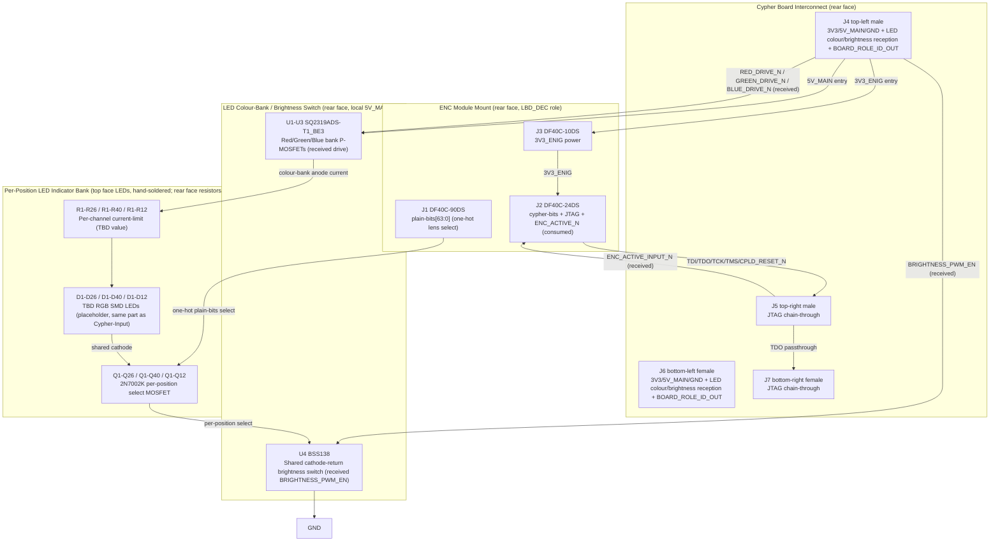

# Cypher-Output Board (V1.0) Design Specification

**Status:** Draft
**Project:** Enigma-NG
**Author:** Izzyonstage & GitHub Copilot
**Version:** v.0.1.0
**Associated Hardware Revision:** Rev A
**Last Updated:** 2026-08-17

## 1. Overview

The Cypher-Output Board is the physical lightboard indicator panel of the Enigma-NG system. It
hosts one ENC module in its **lightboard (decode)** cipher role and connects to the Cypher Board
as the `LBD_DEC` cipher pipeline exit point. This specification documents **three board
variants** sharing an identical circuit topology (ENC module mount, per-position LED indicator
bank, Cypher Board interconnect, board-identification strap); only lens count, layout, and
`BOARD_ROLE_ID_OUT[3:0]` strap value differ between them, mirroring the Cypher-Input Board's own
variant split. Variant-specific detail lives in a dedicated document per variant:

- `design/Electronics/Cypher-Output/Cypher_Output_26_Char_Design.md`
- `design/Electronics/Cypher-Output/Cypher_Output_64_Char_Design.md`
- `design/Electronics/Cypher-Output/Cypher_Output_10_Numeric_Design.md`

| Variant | Lens Layout | Lens Count | `BOARD_ROLE_ID_OUT[3:0]` |
| :--- | :--- | :--- | :--- |
| **64-Character** | Mirrors Cypher-Input's 64-Character QWERTY-style layout, 1:1 | 40 | `0b0111` (default) / `0b1111` (custom-support enabled via SW1 - see §5) |
| **26-Char Classic** | Mirrors Cypher-Input's 26-Char Classic QWERTZ layout, 1:1 | 26 | `0b0001` |
| **10-Numeric** | Mirrors Cypher-Input's 10-Numeric number-pad grid, 1:1 (10 digit lenses only - Space/Enter positions are unpopulated keepout on this board, see `Cypher_Output_10_Numeric_Design.md §2`) | 12 | `0b0010` |

> **Capability bitmask encoding (`ID[3]:ID[2]:ID[1]:ID[0]`) - see `Cypher/Design_Spec.md §3a`:**
> bit0 = Characters, bit1 = Numbers, bit2 = Special, bit3 = Custom. The 64-Character variant is
> the only Cypher-Output variant capable of asserting bit3, via its own user-accessible
> custom-support switch (SW1, see §5) - the 26-Char Classic and 10-Numeric variants have a fixed,
> non-switchable `BOARD_ROLE_ID_OUT[3:0]` value (Cypher-Input never carries this switch - see
> DEC-089). Per the Cypher Board's compatibility rule
> (`AND(BOARD_ROLE_ID_OUT, BOARD_ROLE_ID_IN) == BOARD_ROLE_ID_IN`), the 64-Character variant's
> default value (`0b0111`, Characters + Numbers + Special) is compatible with **all three**
> Cypher-Input variants, since it is a superset of each of their individual capability bits - this
> is intentional: the 64-Character Cypher-Output variant contains every lens position needed to
> display the output of any Cypher-Input variant.
>
> **Board family / interface contract:** the Cypher Board `J6` connector (Samtec
> QSS-025-01-L-D-A-GP-K mating female, per `Cypher/Board_Layout.md §4`) plus the ENC module DF40C
> BtB mount standard (owned by `Encoder_Module/Board_Layout.md §1a-1c`; reproduced for layout
> reference in this board's own `Board_Layout.md §1-3`) form the fixed hardware interface that
> any lightboard front-end board must honour. Fully custom lightboard designs are supported as
> long as they use this same interface, and need their own distinct `BOARD_ROLE_ID_OUT[3:0]`
> value to identify themselves as a new variant - the reserved capability combinations not
> covered by the three variants defined in this document are intended for exactly this: a custom
> board's own CPLD image, mapped in software to its own distinct capability value.

| Circuit Responsibility | Board Role | Key Component |
| :--- | :--- | :--- |
| **Lightboard cipher exit** | Hosts one ENC module (lightboard/decode role); receives cipher-bits/JTAG and decodes into a one-of-64 `plain-bits` output; forwards keystroke-activity blanking | J1-J3 - DF40C BtB mount |
| **Per-position LED indicator** | RGB LED per lens position, qty matching variant lens count; colour/brightness are **not** generated on this board - received entirely as a broadcast from the Cypher-Input board via `J4`/`J6`, but the LED bank's anode-side current is sourced **locally** from this board's own `5V_MAIN` entry (see LED colour-bank switch row below) | D1-D26 / D1-D40 / D1-D12 - TBD RGB SMD (placeholder, same part as Cypher-Input, pending confirmation) |
| **LED colour-bank switch** | 3-line `RED_DRIVE_N`/`GREEN_DRIVE_N`/`BLUE_DRIVE_N`, received (not generated) from the Cypher-Input board; gate this board's own colour-bank P-MOSFETs, sourced from this board's own `5V_MAIN` entry - see §4 Colour-Bank Drive Topology | U1-U3 (SQ2319ADS-T1_BE3) - see §4 |
| **LED brightness switch** | Received `BRIGHTNESS_PWM_EN` gates a common low-side switch at the LED bank's shared cathode return, downstream of the per-position select MOSFETs - see §4 Brightness Termination Switch | U4 (BSS138) |
| **Per-position LED select** | One discrete N-channel MOSFET per lens position, gated directly by that position's decoded `plain-bits` line (`PB[n]`, one-hot from the ENC module's `LBD_DEC` CPLD image) - only one lens lit at a time | Q1-Q26 / Q1-Q40 / Q1-Q12 - 2N7002K |
| **Board identification** | Hardwired 4-bit capability-bitmask strap, tied both directions on the Cypher Board interconnect left pair | `BOARD_ROLE_ID_OUT[3:0]` strap - see §3a |
| **Cypher Board interconnect** | 4 connectors (2 male top, 2 female bottom) to whichever HID board is closest to the Cypher Board, either order | J4-J7 - Samtec QTS/QSS-025 family |

The top face (L1) carries only the LED bank (D1-Dxx) and a keyless keepout zone in the region
corresponding to a conventional keyboard's number-pad area (mirroring Cypher-Input's RV1
placement, even though this board has no local brightness control of its own - brightness is
received entirely as a broadcast signal, see the Colour / Brightness Reception subsection below);
on the 64-Character variant only, this zone also carries SW1 (custom-support switch). **The LED
bank (and SW1, where populated) are not part of the JLCPCB PCBA order** - both
are hand-soldered by the user after the
bare-assembled board is delivered, the same way Cypher-Input's own LED bank is (see below). This
keeps JLCPCB's automated SMT assembly **single-sided** (rear face only), consistent with the
standard PCBA service constraint in `design/Production/JLCPCB_Manufacturing.md §3.1`.

> **Open item - LED mounting face is provisional, tied to Cypher-Input's own open LED part
> selection:** this board uses the **same LED part** as Cypher-Input (see §4 LED Specification),
> so whichever mounting face that part ends up needing also applies here. A reverse-mount
> addressable candidate is under evaluation (`merge-missing-components.md`) that could mount on
> the **rear face** instead (via light-pipe cutouts through the board), which would remove the
> LED bank from this board's own hand-soldered top-face list entirely, leaving nothing manually
> fitted on the 26-Char Classic/10-Numeric variants (and only SW1 on the 64-Character variant).
> This has **not** been decided - do not assume rear-face mounting until the LED part and its
> mounting orientation are confirmed; update this section and `Board_Layout.md` together with
> Cypher-Input's own equivalent section when that happens.

The rear face (L4) carries everything else: the ENC module mount (J1-J3) - positioned directly
beneath the keepout zone, in that same keyless region; the Cypher Board interconnect (J4-J7); the
LED current-limit resistors (R1-Rxx, one per colour channel per LED); the LED colour-bank
P-MOSFETs (U1-U3) and brightness termination switch (U4); the per-position select
MOSFETs (Q1-Qxx, one per lens position); the custom-support switch (SW1, 64-Character variant
only); local decoupling - all fully populated by JLCPCB's
standard single-sided SMT PCBA pass, with the exception of SW1, which (like the LED bank) is
hand-soldered post-delivery since it is a panel-mount user control.

> **No I2C GPIO expander on this board.** Unlike Cypher-Input, this board has no software-defined
> configuration state to hold: `BOARD_ROLE_ID_OUT[3:0]` is a pure hardwired strap (with the
> 64-Character variant's bit3 toggled by a physical SPDT switch, not an I2C write), colour and
> brightness are received as broadcast hardware signals rather than generated locally, and there
> are no non-cipher keys to read (no Space/Enter equivalent - this board has no keyswitches at
> all). No I2C bus connection is required or present on this board.

### Colour / Brightness Reception (No Local Generation)

This board never generates LED colour or brightness - both are received as broadcast hardware
signals from whichever Cypher-Input board is installed, via the Cypher Board interconnect's left
connector pair (`J4`/`J6` - see §6 Interconnects): `RED_DRIVE_N`, `GREEN_DRIVE_N`, `BLUE_DRIVE_N` (final,
post-mux colour signals, from Cypher-Input's own §5 LED Indicator Circuit) and
`BRIGHTNESS_PWM_EN` (shared brightness gate, from Cypher-Input's own §6 Brightness Control). These
received signals directly gate this board's **own** colour-bank P-MOSFETs (U1-U3) and brightness
termination switch (U4) - see §4 Colour-Bank Drive Topology / Brightness Termination Switch -
which switch this board's own LED bank current, sourced from this board's own `5V_MAIN` entry
(not merely a passthrough rail). This board's own per-position select MOSFETs (§4, Q1-Qxx) then
gate which single lens position's cathode is connected to that shared, brightness-switched
return - the broadcast signals set *which colour, at what brightness*, while this board's own
`plain-bits`-driven select MOSFETs set *which single position* is currently lit.

### Functional Requirements

| ID | Functional Requirement | Notes | Satisfied By / Cross-Ref |
| :--- | :--- | :--- | :--- |
| FR-CYPO-01 | Host one ENC module in the lightboard (decode) cipher role | DF40C BtB mount; `plain-bits[63:0]` carry the variant's one-hot lens-select outputs only | §3 ENC Module Interface; BOM J1-J3 |
| FR-CYPO-02 | Provide 26 (Classic), 40 (64-Character), or 12 (10-Numeric) per-position RGB LED lenses, mirroring Cypher-Input's own key layout 1:1 | qty matches variant lens count (26, 40, or 12); lens layout is a visual mirror of the corresponding Cypher-Input variant's key layout | §4 LED Indicator Panel; BOM D1-D26 / D1-D40 / D1-D12 |
| FR-CYPO-03 | Illuminate only the single lens position corresponding to the current decoded output character, blanking all positions while no valid keypress is active | Per-position N-channel select MOSFET gated by that position's decoded `plain-bits` line (`LBD_DEC` CPLD role); CPLD additionally blanks all outputs when `ENC_ACTIVE_N` is HIGH (no active keypress) - see `Encoder_Module/Design_Spec.md §3` Role Definitions | §4 LED Indicator Panel; BOM Q1-Q26 / Q1-Q40 / Q1-Q12 |
| FR-CYPO-04 | Receive LED colour and brightness entirely as a broadcast from the Cypher-Input board - no local colour/brightness generation | `RED_DRIVE_N`/`GREEN_DRIVE_N`/`BLUE_DRIVE_N`/`BRIGHTNESS_PWM_EN` received on `J4`/`J6`; no local dial, oscillator, or I2C colour-config hardware on this board; the received signals still gate this board's own local colour-bank/brightness switching hardware (U1-U4) - see FR-CYPO-09 | §7 Interconnects; Colour / Brightness Reception (above) |
| FR-CYPO-05 | Connect to the Cypher Board as the `LBD_DEC` cipher pipeline exit point | J4-J7 = Samtec QTS/QSS-025 family (2 male top, 2 female bottom); mates whichever of Cypher Board / Cypher-Input is closest, either order | §7 Interconnects; BOM J4-J7 |
| FR-CYPO-06 | Consume keyboard-source activity state from the Cypher-Input board to gate lightboard output blanking | `ENC_ACTIVE_INPUT_N`, received on `J5`/`J7`, tied both connectors; fed into this board's own ENC module `ENC_ACTIVE_N` input (this board's CPLD role consumes it, unlike Cypher-Input's `KBD_ENC` role which drives it) | §7 Interconnects |
| FR-CYPO-07 | Protect no connector on this board with TVS/ESD suppression | All connectors (J1-J7) are internal BtB/dock connectors, not hot-swapped or externally accessible, per `design/Standards/Global_Routing_Spec.md §9` | §9 Thermal & ESD |
| FR-CYPO-08 | Identify this board's own variant and capability set to the Cypher Board's compatibility comparator via a hardwired strap | `BOARD_ROLE_ID_OUT[3:0]` strap carries variant identity as a 4-bit capability bitmask; on the 64-Character variant, bit3 is user-switchable via SW1 | §3a; BOM SW1 (64-Character variant only) |
| FR-CYPO-09 | Provide local anode-side current for this board's own LED bank, sourced from this board's own `5V_MAIN` entry, switched by the received colour/brightness signals | Colour-bank P-MOSFETs (U1-U3) high-side switch each colour channel from `5V_MAIN`; brightness termination switch (U4) low-side switches the shared cathode return | §4 Colour-Bank Drive Topology; Brightness Termination Switch; BOM U1-U4 |

### Design Requirements

| ID | Design Requirement | Specification | Satisfied By / Cross-Ref |
| :--- | :--- | :--- | :--- |
| DR-CYPO-01 | PCB stackup | 4-layer standard per `design/Standards/Global_Routing_Spec.md §2.3.1` | §7 PCB Fabrication & Stackup |
| DR-CYPO-02 | ENC module mount connectors | J1 = DF40C-90DS-0.4V(51) (plain-bits[63:0]); J2 = DF40C-24DS-0.4V(51) (cypher-bits + JTAG + ENC_ACTIVE_N); J3 = DF40C-10DS-0.4V(51) (3V3_ENIG power); pin mapping owned by `Encoder_Module/Board_Layout.md §1a-1c`, reproduced in this board's `Board_Layout.md §1-3` | §3 ENC Module Interface; BOM J1-J3 |
| DR-CYPO-03 | Cypher Board interconnect | J4 (TL, male), J5 (TR, male) = QTS-025-01-L-D-RA-P; J6 (BL, female), J7 (BR, female) = QSS-025-01-L-D-RA-K; left pair (J4/J6) = 3V3_ENIG/GND/5V_MAIN/LED colour+brightness reception/`BOARD_ROLE_ID_OUT[3:0]`; right pair (J5/J7) = shared JTAG chain-through template per `Cypher/Board_Layout.md §4`; pin mapping per `Board_Layout.md §4` | §7 Interconnects; BOM J4-J7 |
| DR-CYPO-04 | LED bank | D1-D26 / D1-D40 / D1-D12 = **TBD RGB SMD LED (placeholder)** - same part as Cypher-Input, pending user confirmation (see `Cypher-Input/Design_Spec.md §5`); every variant lens is single-colour-at-a-time, driven by the broadcast colour/brightness signals | §4 LED Indicator Panel; BOM D1-D26 / D1-D40 / D1-D12 |
| DR-CYPO-05 | LED current-limit resistors | One resistor per LED per colour channel (Red/Green/Blue); values TBD pending the RGB LED part's V_F per channel (see DR-CYPO-04); target 10mA drive per channel, matching Cypher-Input | §4 LED Indicator Panel; BOM R1-R26 / R1-R40 / R1-R12 (each colour) |
| DR-CYPO-06 | Per-position LED select topology | One N-channel MOSFET per lens position (SOT-23), gated directly by that position's decoded `plain-bits` line from the ENC module's `LBD_DEC` CPLD image; active-HIGH gate drive (CPLD output HIGH = MOSFET ON = that position's LED cathode connected to the shared brightness-switched return, DR-CYPO-13 - subject to the received colour/brightness signals) | §4 LED Indicator Panel; BOM Q1-Q26 / Q1-Q40 / Q1-Q12 |
| DR-CYPO-07 | Per-position select MOSFET rating | 2N7002K (SOT-23, single N-channel); I_D = 310mA, R_DS(on) = 5.3 Ohm @ V_GS = 4.5V - comfortably exceeds a single lens position's worst-case 30mA load (10mA x 3 colour channels, all channels active simultaneously for a non-primary colour) | §4 LED Indicator Panel; BOM Q1-Q26 / Q1-Q40 / Q1-Q12 |
| DR-CYPO-08 | Custom-support switch (64-Character variant only) | SW1 = user-accessible panel-mount SPDT switch, common pin to `BOARD_ROLE_ID_OUT[3]`, one throw to GND (default, bit3=0), other throw to 3V3_ENIG (custom-support enabled, bit3=1); placed in the keyless keepout zone (mirroring Cypher-Input's RV1 "keyboard settings" panel location); 0 Ohm DNF link R_CUST provided in parallel for a user to hardwire bit3=1 permanently if a custom lightboard build never needs to toggle it | §5 (64-Character variant only); BOM SW1, R_CUST |
| DR-CYPO-09 | Mounting holes | MH1-MH4: M3 PTH (3.2mm drill) tied to GND_CHASSIS per GRS §4; placement per GRS §4.3 Pattern A (standard rectangular board). No BOM entry. | §6 PCB Fabrication; GRS §4.3 |
| DR-CYPO-10 | ESD protection | Not required. J1-J7 are internal BtB/dock connectors, not hot-swapped and not externally accessible during normal servicing, per `design/Standards/Global_Routing_Spec.md §9` | §7 Thermal & ESD |
| DR-CYPO-11 | 3V3_ENIG entry decoupling bank | 5x 10uF X7R 50V 1206 at J4/J6 3V3_ENIG entry per `design/Standards/Global_Routing_Spec.md §3` Bulk Entry Bank Rule | §7 Power; BOM |
| DR-CYPO-12 | LED colour-bank drive topology | P-channel MOSFET high-side switch per colour bank, sourced from this board's own `5V_MAIN` entry (not `3V3_ENIG` - see DR-CYPO-14): U1 (Red), U2 (Green), U3 (Blue); gated by the received `RED_DRIVE_N`/`GREEN_DRIVE_N`/`BLUE_DRIVE_N` (never generated locally) - see §4 Colour-Bank Drive Topology; active-LOW gate drive; same circuit on all variants | §4 Colour-Bank Drive Topology; BOM U1-U3 |
| DR-CYPO-13 | LED colour-bank MOSFET rating / brightness termination switch | U1-U3 = SQ2319ADS-T1_BE3 (SOT-23, single P-channel; same part as Cypher-Input U5-U7), I_D = -4.6A, R_DS(on) = 0.145 Ohm @ V_GS = -4.5V; U4 = BSS138 (N-channel, SOT-23; same part as Cypher-Input U8) - common low-side switch at the LED bank's shared cathode return, downstream of the per-position select MOSFETs (Q1-Qxx); gated by the received `BRIGHTNESS_PWM_EN` | §4 Colour-Bank Drive Topology; Brightness Termination Switch; BOM U1-U4 |
| DR-CYPO-14 | 5V_MAIN entry decoupling bank | C6-C10 (5x 10uF X7R 50V 1206) at J4/J6 5V_MAIN entry per `design/Standards/Global_Routing_Spec.md §3` Bulk Entry Bank Rule (second distinct rail present on this board, alongside 3V3_ENIG - see DR-CYPO-11); required because this board's own LED colour banks (U1-U3) switch on `5V_MAIN`, not `3V3_ENIG` - see §4 Colour-Bank Drive Topology and `Power_Budgets.md` 5V_MAIN Load Analysis for the worst-case current (per variant) this rail must support | §7 Power; BOM C6-C10 |

### Component Block Diagram

> This diagram shows the baseline circuit common to **all** Cypher-Output variants.

## 2. Architecture

- **PCB:** 4-layer standard per `design/Standards/Global_Routing_Spec.md §2.3.1`. ENIG Gold.
  2.0mm filleted corners.
- **Assembly:** Single-sided JLCPCB SMT (rear face, L4, only) - required to stay within the
  standard PCBA service constraint (`design/Production/JLCPCB_Manufacturing.md §3.1`). Top face
  (L1): LED bank (D1-Dxx) only, plus a keyless keepout zone (mirroring Cypher-Input's RV1
  location) that carries no components on any variant. **The LED bank is not part of the JLCPCB
  PCBA order** - it is hand-soldered by the
  user after the bare-assembled board is delivered. Rear face (L4, fully populated by JLCPCB's
  single-sided SMT pass): ENC module mount (J1-J3), positioned directly beneath the keepout zone;
  Cypher Board interconnect (J4-J7); LED current-limit resistors (R1-Rxx); per-position select
  MOSFETs (Q1-Qxx); local decoupling.
- **Manufacturer:** JLCPCB (standard 4-layer; single-sided SMT PCBA, rear face only).

### GND_CHASSIS Single-Point Bond

Per `design/Standards/Global_Routing_Spec.md §5`: this board implements a local `GND_CHASSIS`
net tied to its mounting holes, but does **not** implement a local GND to GND_CHASSIS bond. The
system's only galvanic GND to GND_CHASSIS bond remains on the Power Module.

## 3. ENC Module Interface

The Cypher-Output Board hosts one ENC module in the lightboard (decode) cipher role via three
Hirose DF40C BtB receptacle sets, identical connector topology to Cypher-Input (see
`Encoder_Module/Design_Spec.md §4`).

| Connector | MPN | Pins | Content |
| :--- | :--- | :--- | :--- |
| J1 | DF40C-90DS-0.4V(51) | 90 (2x45) | plain-bits[63:0] (64 signals, one-hot lens select) + GND (26); zig-zag distributed |
| J2 | DF40C-24DS-0.4V(51) | 24 (2x12) | cypher-bits[5:0] (6) + JTAG (TCK, RST_N/CPLD_RESET_N, TMS, TDI, TDO) + ENC_ACTIVE_N (1, consumed) + GND (12); full zig-zag |
| J3 | DF40C-10DS-0.4V(51) | 10 (2x5) | 3V3_ENIG (5) + GND (5); power only |

> **Pinout:** see `Board_Layout.md §1-3` for the full per-pin zig-zag GND distribution tables -
> identical to Cypher-Input's own tables, per `Encoder_Module/Board_Layout.md §1a-1c`.

### plain-bits[63:0] Allocation on This Board

All 64 `plain-bits` positions are reserved **exclusively for one-hot lens-position select
outputs** on every variant. Per-variant allocation (which PB[] positions drive which lens
position) is defined in each variant's own design file, and mirrors that variant's
Cypher-Input `plain-bits` allocation position-for-position:

- `Cypher_Output_26_Char_Design.md §3`
- `Cypher_Output_64_Char_Design.md §3`
- `Cypher_Output_10_Numeric_Design.md §3`

### ENC_ACTIVE_N Bidirectionality

In this board's lightboard (decode) role, the ENC module CPLD **consumes** `ENC_ACTIVE_N`
(input, active-low keypress notification from Cypher-Input) via J2, blanking all lens outputs
while HIGH (no active keypress upstream) - see `Encoder_Module/Design_Spec.md §3` Role
Definitions. This board receives it from the Cypher Board interconnect (`J5`/`J7`) as
`ENC_ACTIVE_INPUT_N`, the same net name used on Cypher-Input (this board does not rename it,
since it is simply forwarding/consuming the same signal Cypher-Input generates).

## 3a. Board Identification

Every Cypher-Output board variant identifies itself to the Cypher Board's `BOARD_ROLE_ID`
compatibility comparator (`Cypher/Design_Spec.md §3a`) via a hardwired `BOARD_ROLE_ID_OUT[3:0]`
strap on the Cypher Board interconnect (`J4`/`J6`, per `Cypher/Board_Layout.md §4`) - there is no
I2C-based identification mechanism on this board (see the "No I2C GPIO expander" note in §1).

- **26-Char Classic and 10-Numeric variants:** `BOARD_ROLE_ID_OUT[3:0]` is a fixed hardwired
  strap (3V3_ENIG/GND per bit, no switch) - see each variant's own design file §4.
- **64-Character variant only:** bit3 (Custom) is user-switchable via SW1, a panel-mount SPDT
  switch - see §5 for the full circuit.

## 4. LED Indicator Panel

One RGB LED per lens position, quantity matching the variant's lens count (26 for Classic, 40
for 64-Character, 12 for 10-Numeric), mirroring Cypher-Input's own key layout 1:1 so the
illuminated lens always corresponds visually to the operator's expected key position on the
paired keyboard (per `Mechanical/Lightboard_Assembly/Design_Spec.md §2`).

### LED Specification (placeholder - part TBD)

> Same open item as Cypher-Input (`Cypher-Input/Design_Spec.md §5`): the LED part is not yet
> finalised. This board uses the **same confirmed part** as Cypher-Input once selected, so both
> boards' LED banks are identical components. Do not source this part without explicit user
> confirmation.

| Parameter | Red | Green | Blue |
| :--- | :--- | :--- | :--- |
| Package | TBD | TBD | TBD |
| V_F typ | TBD | TBD | TBD |
| I_F max | TBD | TBD | TBD |

### Current-Limit Resistors (placeholder values)

One series resistor per LED per colour channel, target 10mA drive per channel (matching
Cypher-Input) - exact values to be recalculated once the LED part is confirmed:

- R1-R26 / R1-R40 / R1-R12 (Red): value TBD.
- R1-R26 / R1-R40 / R1-R12 (Green): value TBD.
- R1-R26 / R1-R40 / R1-R12 (Blue): value TBD.

### Colour-Bank Drive Topology - P-Channel MOSFET High-Side Switching (Received Signals)

Unlike Cypher-Input (which generates its own colour selection locally via U4/PCA9534A), this
board's LED bank anode-side current is switched entirely by **received** signals - there is no
local colour generation, only local anode switching hardware. Each colour bank (all lens
positions' Red, Green, or Blue anodes in parallel, quantity matching the variant's lens count) is
switched at the anode side by one dedicated P-channel MOSFET (SOT-23), sourced from this board's
own `5V_MAIN` entry (not `3V3_ENIG` - see DR-CYPO-14 for the corresponding entry decoupling
bank):

- U1 (Red bank): gate driven by the received `RED_DRIVE_N` (from Cypher-Input's own U4 GPIO or
  local switching hardware, via `J4`/`J6` - never generated on this board).
- U2 (Green bank): gate driven by the received `GREEN_DRIVE_N` (same source pattern as U1).
- U3 (Blue bank): gate driven by the received `BLUE_DRIVE_N` (same source pattern as U1).

Because only one lens position is ever lit at a time (Per-Position Select Topology, below), each
colour bank's P-MOSFET only ever carries the current of the single currently-selected position -
not the full variant lens count in parallel - unlike Cypher-Input's own colour banks, which light
every populated key simultaneously.

- No external gate resistors required at these switching frequencies (~100-300 Hz, matching
  Cypher-Input's `BRIGHTNESS_PWM_EN` source).
- No external pull-down resistors required - the driving signals hold a defined state from
  power-up (sourced from Cypher-Input's own logic).

**MOSFET selection:** SQ2319ADS-T1_BE3 (Vishay Siliconix, SOT-23, single P-channel - same part as
Cypher-Input U5-U7) for U1-U3. I_D = -4.6A, R_DS(on) = 0.145 Ohm @ V_GS = -4.5V - comfortably
exceeds a single lens position's worst-case single-channel 10mA load, with very wide margin
(since, unlike Cypher-Input, this board never has more than one lens position lit at once).

> **Combined `5V_MAIN` current (all 3 channels, mixed colour, single lit position):** a mixed
> colour (e.g. white/yellow/cyan) can hold all 3 colour banks active simultaneously for the one
> currently-lit lens position - up to **30mA worst case** (1 lens x 3 channels x 10mA) on the
> shared `5V_MAIN` entry. This is far below Cypher-Input's own combined-channel figure (which
> lights its entire key bank at once) because only one Cypher-Output lens is ever lit at a time -
> see `Power_Budgets.md` 5V_MAIN Load Analysis for the system-level figure and DR-CYPO-14 for the
> entry decoupling bank sized against it.

### Brightness Termination Switch

- U4 = BSS138 (N-channel MOSFET, SOT-23; same part as Cypher-Input U8) - common low-side switch
  at the LED bank's shared cathode return, **downstream of the per-position select MOSFETs**
  (Q1-Qxx, below) rather than upstream of colour selection (the reverse ordering from
  Cypher-Input, which has no per-position select stage of its own).
- Gated by the received `BRIGHTNESS_PWM_EN` (from Cypher-Input's own U1/555 astable oscillator,
  via `J4`/`J6` - never generated on this board), so the same dial that dims Cypher-Input's own
  key backlighting also dims whichever single lens position is lit on this board.

### Per-Position Select Topology - N-Channel MOSFET Low-Side Switching

Each lens position's LED is switched at the cathode side by one dedicated N-channel MOSFET
(SOT-23), gated directly by that position's decoded `plain-bits` line from the ENC module's
`LBD_DEC` CPLD image:

- Q1-Qxx (one per lens position): gate driven directly by that position's `PB[n]` line; drain
  connects to that position's LED cathode, source connects to the shared node feeding U4's drain
  (Brightness Termination Switch, above).
- Active-HIGH gate drive: CPLD output HIGH -> MOSFET ON -> that position's LED cathode connected
  to the shared brightness-switched return (subject to the received colour/brightness signals
  from Cypher-Input, received on `J4`/`J6` - see §1 Colour / Brightness Reception). CPLD output
  LOW -> MOSFET OFF -> that position dark.
- Only one `PB[n]` line is ever asserted at a time (one-hot decode), so only one lens position is
  ever lit at once; all positions blank together when `ENC_ACTIVE_N` is HIGH (no active
  keypress upstream - see §3).
- No external gate resistors required at these switching frequencies. No external pull-down
  resistors required - the driving CPLD outputs hold a defined state from power-up.

**MOSFET selection:** 2N7002K (SOT-23, single N-channel) for Q1-Qxx. I_D = 310mA,
R_DS(on) = 5.3 Ohm @ V_GS = 4.5V - comfortably exceeds a single lens position's worst-case 30mA
load (10mA x 3 colour channels, all channels active simultaneously for a non-primary colour),
with wide margin; since only one position is ever lit at a time, per-position current is never
compounded across positions.

> **Rationale for a discrete MOSFET per position (rather than sinking each LED directly through
> its own ENC module CPLD pin):** the EPM570T100I5N CPLD's `PB[n]` pins already fully commit all
> 64 available `plain-bits` positions to one-hot lens select, with no spare pins left to split a
> lens position's colour channels across multiple pins (all 76 user I/O pins are consumed by the
> 64 `plain-bits` + 6 `cypher-bits` + JTAG/status - see `Encoder_Module/Design_Spec.md §3` I/O
> Capacity). A single `PB[n]` pin sinking a lit position's full worst-case current directly
> (10mA x 3 colour channels = 30mA, if the LED's colour channels shared one common cathode) would
> exceed the CPLD's specified 3.3-V LVTTL programmable drive-strength rating (8mA or 16mA
> per pin, per the MAX II Device Handbook's Table 2-6/Table 8-1 - the same setting applies
> symmetrically to both sourcing, IOH, and sinking, IOL). While this is still below the
> device's absolute-maximum per-pin rating (±25mA, Table 5-1), exceeding the programmed
> drive-strength current risks violating the guaranteed VOL/VOH switching thresholds rather than
> damaging the pin outright - an unreliable design margin either way. Using a discrete MOSFET per
> position keeps each CPLD pin's job limited to driving a near-zero-current MOSFET gate (well
> within any drive-strength setting), while the MOSFET itself - not the CPLD pin - carries the
> real LED current.

## 5. Custom-Support Strap Circuit (64-Character Variant Only)

See `Cypher_Output_64_Char_Design.md §4` for the full SW1 circuit, BOM entries, and panel
placement. The 26-Char Classic and 10-Numeric variants have no switch - their
`BOARD_ROLE_ID_OUT[3:0]` value is fully fixed (see each variant's own design file §4).

## 6. Interconnects

### J1-J3 - ENC Module Mount

See §3 ENC Module Interface for connector definitions. Pinout: `Board_Layout.md §1-3`.

### J4-J7 - Cypher Board Interconnect

**Pin-level template owned by the Cypher Board (`Cypher/Board_Layout.md §4`) - this board owns
only its own physical connector placement and gender, per that shared template.**

- **Architecture:** 4 connectors: J4 (top-left, male), J5 (top-right, male) - mounted flush with
  the board's top edge; J6 (bottom-left, female), J7 (bottom-right, female) - mounted protruding
  past the board's bottom edge, identical mechanical arrangement to Cypher-Input (see
  `Cypher-Input/Design_Spec.md §7` for the full stacking-order rationale). This lets Cypher-Input
  and Cypher-Output attach to the Cypher Board in either order.
- **MPN:** J4/J5 = QTS-025-01-L-D-RA-P (Samtec 50-contact 0.635mm right-angle male SMT); J6/J7 =
  QSS-025-01-L-D-RA-K (Samtec 50-contact 0.635mm right-angle female SMT).
- **J4/J6 (left pair):** mates the Cypher Board's own `J5` template (`Cypher/Board_Layout.md §4`)
  - `3V3_ENIG` (pins 1-4), `5V_MAIN` (pins 5-8; feeds this board's own LED colour-bank MOSFETs
  U1-U3 - see §4 Colour-Bank Drive Topology; worst-case 30mA combined across all 3 channels,
  since only one lens position is ever lit at a time - see `Power_Budgets.md` 5V_MAIN Load
  Analysis; exact per-channel current still depends on the LED part selected in
  `merge-missing-components.md`), GND (pins 9-12), `RED_DRIVE_N`
  (pin 14) and `GREEN_DRIVE_N` (pin 16) received on the bottom row (top row 13/15 is GND) -
  **this board reads these, it does not drive them** - and a top row at pins 17/19/21/23 that
  carries `BOARD_ROLE_ID_IN[3:0]` as a straight passthrough (an internal trace on this board
  bridging J4's top-row pin to J6's top-row pin, not touching this board's own CPLD or strap
  logic - relays whichever Cypher-Input board's own ID is installed, same convention as
  `ENC_DATA` at J5/J7); bottom row 18/20/22/24 is GND at this column pair, since this board does
  not generate an Input ID. Pins 25/26 are the connector's fixed center GND bar. On
  the far side of the bar, pins 28/30/32/34 (bottom row) carry this board's own
  `BOARD_ROLE_ID_OUT[3:0]` strap (top row 27/29/31/33 is GND) - driven by this board, tied both
  J4 and J6; pins 35/37 (top row) receive `BRIGHTNESS_PWM_EN`/`BLUE_DRIVE_N` (bottom row 36/38 is
  GND) - **received, not driven**, from Cypher-Input. Pins 39-42 are GND, pins 43-50 are
  `5V_MAIN` (43-46) and `3V3_ENIG` (47-50), matching the Cypher Board's own J5 template.
- **J5/J7 (right pair):** share the Cypher Board's board-agnostic HID Interconnect pin template
  (`Cypher/Board_Layout.md §4`, its own `J6`) - `TTD_HID_IN`/`TTD_HID_OUT`/`TTD_HID_PASS` (JTAG
  serial data, per-hop names distinguishing this board's own TDI/TDO from the passthrough relay
  pin - see below), `TCK`, `TMS`, `CPLD_RESET_N` (broadcast, unchained; single pin - pin 23 only), plus
  `ENC_DATA[5:0]`, `ENC_ACTIVE_INPUT_N`, `I2C_SDA`/`I2C_SCL` (passthrough only). Pins 17-22 are GND
  on this template - `BOARD_ROLE_ID` is
  carried on the `J4`/`J6` left pair. Pins 27/28 (`I2C_SDA`/`I2C_SCL` on this template) are a
  direct passthrough on this board - not connected to this board's own circuitry (no I2C device
  on this board, see §1), so Cypher-Input's I2C bus can still reach the Cypher Board if this
  board sits directly beneath it. Pins 30/32 are unused (NC) on
  this template. This board's own wiring at J5/J7 (full pin numbers per `Board_Layout.md §4`):
  - Pin 37 (`TTD_HID_IN`, J5 <-> J7) - direct passthrough wire, not connected to the ENC module
    CPLD; relays the Cypher Board's TDI through to Cypher-Input when this board is directly
    beneath the Cypher Board
  - Pin 36 (`TTD_HID_PASS`, J5 & J7, tied) -> ENC module CPLD TDI (this board's own real TDI,
    receiving Cypher-Input's own TDO)
  - Pin 40 (`TTD_HID_OUT`, J5 & J7, tied) -> ENC module CPLD TDO (this board's own real TDO,
    broadcast back toward the Cypher Board's `J6` pin 40)
  - `TMS`/`TCK` (pins 43/44, 47/48) - broadcast, tied on both J5 and J7, both rows
  - `CPLD_RESET_N` (pin 23 only, tied J5 & J7) - broadcast, tied on both J5 and J7
  - `ENC_ACTIVE_INPUT_N` (pin 24, tied J5 & J7) - **received** here (this board consumes it,
    unlike Cypher-Input's `KBD_ENC` role which generates it), fed into this board's own ENC
    module CPLD `ENC_ACTIVE_N` input (via J2 column C12)
  - Bottom row `ENC_DATA[5:0]` (pins 4/6/8/10/12/14) - this board's own generated cipher data
    (from ENC module `CB[0:5]`, tied both J5 and J7); top row (3/5/7/9/11/13) - straight
    passthrough only, relays Cypher-Input's own data when this board is not directly under the
    Cypher Board

> **Pinout:** see `Board_Layout.md §4` for the full connector definitions and this board's
> pin-level wiring, including the JTAG chain-through wiring between this board's ENC module JTAG
> TDI/TDO and the Cypher Board interconnect. See `Cypher/Design_Spec.md §3` JTAG Hub for the full
> 37-device chain order (this board is device 2 of 37, after Cypher-Input).

## 7. PCB Fabrication & Stackup

- **Stackup:** 4-layer standard per `design/Standards/Global_Routing_Spec.md §2.3.1`.
- **Manufacturer:** JLCPCB. Single-sided SMT PCBA (rear face, L4, only). Top face (L1: LEDs, and
  SW1 on the 64-Character variant) is hand-soldered by the user after PCBA delivery, not part of
  the JLCPCB order - see §2 Architecture.
- **Fillets:** 2.0mm rounded PCB corners.
- **Mounting Holes:** MH1-MH4, M3 PTH (3.2mm drill), tied to GND_CHASSIS per GRS §4. Placement
  per GRS §4.3 Pattern A (standard rectangular board, 7mm inset from both nearest edges at each
  corner). No BOM entry.
- **Decoupling:** per `design/Standards/Global_Routing_Spec.md §3`.

## 8. Thermal & ESD

- **Thermal:** No active cooling required. Q1-Qxx (2N7002K) and U1-U4 (colour-bank/brightness
  switches) dissipate well below 100mW combined, since only one position is ever lit at a time.
- **ESD:** No TVS/ESD protection required. J1-J7 are internal BtB/dock connectors that are not
  hot-swapped and not externally accessible during normal servicing, per
  `design/Standards/Global_Routing_Spec.md §9`.

## 9. Branding & Traceability

- **Data Plate:** Per GRS §6 on Layer L4 (bottom/rear face), placed in a quiet zone clear of the
  lens keepout area. Revision block: `CHIFFRIER-AUSGABE-26 [Cypher-Output] V1.0` (Classic
  variant), `CHIFFRIER-AUSGABE-64 [Cypher-Output] V1.0` (64-Character variant), or
  `CHIFFRIER-AUSGABE-10N [Cypher-Output] V1.0` (10-Numeric variant), matching Cypher-Input's
  `CHIFFRIER-EINGABE-{variant}` naming convention.
- **Connector Pin-1 Markers:** J1-J4 silkscreen pin-1 markers required per GRS §7.1.

## 10. Bill of Materials

> This BOM lists only components common to **all** Cypher-Output variants (fixed quantity,
> independent of variant) - connectors and decoupling. Variant-specific components (LED bank,
> current-limit resistors, per-position select MOSFETs, and the 64-Character variant's
> custom-support switch) with their per-variant quantities are listed in each variant's own
> design file §5 (`Cypher_Output_26_Char_Design.md`, `Cypher_Output_64_Char_Design.md`,
> `Cypher_Output_10_Numeric_Design.md`), mirroring the Cypher-Input board's common/variant BOM
> split. **One open sourcing item remains:** the RGB LED part itself (variant files) is a
> placeholder pending the same user confirmation tracked for Cypher-Input - do not source this
> without explicit user approval.

| RefDes | Specification | MPN | Manufacturer | DigiKey PN | Mouser PN | JLCPCB PN | Alt Supplier + PN | Notes | Footprint Available | Footprint Downloaded | Qty |
| --- | --- | --- | --- | --- | --- | --- | --- | --- | --- | --- | --- |
| C1-C5 | 10uF X7R 50V 1206 | CL31B106KBK6PJE | Samsung | 1276-CL31B106KBK6PJECT-ND | 187-CL31B106KBK6PJE | C43935922 | - | 3V3_ENIG entry decoupling bank at J4; same part as Cypher-Input C4-C8 | ✔ | ✔ | 5 |
| C6-C10 | 10uF X7R 50V 1206 | CL31B106KBK6PJE | Samsung | 1276-CL31B106KBK6PJECT-ND | 187-CL31B106KBK6PJE | C43935922 | - | 5V_MAIN entry decoupling bank at J4, feeding the LED colour-bank MOSFETs (U1-U3) - see DR-CYPO-14; same part as Cypher-Input C9-C13 | ✔ | ✔ | 5 |
| J1 | 90-pin 0.4mm pitch BtB receptacle | DF40C-90DS-0.4V(51) | Hirose | 26-DF40C-90DS-0.4V(51)CT-ND | 798-DF40C90DS0.4V51 | C2911197 | - | ENC module mount - plain-bits connector | ✔ | ✔ | 1 |
| J2 | 24-pin 0.4mm pitch BtB receptacle | DF40C-24DS-0.4V(51) | Hirose | H11621CT-ND | 798-DF40C24DS0.4V51 | C424640 | - | ENC module mount - cypher-bits + JTAG + ENC_ACTIVE_N | ✔ | ✔ | 1 |
| J3 | 10-pin 0.4mm pitch BtB receptacle | DF40C-10DS-0.4V(51) | Hirose | H11617CT-ND | 798-DF40C10DS0.4V51 | C424636 | - | ENC module mount - 3V3_ENIG power | ✔ | ✔ | 1 |
| J4, J5 | 50-contact 0.635mm right-angle male SMT | QTS-025-01-L-D-RA-P | Samtec | QTS-025-01-L-D-RA-P-ND | 200-QTS02501LDRAP | C7267889 | - | Cypher Board interconnect, top edge (LBD_DEC role); J4=left (power + LED reception + BOARD_ROLE_ID_OUT), J5=right (JTAG chain-through); mates whichever board is above, either order; same part as Cypher-Input J4/J5 | ✔ | ✔ | 1 |
| J6, J7 | 50-contact 0.635mm right-angle female SMT | QSS-025-01-L-D-RA-K | Samtec | QSS-025-01-L-D-RA-K-ND | 200-QSS02501LDRAK | C6156774 | - | Cypher Board interconnect, bottom edge (LBD_DEC role); J6=left (power + LED reception + BOARD_ROLE_ID_OUT), J7=right (JTAG chain-through); mates whichever board is below, either order; same part as Cypher-Input J6/J7 | ✔ | ✔ | 1 |
| U1-U3 | P-channel MOSFET, SOT-23 | SQ2319ADS-T1_BE3 | Vishay Siliconix | 742-SQ2319ADS-T1_BE3CT-ND | 78-SQ2319ADS-T1_BE3 | C3280190 | - | U1: Red bank switch; U2: Green bank switch; U3: Blue bank switch, sourced from local 5V_MAIN, gated by received RED/GREEN/BLUE_DRIVE_N; same part as Cypher-Input U5-U7 | ✔ | ✔ | 3 |
| U4 | N-channel MOSFET, SOT-23 | BSS138 | onsemi (or equiv.) | - | - | - | - | Shared LED-bank cathode-return brightness switch, gated by received BRIGHTNESS_PWM_EN; same part as Cypher-Input U8 - exact supplier PN to be confirmed at schematic capture | ✔ | - | 1 |

> **Sourcing status:** all components in this common BOM have confirmed sourcing, reused directly
> from Cypher-Input's own already-approved parts.
