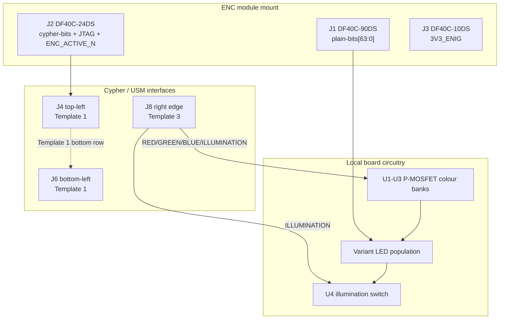

# Cypher-Output Board (V1.0) Design Specification

**Status:** Draft
**Project:** Enigma-NG
**Author:** Izzyonstage & GitHub Copilot
**Version:** v.0.1.0
**Associated Hardware Revision:** Rev A
**Last Updated:** 2026-09-17

## 1. Overview

The Cypher-Output Board is the physical lightboard indicator panel of the Enigma-NG system. It
hosts one ENC module in the output cipher role, drives the Template 1 bottom-row HID signals,
receives shared lighting control from the User Settings Module over a dedicated right-edge
connector, and presents its variant identity through `BOARD_ROLE_ID_OUT[3:0]`.

Variant-specific detail lives in:

- `design/Electronics/Cypher-Output/Cypher_Output_26_Char_Design.md`
- `design/Electronics/Cypher-Output/Cypher_Output_64_Char_Design.md`
- `design/Electronics/Cypher-Output/Cypher_Output_10_Numeric_Design.md`

| Variant | Lens Layout | Lens Count | `BOARD_ROLE_ID_OUT[3:0]` |
| :--- | :--- | :--- | :--- |
| **64-Character** | Mirrors the 64-character keyboard layout | 40 | `0b0111` default / `0b1111` custom-support |
| **26-Char Classic** | Mirrors the 26-character keyboard layout | 26 | `0b0001` |
| **10-Numeric** | Mirrors the numeric-entry keyboard layout | 12 | `0b0010` |

| Circuit Responsibility | Board Role | Key Component |
| :--- | :--- | :--- |
| Lightboard cipher exit | Hosts one ENC module in the output role | `J1`-`J3` |
| Variant LED population | One RGB LED per indicated position | Variant `D1+` |
| Local LED drive stage | Preserves the existing board-local high-current RGB drive circuitry | `U1`-`U4` |
| Shared lighting / JTAG / I2C intake | Receives USM lighting control, `I2C2` fanout, and the Output-side JTAG path | `J8` |
| Board ID | Fixed `BOARD_ROLE_ID_OUT[3:0]` strap, with the 64-character custom-support option | Variant strap / `SW1` |
| Cypher left-pair interface | Drives the Template 1 bottom-row HID signals and relays the Input-side top row | `J4`, `J6` |

### Functional Requirements

| ID | Functional Requirement | Notes | Satisfied By / Cross-Ref |
| :--- | :--- | :--- | :--- |
| FR-CYPO-01 | Host one ENC module in the lightboard cipher role | `plain-bits[63:0]` remain one-hot lens-select outputs | Section 3; BOM `J1`-`J3` |
| FR-CYPO-02 | Provide 26, 40, or 12 RGB indicator positions depending on variant | Variant files define the exact lens population | Section 4 |
| FR-CYPO-03 | Illuminate the local LED population using the existing board-local drive stage | LED part selection remains open | Section 4 |
| FR-CYPO-04 | Receive shared lighting control, `I2C2`, and JTAG from USM | `J8` is the only USM-facing connector on this board | Section 5; BOM `J8` |
| FR-CYPO-05 | Connect to Cypher through the left-pair connector template | `J4` / `J6` implement Template 1 | Section 6; BOM `J4`, `J6` |
| FR-CYPO-06 | Drive the Output-role HID signals on Template 1 | `ENC_DATA_OUT[5:0]`, `ENC_ACTIVE_OUTPUT_N`, and `BOARD_ROLE_ID_OUT[3:0]` originate on this board | Section 6 |
| FR-CYPO-07 | Protect no connector on this board with TVS / ESD suppression | All connectors remain internal | Section 8 |
| FR-CYPO-08 | Preserve the existing custom-support strap behaviour on the 64-character variant | Variant file retains the switch-specific detail | Variant file Section 4 |

### Design Requirements

| ID | Design Requirement | Specification | Satisfied By / Cross-Ref |
| :--- | :--- | :--- | :--- |
| DR-CYPO-01 | PCB stackup | 4-layer standard per `design/Standards/Global_Routing_Spec.md §2.3.1` | Section 7 |
| DR-CYPO-02 | ENC module mount connectors | `J1` = `DF40C-90DS-0.4V(51)`; `J2` = `DF40C-24DS-0.4V(51)`; `J3` = `DF40C-10DS-0.4V(51)` | Section 3; BOM `J1`-`J3` |
| DR-CYPO-03 | Cypher-facing connectors | `J4` = `QTS-025-01-L-D-RA-P`; `J6` = `QSS-025-01-L-D-RA-K`; both use Template 1 | Section 6; BOM `J4`, `J6` |
| DR-CYPO-04 | USM-facing connector | `J8` = `QTS-025-01-L-D-RA-P`; right edge; Template 3 | Section 5; BOM `J8` |
| DR-CYPO-05 | LED bank | Variant-specific RGB LED population remains placeholder-only pending final LED selection | Section 4 |
| DR-CYPO-06 | Local LED drive topology | `U1`/`U2`/`U3` remain the local colour-bank P-MOSFETs and `U4` remains the shared low-side illumination switch; their drive inputs now come from `J8` | Section 4; BOM `U1`-`U4` |
| DR-CYPO-07 | Rail entry decoupling | `C1-C5` (`3V3_ENIG`) and `C6-C10` (`5V_MAIN`) remain the entry bulk banks | Section 7; BOM `C1-C10` |
| DR-CYPO-08 | `I2C2` handling | Template 3 carries `I2C2` through the board edge connector; the current common board circuit does not populate a local I2C device on this board | Section 5 |
| DR-CYPO-09 | Mounting holes | `MH1`-`MH4`: M3 PTH tied to `GND_CHASSIS` per GRS Section 4 | Section 7 |
| DR-CYPO-10 | ESD protection | No TVS devices on `J1`-`J4`, `J6`, or `J8` | Section 8 |

### Component Block Diagram

## 2. Architecture

- **Top face:** lens / LED population, and the 64-character custom-support switch where that
  variant populates it.
- **Rear face:** ENC mount, per-position select circuitry, local LED drive parts, entry
  decoupling, and the three external board-to-board connectors.
- **Lighting architecture:** colour and illumination source signals come from USM; the local
  high-current drive stage remains on this PCB.

## 3. ENC Module Interface

`J1`-`J3` retain the existing ENC-module mounting standard. The ENC module continues to present
one-hot lightboard outputs on the `plain-bits` interface.

## 4. LED Indicator Panel

This board keeps the existing local analog RGB drive stage:

- `U1` / `U2` / `U3` remain the Red / Green / Blue colour-bank P-MOSFETs.
- `U4` remains the shared low-side illumination switch.
- The active control inputs to that stage are now received from USM on `J8` as
  `RED_DRIVE_N`, `GREEN_DRIVE_N`, `BLUE_DRIVE_N`, and `ILLUMINATION_DRIVE_N`.
- The LED part remains open alongside the Cypher-Input LED review todo.

## 5. User Settings Module Interface

### J8 - USM Right-Edge Connector

| Top Row Signal | Top Pin# | Bottom Pin# | Bottom Row Signal |
| :--- | :---: | :---: | :--- |
| `3V3_ENIG` | 1 | 2 | `3V3_ENIG` |
| `3V3_ENIG` | 3 | 4 | `3V3_ENIG` |
| GND | 5 | 6 | GND |
| GND | 7 | 8 | `TCK` |
| `I2C_SDA` | 9 | 10 | GND |
| GND | 11 | 12 | `TMS` |
| `I2C_SCL` | 13 | 14 | GND |
| GND | 15 | 16 | `TDO_OUTPUT` |
| `RED_DRIVE_N` | 17 | 18 | GND |
| `GREEN_DRIVE_N` | 19 | 20 | `TDI_OUTPUT` |
| `BLUE_DRIVE_N` | 21 | 22 | GND |
| `ILLUMINATION_DRIVE_N` | 23 | 24 | `CPLD_RESET_N` |
| GND (bar) | 25 | 26 | GND (bar) |
| `CPLD_RESET_N` | 27 | 28 | `ILLUMINATION_DRIVE_N` |
| GND | 29 | 30 | `BLUE_DRIVE_N` |
| `TDI_INPUT` | 31 | 32 | `GREEN_DRIVE_N` |
| GND | 33 | 34 | `RED_DRIVE_N` |
| `TDO_INPUT` | 35 | 36 | GND |
| GND | 37 | 38 | `I2C_SCL` |
| `TMS` | 39 | 40 | GND |
| GND | 41 | 42 | `I2C_SDA` |
| `TCK` | 43 | 44 | GND |
| GND | 45 | 46 | GND |
| `3V3_ENIG` | 47 | 48 | `3V3_ENIG` |
| `3V3_ENIG` | 49 | 50 | `3V3_ENIG` |

This board's local use of Template 3 is:

- `TDI_OUTPUT` (pin 20) -> ENC module TDI.
- `TDO_OUTPUT` (pin 16) -> ENC module TDO.
- `TDI_INPUT` / `TDO_INPUT` are NC on this board.
- `I2C_SDA` / `I2C_SCL` are present on the connector and reserved for any future local
  colour-store-consumer circuitry; the current common board does not populate an I2C device.
- `RED_DRIVE_N` / `GREEN_DRIVE_N` / `BLUE_DRIVE_N` -> local colour-bank drive inputs.
- `ILLUMINATION_DRIVE_N` -> local `U4` gate input.
- `TCK`, `TMS`, and `CPLD_RESET_N` -> ENC module JTAG pins.

## 6. Interconnects

### J1-J3 - ENC Module Mount

The ENC mount remains unchanged.

### J4 / J6 - Cypher Left Pair Template

| Top Row Signal | Top Pin# | Bottom Pin# | Bottom Row Signal |
| :--- | :---: | :---: | :--- |
| `5V_MAIN` | 1 | 2 | `5V_MAIN` |
| `5V_MAIN` | 3 | 4 | `5V_MAIN` |
| GND | 5 | 6 | GND |
| GND | 7 | 8 | GND |
| `ENC_ACTIVE_INPUT_N` | 9 | 10 | `ENC_DATA_OUT[5]` |
| GND | 11 | 12 | `ENC_DATA_OUT[4]` |
| GND | 13 | 14 | `ENC_DATA_OUT[3]` |
| `BOARD_ROLE_ID_IN[0]` | 15 | 16 | `ENC_DATA_OUT[2]` |
| `BOARD_ROLE_ID_IN[1]` | 17 | 18 | `ENC_DATA_OUT[1]` |
| `BOARD_ROLE_ID_IN[2]` | 19 | 20 | `ENC_DATA_OUT[0]` |
| `BOARD_ROLE_ID_IN[3]` | 21 | 22 | GND |
| GND | 23 | 24 | GND |
| GND (bar) | 25 | 26 | GND (bar) |
| GND | 27 | 28 | GND |
| GND | 29 | 30 | `BOARD_ROLE_ID_OUT[3]` |
| `ENC_DATA_IN[0]` | 31 | 32 | `BOARD_ROLE_ID_OUT[2]` |
| `ENC_DATA_IN[1]` | 33 | 34 | `BOARD_ROLE_ID_OUT[1]` |
| `ENC_DATA_IN[2]` | 35 | 36 | `BOARD_ROLE_ID_OUT[0]` |
| `ENC_DATA_IN[3]` | 37 | 38 | GND |
| `ENC_DATA_IN[4]` | 39 | 40 | GND |
| `ENC_DATA_IN[5]` | 41 | 42 | `ENC_ACTIVE_OUTPUT_N` |
| GND | 43 | 44 | GND |
| GND | 45 | 46 | GND |
| `5V_MAIN` | 47 | 48 | `5V_MAIN` |
| `5V_MAIN` | 49 | 50 | `5V_MAIN` |

This board straight-passes the Template 1 **top row** and drives / uses the **bottom row** locally:

- `ENC_DATA_OUT[5:0]` (pins 10, 12, 14, 16, 18, 20) are driven from the local ENC module
  cipher-data outputs.
- `ENC_ACTIVE_OUTPUT_N` (pin 42) is driven from the local ENC-module activity output.
- `BOARD_ROLE_ID_OUT[3:0]` occupies the Template 1 bottom-row ID positions and identifies the
  populated lightboard variant.
- `BOARD_ROLE_ID_IN[3:0]`, `ENC_DATA_IN[5:0]`, and `ENC_ACTIVE_INPUT_N` are straight-through
  relay traces on this board and are not tapped locally.
- `5V_MAIN` and GND are continuous entry / distribution rails for the local LED drive stage.

## 7. PCB Fabrication & Stackup

- **Stackup:** 4-layer standard per `design/Standards/Global_Routing_Spec.md §2.3.1`.
- **Bulk-entry decoupling:** `C1-C5` at `3V3_ENIG`; `C6-C10` at `5V_MAIN`.
- **Mounting holes:** `MH1`-`MH4`, M3 PTH, tied to `GND_CHASSIS`.

## 8. Thermal & ESD

- **Thermal:** no active cooling required.
- **ESD:** `J1`-`J4`, `J6`, and `J8` are internal connectors; no TVS devices are required.

## 9. Branding & Traceability

- **Data Plate:** per GRS Section 6 on the rear face.
- **Connector Pin-1 Markers:** `J1`-`J4`, `J6`, and `J8` require pin-1 markers per GRS Section 7.1.

## 10. Bill of Materials

| RefDes | Specification | MPN | Manufacturer | DigiKey PN | Mouser PN | JLCPCB PN | Alt Supplier + PN | Notes | Footprint Available | Footprint Downloaded | Qty |
| --- | --- | --- | --- | --- | --- | --- | --- | --- | --- | --- | --- |
| `C1-C5` | 10uF X7R 50V 1206 | CL31B106KBK6PJE | Samsung | 1276-CL31B106KBK6PJECT-ND | 187-CL31B106KBK6PJE | C43935922 | - | `3V3_ENIG` entry decoupling bank | ✔ | ✔ | 5 |
| `C6-C10` | 10uF X7R 50V 1206 | CL31B106KBK6PJE | Samsung | 1276-CL31B106KBK6PJECT-ND | 187-CL31B106KBK6PJE | C43935922 | - | `5V_MAIN` entry decoupling bank | ✔ | ✔ | 5 |
| `J1` | 90-pin 0.4mm pitch BtB receptacle | DF40C-90DS-0.4V(51) | Hirose | 26-DF40C-90DS-0.4V(51)CT-ND | 798-DF40C90DS0.4V51 | C2911197 | - | ENC module mount - plain-bits connector | ✔ | ✔ | 1 |
| `J2` | 24-pin 0.4mm pitch BtB receptacle | DF40C-24DS-0.4V(51) | Hirose | H11621CT-ND | 798-DF40C24DS0.4V51 | C424640 | - | ENC module mount - cypher-bits + JTAG + ENC_ACTIVE_N | ✔ | ✔ | 1 |
| `J3` | 10-pin 0.4mm pitch BtB receptacle | DF40C-10DS-0.4V(51) | Hirose | H11617CT-ND | 798-DF40C10DS0.4V51 | C424636 | - | ENC module mount - 3V3_ENIG power | ✔ | ✔ | 1 |
| `J4, J8` | 50-contact 0.635mm right-angle male SMT | QTS-025-01-L-D-RA-P | Samtec | QTS-025-01-L-D-RA-P-ND | 200-QTS02501LDRAP | C7267889 | - | `J4` Cypher left-pair top connector; `J8` USM connector | ✔ | ✔ | 2 |
| `J6` | 50-contact 0.635mm right-angle female SMT | QSS-025-01-L-D-RA-K | Samtec | QSS-025-01-L-D-RA-K-ND | 200-QSS02501LDRAK | C6156774 | - | Cypher left-pair bottom connector | ✔ | ✔ | 1 |
| `U1-U3` | P-channel MOSFET, SOT-23 | SQ2319ADS-T1_BE3 | Vishay Siliconix | 742-SQ2319ADS-T1_BE3CT-ND | 78-SQ2319ADS-T1_BE3 | C3280190 | - | Local Red / Green / Blue colour-bank switches | ✔ | ✔ | 3 |
| `U4` | N-channel MOSFET, SOT-23 | BSS138 | onsemi (or equiv.) | - | - | - | - | Shared local illumination switch; gate driven from `ILLUMINATION_DRIVE_N` | ✔ | - | 1 |
