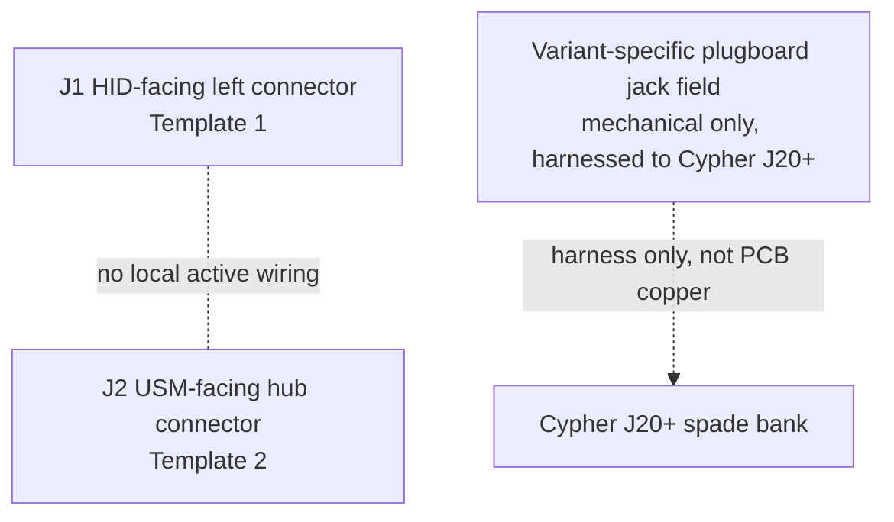

# Cypher-Plugboard Board (V1.0) Design Specification

**Status:** Draft
**Project:** Enigma-NG
**Author:** Izzyonstage & GitHub Copilot
**Version:** v.0.1.0
**Associated Hardware Revision:** Rev A
**Last Updated:** 2026-09-17

## 1. Overview

The Cypher-Plugboard Board is a mechanical plugboard carrier with two connector footprints only:
`J1` mates the bottom HID board on the left-pair template, and `J2` mates the User Settings Module
on the hub template. The board carries no active electrical components. All plugboard patch-jack
wiring still runs directly between the physical jack field and the Cypher Board `J20+` spade bank.

Variant-specific jack-count and enclosure detail remains in:

- `design/Electronics/Cypher-Plugboard/Cypher_Plugboard_26_Char_Design.md`
- `design/Electronics/Cypher-Plugboard/Cypher_Plugboard_64_Char_Design.md`
- `design/Electronics/Cypher-Plugboard/Cypher_Plugboard_10_Numeric_Design.md`

| Circuit Responsibility | Board Role | Key Component |
| :--- | :--- | :--- |
| HID-stack lower mechanical interface | Provides the lower mating point for the HID left-pair connector | `J1` |
| USM lower mechanical interface | Provides the lower mating point for the USM hub connector | `J2` |
| Plugboard jack field | Mechanical jack mounting only; electrically harnessed to Cypher `J20+` | Variant-specific `J3+` |

### Functional Requirements

| ID | Functional Requirement | Notes | Satisfied By / Cross-Ref |
| :--- | :--- | :--- | :--- |
| FR-PLB-01 | Provide the lower mechanical mating points for the HID / USM assembly | `J1` and `J2` only | Section 3; BOM `J1`, `J2` |
| FR-PLB-02 | Carry no active electrical components | No resistors, logic, or local loads remain on this board | Section 2; BOM |
| FR-PLB-03 | Keep the physical plugboard jack field off this PCB's signal copper | Jack field remains harnessed directly to Cypher `J20+` | Section 4 |
| FR-PLB-04 | Preserve `GND_CHASSIS` continuity for the enclosure-mounted jack field | Mechanical-only plugboard construction remains unchanged | Section 2; Section 4 |

### Design Requirements

| ID | Design Requirement | Specification | Satisfied By / Cross-Ref |
| :--- | :--- | :--- | :--- |
| DR-PLB-01 | PCB stackup | 4-layer standard per `design/Standards/Global_Routing_Spec.md §2.3.1` | Section 5 |
| DR-PLB-02 | HID-facing left connector | `J1` = `QTS-025-01-L-D-RA-P`, Template 1 pin map | Section 3; BOM `J1` |
| DR-PLB-03 | USM-facing hub connector | `J2` = `QTS-025-01-L-D-RA-P`, Template 2 pin map | Section 3; BOM `J2` |
| DR-PLB-04 | Electrical population | Every non-GND pin on `J2` is NC; all non-power functional pins on `J1` are NC | Section 3 |
| DR-PLB-05 | Mounting holes | `MH1`-`MH4`: M3 PTH tied to `GND_CHASSIS` per GRS Section 4 | Section 5 |
| DR-PLB-06 | Jack field build | Variant-specific Switchcraft jack population remains mechanical-only and off-board from this PCB | Section 4 |

### Component Block Diagram

## 2. Architecture

- **PCB role:** connector strip only.
- **Electrical population:** none beyond the two Samtec connector footprints.
- **Signal treatment:** `J1` receives the left-pair template and leaves the non-power functional
  signals unconsumed. `J2` receives the USM hub template and leaves every non-GND pin NC.
- **Jack field:** physical patch jacks remain mounted to the machined enclosure and wire directly
  to Cypher `J20+`.

### GND_CHASSIS Single-Point Bond

The Cypher-Plugboard assembly keeps the jack-field enclosure and mounting hardware on
`GND_CHASSIS` only. No local `GND_CHASSIS` to GND bond is created here.

## 3. Interconnects

### J1 - HID Left Pair Template

| Top Row Signal | Top Pin# | Bottom Pin# | Bottom Row Signal |
| :--- | :---: | :---: | :--- |
| `5V_MAIN` | 1 | 2 | `5V_MAIN` |
| `5V_MAIN` | 3 | 4 | `5V_MAIN` |
| GND | 5 | 6 | GND |
| GND | 7 | 8 | GND |
| `ENC_ACTIVE_INPUT_N` | 9 | 10 | `ENC_DATA_OUT[5]` |
| GND | 11 | 12 | `ENC_DATA_OUT[4]` |
| GND | 13 | 14 | `ENC_DATA_OUT[3]` |
| `BOARD_ROLE_ID_IN[0]` | 15 | 16 | `ENC_DATA_OUT[2]` |
| `BOARD_ROLE_ID_IN[1]` | 17 | 18 | `ENC_DATA_OUT[1]` |
| `BOARD_ROLE_ID_IN[2]` | 19 | 20 | `ENC_DATA_OUT[0]` |
| `BOARD_ROLE_ID_IN[3]` | 21 | 22 | GND |
| GND | 23 | 24 | GND |
| GND (bar) | 25 | 26 | GND (bar) |
| GND | 27 | 28 | GND |
| GND | 29 | 30 | `BOARD_ROLE_ID_OUT[3]` |
| `ENC_DATA_IN[0]` | 31 | 32 | `BOARD_ROLE_ID_OUT[2]` |
| `ENC_DATA_IN[1]` | 33 | 34 | `BOARD_ROLE_ID_OUT[1]` |
| `ENC_DATA_IN[2]` | 35 | 36 | `BOARD_ROLE_ID_OUT[0]` |
| `ENC_DATA_IN[3]` | 37 | 38 | GND |
| `ENC_DATA_IN[4]` | 39 | 40 | GND |
| `ENC_DATA_IN[5]` | 41 | 42 | `ENC_ACTIVE_OUTPUT_N` |
| GND | 43 | 44 | GND |
| GND | 45 | 46 | GND |
| `5V_MAIN` | 47 | 48 | `5V_MAIN` |
| `5V_MAIN` | 49 | 50 | `5V_MAIN` |

- `5V_MAIN` and GND are received on the connector footprint.
- `BOARD_ROLE_ID_IN[3:0]`, `BOARD_ROLE_ID_OUT[3:0]`, `ENC_DATA_IN[5:0]`, `ENC_DATA_OUT[5:0]`,
  `ENC_ACTIVE_INPUT_N`, and `ENC_ACTIVE_OUTPUT_N` are NC on this board.

### J2 - USM Hub Template

| Top Row Signal | Top Pin# | Bottom Pin# | Bottom Row Signal |
| :--- | :---: | :---: | :--- |
| `3V3_ENIG` | 1 | 2 | `3V3_ENIG` |
| `3V3_ENIG` | 3 | 4 | `3V3_ENIG` |
| GND | 5 | 6 | GND |
| GND | 7 | 8 | GND |
| GND | 9 | 10 | GND |
| GND | 11 | 12 | GND |
| GND | 13 | 14 | GND |
| GND | 15 | 16 | GND |
| GND | 17 | 18 | `I2C_SDA` |
| GND | 19 | 20 | GND |
| `CPLD_RESET_N` | 21 | 22 | `I2C_SCL` |
| GND | 23 | 24 | GND |
| GND (bar) | 25 | 26 | GND (bar) |
| GND | 27 | 28 | GND |
| `TMS` | 29 | 30 | `TCK` |
| GND | 31 | 32 | GND |
| `TDI` | 33 | 34 | `TDO` |
| GND | 35 | 36 | GND |
| GND | 37 | 38 | GND |
| GND | 39 | 40 | GND |
| GND | 41 | 42 | GND |
| GND | 43 | 44 | GND |
| GND | 45 | 46 | GND |
| `3V3_ENIG` | 47 | 48 | `3V3_ENIG` |
| `3V3_ENIG` | 49 | 50 | `3V3_ENIG` |

- All non-GND pins are NC on this board.
- The Plugboard board is not part of the HID JTAG serial-data loop.

## 4. Plugboard Jack Field (Mechanical)

The physical jack field remains mechanically separate from this PCB and is documented in the
variant files. Each jack position still wires back to the Cypher Board `J20+` spade bank by
harness, not by Cypher-Plugboard PCB copper.

## 5. PCB Fabrication & Stackup

- **Stackup:** 4-layer standard per `design/Standards/Global_Routing_Spec.md §2.3.1`.
- **Mounting holes:** `MH1`-`MH4`, M3 PTH, tied to `GND_CHASSIS`.
- **Assembly:** connector strip only.

## 6. Thermal & ESD

- **Thermal:** no active cooling required.
- **ESD:** `J1` and `J2` are internal board-to-board connectors; no TVS devices are required here.

## 7. Branding & Traceability

- **Data Plate:** per GRS Section 6 on the rear face.
- **Connector Pin-1 Markers:** `J1` and `J2` require pin-1 markers per GRS Section 7.1.

## 8. Bill of Materials

| RefDes | Specification | MPN | Manufacturer | DigiKey PN | Mouser PN | JLCPCB PN | Alt Supplier + PN | Notes | Footprint Available | Footprint Downloaded | Qty |
| --- | --- | --- | --- | --- | --- | --- | --- | --- | --- | --- | --- |
| `J1, J2` | 50-contact 0.635mm right-angle male SMT | QTS-025-01-L-D-RA-P | Samtec | QTS-025-01-L-D-RA-P-ND | 200-QTS02501LDRAP | C7267889 | - | `J1` HID-facing Template 1; `J2` USM-facing Template 2 | ✔ | ✔ | 2 |
