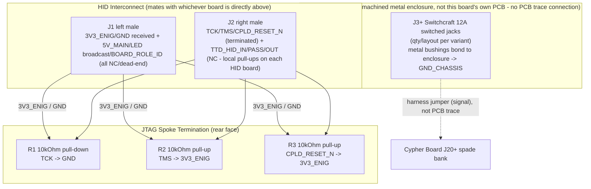

# Cypher-Plugboard Board (V1.0) Design Specification

**Status:** Draft
**Project:** Enigma-NG
**Author:** Izzyonstage & GitHub Copilot
**Version:** v.0.1.0
**Associated Hardware Revision:** Rev A
**Last Updated:** 2026-08-19

## 1. Overview

The Cypher-Plugboard Board terminates the Cypher HID interconnect chain beneath whichever board (either
Cypher-Input or Cypher-Output, either order) occupies the bottom-most position of the local
2-board HID stack - mirroring the Stack-Blanking Board's end-of-chain role for the 30-rotor
mini-stack chain. This specification documents **three board variants** sharing an identical
electrical circuit (HID-chain termination, power passthrough); only the jack field's row count,
character layout, and jack quantity differ between them, mirroring the Cypher-Input/Cypher-Output
variant split. Variant-specific detail lives in a dedicated document per variant:

- `design/Electronics/Cypher-Plugboard/Cypher_Plugboard_26_Char_Design.md`
- `design/Electronics/Cypher-Plugboard/Cypher_Plugboard_64_Char_Design.md`
- `design/Electronics/Cypher-Plugboard/Cypher_Plugboard_10_Numeric_Design.md`

**Electrically, per DEC-088, this board is deliberately simple:** it carries no plugboard-signal-
specific pins at all, on either connector. **This board's PCB is a thin strip along the top edge
only** - just large enough to carry the two HID interconnect connectors (`J1`/`J2`) and the JTAG
spoke termination resistors (R1-R3). The physical plugboard patch jacks are **not** mounted on
this PCB at all - they mount directly to a **machined metal enclosure** that this PCB strip
attaches to, and are **not** electrically connected to this board's own circuitry - each jack
terminal is wired via a discrete jumper cable directly back to the Cypher Board's own spade
terminal bank (`J20+`, see `Cypher/Design_Spec.md §6`), bypassing this board's own PCB and the
`J4`-`J7` HID interconnect stack entirely. This board's only electrical role is passive
termination of the HID interconnect's JTAG spoke signals, identical in principle to the
Stack-Blanking Board's own termination role on the rotor mini-stack chain.

| Circuit Responsibility | Board Role | Key Component |
| :--- | :--- | :--- |
| **HID-chain termination** | Passive end-of-chain bias on the JTAG spoke signals (TCK, TMS, `CPLD_RESET_N`) reaching this board via the shared HID interconnect template | R1-R3 - 10 kOhm 0402 |
| **Power continuity** | Receives `3V3_ENIG`/GND from whichever HID board sits directly above, to bias its own termination resistors; `5V_MAIN` and the LED colour/brightness broadcast are received but unused (no LED bank on this board) | J1 (left connector) |
| **HID interconnect mating** | 2 connectors (male), matching the shared Cypher Board HID Interconnect template, mating with whichever board's bottom (female) connector pair sits above | J1, J2 - Samtec QTS-025 family |
| **Plugboard jack field (mechanical only, chassis-mounted)** | Physical Switchcraft 12A 6.35mm (1/4") switched jack sockets, mounted directly to the machined metal enclosure (not this board's own PCB); wired via harness directly to the Cypher Board's own `J20+` spade bank, not through this board's own copper | J3+ (per variant - see each variant's own design file) |

**Mechanical construction:** unlike Cypher-Input/Cypher-Output (which are single PCBs mounting
horizontally, stacking vertically on top of the Cypher Board), this board is a **hybrid assembly**:
a small PCB strip (top edge only, carrying `J1`/`J2`/R1-R3) attached to a **machined metal
enclosure** that forms the rest of the assembly and hosts the entire jack field. The enclosure is
mounted in a **vertical orientation, like the Cypher Board itself** - so the jack field forms a
human-facing front panel with character rows running top-to-bottom, matching the ergonomics of a
traditional Enigma plugboard. Each "plug" position is **2 jack sockets** (one per plugboard pass)
placed **immediately next to each other, horizontally (left-to-right)** - not stacked vertically -
to keep the panel's overall height as small as possible. Rows are stacked vertically below one
another, with generous horizontal spacing between adjacent plug-pairs (for tidy patch-cable
routing) and generous vertical spacing between rows (so the corresponding character can be
engraved/printed on the metal enclosure face directly above each plug-pair - **not** a PCB
silkscreen, since the jack field is not on the PCB). **The PCB strip is identical across all
three variants** (fixed size, independent of jack count - it only ever carries `J1`/`J2`/R1-R3).
**The machined metal enclosure is sized per variant**, scaling in height with the row count (see
each variant's own design file); the 64-Character variant (the variant with the most rows) is the
tallest.

> **Chassis grounding rationale:** mounting the jacks directly to the machined metal enclosure
> means every jack's metal bushing bonds directly to that enclosure - keeping the entire external
> jack field on a continuous `GND_CHASSIS` network, consistent with the rest of the system's
> external connectors. Per `design/Standards/Global_Routing_Spec.md §5`, this board's own
> `GND_CHASSIS` net (enclosure + jack bushings) is **not** locally bonded to GND here - it
> dissipates through the system's single `GND_CHASSIS`-to-GND bond, which remains on the Power
> Module only (see §2 GND_CHASSIS Single-Point Bond, below).
>
> **Open mechanical item:** the exact transition between the PCB strip and the machined metal
> enclosure (fastening method, panel cutout tolerances, cable routing from the PCB strip's J1/J2
> down to the jack field) is not yet resolved - deferred to the dedicated mechanical design pass,
> consistent with the current electronics-only merge scope. The electrical connector definition
> below (`J1`/`J2`, matching the shared Cypher Board HID Interconnect template) is unaffected by
> this open item.

### Functional Requirements

| ID | Functional Requirement | Notes | Satisfied By / Cross-Ref |
| :--- | :--- | :--- | :--- |
| FR-PLB-01 | Terminate the Cypher HID interconnect chain beneath whichever HID board occupies the bottom of the local 2-board stack | Mirrors Stack-Blanking's rotor-chain termination role | §3 Signal Routing & Termination; BOM J1, J2 |
| FR-PLB-02 | Carry no plugboard-signal-specific pins on either connector | Per DEC-088 - this board's own circuitry never sees plugboard cipher-path signals | §1; §3 |
| FR-PLB-03 | Host the physical plugboard jack field on a machined metal enclosure, not this board's own PCB, with no PCB trace connection to this board's own circuitry | Each jack wired via a harness jumper directly to the Cypher Board's own `J20+` spade bank | §4 Plugboard Jack Field (Mechanical); BOM J3+ (per variant) |
| FR-PLB-04 | Provide 10 (10-Numeric), 26 (26-Char Classic), or 64 (64-Character) plug positions, each with 2 jack sockets (one per plugboard pass) | Jack count and row layout vary by variant - see each variant's own design file | §4 Plugboard Jack Field (Mechanical) |
| FR-PLB-05 | Connect to whichever HID board occupies the bottom of the local stack, matching the shared Cypher Board HID Interconnect template | J1/J2 = Samtec QTS-025 family (male), mating with that board's bottom (female) connector pair | §5 Interconnects; BOM J1, J2 |
| FR-PLB-06 | Keep the jack field's metal bushings on a continuous `GND_CHASSIS` network, consistent with the rest of the system's external connectors | Every jack bonds directly to the machined metal enclosure by its threaded bushing; no local `GND_CHASSIS`-to-GND bond on this board | §2 GND_CHASSIS Single-Point Bond; §4 Plugboard Jack Field (Mechanical) |

### Design Requirements

| ID | Design Requirement | Specification | Satisfied By / Cross-Ref |
| :--- | :--- | :--- | :--- |
| DR-PLB-01 | PCB stackup | 4-layer standard per `design/Standards/Global_Routing_Spec.md §2.3.1`; PCB is a thin strip along the top edge only, carrying `J1`/`J2`/R1-R3 - identical across all three variants | §6 PCB Fabrication & Stackup |
| DR-PLB-02 | HID interconnect connectors | J1 (left, male) = QTS-025-01-L-D-RA-P; J2 (right, male) = QTS-025-01-L-D-RA-P; both mate with whichever HID board's bottom (female, QSS-025-01-L-D-RA-K) connector pair sits directly above; pin mapping per `Board_Layout.md §1-2` | §5 Interconnects; BOM J1, J2 |
| DR-PLB-03 | JTAG spoke termination | R1 (TCK, 10 kOhm pull-down to GND), R2 (TMS, 10 kOhm pull-up to 3V3_ENIG), R3 (`CPLD_RESET_N`, 10 kOhm pull-up to 3V3_ENIG); same values/rationale as Stack-Blanking DR-SBLK-05 | §3 Signal Routing & Termination; BOM R1-R3 |
| DR-PLB-04 | `TTD_HID_IN`/`TTD_HID_OUT`/`TTD_HID_PASS` | Left NC - no termination needed. Each HID board (Cypher-Input, Cypher-Output) provides its own local TDI pull-up close to its own CPLD, via its ENC module's R3 (`Encoder_Module/Design_Spec.md §5` JTAG Chain Integrity - 10 kOhm to 3V3_ENIG, placed near U1); the system always requires both a Cypher-Input and a Cypher-Output board connected (no valid single-HID-board configuration exists) | §3 Signal Routing & Termination |
| DR-PLB-05 | 5V_MAIN, LED colour/brightness broadcast, `BOARD_ROLE_ID_IN[3:0]`/`BOARD_ROLE_ID_OUT[3:0]` | All left NC on this board - dead-end signals with nothing below this board to relay to, and this board carries no `BOARD_ROLE_ID` strap of its own (it is not identified by the Cypher Board's compatibility comparator) | §3 Signal Routing & Termination |
| DR-PLB-06 | 3V3_ENIG/GND continuity | Received from whichever HID board sits directly above (J1 left connector); powers R1-R3's pull references. No further board below this one to relay power to. | §3 Signal Routing & Termination |
| DR-PLB-07 | Plugboard jack sockets (per variant) | Switchcraft 12A ("E12A"), 6.35mm (1/4") 2-conductor switched panel-mount phone jack (Tip, Tip-Shunt switch contact, Sleeve); 3/8-32 UNEF-2A threaded bushing, hardware (washer + hex nut) shipped unassembled; mounted directly to the machined metal enclosure (not this board's own PCB); manually assembled, not part of JLCPCB PCBA - no JLCPCB PN; quantity and RefDes range per variant | §4 Plugboard Jack Field (Mechanical); BOM J3+ (per variant) |
| DR-PLB-08 | PCB mounting holes | MH1-MH4: M3 PTH (3.2mm drill) tied to GND_CHASSIS per GRS §4, on the PCB strip only | §6 PCB Fabrication & Stackup |
| DR-PLB-09 | Jack field chassis bonding | Every jack's metal bushing bonds directly to the machined metal enclosure by mechanical contact (threaded bushing through panel cutout + nut) - no additional bonding hardware required. This board's `GND_CHASSIS` net (enclosure + jack bushings + PCB mounting holes) is **not** locally bonded to GND - the system's only `GND_CHASSIS`-to-GND bond remains on the Power Module | §2 GND_CHASSIS Single-Point Bond; §4 Plugboard Jack Field (Mechanical) |
| DR-PLB-10 | ESD protection | Not required on the PCB. J1/J2 are internal BtB connectors, not hot-swapped or externally accessible, per `design/Standards/Global_Routing_Spec.md §9`. The jack field itself carries no PCB-mounted ESD devices either (it has no PCB trace connection to protect) - patch-cable ESD events are conducted directly to the machined metal enclosure via each jack's chassis bond (DR-PLB-09) rather than into any signal path on this board. Whether any additional protection is needed at the Cypher Board's own `J20+` remains an **open item**, mirroring the equivalent open item already carried there (see `Cypher/Design_Spec.md §8`) | §7 Thermal & ESD |

### Component Block Diagram

## 2. Architecture

- **PCB:** a thin strip along the top edge only, 4-layer standard per
  `design/Standards/Global_Routing_Spec.md §2.3.1`. ENIG Gold. 2.0mm filleted corners. Just large
  enough to carry `J1`/`J2` and the termination resistors R1-R3 - **it does not carry the jack
  field**, which mounts directly to the machined metal enclosure instead (see §4). This PCB strip
  is identical across all three variants.
- **Assembly:** Single-sided JLCPCB SMT (rear face only) for J1/J2/R1-R3 - a fully-automated
  pass, no manual PCBA steps.
- **Manufacturer:** JLCPCB (standard 4-layer; single-sided SMT PCBA for the PCB strip only). The
  machined metal enclosure and jack field are a separate mechanical build, not part of the JLCPCB
  PCBA order.

### GND_CHASSIS Single-Point Bond

Per `design/Standards/Global_Routing_Spec.md §5`: this board's `GND_CHASSIS` net spans both the
PCB strip's own mounting holes **and** the machined metal enclosure (including every jack's
metal bushing, bonded to the enclosure by mechanical contact - see §4). None of this is locally
bonded to GND on this assembly. The system's only galvanic GND_CHASSIS-to-GND bond remains on the
Power Module.

## 3. Signal Routing & Termination

This board carries no active components and no plugboard-signal-specific pins - it is a pure
JTAG-spoke terminator, mirroring `Stack-Blanking/Design_Spec.md §3`.

### Terminated signals (dead-end at this board's J2)

| RefDes | Signal | Termination | Rationale |
| :--- | :--- | :--- | :--- |
| R1 | TCK | 10 kOhm pull-down to GND | Prevents spurious clocking at JTAG spoke end |
| R2 | TMS | 10 kOhm pull-up to 3V3_ENIG | Holds JTAG TAP in Test-Logic-Reset at spoke end |
| R3 | `CPLD_RESET_N` | 10 kOhm pull-up to 3V3_ENIG | Holds CPLDs out of reset at chain end |

### NC / dead-end signals

| Signal(s) | Reason |
| :--- | :--- |
| `TTD_HID_IN`/`TTD_HID_OUT`/`TTD_HID_PASS` | No termination needed - each HID board (Cypher-Input, Cypher-Output) provides its own local TDI pull-up close to its own CPLD, via its ENC module's R3 (`Encoder_Module/Design_Spec.md §5` JTAG Chain Integrity - 10 kOhm to 3V3_ENIG). The system always requires both a Cypher-Input and a Cypher-Output board connected; there is no valid single-HID-board configuration. |
| `5V_MAIN` | No LED bank or other `5V_MAIN` consumer on this board |
| `RED_DRIVE_N`/`GREEN_DRIVE_N`/`BLUE_DRIVE_N`/`BRIGHTNESS_PWM_EN` | LED colour/brightness broadcast signals - no LED bank on this board, and nothing below this board to relay them to |
| `BOARD_ROLE_ID_IN[3:0]`/`BOARD_ROLE_ID_OUT[3:0]` | This board carries no `BOARD_ROLE_ID` strap of its own and is not identified by the Cypher Board's compatibility comparator; nothing below this board to relay these bits to |
| `I2C_SDA`/`I2C_SCL` | No I2C device on this board; nothing below this board to relay the bus to |

### Continuity signals

| Signal(s) | Path |
| :--- | :--- |
| `3V3_ENIG`, GND | Received at J1 from whichever HID board sits directly above; biases R1-R3's pull references. Not relayed further (nothing below this board). |

## 4. Plugboard Jack Field (Mechanical)

The physical plugboard patch jacks mount directly to a **machined metal enclosure** - **not** to
this board's own PCB - and carry **no PCB trace connection** to this board's own circuitry (per
DEC-088). Each jack terminal is wired via a discrete jumper cable directly back to the Cypher
Board's own spade terminal bank (`J20+`, see `Cypher/Design_Spec.md §6`).

- **Jack type:** Switchcraft 12A ("E12A"), 6.35mm (1/4") 2-conductor switched panel-mount phone
  jack - confirmed 2026-08-19 (datasheet: `design/Datasheets/Switchcraft-12A-datasheet.pdf`).
  3/8-32 UNEF-2A threaded bushing, mounted through a cutout in the machined metal enclosure with
  the K178 washer and K180 hex nut (hardware shipped unassembled). **Manually assembled - not
  part of the JLCPCB PCBA order, no JLCPCB PN.** 3 terminals: `Tip`, `Tip-Shunt` (normally-closed
  switch contact, opens when a plug is inserted), and `Sleeve`.
- **Chassis bonding:** each jack's threaded metal bushing makes direct mechanical (and
  electrical) contact with the machined metal enclosure it mounts through - keeping every jack on
  a continuous `GND_CHASSIS` network with the rest of the enclosure and the PCB strip's own
  mounting holes. No additional bonding hardware is required beyond the jack's own mounting nut.
  See §2 GND_CHASSIS Single-Point Bond.
- **Plug arrangement:** each cipher character occupies one "plug" position, consisting of **2
  jack sockets placed immediately next to each other, horizontally (left-to-right)** - one for
  each plugboard pass (Pass 1, Pass 2). Positions are **not** stacked vertically, to keep the
  enclosure's overall height as small as possible.
- **Row layout:** character positions are arranged in rows running top-to-bottom on the vertical
  enclosure face, with the character engraved/printed on the enclosure **directly above its
  plug-pair - not a PCB silkscreen**, since the jack field is not on the PCB. Row count and
  character assignment vary by variant - see each variant's own design file §2.
- **Spacing:** generous horizontal spacing between adjacent plug-pairs (for tidy patch-cable
  routing) and generous vertical spacing between rows (for clear per-plug character labelling).
  Exact dimensions are TBD at mechanical/enclosure layout time.
- **Enclosure sizing:** the machined metal enclosure is sized per variant, scaling in height with
  the row count (see each variant's own design file); the **PCB strip itself is identical across
  all three variants** (fixed size, independent of jack count - it only ever carries
  `J1`/`J2`/R1-R3).
- **Wiring:** each jack's `Tip` and `Tip-Shunt` terminals are wired together to one spade jumper
  (matching the historical decode-board terminal role), and the `Sleeve` terminal to a second
  spade jumper (matching the historical encode-board terminal role) - both running directly to
  the corresponding spade terminals on the Cypher Board's `J20+` bank - see each variant's own
  design file for the per-position jack count and the resulting total wire-run count back to
  `J20+`.

## 5. Interconnects

### J1 - Left Connector (Power / LED Broadcast / `BOARD_ROLE_ID` Template)

**Pin-level template owned by the Cypher Board (`Cypher/Board_Layout.md §4`, its own `J5`) - this
board owns only its own physical connector placement and gender, per that shared template.**

- **MPN:** QTS-025-01-L-D-RA-P (Samtec 50-contact 0.635mm right-angle male SMT) - same part as
  Cypher-Input/Cypher-Output's own J4/J5.
- **Mates with:** whichever HID board's bottom-left connector (J6, female) sits directly above
  this board.
- **Wiring:** `3V3_ENIG`/GND received (bias reference for R1-R3 on J2). `5V_MAIN`, `RED_DRIVE_N`/
  `GREEN_DRIVE_N`/`BLUE_DRIVE_N`/`BRIGHTNESS_PWM_EN`, and `BOARD_ROLE_ID_IN[3:0]`/
  `BOARD_ROLE_ID_OUT[3:0]` are all received but left NC on this board - see §3 for the full
  per-signal rationale.

> **Pinout:** see `Board_Layout.md §1` for the full connector definition.

### J2 - Right Connector (JTAG + ENC_DATA + I2C + PWM Template)

**Pin-level template owned by the Cypher Board (`Cypher/Board_Layout.md §4`, its own `J6`) - this
board owns only its own physical connector placement and gender, per that shared template.**

- **MPN:** QTS-025-01-L-D-RA-P (Samtec 50-contact 0.635mm right-angle male SMT) - same part as
  Cypher-Input/Cypher-Output's own J4/J5.
- **Mates with:** whichever HID board's bottom-right connector (J7, female) sits directly above
  this board.
- **Wiring:** TCK/TMS/`CPLD_RESET_N` terminated via R1-R3 (§3). `TTD_HID_IN`/`TTD_HID_OUT`/
  `TTD_HID_PASS`, `ENC_DATA[5:0]`, `I2C_SDA`/`I2C_SCL`, and `ENC_ACTIVE_INPUT_N` are all received
  but left NC on this board - nothing below this board to relay any of them to, and this board
  has no ENC module or I2C device of its own.

> **Pinout:** see `Board_Layout.md §2` for the full connector definition.

## 6. PCB Fabrication & Stackup

- **Stackup:** 4-layer standard per `design/Standards/Global_Routing_Spec.md §2.3.1`. This PCB is
  a thin strip along the top edge only - just large enough for `J1`/`J2`/R1-R3 - identical across
  all three variants; it does **not** extend down to cover the jack field, which mounts to the
  separate machined metal enclosure (see §4).
- **Manufacturer:** JLCPCB. Single-sided SMT PCBA (rear face only) for J1, J2, R1-R3. The machined
  metal enclosure and jack field are a separate mechanical build, outside the JLCPCB PCBA order.
- **Mounting Holes:** MH1-MH4, M3 PTH (3.2mm drill), tied to GND_CHASSIS per GRS §4, on the PCB
  strip itself.

## 7. Thermal & ESD

- **Thermal:** No active components. No thermal concerns.
- **ESD:** J1/J2 are internal BtB connectors, not hot-swapped or externally accessible during
  normal operation - no TVS/ESD protection required on the PCB strip, per
  `design/Standards/Global_Routing_Spec.md §9`. The jack field carries no PCB-mounted ESD devices
  either, since it has no PCB trace connection at all - patch-cable ESD events are conducted
  directly to the machined metal enclosure via each jack's chassis bond (§4), not into any signal
  path on this board. Whether any additional protection is needed at the Cypher Board's own
  `J20+` remains an **open item**, mirroring the equivalent open item already carried there (see
  `Cypher/Design_Spec.md §8`).

## 8. Branding & Traceability

- **Data Plate:** Per GRS §6 on Layer L4 (rear face of the PCB strip). Revision block:
  `STECKERBRETT [Cypher-Plugboard] V1.0` (common to all variants; variant-specific suffix TBD -
  see each variant's own design file).
- **Connector Pin-1 Markers:** J1/J2 silkscreen pin-1 markers required per GRS §7.1.
- **Character labelling:** each plug-pair's corresponding character is engraved/printed on the
  **machined metal enclosure** directly above that pair - **not** a PCB silkscreen, since the
  jack field is not on the PCB - see each variant's own design file for the exact character set
  and case (26-Char Classic: uppercase only; 64-Character: uppercase row block followed by
  lowercase row block, per §2 of that variant's own design file).

## 9. Bill of Materials

> This BOM lists only components common to **all** Plugboard variants (fixed quantity,
> independent of variant) - the two HID interconnect connectors and the JTAG spoke termination
> resistors. Variant-specific components (the plugboard jack sockets themselves, RefDes J3+) with
> their per-variant quantities are listed in each variant's own design file §3
> (`Cypher_Plugboard_26_Char_Design.md`, `Cypher_Plugboard_64_Char_Design.md`,
> `Cypher_Plugboard_10_Numeric_Design.md`).

| RefDes | Specification | MPN | Manufacturer | DigiKey PN | Mouser PN | JLCPCB PN | Alt Supplier + PN | Notes | Footprint Available | Footprint Downloaded | Qty |
| --- | --- | --- | --- | --- | --- | --- | --- | --- | --- | --- | --- |
| J1, J2 | 50-contact 0.635mm right-angle male SMT | QTS-025-01-L-D-RA-P | Samtec | QTS-025-01-L-D-RA-P-ND | 200-QTS02501LDRAP | C7267889 | - | J1: mates with the bottom-most HID board's J6 (power/LED broadcast/BOARD_ROLE_ID); J2: mates with that board's J7 (JTAG/ENC_DATA/I2C/PWM); same part as Cypher-Input/Cypher-Output J4/J5 | ✔ | ✔ | 1 |
| R1-R3 | 10kOhm 1% 0402 | ERJ-2RKF1002X | Panasonic | P10.0KLCT-ND | 667-ERJ-2RKF1002X | C191123 | - | R1: TCK pull-down to GND; R2: TMS pull-up to 3V3_ENIG; R3: CPLD_RESET_N pull-up to 3V3_ENIG - same part and values as Stack-Blanking R2-R4 | ✔ | ✔ | 3 |

> **Sourcing status:** J1/J2/R1-R3 all have confirmed sourcing, reused directly from
> Cypher-Input/Cypher-Output's and Stack-Blanking's own already-approved parts. The plugboard
> jack socket (variant files) is now also confirmed - Switchcraft 12A, DigiKey SC1089-ND, Mouser
> 502-12A; no JLCPCB PN (manually assembled, not part of the JLCPCB PCBA order) - see each
> variant's own design file §4 BOM.
