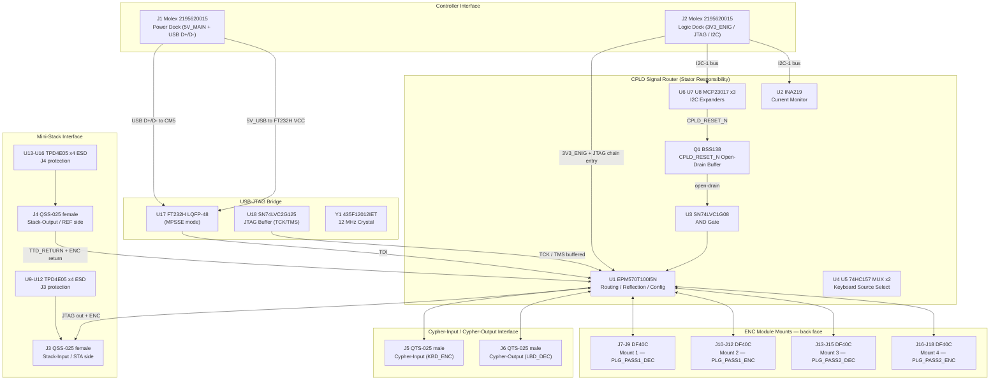

# Cypher Board (V1.0) Design Specification

**Status:** Draft
**Project:** Enigma-NG
**Author:** Izzyonstage & GitHub Copilot
**Version:** v.0.1.0
**Associated Hardware Revision:** Rev A
**Last Updated:** 2026-07-05

## 1. Overview

The Cypher Board is the central backplane of the Enigma-NG encryption engine. It fulfils the
**Stator** and **Reflector** responsibilities of the historical Enigma machine within a single
consolidated 6-layer PCB, and hosts the USB-JTAG programming bridge for the system.

| Enigma Responsibility | Board Role | Key Component |
| :--- | :--- | :--- |
| **Stator** | CPLD-based cipher routing, plugboard configuration, reflector map selection, I2C telemetry, power distribution to the rotor stack | U1 — Intel MAX II EPM570T100I5N |
| **Reflector** | Electrical turnaround at the end of the rotor stack; reflection mapping applied by CPLD U1 at Step 2 boundary | J4 + U1 + R50 |
| **JTAG Bridge** | USB-to-JTAG programming for all 37 system CPLDs | U17 — FT232H (MPSSE) |

Rotor Mini-Stacks attach to the Cypher Board via keyed Samtec QSS-025 vertical female
connectors (J3 and J4). Cypher-Input and Cypher-Output boards chain from J5 and J6. The
Controller Board connects via Molex hybrid dock connectors (J1 and J2).

### Functional Requirements

| ID | Functional Requirement | Notes | Satisfied By / Cross-Ref |
| :--- | :--- | :--- | :--- |
| FR-STA-01 | Serve as the mechanical and electrical backplane for the 30-rotor stack | Rotor positions distributed across Rotor Mini-Stacks (up to 6 mini-stacks = 30 positions) | §2 Architecture; BOM J3, J4 |
| FR-STA-02 | Distribute 3V3_ENIG power to all 30 rotor positions simultaneously | Via J3 and J4 power pins; 2oz copper pour; 4x ferrite beads L1–L4 | §7 Power Telemetry; BOM L1–L4 |
| FR-STA-03 | Route the JTAG chain from the Controller Board through all 30 rotor positions in sequence | Serial daisy-chain; CPLD U1 is device 1; exits via J3 TTD pin | §3 JTAG Hub; BOM U1 |
| FR-STA-04 | Receive TTD_RETURN from the end of the rotor chain and deliver it to the JTAG bridge | Via J4 (Stack-Output/REF-side) → R50 → FT232H U17 TDO | §4 Signal Turnaround; BOM J4, R50, U17 |
| FR-STA-05 | Interface with ENC modules for all cipher pipeline roles | 4x back-face DF40C mounts for plugboard passes (J7–J18); J5/J6 for HID (Cypher-Input / Cypher-Output) | §6 Interconnects; BOM J5–J18 |
| FR-STA-06 | Host a CPLD as the first device in the system JTAG chain | Intel MAX II EPM570T100I5N (570 LEs) | §3 CPLD; BOM U1 |
| FR-STA-07 | Connect to the Controller Board via two hybrid blind-mate dock connectors | J1 = 5V power dock + USB D+/D-; J2 = logic dock | §6 Interconnects; BOM J1, J2 |
| FR-STA-08 | Select the active plugboard routing configuration from the User Settings Module via I2C | CFG_ROUTE[3:0] via U8 GPA[3:0]; 13 valid configurations (indices 0–12); indices 13–15 reserved | §3 Configuration Bank 1; BOM U8 |
| FR-STA-09 | Select and apply a stored reflector substitution map at the reflection boundary | CFG_REFMAP[5:0] via U8 GPB[5:0]; 21 pre-loaded maps | §3 Configuration Bank 2; BOM U8 |
| FR-STA-10 | Provide I2C GPIO expansion for CM5 virtual keypress, HID monitoring, ENC service-bus monitoring, CPLD_RESET_N management, and CPLD configuration driving | Three MCP23017 expanders U6, U7, U8 on I2C-1 bus | §3 I2C Devices; BOM U6–U8 |
| FR-STA-11 | Select between the physical keyboard source and CM5 virtual key source before the cipher pipeline | 7-channel 2:1 mux (U4/U5); KEY_CM5_ACTIVE selects source | §3 External Keyboard Source Mux; BOM U4, U5 |
| FR-STA-12 | Connect to the User Settings Module via I2C-1 bus | J19 = 6-pin JST PH 2.0mm harness | §6 Interconnects; BOM J19 |
| FR-STA-13 | Protect J3 (Stack-Input/STA-side) stacking connector from ESD during live mini-stack swap | J3 carries JTAG + ENC signals; accessible during hot-swap | §8 Thermal & ESD; BOM U9–U12 |
| FR-REF-01 | Terminate the JTAG daisy-chain at the end of the 30-rotor stack | End-of-chain turnaround via J4 (Stack-Output/REF-side) | §4 Signal Turnaround; BOM J4 |
| FR-REF-02 | Provide the reflection turnaround at the end of the rotor chain with the selected map applied | Reflection mapping applied by CPLD U1 at Step 2 boundary; J4 provides the electrical return path | §3 CPLD Signal Routing; BOM U1, J4 |
| FR-REF-03 | Return TTD_RETURN from the end of the chain to the JTAG bridge | J4 → R50 (22 Ohm) → FT232H U17 TDO | §4 Signal Turnaround; BOM R50, U17 |
| FR-REF-04 | Provide end-of-chain JTAG signal damping | R50 = 22 Ohm 0603 series resistor on TTD_RETURN | §4 Signal Turnaround; BOM R50 |
| FR-REF-05 | Protect J4 (Stack-Output/REF-side) stacking connector from ESD during live mini-stack swap | J4 carries TTD_RETURN + ENC return signals; accessible during hot-swap | §8 Thermal & ESD; BOM U13–U16 |
| FR-CYP-01 | Provide USB-to-JTAG bridge for programming all 37 CPLDs in the system | FT232H in MPSSE mode; USB D+/D- via CTL dock J1 to CM5 | §5 USB-JTAG Bridge; BOM U17, U18, Y1 |
| FR-CYP-02 | Interface with up to 6 Rotor Mini-Stacks via keyed stacking connectors | J3 = Stack-Input/STA-side; J4 = Stack-Output/REF-side | §6 Interconnects; BOM J3, J4 |
| FR-CYP-03 | Interface with Cypher-Input and Cypher-Output boards | J5 = Cypher-Input; J6 = Cypher-Output | §6 Interconnects; BOM J5, J6 |
| FR-CYP-04 | Host 4 ENC module mounts on the back face for plugboard-role encoder modules | DF40C Hirose BtB receptacle sets; replaces former Stator IDC encoder ports J6–J9 | §6 Interconnects; BOM J7–J18 |
| FR-CYP-05 | Carry spade blade terminal bank on the back face for jack plug harnesses | Keystone 1285-ST; 64 per ENC mount position × 4 = 256 total | §6 Interconnects; BOM J20+ |

### Design Requirements

| ID | Design Requirement | Specification | Satisfied By / Cross-Ref |
| :--- | :--- | :--- | :--- |
| DR-STA-01 | PCB stackup | 6-layer / 2oz copper per DR-CYP-01 | §9 PCB Fabrication & Stackup |
| DR-STA-02 | Layer mapping | TBD at PCB layout phase (6-layer) | §9 PCB Fabrication & Stackup |
| DR-STA-03 | Stack-Input / STA-side rotor interface | J3 = QSS-025-01-L-D-A-GP-K (50-contact vertical female); pin mapping per `Board_Layout.md §2` | §6 Interconnects; BOM J3 |
| DR-STA-04 | ENC module and HID board interfaces | J5/J6 = QTS-025-01-L-D-A-GP-K-TR (HID roles — KBD_ENC/LBD_DEC); J7–J18 = DF40C-xDS sets (4x plugboard passes) | §6 Interconnects; BOM J5–J18 |
| DR-STA-06 | Controller dock connectors | J1 = Molex 2195620015 (5V power dock + USB D+/D-); J2 = Molex 2195620015 (logic dock); mating CTL receptacle = Molex 2195630015 | §6 Interconnects; BOM J1, J2 |
| DR-STA-07 | CPLD | Intel MAX II EPM570T100I5N (TQFP-100); 570 LEs; same footprint as EPM240; 570 LEs required for startup-loaded 64-char reflector map (384 FFs) + routing matrix logic | §3 CPLD; BOM U1 |
| DR-STA-08 | Power monitoring | INA219 current sensor (U2); shunt R1 = KRL6432T4-M-R010-F-T1 (10 mOhm 6432/2512 Kelvin 4-terminal) | §7 Power Telemetry; BOM U2, R1 |
| DR-STA-09 | Maximum 3V3_ENIG load | 2.05 A worst-case typical (30 rotors + CPLD + all encoders) | §7 Power Telemetry |
| DR-STA-10 | Routing configuration selection | CFG_ROUTE[3:0] driven by U8 GPA[3:0]; 4x 10 kOhm pull-down R13–R16 on CPLD inputs (power-up safe default = 0) | §3 Configuration Bank 1; BOM U8, R13–R16 |
| DR-STA-11 | Reflector map selection | CFG_REFMAP[5:0] driven by U8 GPB[5:0]; 6x 10 kOhm pull-down R18–R23 on CPLD inputs | §3 Configuration Bank 2; BOM U8, R18–R23 |
| DR-STA-12 | I2C GPIO expanders | U6 = MCP23017T-E/SO @ 0x20; U7 = MCP23017T-E/SO @ 0x21; U8 = MCP23017T-E/SO @ 0x22; SOIC-28; dedicated /RESET pull-ups R36 (U6), R37 (U7), R38 (U8) — 10 kOhm each to 3V3_ENIG | BOM U6–U8, R36–R38 |
| DR-STA-13 | U8 specification | U8 = MCP23017T-E/SO; SOIC-28; A2=LOW, A1=HIGH, A0=LOW; GPA[3:0] = CFG_ROUTE[3:0]; GPA[6] = CFG_APPLY_N; GPB[5:0] = CFG_REFMAP[5:0] | BOM U8 |
| DR-STA-14 | USM harness | J19 = B6B-PH-K-S(LF)(SN) 6-pin JST PH 2.0mm; signals: 3V3_ENIG, 5V_MAIN, GND, SDA, SCL, GND | §6 Interconnects; BOM J19 |
| DR-STA-15 | CFG_APPLY_N signal | CFG_APPLY_N = active-low Stator-only reload pulse from U8 GPA[6]; ANDed with CPLD_RESET_N through U3 (SN74LVC1G08DBVR) to drive CPLD DEV_CLR_N; R17 (10 kOhm pull-up to 3V3_ENIG) holds CFG_APPLY_N deasserted at power-up | BOM U8, U3, R17 |
| DR-STA-16 | ESD protection — J3 Stack-Input/STA-side | U9 (JTAG: TTD, TMS, TCK, CPLD_RESET_N) + U10–U12 (ENC: ENC_IN[5:0] + ENC_OUT[5:0]); placed within 3mm of J3 mating edge | §8 Thermal & ESD; BOM U9–U12 |
| DR-STA-17 | Mounting holes | MH1–MH4: M3 PTH (3.2 mm drill) tied to GND_CHASSIS per GRS §4; placement per GRS §4.3 (pattern TBD — board shape TBD). No BOM entry. | §9 PCB Fabrication; GRS §4.3 |
| DR-STA-18 | CPLD_RESET_N open-drain buffer | Q1 = BSS138 N-ch MOSFET SOT-23; gate resistor R41 = 100 Ohm 0402; driven by U7 GPA[7]; prevents MCP23017 IOL overload from 30-rotor pull-up stack (30 x 330 uA = 9.90 mA > 8 mA I/O sink limit) | BOM Q1, R41 |
| DR-REF-02 | Stack-Output / REF-side interface | J4 = QSS-025-01-L-D-A-GP-K (50-contact vertical female); pin mapping per `Board_Layout.md §3` | §6 Interconnects; BOM J4 |
| DR-REF-03 | TTD_RETURN routing | TTD_RETURN received on J4 from Stack-Output; routed via R50 (22 Ohm) to FT232H U17 TDO | §4 Signal Turnaround; BOM J4, R50 |
| DR-REF-04 | End-of-chain damping | R50 = 22 Ohm, 0603, ERJ-3EKF2200V, on TTD_RETURN from J4 to U17 TDO | §4 Signal Turnaround; BOM R50 |
| DR-REF-05 | Reflection mapping | Reflection mapping handled by CPLD U1 at Step 2 boundary; no passive turnaround traces required | §3 CPLD Signal Routing |
| DR-REF-06 | ESD protection — J4 Stack-Output/REF-side | U13–U16 (TPD4E05U06QDQARQ1 x4); placed within 3mm of J4 mating edge | §8 Thermal & ESD; BOM U13–U16 |
| DR-CYP-01 | PCB stackup | 6-layer / 2oz copper; GRS §2.3.x for 6-layer boards pending (see todo `merge-grs-6layer-stackup`) | §9 PCB Fabrication & Stackup |
| DR-CYP-02 | Prototype manufacturer | PCBWay (JLCPCB not suitable for 6-layer + double-sided assembly) | §9 PCB Fabrication & Stackup |
| DR-CYP-03 | Stack-Input stacking connector | J3 = QSS-025-01-L-D-A-GP-K (Samtec 50-contact 0.635mm vertical female SMT) | §6 Interconnects; BOM J3 |
| DR-CYP-04 | Stack-Output stacking connector | J4 = QSS-025-01-L-D-A-GP-K (Samtec 50-contact 0.635mm vertical female SMT) | §6 Interconnects; BOM J4 |
| DR-CYP-05 | Cypher-Input and Cypher-Output connectors | J5, J6 = QTS-025-01-L-D-A-GP-K-TR (Samtec 50-contact 0.635mm vertical male SMT) | §6 Interconnects; BOM J5, J6 |
| DR-CYP-06 | ENC module mounts (x4 on back face) | J7–J9, J10–J12, J13–J15, J16–J18 = DF40C-90DS + DF40C-24DS + DF40C-10DS per mount (Hirose 0.4mm pitch) | §6 Interconnects; BOM J7–J18 |
| DR-CYP-07 | Spade blade terminal bank on back face | Keystone 1285-ST (6.35mm PCB vertical THT); 64 per ENC mount position x 4 = 256 total; RefDes J20+ (arrangement TBD at schematic time) | §6 Interconnects; BOM J20+ |
| DR-CYP-08 | USB-JTAG bridge | U17 = FT232HL-REEL LQFP-48 (MPSSE mode); U18 = SN74LVC2G125DCUR VSSOP-8; Y1 = 435F12012IET 12MHz SMD-5032 | §5 USB-JTAG Bridge; BOM U17, U18, Y1 |

### Component Block Diagram

## 2. Architecture

- **PCB:** 6-layer / 2oz copper. ENIG Gold. 2.0mm filleted corners.
- **Prototype manufacturer:** PCBWay (JLCPCB not suitable for 6-layer + double-sided assembly).
- **Data plate:** inverted white data plate on bottom layer.

### GND_CHASSIS Single-Point Bond

Per `design/Standards/Global_Routing_Spec.md §5`: the Cypher Board implements a local
`GND_CHASSIS` net tied to its mounting holes and any deliberate enclosure-contact features,
but does **not** implement a local GND to GND_CHASSIS bond. The system's only galvanic
GND to GND_CHASSIS bond remains on the Power Module at the common power-entry point
immediately before the eFuse.

## 3. CPLD Signal Routing (Stator Responsibility)

**CPLD:** Intel MAX II EPM570T100I5N (U1, TQFP-100). 570 LEs.

### Port Mapping

The Cypher Board's external cipher pipeline interfaces. Original Stator port group names are
carried forward in parentheses for schematic capture continuity.

| Cypher Connector | Stator Port Group | CPLD Role |
| :--- | :--- | :--- |
| J5 QTS-025 (Cypher-Input) | `KBD_ENC` | Keyboard encode source — Forward entry Step 1 |
| J6 QTS-025 (Cypher-Output) | `LBD_DEC` | Lightboard decode destination — Final exit Step 3 |
| J7–J9 DF40C Mount 1 | `PLG_PASS1_DEC` | Plugboard Pass 1 decode |
| J10–J12 DF40C Mount 2 | `PLG_PASS1_ENC` | Plugboard Pass 1 encode |
| J13–J15 DF40C Mount 3 | `PLG_PASS2_DEC` | Plugboard Pass 2 decode |
| J16–J18 DF40C Mount 4 | `PLG_PASS2_ENC` | Plugboard Pass 2 encode |
| J3 QSS-025 (Stack-Input/STA-side) | Mini-Stack 1 Rotor 1 | JTAG + ENC forward into first mini-stack |
| J4 QSS-025 (Stack-Output/REF-side) | Reflection Interconnect | TTD_RETURN + ENC reflection return |

### CPLD Signal Routing Matrix

The CPLD (U1) is the bidirectional ENC_DATA routing hub for the full encryption cycle.

Fixed interfaces:

- `J5 KBD_ENC` — keyboard encode source (Cypher-Input board)
- `J6 LBD_DEC` — lightboard decode destination (Cypher-Output board)
- `J3` — Mini-Stack 1 Rotor 1 connector (Stack-Input/STA-side stacking connector)
- `J4` — Reflection Interconnect connector (Stack-Output/REF-side stacking connector)

Configurable plugboard passes:

- `J7–J9 / J10–J12` = Plugboard Pass 1 (DEC/ENC DF40C mounts, back face)
- `J13–J15 / J16–J18` = Plugboard Pass 2 (DEC/ENC DF40C mounts, back face)

The encryption signal passes through U1 at three defined interception points:

| Step | CPLD receives from | Optional plugboard insertion | CPLD drives to |
| :--- | :--- | :--- | :--- |
| **1 — Forward entry** | J5 `ENC_IN_KBD[5:0]` — keyboard keystroke | Pre-Rotor 1: Pass 1 and/or Pass 2 | J3 `ENC_OUT_ROT[5:0]` → Rotor 1 (forward pass through rotor stack) |
| **2 — Reflector return** | J4 `ENC_IN_REF[5:0]` — reflected signal from Stack-Output | At Reflector boundary: Pass 1 and/or Pass 2 | J4 `ENC_OUT_REF[5:0]` → Stack-Output → Rotor 30 (return pass through rotor stack) |
| **3 — Final exit** | J3 `ENC_IN_ROT[5:0]` — Rotor 1 return-pass output | Post-Rotor 1 return: Pass 1 and/or Pass 2 | J6 `ENC_OUT_LBD[5:0]` → Cypher-Output (lightboard) |

`ENC_ACTIVE_N` is a HID-local sideband only — selected keyboard-source activity state forwarded
to `LBD_DEC` (J6) so Cypher-Output can blank when no key event is active. Not propagated through
the plugboard, rotor, or reflector interfaces.

### Configuration Bank 1 — Plugboard Routing

User Settings Module toggle switches provide a 4-bit user-intent image of `CFG_ROUTE[3:0]`,
selecting one of 13 valid routing configurations synthesised into the CPLD fabric as a case
statement. Final `CFG_ROUTE[3:0]` driven by U8 GPA[3:0] via I2C. Pull-down R13–R16 (10 kOhm)
hold CPLD inputs at logic-0 when U8 uninitialised (power-up safe default = config 0, no plugboard).

#### Plugboard Insertion Rules (for CPLD synthesis validation)

1. Three insertion positions exist in the cipher pipeline: **Pre-Rotor 1**, **At Reflector**, and
   **Post-Rotor 1 Return**.
2. Each insertion position may hold **at most one** plugboard pass per configuration.
3. Each plugboard pass (Pass 1 or Pass 2) may be assigned to **at most one** position per
   configuration, or left uninserted (None).
4. Any configuration where Pass 1 and Pass 2 occupy the **same non-None position** is invalid and
   must not be synthesised. Three such states exist (indices 13–15 are reserved for this reason).
5. The CPLD `when others` clause shall produce the same behaviour as config 0 (no insertion) for
   all reserved indices.

| `CFG_ROUTE` | Pass 1 (`J7–J12`) | Pass 2 (`J13–J18`) | Notes |
| :--- | :--- | :--- | :--- |
| 0 (0000) | None | None | No plugboard — straight cipher pass |
| 1 (0001) | Pre-Rotor 1 | Post-Rotor 1 Return | Classic Enigma (Steckerbrett) — symmetric at keyboard entry and lightboard exit |
| 2 (0010) | At Reflector | None | Later Enigma variants — single pass at reflection boundary |
| 3 (0011) | Pre-Rotor 1 | None | Single pass — forward entry only |
| 4 (0100) | Post-Rotor 1 Return | None | Single pass — return exit only |
| 5 (0101) | None | Pre-Rotor 1 | Single pass — forward entry (Pass 2 module) |
| 6 (0110) | None | At Reflector | Single pass — reflection boundary (Pass 2 module) |
| 7 (0111) | None | Post-Rotor 1 Return | Single pass — return exit (Pass 2 module) |
| 8 (1000) | Pre-Rotor 1 | At Reflector | Dual pass — forward entry + reflection boundary |
| 9 (1001) | At Reflector | Pre-Rotor 1 | Dual pass — reflection boundary + forward entry |
| 10 (1010) | At Reflector | Post-Rotor 1 Return | Dual pass — reflection boundary + return exit |
| 11 (1011) | Post-Rotor 1 Return | Pre-Rotor 1 | Dual pass — return exit + forward entry |
| 12 (1100) | Post-Rotor 1 Return | At Reflector | Dual pass — return exit + reflection boundary |
| 13–15 | Reserved | — | Unused; CPLD shall treat as config 0 |

### Configuration Bank 2 — Reflector Mapping

User Settings Module toggle switches provide a 6-bit user-intent image of `CFG_REFMAP[5:0]`
selecting the reflector-map index. The Stack-Output/REF-side connection (J4) remains mandatory
and provides the physical electrical return path; Bank 2 selects which involutory map U1 applies
at the Step 2 reflection boundary. Final `CFG_REFMAP[5:0]` driven by U8 GPB[5:0] via I2C.
Pull-down R18–R23 (10 kOhm) hold CPLD inputs at logic-0 when uninitialised. R17 (10 kOhm
pull-up to 3V3_ENIG) holds `CFG_APPLY_N` deasserted at power-up.

**UFM map storage:** 21 involutory reflector maps; 64-entry x 6-bit format (384 bits per map;
21 x 384 = 8,064 bits <= 8,192-bit UFM).

| Index | Map | Notes |
| :--- | :--- | :--- |
| 0 | UKW-A equivalent | Historical Enigma Reflector A (26-char; entries 26–63 = identity for 64-char variant) |
| 1 | UKW-B equivalent | Most common WWII Enigma variant |
| 2 | UKW-C equivalent | Later wartime variant |
| 3–20 | Custom | Available for user-defined involutory maps via JTAG programming |

### EPM570T100I5N Power Rail Assignments

| Domain | Pin count (TQFP-100) | Connected to | Bypass caps |
| :--- | :--- | :--- | :--- |
| VCCINT (core supply, 3.3V MultiVolt) | 8 | 3V3_ENIG | C1–C8 (100nF 0402 x8, one per pin) |
| VCCIO (I/O supply, 3.3V) | 8 | 3V3_ENIG | C14–C21 (100nF 0402 x8, one per pin) |

All bypass capacitors placed within 1mm of their respective supply pin per GRS §3.2.

### CPLD I/O Budget

The EPM570T100I5N TQFP-100 provides 76 user I/O pins. Dedicated pins (TCK, TMS, TDI, TDO,
DEV_CLR_N) are not part of the user I/O budget.

| Signal Group | Count | Direction |
| :--- | :--- | :--- |
| J3 Stack-Input/STA-side — ENC_OUT_ROT[5:0] | 6 | Output |
| J3 Stack-Input/STA-side — ENC_IN_ROT[5:0] | 6 | Input |
| J5 `KBD_ENC` — ENC_IN_KBD[5:0] | 6 | Input |
| J6 `LBD_DEC` — ENC_OUT_LBD[5:0] | 6 | Output |
| J7–J9 `PLG_PASS1_DEC` — decode output | 6 | Output |
| J10–J12 `PLG_PASS1_ENC` — encode input | 6 | Input |
| J13–J15 `PLG_PASS2_DEC` — decode output | 6 | Output |
| J16–J18 `PLG_PASS2_ENC` — encode input | 6 | Input |
| J4 Stack-Output/REF-side — ENC_OUT_REF[5:0] | 6 | Output |
| J4 Stack-Output/REF-side — ENC_IN_REF[5:0] | 6 | Input |
| **ENC routing subtotal** | **60** | — |
| U8 routing config input — CFG_ROUTE[3:0] | 4 | Input |
| U8 reflector map input — CFG_REFMAP[5:0] | 6 | Input |
| **Config subtotal** | **10** | — |
| **Total user I/O** | **70 / 76** | — |

`ENC_ACTIVE_N` sidebands handled by external mux (U4/U5) and routed through U7 MCP23017 GPIO;
not counted in CPLD user I/O budget.

### External Keyboard Source Mux

7-channel 2:1 mux using U4 and U5 (74HC157PW-Q100,118) at the `J5 KBD_ENC` entry point:

- `KEY_CM5_ACTIVE=0` (default): physical keyboard bundle forwarded — `ENC_IN_KBD[5:0]` + `ENC_ACTIVE_KBD_N`
- `KEY_CM5_ACTIVE=1`: CM5 virtual-key bundle forwarded — `CM5_KEY_DATA[5:0]` + `CM5_KEY_ACTIVE_N`

Both `E` pins of U4/U5 tied to GND; mux path always enabled when board is powered.
Selected activity state routed to J6 `ENC_ACTIVE_LBD_N` (Cypher-Output can blank when no key
event active) and monitored through U7 for GUI / telemetry visibility.

### Device-to-Design Net Name Mapping

| Component Pin Name | Design Net Name | Notes |
| :--- | :--- | :--- |
| `/RESET` (MCP23017 pin 9, U6/U7/U8) | — (chip-local) | Active-low chip reset; held HIGH via R36/R37/R38 (10 kOhm each to 3V3_ENIG); NOT connected to CPLD_RESET_N |
| `DEV_CLR_N` (EPM570T100I5N U1) | AND(CPLD_RESET_N, CFG_APPLY_N) | Driven by AND gate U3; either signal asserted LOW clears CPLD routing matrix. GRS §10 name: DEV_CLR_N. |
| `TDI` (EPM570T100I5N U1) | TTD (inbound from J3) | Incoming JTAG serial data from JTAG chain (TTD = unified T-prefix net name for JTAG data) |
| `TDO` (EPM570T100I5N U1) | — (via R24 → J5 TDI) | CPLD TDO exits via series resistor R24 into first encoder JTAG chain; returns as TTD_RETURN on J4 |

### I2C-1 Bus Devices

| Device | Ref | I2C Address | Function |
| :--- | :--- | :--- | :--- |
| MCP23017 | U6 | 0x20 | ENC service-bus monitoring |
| MCP23017 | U7 | 0x21 | CM5 virtual-key injection; CPLD_RESET_N output; activity monitoring |
| MCP23017 | U8 | 0x22 | CPLD configuration driver (CFG_ROUTE + CFG_REFMAP + CFG_APPLY_N) |
| INA219 | U2 | See `Controller/Design_Spec.md §4.1` | Rotor stack current/power telemetry |

### U6 — MCP23017T-E/SO @ 0x20

Monitors the HID cipher path. All active pins are inputs.

**Address:** 0x20 — A2=LOW, A1=LOW, A0=LOW

| Port | Pin | Signal | Direction | Notes |
| :--- | :--- | :--- | :--- | :--- |
| GPA | [0] | ENC_IN[0] | Bidirectional(Input) | Monitor: cipher input bit 0 — post keyboard-source mux, forward path to CPLD |
| GPA | [1] | ENC_IN[1] | Bidirectional(Input) | Monitor: cipher input bit 1 |
| GPA | [2] | ENC_IN[2] | Bidirectional(Input) | Monitor: cipher input bit 2 |
| GPA | [3] | ENC_IN[3] | Bidirectional(Input) | Monitor: cipher input bit 3 |
| GPA | [4] | ENC_IN[4] | Bidirectional(Input) | Monitor: cipher input bit 4 |
| GPA | [5] | ENC_IN[5] | Bidirectional(Input) | Monitor: cipher input bit 5 |
| GPA | [6] | ENC_ACTIVE_KBD_N | Bidirectional(Input) | Monitor: selected keyboard-source activity sideband (active-LOW) |
| GPA | [7] | NC | Output | MCP23017 silicon restriction: GPA[7] output-only (DS20001952D §1); NC |
| GPB | [0] | ENC_OUT[0] | Bidirectional(Input) | Monitor: cipher output bit 0 — CPLD return path to Cypher-Output |
| GPB | [1] | ENC_OUT[1] | Bidirectional(Input) | Monitor: cipher output bit 1 |
| GPB | [2] | ENC_OUT[2] | Bidirectional(Input) | Monitor: cipher output bit 2 |
| GPB | [3] | ENC_OUT[3] | Bidirectional(Input) | Monitor: cipher output bit 3 |
| GPB | [4] | ENC_OUT[4] | Bidirectional(Input) | Monitor: cipher output bit 4 |
| GPB | [5] | ENC_OUT[5] | Bidirectional(Input) | Monitor: cipher output bit 5 |
| GPB | [6] | ENC_ACTIVE_LBD_N | Bidirectional(Input) | Monitor: Cypher-Output activity sideband (active-LOW) |
| GPB | [7] | NC | Output | MCP23017 silicon restriction: GPB[7] output-only (DS20001952D §1); NC |

> GPA[7] and GPB[7] output-only. Both NC on U6. All 14 active monitoring signals occupy
> GPA[0:6] and GPB[0:6] only — no silicon violation.

### U7 — MCP23017T-E/SO @ 0x21

Handles CM5 virtual-key injection, mux-select, CPLD_RESET_N output, and activity monitoring.

**Address:** 0x21 — A2=LOW, A1=LOW, A0=HIGH

| Port | Pin | Signal | Direction | Notes |
| :--- | :--- | :--- | :--- | :--- |
| GPA | [0] | CM5_KEY_DATA[0] | Bidirectional(Output) | CM5 virtual-key bus bit 0 — driven to keyboard-source mux (U4/U5) input |
| GPA | [1] | CM5_KEY_DATA[1] | Bidirectional(Output) | CM5 virtual-key bus bit 1 |
| GPA | [2] | CM5_KEY_DATA[2] | Bidirectional(Output) | CM5 virtual-key bus bit 2 |
| GPA | [3] | CM5_KEY_DATA[3] | Bidirectional(Output) | CM5 virtual-key bus bit 3 |
| GPA | [4] | CM5_KEY_DATA[4] | Bidirectional(Output) | CM5 virtual-key bus bit 4 |
| GPA | [5] | CM5_KEY_DATA[5] | Bidirectional(Output) | CM5 virtual-key bus bit 5 |
| GPA | [6] | KEY_CM5_ACTIVE | Bidirectional(Output) | Mux select: LOW = physical keyboard forwarded; HIGH = CM5 virtual-key forwarded |
| GPA | [7] | CPLD_RESET_N | Output | Board-level active-low system reset; drives CPLD DEV_CLR_N via Q1 open-drain → U3 AND gate; GPA[7] output-only — assignment is silicon-compatible |
| GPB | [0] | CM5_KEY_ACTIVE_N | Bidirectional(Output) | CM5 virtual-key activity sideband (active-LOW); forwarded by mux when KEY_CM5_ACTIVE=HIGH |
| GPB | [1] | KEY_SRC_ACTIVE_N | Bidirectional(Input) | Selected keyboard-source activity state monitoring (post-mux, active-LOW) |
| GPB | [6:2] | NC | Bidirectional | Reserved future use |
| GPB | [7] | NC | Output | MCP23017 silicon restriction: GPB[7] output-only (DS20001952D §1); NC |

> GPA[7] = CPLD_RESET_N (Output) — silicon-compatible. GPB[7] NC.

### U8 — MCP23017T-E/SO @ 0x22

CPLD configuration output driver: delivers CFG_ROUTE[3:0], CFG_REFMAP[5:0], and CFG_APPLY_N.

**Address:** 0x22 — A2=LOW, A1=HIGH, A0=LOW

| Port | Pin | Signal | Direction | Notes |
| :--- | :--- | :--- | :--- | :--- |
| GPA | [0] | CFG_ROUTE[0] | Bidirectional(Output) | CPLD routing config bit 0; 10 kOhm pull-down R13 on CPLD input |
| GPA | [1] | CFG_ROUTE[1] | Bidirectional(Output) | CPLD routing config bit 1; 10 kOhm pull-down R14 on CPLD input |
| GPA | [2] | CFG_ROUTE[2] | Bidirectional(Output) | CPLD routing config bit 2; 10 kOhm pull-down R15 on CPLD input |
| GPA | [3] | CFG_ROUTE[3] | Bidirectional(Output) | CPLD routing config bit 3; 10 kOhm pull-down R16 on CPLD input |
| GPA | [5:4] | NC | Bidirectional | Reserved future use |
| GPA | [6] | CFG_APPLY_N | Bidirectional(Output) | Active-low Stator-only config reload pulse; ANDed with CPLD_RESET_N through U3 to drive CPLD DEV_CLR_N; 10 kOhm pull-up R17 to 3V3_ENIG |
| GPA | [7] | NC | Output | MCP23017 silicon restriction: GPA[7] output-only (DS20001952D §1); NC |
| GPB | [0] | CFG_REFMAP[0] | Bidirectional(Output) | Reflector map bit 0; 10 kOhm pull-down R18 on CPLD input |
| GPB | [1] | CFG_REFMAP[1] | Bidirectional(Output) | Reflector map bit 1; 10 kOhm pull-down R19 on CPLD input |
| GPB | [2] | CFG_REFMAP[2] | Bidirectional(Output) | Reflector map bit 2; 10 kOhm pull-down R20 on CPLD input |
| GPB | [3] | CFG_REFMAP[3] | Bidirectional(Output) | Reflector map bit 3; 10 kOhm pull-down R21 on CPLD input |
| GPB | [4] | CFG_REFMAP[4] | Bidirectional(Output) | Reflector map bit 4; 10 kOhm pull-down R22 on CPLD input |
| GPB | [5] | CFG_REFMAP[5] | Bidirectional(Output) | Reflector map bit 5; 10 kOhm pull-down R23 on CPLD input |
| GPB | [6] | NC | Bidirectional | Reserved future use |
| GPB | [7] | NC | Output | MCP23017 silicon restriction: GPB[7] output-only (DS20001952D §1); NC |

> All 11 active signals (CFG_ROUTE[3:0] + CFG_APPLY_N + CFG_REFMAP[5:0]) occupy GPA[0:3],
> GPA[6], and GPB[0:5] only — no silicon violation.

### JTAG Hub

- **Chain order:** FT232H (U17) drives U1 CPLD (device 1) → J3 TTD pin → mini-stacks →
  J4 TTD_RETURN → R50 (22 Ohm) → U17 TDO.
- **JTAG series termination at encoder-equivalent ports (all BtB — 33 Ohm per DEC-024):**
  - R7–R12 (x6): 33 Ohm TCK to J5, J6, and DF40C Mounts 1–4 (one per port)
  - R30–R35 (x6): 33 Ohm TMS to J5, J6, and DF40C Mounts 1–4 (one per port)
  - R24: 33 Ohm CPLD U1 TDO to J5 TDI (first encoder in JTAG chain)
  - R25–R29: 33 Ohm TDO return to TDI through encoder port chain (J5→J6→Mount1→Mount2→Mount3→Mount4)
- **JTAG pull resistors (placed near U1):**
  - R2: 10 kOhm pull-up on TTD_RETURN at J2 logic-dock boundary
  - R3: 10 kOhm TMS pull-up to 3V3_ENIG (idle TAP reset)
  - R4: 10 kOhm TDI pull-up to 3V3_ENIG (holds TDI at logic-1 / BYPASS when idle)
  - R5: 10 kOhm TCK pull-down to GND (prevents spurious clocking)
  - R6: 10 kOhm CPLD_RESET_N pull-up to 3V3_ENIG (CPLD out of reset by default)
- **JTAG trace width:** all JTAG traces routed per GRS §2.3.x targeting 50 Ohm CI.

## 4. Signal Turnaround (Reflector Responsibility)

The Cypher Board provides the electrical return point at the end of the rotor stack — the role
of the physical Reflector (Umkehrwalze) of the historical Enigma machine.

- **Turnaround path:** ENC return signals arrive via J4 (Stack-Output/REF-side QSS-025). The
  reflection map is applied by CPLD U1 at Step 2 of the routing matrix (§3). `ENC_OUT_REF[5:0]`
  and `ENC_IN_REF[5:0]` remain part of the active signal path in all supported configurations.
- **TTD_RETURN damping:** R50 (22 Ohm, 0603, ERJ-3EKF2200V) — series damping on TTD_RETURN
  from J4 to FT232H U17 TDO. Provides impedance damping at the final rotor output.
- **ESD protection on J4:** U13–U16 (TPD4E05U06QDQARQ1 x4). Per DEC-045 and DEC-048.
  Placed within 3mm of J4 mating edge.
  - U13: channels — TTD_RETURN + ENC_IN[0–2] (return)
  - U14: channels — ENC_IN[3–5] (return) + ENC_OUT[0] (return)
  - U15: channels — ENC_OUT[1–4] (return)
  - U16: channels — ENC_OUT[5] (return) (3 channels NC)

> **J4 pinout:** see `Board_Layout.md §3`.

## 5. USB-JTAG Bridge

### Core Logic

- **Bridge IC:** FT232H (U17, LQFP-48) in MPSSE mode. Presents as FTDI JTAG device to OpenOCD
  via libftdi; no custom driver required. `ftdi_sio` for USB enumeration; `OpenOCD` with
  `libftdi` for JTAG/MPSSE operation.
- **MPSSE signal mapping:** AD0 = TCK; AD1 = TDI; AD2 = TDO; AD3 = TMS.
- **Buffer:** SN74LVC2G125DCUR (U18, VSSOP-8) — dual-channel 3-state buffer for TCK and TMS.
  1OE and 2OE tied to GND (always enabled). Buffers for 37-device JTAG chain load.
- **Crystal:** 435F12012IET (Y1, 12MHz, SMD-5032). FT232H internal PLL requires 12MHz.

### Power Architecture

- FT232H VCC = **5V_USB** from J1 dock (CTL TPS2065C-protected rail; 1.6A limit).
- FT232H VCCIO = **3V3_ENIG** from J2 dock (sets JTAG signal voltage to match CPLD I/O).
- FT232H VBUS tied to 5V_USB (always-on; USB to CM5 is internal — no VBUS monitoring).
- C27 (4.7uF, 1210): 5V_USB entry filter.
- C28–C36 (9x 100nF 0402): per-IC bypass — one per FT232H supply pin (VCCA, VCORE, VCCD,
  VCCIOx3, VPLL, VPHY) + JTAG buffer U18 VCC bypass.

### USB Connectivity

USB D+/D- route from FT232H U17 via J1 CTL dock (Molex 2195620015) through the Controller
Board PCB to the CM5 USB 2.0 port. USB connection is entirely internal; no USB-C connector on
this board. FT232H operates in self-powered USB mode. CM5 enumerates FT232H on Linux boot via
`ftdi_sio`; no board-side power sequencing required.

### JTAG Signal Conditioning

- **R42 (33 Ohm):** series damping on FT232H TDI output (within 2mm of FT232H TDI pin).
  Source impedance: FT232H (~20 Ohm) + R42 (33 Ohm) ~= 53 Ohm.
- **R43 (33 Ohm):** series damping on U18 TCK output. Source impedance: U18 (~15 Ohm) + R43 ~= 48 Ohm.
- **R44 (33 Ohm):** series damping on U18 TMS output — same function as R43.
- **R45 (33 Ohm):** TDI series damping before first CPLD in chain (U1 input).
- **R46 (10 kOhm):** TMS pull-up near U1 — holds JTAG TAP in defined state when idle.
- **R47 (10 kOhm):** TCK pull-down near U1 — prevents spurious clocking when idle.
- **R48 (10 kOhm):** FT232H RESET_N pull-up (pin 34) to 3V3_ENIG. Holds RESET_N HIGH (deasserted)
  per FTDI AN_108. Floating RESET_N risks chip latching in reset.

### Crystal Load Capacitors

C37, C38 (33pF C0G 0402): crystal load capacitors for Y1. Crystal specifies C_L = 20pF.

- C_series = 33/2 = 16.5pF
- C_stray ~= 3–4pF (PCB traces + FT232H XTIN input capacitance)
- C_L = 16.5 + 3.5 = **20pF** — correct. Do not substitute 15pF (gives C_L ~= 11pF, well below spec).

### FT232H Special Pins

- **REF pin (pin 5):** R49 (12 kOhm ±1%, ERJ-2RKF1202X) to GND. Sets USB 2.0 HS PHY internal
  bias reference current. Required per FTDI FT232H datasheet §3.5 and AN_146. Without R49, HS
  chirp negotiation fails and device falls back to Full-Speed or fails to enumerate entirely.
- **TEST pin (pin 42):** tied directly to GND by PCB copper trace. No series component. Must be
  GND for normal operation per FTDI datasheet Table 3.2. Floating TEST activates factory test
  mode and corrupts USB enumeration.

## 6. Interconnects

### J1 / J2 — Controller Dock

- **J1 (5V-biased power dock):** Molex 2195620015. 4x 5V_MAIN blades, 1x GND blade. Also carries
  USB D+/D- from FT232H U17 to CM5. Mating CTL receptacle: Molex 2195630015.
- **J2 (logic dock):** Molex 2195620015. 4x 3V3_ENIG blades, 1x GND blade; JTAG (TCK, TMS, TDI,
  TTD_RETURN), I2C (SDA, SCL). Mating CTL receptacle: Molex 2195630015.

> **Pinout:** see `Board_Layout.md §1`.

### J3 — Stack-Input / STA-Side Stacking Connector (`KBD_ENC` / Rotor-1 group)

**Connector definition owner: this board.** Mates with Stack-Input Board front-face male QTS-025.

- **MPN:** QSS-025-01-L-D-A-GP-K (Samtec 50-contact 0.635mm vertical female SMT)
- **Stacking height:** 5.00mm mated per Samtec datasheet.

> **Pinout:** see `Board_Layout.md §2`. Full 50-pin allocation pending — see todo `merge-cypher-board-j3j6-pinouts`.

### J4 — Stack-Output / REF-Side Stacking Connector (Reflector return group)

**Connector definition owner: this board.** Mates with Stack-Output Board front-face male QTS-025.

- **MPN:** QSS-025-01-L-D-A-GP-K (Samtec 50-contact 0.635mm vertical female SMT)

> **Pinout:** see `Board_Layout.md §3`. Full 50-pin allocation pending — see todo `merge-cypher-board-j3j6-pinouts`.

### J5 / J6 — Cypher-Input and Cypher-Output Connectors (`KBD_ENC` / `LBD_DEC` group)

**Connector definition owner: this board.** Mate with right-angle female QSS-025-01-L-D-RA-K on
the bottom edges of Cypher-Input (J5) and Cypher-Output (J6) boards.

- **MPN:** QTS-025-01-L-D-A-GP-K-TR (Samtec 50-contact 0.635mm vertical male SMT)
- **J5 role:** Cypher-Input Board (keyboard source — `KBD_ENC` cipher role)
- **J6 role:** Cypher-Output Board (lightboard destination — `LBD_DEC` cipher role)
- Either board can be inserted first; chaining passthrough pins allow both orders.
- GREEN_PWM_N (pin 19) and YELLOW_PWM_N (pin 32) are NC on this board.

> **Pinout:** see `Board_Layout.md §4`.

### J7–J18 — ENC Module Mounts (x4, back face)

Four Hirose DF40C BtB receptacle sets on the back face. Each mount accepts one ENC module
serving a plugboard cipher role. Stator port group names are carried forward as labels.

| Mount | Refs | Stator Port Group | Connector A (90-pin) | Connector B (24-pin) | Connector C (10-pin) |
| :--- | :--- | :--- | :--- | :--- | :--- |
| 1 | J7, J8, J9 | `PLG_PASS1_DEC` | DF40C-90DS-0.4V(51) | DF40C-24DS-0.4V(51) | DF40C-10DS-0.4V(51) |
| 2 | J10, J11, J12 | `PLG_PASS1_ENC` | DF40C-90DS-0.4V(51) | DF40C-24DS-0.4V(51) | DF40C-10DS-0.4V(51) |
| 3 | J13, J14, J15 | `PLG_PASS2_DEC` | DF40C-90DS-0.4V(51) | DF40C-24DS-0.4V(51) | DF40C-10DS-0.4V(51) |
| 4 | J16, J17, J18 | `PLG_PASS2_ENC` | DF40C-90DS-0.4V(51) | DF40C-24DS-0.4V(51) | DF40C-10DS-0.4V(51) |

Per-mount connector function:

- **Connector A (90-pin):** `plain-bits[63:0]` interface (ENC module to Cypher Board).
  2 rows x 45 positions. 64 signal pins + 26 GND pins; zig-zag GND distribution (max
  signal-only gap = 1 column between any two GND columns). Pin assignments (C01–C45, Row A/B)
  defined in the Cypher System Signal Specification.
- **Connector B (24-pin):** `cypher-bits[5:0]` (6) + JTAG (TCK, RST_N/CPLD_RESET_N, TMS, TDI,
  TDO = 5) + ENC_ACTIVE_N (1) + GND (12). Full zig-zag: every signal paired with GND in
  adjacent row position.
- **Connector C (10-pin):** 3V3_ENIG power only (5x 3V3_ENIG + 5x GND).

> **Connector definition ownership:** ENC module owns the interface family (DF40C-xDP plugs).
> Cypher Board carries the mating DF40C-xDS receptacles.

### J19 — USM Harness

6-pin JST PH 2.0mm connector to the User Settings Module.

- **MPN:** B6B-PH-K-S(LF)(SN)
- **Signals:** 3V3_ENIG, 5V_MAIN, GND, SDA, SCL, GND
- **5V_MAIN role:** pass-through LED supply from J1 branch only.

> **Pinout:** see `Board_Layout.md §6`.

### J20+ — Spade Blade Terminal Bank (back face)

Jack plug harness attachment points on the back face.

- **MPN:** 1285-ST (Keystone Electronics) — 6.35mm PCB spade blade terminal, THT vertical
- **DigiKey PN:** 36-1285-ST-ND
- **Mouser PN:** 534-1285-ST
- **JLCPCB PN:** C5370868
- **Quantity:** 64 per ENC module mount position x 4 mounts = **256 terminals total**
- **RefDes:** J20+ (exact allocation and physical arrangement TBD at schematic capture time)

Trace routing from spade blade terminals to relevant CPLD signal nets is done within the Cypher
Board copper layers.

## 7. Power Telemetry

- **Sensor:** INA219AIDR (U2, SOIC-8) on 3V3_ENIG rail before rotor stack distribution.
  I2C address: see `Controller/Design_Spec.md §4.1`. Minimum 15mm isolation from U1 CPLD core.
- **Shunt:** KRL6432T4-M-R010-F-T1 (R1, 10 mOhm ±1% 2W, 6432/2512 Kelvin 4-terminal).
  Rotor rail budgeted at 1.65A (30 rotors x 55mA); 2.05A worst-case including CPLDs and
  encoders (~32% headroom vs 3.0A LDO).
- **Ferrite beads:** L1–L4 (HI1206P121R-10, 120 Ohm @100MHz, 4.0A rated). Four beads between
  J2 dock 3V3_ENIG entry and rotor stack distribution (~413mA per bead nominal; well within
  3.5A rating).
- **RC input filter (INA219):** R39 (10 Ohm RF1, series on IN+), R40 (10 Ohm RF2, series on IN-),
  C21 (100nF CF, differential across IN+/IN-). f_3dB ~= 80kHz differential. Suppresses
  electromechanical rotor noise per INA219 datasheet Figure 14.
- **Per-IC VDD bypass:** C14–C20 (7x 100nF 0402) — one per Stator-local IC (U2–U8). Within 1mm
  of IC Vcc pin per GRS §3.2.
- **Rail entry decoupling (Bulk Entry Bank Rule per GRS §3):**
  - C9–C13: 5x 10uF X7R 25V 1206 at J1 5V_MAIN entry.
  - C22–C26: 5x 10uF X7R 25V 1206 at J2 3V3_ENIG entry.
- **JTAG TTD_RETURN pull-up:** R2 (10 kOhm) at J2 logic-dock entry/exit boundary.

## 8. Thermal & ESD

- **Thermal:** No active cooling required. Relies on chassis airflow.
- **ESD — J3 Stack-Input/STA-side (TVS required):**
  J3 carries JTAG and ENC signals; accessible during live mini-stack swap. Per DEC-045 and DEC-048:
  - **U9:** 1x TPD4E05U06QDQARQ1 — channels: TTD, TMS, TCK, CPLD_RESET_N (JTAG group)
  - **U10:** 1x TPD4E05U06QDQARQ1 — channels: ENC_IN[0–3]
  - **U11:** 1x TPD4E05U06QDQARQ1 — channels: ENC_IN[4–5] + ENC_OUT[0–1]
  - **U12:** 1x TPD4E05U06QDQARQ1 — channels: ENC_OUT[2–5]
  All U9–U12 placed within 3mm of J3 mating edge on L1.
- **ESD — J4 Stack-Output/REF-side (TVS required):** per §4 Signal Turnaround.
- **Working voltage note:** TPD4E05U06QDQARQ1 max continuous working voltage = 5.5V. On 3V3_ENIG
  (max 3.465V at +5%), all U9–U16 are within rated limits with >= 2.0V margin.
- **ESD — all other connectors (no TVS required):**
  J1, J2 (blind-mate dock); J5, J6 (internal BtB); J7–J18 (back-face mounts, not live-swap);
  J19 (internal harness); J20+ (passive blade terminals — ESD TBD at harness definition).
  Per `design/Standards/Global_Routing_Spec.md §9`.

## 9. PCB Fabrication & Stackup

- **Stackup:** 6-layer / 2oz copper. Layer mapping TBD at PCB layout phase.
  See todo `merge-grs-6layer-stackup` for the pending GRS §2.3.x definition.
- **Manufacturer:** PCBWay for prototype. JLCPCB not suitable (6-layer + double-sided assembly).
- **Fillets:** 2.0mm rounded PCB corners.
- **Mounting Holes:** MH1–MH4, M3 PTH (3.2mm drill), tied to GND_CHASSIS per GRS §4.
  Placement pattern per GRS §4.3 (TBD — board shape not yet finalised). No BOM entry.
- **Decoupling and bulk entry capacitors:** per `design/Standards/Global_Routing_Spec.md §3`.

## 10. Branding & Traceability

- **Data Plate:** Per GRS §6 on bottom layer (L6). Revision block: `CHIFFRIERWERK [Cypher Board] V1.0`.
- **Connector Pin-1 Markers:** J1–J19 silkscreen pin-1 markers required per GRS §7.1.

## 11. Bill of Materials

| RefDes | Specification | MPN | Manufacturer | DigiKey PN | Mouser PN | JLCPCB PN | Alt Supplier + PN | Notes | Footprint Available | Footprint Downloaded | Qty |
| --- | --- | --- | --- | --- | --- | --- | --- | --- | --- | --- | --- |
| C1-C8, C14-C21, C28-C36 | 100nF X7R 50V 0402 | CL05B104KB5NNNC | Samsung | 1276-CL05B104KB5NNNCCT-ND | 187-CL05B104KB5NNNC | C960916 | - | CPLD bypass (C1-C8, C14-C21); FT232H per-IC bypass (C28-C36) | Yes | ✔ | 25 |
| C9-C13, C22-C26 | 10µF X7R 50V 1206 | CL31B106KBK6PJE | Samsung | 1276-CL31B106KBK6PJECT-ND | 187-CL31B106KBK6PJE | C43935922 | – | Bulk entry decoupling at J1 (5V_MAIN) and J2 (3V3_ENIG) | Yes | ✔ | 10 |
| C27 | 4.7µF X7R 50V 1210 | CGA6P3X7R1H475K250AD | TDK | 445-10040-1-ND | 810-CGA6P3X7R1H475KD | C3877549 | - | FT232H 5V_USB entry filter | Yes | ✔ | 1 |
| C37, C38 | 33pF C0G/NP0 0402 crystal-load | C0402C330J5GAUTO | Kemet | 399-12979-1-ND | 80-C0402C330J5GAUTO | C2169327 | - | Y1 crystal load caps; C_L = 20pF | Yes | ✔ | 2 |
| J1, J2 | 5+15-pin hybrid plug | 2195620015 | Molex | 900-2195620015-ND | 538-219562-0015 | - | Global sourcing | CTL dock (J1: 5V_MAIN + USB D+/D-; J2: 3V3 logic) | Yes | Pending | 2 |
| J3, J4 | 50-contact 0.635mm vertical female SMT | QSS-025-01-L-D-A-GP-K | Samtec | QSS-025-01-L-D-A-GP-K-ND | 200-QSS02501LDAGPK | C6632602 | - | Stack-Input/STA-side (J3); Stack-Output/REF-side (J4) | Yes | ✔ | 2 |
| J5, J6 | 50-contact 0.635mm vertical male SMT T/R | QTS-025-01-L-D-A-GP-K-TR | Samtec | QTS-025-01-L-D-A-GP-K-TR-ND | 200-QTS02501LDAGPKTR | C5714677 | - | Cypher-Input (J5); Cypher-Output (J6) | Yes | ✔ | 2 |
| J7, J10, J13, J16 | 90-pin 0.4mm pitch BtB receptacle | DF40C-90DS-0.4V(51) | Hirose | 26-DF40C-90DS-0.4V(51)CT-ND | 798-DF40C90DS0.4V51 | C2911197 | - | ENC mount plain-bits connector — Mounts 1/2/3/4 | Yes | ✔ | 4 |
| J8, J11, J14, J17 | 24-pin 0.4mm pitch BtB receptacle | DF40C-24DS-0.4V(51) | Hirose | H11621CT-ND | 798-DF40C24DS0.4V51 | C424640 | - | ENC mount cypher-bits + JTAG — Mounts 1/2/3/4 | Yes | ✔ | 4 |
| J9, J12, J15, J18 | 10-pin 0.4mm pitch BtB receptacle | DF40C-10DS-0.4V(51) | Hirose | H11617CT-ND | 798-DF40C10DS0.4V51 | C424636 | - | ENC mount power — Mounts 1/2/3/4 | Yes | ✔ | 4 |
| J19 | 6-pin JST PH 2.0mm THT | B6B-PH-K-S(LF)(SN) | JST | 455-1708-ND | 306-B6B-PH-K-SLFSN | C131342 | - | USM harness | Yes | ✔ | 1 |
| J20+ | 6.35mm PCB spade blade terminals THT vertical | 1285-ST | Keystone Electronics | 36-1285-ST-ND | 534-1285-ST | C5370868 | - | Jack plug harness; 64 per ENC mount x 4 = 256 total; RefDes/arrangement TBD at schematic | Yes | ✔ | 256 |
| L1-L4 | 120Ω @100MHz 4.0A 1206 ferrite bead | HI1206P121R-10 | Laird Performance Materials | 240-2410-1-ND | 875-HI1206P121R-10 | C2442103 | - | 3V3_ENIG rotor power entry beads | Yes | ✔ | 4 |
| Q1 | BSS138 N-ch MOSFET SOT-23 | BSS138LT1G | ON Semiconductor | BSS138LT1GOSCT-ND | 863-BSS138LT1G | C6568483 | - | CPLD_RESET_N open-drain buffer; prevents MCP23017 IOL overload (30-rotor stack) | Yes | Pending | 1 |
| R1 | 10mΩ ±1% 2W 6432 (2512) Kelvin 4-terminal shunt | KRL6432T4-M-R010-F-T1 | Susumu | KRL6432T4-M-R010-F-T1 | 754-KRL6432T4MR010FT | C4076514 | - | Rotor stack current shunt | Yes | ✔ | 1 |
| R2-R6, R13-R23, R36-R38, R46-R48 | 10kΩ 1% 0402 | ERJ-2RKF1002X | Panasonic | P10.0KLCT-ND | 667-ERJ-2RKF1002X | C191123 | - | JTAG/config pull-ups and pull-downs (R2-R6/R13-R23/R36-R38: CPLD/config; R46-R48: FT232H idle biasing) | Yes | ✔ | 22 |
| R7-R12, R24-R35, R42-R45 | 33Ω 1% 0402 | ERJ-2RKF33R0X | Panasonic | P33.0LCT-ND | 667-ERJ-2RKF33R0X | C278594 | - | JTAG BtB series termination 33Ω per DEC-024 (R7-R12/R24-R35: encoder-equiv ports; R42-R45: FT232H JTAG outputs) | Yes | ✔ | 22 |
| R39, R40 | 10Ω 1% Thin-Film 0402 | ERJ-2RKF10R0X | Panasonic | P10.0LCT-ND | 667-ERJ-2RKF10R0X | C413044 | - | INA219 RF input filter | Yes | ✔ | 2 |
| R41 | 100Ω 1% 0402 | ERJ-2RKF1000X | Panasonic | P100LCT-ND | 667-ERJ-2RKF1000X | C25190 | - | Q1 gate resistor (CPLD_RESET_N open-drain buffer) | Yes | Pending | 1 |
| R49 | 12kΩ ±1% 0402 | ERJ-2RKF1202X | Panasonic | P12.0KLCT-ND | 667-ERJ-2RKF1202X | C25741 | - | FT232H REF pin bias (pin 5 to GND); per FTDI datasheet §3.5 and AN_146 | Yes | ✔ | 1 |
| R50 | 22Ω 1% 0603 | ERJ-3EKF2200V | Panasonic | P220HCT-ND | 667-ERJ-3EKF2200V | C403073 | - | TTD_RETURN end-of-chain series damping (J4 to FT232H U17 TDO) | Yes | ✔ | 1 |
| U1 | MAX II 570 LEs CPLD TQFP-100 | EPM570T100I5N | Intel (Altera) | 544-2281-ND | 989-EPM570T100I5N | C27319 | - | Signal routing and reflector-mapping CPLD | Yes | ✔ | 1 |
| U2 | Current monitor I2C SOIC-8 | INA219AIDR | Texas Instruments | 296-23978-1-ND | 595-INA219AIDR | C138706 | - | Rotor stack current/power telemetry | Yes | ✔ | 1 |
| U3 | Single AND gate SOT-23-5 | SN74LVC1G08DBVR | Texas Instruments | 296-11601-1-ND | 595-SN74LVC1G08DBVR | C7666 | - | CPLD_RESET_N / CFG_APPLY_N AND gate | Yes | ✔ | 1 |
| U4, U5 | Quad 2-to-1 mux TSSOP-16 | 74HC157PW-Q100,118 | Nexperia | 1727-74HC157PW-Q100,118CT-ND | 771-74HC157PWQ100118 | C546614 | - | Keyboard source select mux | Yes | ✔ | 2 |
| U6-U8 | I2C GPIO expander SOIC-28 | MCP23017T-E/SO | Microchip Technology | MCP23017T-E/SOCT-ND | 579-MCP23017T-E/SO | C47023 | - | I2C expanders (U6 @ 0x20, U7 @ 0x21, U8 @ 0x22) | Yes | ✔ | 3 |
| U9-U12 | 4-ch bidirectional ESD array USON-10 | TPD4E05U06QDQARQ1 | Texas Instruments | 296-40696-1-ND | 595-PD4E05U06QDQARQ1 | C81353 | - | J3 Stack-Input/STA-side ESD protection | Yes | ✔ | 4 |
| U13-U16 | 4-ch bidirectional ESD array USON-10 | TPD4E05U06QDQARQ1 | Texas Instruments | 296-40696-1-ND | 595-PD4E05U06QDQARQ1 | C81353 | - | J4 Stack-Output/REF-side ESD protection | Yes | ✔ | 4 |
| U17 | USB 2.0 to MPSSE bridge LQFP-48 | FT232HL-REEL | FTDI Chip | 768-1101-1-ND | 895-FT232HL-REEL | C51997 | - | USB-JTAG bridge in MPSSE mode | Yes | ✔ | 1 |
| U18 | Dual 3-state buffer VSSOP-8 | SN74LVC2G125DCUR | Texas Instruments | 296-SN74LVC2G125DCURCT-ND | 595-SN74LVC2G125DCUR | C21404 | - | JTAG TCK/TMS output buffer (1OE/2OE tied to GND) | Yes | ✔ | 1 |
| Y1 | 12MHz 20pF ±20ppm SMD-5032 (5.0×3.2×1.1mm) | 435F12012IET | CTS | 110-435F12012IETTR-ND | 774-435F12012IET | C19766404 (Extended) | - | FT232H reference crystal; load caps C37/C38 = 33pF (C_L = 20pF) | Yes* | Yes* | 1 |
