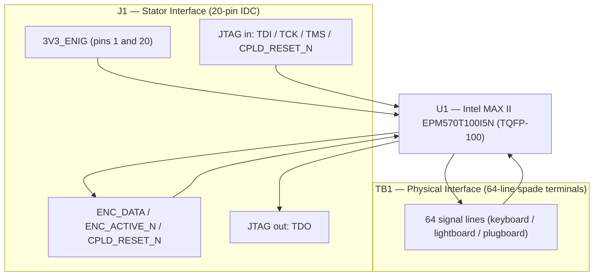

# Encoder Module (V1.0) Design Specification

**Status:** In Review
**Project:** Enigma-NG
**Author:** Izzyonstage & GitHub Copilot
**Version:** v.0.1.0
**Associated Hardware Revision:** Rev A
**Last Updated:** 2026-05-22

## 1. Overview

The Encoder Module is a **single-sided generic 64-line interface board**. Each PCB contains one
Intel MAX II CPLD, one bank of 64 spade terminals, one 20-pin IDC data-link connector, and the
shared JTAG chain connection on that same cable. The same PCB is reused in six system roles:

- `KBD_ENC` - keyboard encode module
- `LBD_DEC` - lightboard decode module
- `PLG_PASS1_DEC` - plugboard pass 1 decode module
- `PLG_PASS1_ENC` - plugboard pass 1 encode module
- `PLG_PASS2_DEC` - plugboard pass 2 decode module
- `PLG_PASS2_ENC` - plugboard pass 2 encode module

The **20-pin ribbon pinout does not change between board roles**. Role is determined by the
programmed CPLD image, not by connector rewiring. The board itself exposes only the generic
`ENC_DATA[5:0]` service bus plus `ENC_ACTIVE_N` on `J1`; role-specific signal names are owned by
the Stator.

### Plugboard Use (4 modules required)

Each plugboard pass is implemented as a paired decode / encode module set:

```text
Stator alias `ENC_OUT_PLGx[5:0]`
       ↓
PLG_PASSx_DEC `ENC_DATA[5:0]`  ->  64 passive jack lines  ->  PLG_PASSx_ENC `ENC_DATA[5:0]`
                                                                     ↓
                                                        Stator alias `ENC_IN_PLGx[5:0]`
```

With no patch cable inserted, the jack's normally-closed contact preserves identity mapping. The
full Plugboard Assembly contains two such passes.

### HID Use (2 modules required)

The HID path is split mechanically and electrically:

- **`KBD_ENC`:** reads the keyboard switch matrix subset and returns 6-bit `ENC_DATA[5:0]` to the
  Stator (`ENC_IN_KBD[5:0]` on the Stator side) while also asserting `ENC_ACTIVE_N` LOW when a
  debounced key event is active.
- **`LBD_DEC`:** receives 6-bit `ENC_DATA[5:0]` from the Stator (`ENC_OUT_LBD[5:0]` on the Stator
  side) plus `ENC_ACTIVE_N`; when `ENC_ACTIVE_N` is HIGH the board blanks all outputs instead of
  illuminating a lamp.

### Functional & Design Requirements

#### Functional Requirements

| ID | Functional Requirement | Notes | Satisfied By / Cross-Ref |
| :--- | :--- | :--- | :--- |
| FR-ENC-01 | Sense and encode the 64-character logical HID repertoire plus the 64-node plugboard interface with sufficient resolution for per-character detection | HID keyboard mode uses a 40-position physical layout (`[a-z0-9+=]` plus Left/Right Shift), while plugboard roles retain the full 64-line capacity | §3 Single-Module Architecture; §6 Key Mapping; `design/Software/CPLD_Logic/Encoder_Logic.md`; BOM U1 (EPM570T100I5N) |
| FR-ENC-02 | Transmit or receive the 6-bit service bus plus the `ENC_ACTIVE_N` sideband to/from the Stator Board via IDC ribbon cable | 20-pin IDC interface; local connector always exposes generic `ENC_DATA[5:0]` plus `ENC_ACTIVE_N` | §4 Interconnects; BOM J1 |
| FR-ENC-03 | Accept JTAG programming for the on-board CPLD from the Stator JTAG chain | One CPLD per module; six modules occupy six chain positions ahead of the rotor stack | §5 JTAG Chain Integrity; BOM U1 |
| FR-ENC-04 | Operate from 3V3_ENIG power supplied via the Stator ribbon cable | No local voltage regulation required; local bulk and decoupling capacitor network per `design/Standards/Global_Routing_Spec.md §3`. | §2 Power Requirements; BOM J1 |

#### Design Requirements

| ID | Design Requirement | Specification | Satisfied By / Cross-Ref |
| :--- | :--- | :--- | :--- |
| DR-ENC-01 | PCB stackup | Stackup per `design/Standards/Global_Routing_Spec.md §2.3.1` | §9 PCB Fabrication & Stackup |
| DR-ENC-02 | CPLD | Intel MAX II EPM570T100I5N (TQFP-100) | §3 Single-Module Architecture; BOM U1 |
| DR-ENC-03 | Stator interface connector | 20-pin 2x10 IDC (mates with one Stator encoder port) | §4 Interconnects; BOM J1 |
| DR-ENC-04 | Supply voltage | 3.3V via the 3V3_ENIG power rail | §2 Power Requirements; BOM J1 |
| DR-ENC-05 | Mounting holes | MH1–MH4 shall be M3 PTH (Ø3.2 mm drill) mounting holes (KiCAD built-in `MountingHole` footprint; no purchasable BOM component), bonded to `GND_CHASSIS` per `design/Standards/Global_Routing_Spec.md §4`. Placement follows GRS §4.3 Pattern A (rectangular board): MH1 bottom-left, MH2 bottom-right, MH3 top-right, MH4 top-left — all at 7 mm inset from both nearest edges. Exact XY coordinates TBD at PCB layout. | §2 GND_CHASSIS Single-Point Bond; `design/Standards/Global_Routing_Spec.md §4.3` |

### Component Block Diagram



## 2. Power Requirements

- **Core:** The Encoder Module receives its 3V3_ENIG power rail from the IDC cable connection from
  the Stator (pin 1 and pin 20). This may connect to any of the six Stator encoder ports.
- Decoupling and bulk entry capacitor requirements per
  `design/Standards/Global_Routing_Spec.md §3`.

### GND_CHASSIS Single-Point Bond

Per `design/Standards/Global_Routing_Spec.md §5`, the Encoder board implements a local
`GND_CHASSIS` net tied to its mounting holes and any deliberate enclosure-contact or shield-contact
features, but it does **not** implement a local GND-to-GND_CHASSIS bond. The system's only
galvanic GND ↔ GND_CHASSIS bond remains on the Power Module at the common power-entry point
immediately before the eFuse.

## 3. Single-Module Architecture

Each Encoder Module contains one Intel MAX II EPM570T100I5N CPLD and one bank of 64 spade
terminals. The board is intentionally generic so the same PCB may be programmed as either a decoder
or an encoder.

Detailed logic requirements for sampled debounce, 64-to-6 encoding, and 6-to-64 decoding are owned
by `design/Software/CPLD_Logic/Encoder_Logic.md`.

### Role Definitions

| Role | 6-bit bus used | 64-line bank use | Function |
| :--- | :--- | :--- | :--- |
| **Decode role** (`LBD_DEC`, `PLG_PASS1_DEC`, `PLG_PASS2_DEC`) | `ENC_DATA[5:0]` consumed from Stator | Board drives one of 64 lines | Decodes 6-bit input into a one-of-64 asserted output; `LBD_DEC` additionally blanks outputs when `ENC_ACTIVE_N` is HIGH |
| **Encode role** (`KBD_ENC`, `PLG_PASS1_ENC`, `PLG_PASS2_ENC`) | `ENC_DATA[5:0]` driven back to Stator | Board reads one of 64 lines | Encodes one asserted line into a 6-bit output; `KBD_ENC` additionally drives `ENC_ACTIVE_N` LOW while a debounced keypress is active |

### Signal Flow - Plugboard Pass

```text
Stator alias `ENC_OUT_PLGx[5:0]`
       ↓
  Decode-role Encoder Module
       ↓
  64-line jack field
       ↓
  Encode-role Encoder Module
       ↓
Stator alias `ENC_IN_PLGx[5:0]`
```

### Signal Flow - HID

```text
Keyboard Assembly:                    Lightboard Assembly:
40 populated switch lines             Stator alias `ENC_OUT_LBD[5:0]`
            ↓                                  ↓
       KBD_ENC                             LBD_DEC
            ↓                                  ↓
Stator alias `ENC_IN_KBD[5:0]`        one-of-64 light output
```

### I/O Capacity

Each CPLD provides enough user I/O for one 64-line interface bank plus JTAG, status LED, power, the
6-bit ribbon interface, and the `ENC_ACTIVE_N` sideband.

## 4. Interconnects

- **Data Link (J1):** 20-pin (2x10) 2.54 mm shrouded box header with polarisation key.
  > **Connector Definition Owner:** `Stator/Board_Layout.md - J4/J5/J6/J7/J8/J9`.
  > See `design/Electronics/Stator/Board_Layout.md` for the authoritative pin table.
  > `ENC_ACTIVE_N` is the generic pin-8 sideband. Active HID roles use it; unused roles shall leave
  > it HIGH / inactive.
- **Status LED (D1):** one active-low debug LED per CPLD. CPLD output LOW = LED ON.
  330 Ω current-limiting resistor; ~4 mA drive current at 3.3 V.
- **Keyboard Switches:** see `design/Mechanical/Keyboard_Assembly/Design_Spec.md`.
- **Lightboard Harness:** see `design/Mechanical/Lightboard_Assembly/Design_Spec.md`.
- **Plugboard Jack Sockets:** see `design/Mechanical/Plugboard_Assembly/Design_Spec.md`.
- **PCB Spade Terminal Bank (J2-J65):** 6.35 mm (1/4") straight vertical PCB-mount male blade
  tabs.
  - **Decode role:** wired to lightboard lamps or to plugboard jack Tip + Switch terminals.
  - **Encode role:** wired to keyboard switch outputs or to plugboard jack Sleeve terminals.
  - Initial Rev A HID assemblies may populate only **26** or **40** positions for the keyboard role, but the PCB retains
    all 64 terminals for future custom layouts and plugboard usage.

## 5. JTAG Chain Integrity

- **Entry/Exit:** JTAG enters and exits via the IDC ribbon cable connection (J1) to the Stator.
- **Local Chain:** one JTAG device per Encoder Module: U1 only.
- **Trace Width:** all JTAG signal traces on L1 shall be routed at the CI width specified in
  `design/Standards/Global_Routing_Spec.md §2.3.1`, targeting **50 Ω controlled impedance**. See
  `design/Electronics/JTAG_Module/JTAG_Integrity.md`.
- **Pull Resistors (x4, placed near U1):**
  - **TMS:** 10 kΩ pull-up to 3V3_ENIG (R2)
  - **TDI:** 10 kΩ pull-up to 3V3_ENIG (R3)
  - **TCK:** 10 kΩ pull-down to GND (R4)
  - **CPLD_RESET_N:** 10 kΩ pull-up to 3V3_ENIG (R5)
- **Termination:**
  - **Cable Output (R6, 75 Ω):** series resistor placed within 2 mm of U1 TDO, before J1 pin 14.
- **Programming:** Supports in-system debugging via the CM5 GUI. Role is selected by the image
  programmed into the module based on its known JTAG-chain position; no local role switch or role-specific RC
  population is part of the active design.
- **Controlled impedance stackup:** 50 Ω CI trace-width derivation is based on the 4-layer stackup
  per `design/Standards/Global_Routing_Spec.md §2.3.1`.

## 6. Key Mapping (64-Character Code Space with 40-Position HID Layout)

The encode-role Encoder Module maps the HID assembly's physical switch positions to the parallel
6-bit data bus while preserving the machine's 64-character logical repertoire.

> **Variant note:** this section describes the active **64-character keyboard** implementation. The
> same generic Encoder hardware may also support a separate **26-character Enigma-style keyboard**
> variant using only a subset of the 64 available input pins, plus other custom educational
> keyboard mappings. Those alternative mappings require their own dedicated CPLD programming and are
> not fully specified by the active 64-character keyboard logic below.

- **Layout:** QWERTY-derived 40-position HID panel consisting of 38 printable keys
  (`[a-z0-9+=]`) plus Left Shift and Right Shift.
- **Logical repertoire:** the system still exposes 64 unique character codes:
  26 lowercase letters + 26 uppercase letters + 10 digits + `+` + `=`.
- **Signal polarity:** encode-role lines are **active-low**. Each CPLD input shall idle HIGH via
  the MAX II weak pull-up input-bias configuration or an equivalent schematic-level bias method
  chosen during schematic capture. A key press or sensed jack closure then pulls the CPLD input LOW.
- **Activity sideband polarity:** `ENC_ACTIVE_N` is **active-low**. The idle / unconnected / unused
  state is HIGH. `KBD_ENC` drives it LOW only while a debounced keypress is active. `LBD_DEC`
  treats HIGH as "blank all outputs."
- **Weak pull-up justification:** the active design assumes the MAX II weak pull-up setting is
  sufficient for the Encoder input bank because the Stator↔Encoder ribbon link is expected to stay
  short (roughly **5-15 cm** in the finished machine), and prior bench work with a MAX II
  development board already showed stable operation over roughly **25 cm** of ribbon to a
  breadboard. External per-line pull-up resistors are therefore intentionally omitted from the
  active baseline unless prototype boards later demonstrate a real noise problem.
- **Debouncing:** encode-role debounce is performed in CPLD logic using sampled 64-bit bank
  filtering rather than external per-line RC networks. The detailed debounce architecture and
  prototype-tuning requirements live in `design/Software/CPLD_Logic/Encoder_Logic.md`.
- **Shift Logic:** Left Shift and Right Shift act as logic-level triggers for the CPLD state
  machine. When either Shift key is held, alphabetic key positions map to `A-Z` instead of `a-z`.
  Digits and `+` / `=` remain unchanged.
- **Lightboard mapping:** the decode-role lightboard module mirrors the same QWERTY-derived
  printable positions. Uppercase alphabetic outputs illuminate the corresponding alphabetic lamp
  position rather than a separate uppercase-only physical position. When `ENC_ACTIVE_N` is HIGH, all
  lightboard outputs remain inactive regardless of the 6-bit bus value.

> For keyboard switch mechanical specification and panel assembly, see
> `design/Mechanical/Keyboard_Assembly/Design_Spec.md`.
>
## 7. Plugboard Jack-Sensing

The board split does **not** remove the requirement for plugboard insertion-state awareness, but it
does move the implementation decision to the per-pass harness / schematic phase. Any sensing scheme
must preserve the generic one-CPLD module footprint and the unchanged 20-pin IDC pinout.

> For jack panel layout and harness assembly, see
> `design/Mechanical/Plugboard_Assembly/Design_Spec.md`.
>
## 8. Thermal & ESD

- **Thermal:** vias under the Intel MAX II EPM570T100I5N CPLD power pins / thermal area as required
  by layout review.
- **ESD:** No ESD protection arrays required - all signal interfaces are internal IDC ribbon
  connections within the sealed enclosure. Per `design/Standards/Global_Routing_Spec.md §9`.

## 9. PCB Fabrication & Stackup

- **Stackup:** 4-layer standard per `design/Standards/Global_Routing_Spec.md §2.3.1`.
- **Finish:** ENIG.
- **Aesthetics:** dark green solder mask; typewriter font (all-caps German where applicable).
- **Placement:** one CPLD centred behind the 64-line terminal bank; J1 kept on the service edge for
  direct ribbon access.
- **Data Plate:** Per `design/Standards/Global_Routing_Spec.md §6` on Layer L4, Revision Block text: `KODIERWERK [Encoder] V1.0`.

---

## 10. Bill of Materials

| RefDes | Specification | MPN | Manufacturer | DigiKey PN | Mouser PN | JLCPCB PN | Alt Supplier + PN | Notes | Footprint Available | Footprint Downloaded | Qty |
| --- | --- | --- | --- | --- | --- | --- | --- | --- | --- | --- | --- |
| J2-J65 | 6.35mm PCB spade blade terminals THT vertical | 1285-ST | Keystone Electronics | 36-1285-ST-ND | 534-1285-ST | C5370868 | - | - | ✔ | ✔ | 64 |
| C1-C8 | 100nF X7R 50V 0402 | CL05B104KB5NNNC | Samsung | 1276-CL05B104KB5NNNCCT-ND | 187-CL05B104KB5NNNC | C960916 | - | - | ✔ | ✔ | 8 |
| C9-C13 | 10µF X7R 50V 1206 | CL31B106KBK6PJE | Samsung | 1276-CL31B106KBK6PJECT-ND | 187-CL31B106KBK6PJE | C43935922 | – | – | ✔ | ✔ | 5 |
| D1 | Green SMD LED Vf≈2.0V 0603 | 150060VS75000 | Wurth Elektronik | 732-4980-1-ND | 710-150060VS75000 | C6848499 | - | - | ✔ | ✔ | 1 |
| J1 | 20-pin 2x10 2.54mm shrouded THT | BHR-20-VUA | Adam Tech | 2057-BHR-20-VUA-ND | 737-BHR-20-VUA | C17340054 | - | - | ✔ | ✔ | 1 |
| R1 | 330Ω 1% 0402 | ERJ-2RKF3300X | Panasonic | P330LCT-ND | 667-ERJ-2RKF3300X | C278592 | - | - | ✔ | ✔ | 1 |
| R2-R5 | 10kΩ 1% 0402 | ERJ-2RKF1002X | Panasonic | P10.0KLCT-ND | 667-ERJ-2RKF1002X | C191123 | - | - | ✔ | ✔ | 4 |
| R6 | 75Ω 1% 0402 | ERJ-2RKF75R0X | Panasonic | P75.0LCT-ND | 667-ERJ-2RKF75R0X | C413061 | - | - | ✔ | ✔ | 1 |
| SW1-SW40 | DPDT 6-pin momentary switches panel-mount | - | generic | - | - | - | eBay gadgetskingdom | eBay sourcing only | N/A | N/A | 40 |
| U1 | MAX II 570 LEs CPLD TQFP-100 | EPM570T100I5N | Intel (Altera) | 544-2281-ND | 989-EPM570T100I5N | C27319 | - | - | ✔ | ✔ | 1 |

**Quantity notes:**

- **Common fitted PCB population:** C1-C13, J2-J65, D1, J1, U1, and R1-R6 are fitted on every
  Encoder Module (**6 boards total**).
- **Role selection:** on-board fitted population is common across all six Encoder Modules.
  Encode-vs-decode behaviour is selected by the programmed CPLD image rather than an
  encode-role-only RC population.
- **Assembly-level off-board parts:** Plugboard jack sockets (panel-mount 6.35mm, 64 per plugboard
  pass, 128 system total) are tracked in `design/Mechanical/Plugboard_Assembly/Design_Spec.md`.
  SW1-SW40 keyboard switches are **40 per Keyboard Assembly (40 system total)**.
