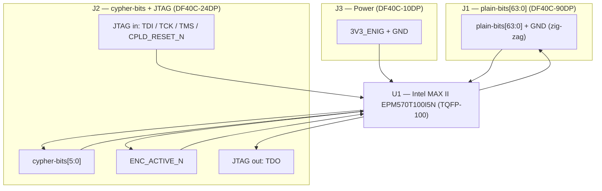

# Encoder Module (V1.0) Design Specification

**Status:** In Review
**Project:** Enigma-NG
**Author:** Izzyonstage & GitHub Copilot
**Version:** v.0.1.0
**Associated Hardware Revision:** Rev A
**Last Updated:** 2026-08-13

## 1. Overview

The Encoder Module is a **single-sided generic cipher-bank interface board**. Each PCB contains
one Intel MAX II CPLD, supporting bulk/decoupling capacitors, one status LED, and three Hirose
DF40C board-to-board (BtB) plug connectors (`J1`-`J3`) that carry all signal, JTAG, and power
interfacing to whichever carrier board the module is mounted on. The module carries **no on-board
keyboard switches, lightboard lamps, or plugboard jack terminals** - those live on the carrier
board (Cypher-Input, Cypher-Output) or the Plugboard Assembly, wired back to the module's
`plain-bits[63:0]` bus. The same PCB is reused in six system roles:

- `KBD_ENC` - keyboard encode module (mounted on the Cypher-Input Board)
- `LBD_DEC` - lightboard decode module (mounted on the Cypher-Output Board)
- `PLG_PASS1_DEC` - plugboard pass 1 decode module (mounted on the Cypher Board)
- `PLG_PASS1_ENC` - plugboard pass 1 encode module (mounted on the Cypher Board)
- `PLG_PASS2_DEC` - plugboard pass 2 decode module (mounted on the Cypher Board)
- `PLG_PASS2_ENC` - plugboard pass 2 encode module (mounted on the Cypher Board)

The **J1/J2/J3 pinout does not change between board roles**. Role is determined by the programmed
CPLD image, not by connector rewiring. The module itself exposes the generic `plain-bits[63:0]`
bus (`J1`), the `cypher-bits[5:0]` bus plus JTAG and `ENC_ACTIVE_N` (`J2`), and power (`J3`);
role-specific signal names are owned by whichever carrier board (Cypher Board, Cypher-Input,
Cypher-Output) the module is mounted on.

> **Connector Definition Owner:** this board is the sole canonical source for the ENC module BtB
> interface family (`J1`/`J2`/`J3`, DF40C-xDP plugs) - see §4 Interconnects and
> `Board_Layout.md §1-3`. Carrier boards reference this document and carry only the mating
> DF40C-xDS receptacles (§4.1 Mating Connectors for Carrier Boards).

### Plugboard Use (4 modules required)

Each plugboard pass is implemented as a paired decode / encode module set, both mounted on the
Cypher Board's back face:

```text
Cypher Board alias `ENC_OUT_PLGx[5:0]`
       ↓
PLG_PASSx_DEC `cypher-bits[5:0]`  ->  64 passive jack lines (Plugboard Assembly)  ->  PLG_PASSx_ENC `cypher-bits[5:0]`
                                                                                            ↓
                                                                       Cypher Board alias `ENC_IN_PLGx[5:0]`
```

With no patch cable inserted, the jack's normally-closed contact preserves identity mapping. The
full Plugboard Assembly contains two such passes. Jack-sensing and spade-terminal harness detail
that previously lived on this board's spec are tracked in `.copilot/todos/merge-create-plugboard.md`
pending the Plugboard Board's own design.

### HID Use (2 modules required)

The HID path is split mechanically and electrically across two separate carrier boards:

- **`KBD_ENC`** (Cypher-Input Board): reads the keyboard cipher-path keyswitch inputs via
  `plain-bits[63:0]` and returns 6-bit `cypher-bits[5:0]` to the Cypher Board interconnect while
  also asserting `ENC_ACTIVE_N` LOW when a debounced key event is active.
- **`LBD_DEC`** (Cypher-Output Board): receives 6-bit `cypher-bits[5:0]` from the Cypher Board
  interconnect plus `ENC_ACTIVE_N`; when `ENC_ACTIVE_N` is HIGH the carrier board blanks all
  lightboard outputs instead of illuminating a lamp.

### Functional & Design Requirements

#### Functional Requirements

| ID | Functional Requirement | Notes | Satisfied By / Cross-Ref |
| :--- | :--- | :--- | :--- |
| FR-ENC-01 | Sense and encode the 64-character logical cipher repertoire plus the 64-node plugboard interface with sufficient resolution for per-character detection | Key mapping and per-variant layout are owned by the carrier board (Cypher-Input variant design files); this module provides the generic 64-line `plain-bits` bus only | §3 Single-Module Architecture; `design/Software/CPLD_Logic/Encoder_Logic.md`; BOM U1 (EPM570T100I5N) |
| FR-ENC-02 | Transmit or receive the `cypher-bits[5:0]` bus plus the `ENC_ACTIVE_N` sideband to/from the carrier board via `J2` | Local connector always exposes generic `cypher-bits[5:0]` plus `ENC_ACTIVE_N`; role-specific signal naming is owned by the carrier board | §4 Interconnects; BOM J2 |
| FR-ENC-03 | Accept JTAG programming for the on-board CPLD from the carrier board's JTAG chain | One CPLD per module; six modules occupy six chain positions ahead of the rotor stack | §5 JTAG Chain Integrity; BOM U1 |
| FR-ENC-04 | Operate from 3V3_ENIG power supplied via the carrier board's BtB mount | No local voltage regulation required; local bulk and decoupling capacitor network per `design/Standards/Global_Routing_Spec.md §3`. | §2 Power Requirements; BOM J3 |

#### Design Requirements

| ID | Design Requirement | Specification | Satisfied By / Cross-Ref |
| :--- | :--- | :--- | :--- |
| DR-ENC-01 | PCB stackup | Stackup per `design/Standards/Global_Routing_Spec.md §2.3.1` | §7 PCB Fabrication & Stackup |
| DR-ENC-02 | CPLD | Intel MAX II EPM570T100I5N (TQFP-100) | §3 Single-Module Architecture; BOM U1 |
| DR-ENC-03 | Carrier board interface connectors | 3x Hirose DF40C-xDP BtB plugs: J1 = DF40C-90DP-0.4V(51) (`plain-bits[63:0]`); J2 = DF40C-24DP-0.4V(51) (`cypher-bits[5:0]` + JTAG + `ENC_ACTIVE_N`); J3 = DF40C-10DP-0.4V(51) (3V3_ENIG power). Mates with the carrier board's DF40C-xDS receptacle set. | §4 Interconnects; BOM J1-J3 |
| DR-ENC-04 | Supply voltage | 3.3V via the 3V3_ENIG power rail | §2 Power Requirements; BOM J3 |
| DR-ENC-05 | Mounting holes | MH1–MH4 shall be M3 PTH (Ø3.2 mm drill) mounting holes (KiCAD built-in `MountingHole` footprint; no purchasable BOM component), bonded to `GND_CHASSIS` per `design/Standards/Global_Routing_Spec.md §4`. Placement follows GRS §4.3 Pattern A (rectangular board): MH1 bottom-left, MH2 bottom-right, MH3 top-right, MH4 top-left — all at 7 mm inset from both nearest edges. Exact XY coordinates TBD at PCB layout. | §2 GND_CHASSIS Single-Point Bond; `design/Standards/Global_Routing_Spec.md §4.3` |

### Component Block Diagram



## 2. Power Requirements

- **Core:** The Encoder Module receives its 3V3_ENIG power rail from the carrier board via `J3`
  (5x 3V3_ENIG + 5x GND). This may connect to any of the six carrier board mount positions
  (Cypher-Input, Cypher-Output, or one of the four plugboard-pass mounts on the Cypher Board).
- Decoupling and bulk entry capacitor requirements per
  `design/Standards/Global_Routing_Spec.md §3`.

### GND_CHASSIS Single-Point Bond

Per `design/Standards/Global_Routing_Spec.md §5`, the Encoder Module implements a local
`GND_CHASSIS` net tied to its mounting holes and any deliberate enclosure-contact or shield-contact
features, but it does **not** implement a local GND-to-GND_CHASSIS bond. The system's only
galvanic GND ↔ GND_CHASSIS bond remains on the Power Module at the common power-entry point
immediately before the eFuse.

## 3. Single-Module Architecture

Each Encoder Module contains one Intel MAX II EPM570T100I5N CPLD and no on-board keyboard
switches, lamps, or jack terminals - the physical interface (keyswitches, lightboard lamps,
plugboard jacks) lives entirely on the carrier board or assembly the module is mounted to. The
board is intentionally generic so the same PCB may be programmed as either a decoder or an
encoder.

Detailed logic requirements for sampled debounce, 64-to-6 encoding, and 6-to-64 decoding are owned
by `design/Software/CPLD_Logic/Encoder_Logic.md`.

### Role Definitions

| Role | 6-bit bus used | `plain-bits[63:0]` use | Function |
| :--- | :--- | :--- | :--- |
| **Decode role** (`LBD_DEC`, `PLG_PASS1_DEC`, `PLG_PASS2_DEC`) | `cypher-bits[5:0]` consumed from carrier board | Module drives one of 64 lines | Decodes 6-bit input into a one-of-64 asserted output; `LBD_DEC` additionally blanks outputs when `ENC_ACTIVE_N` is HIGH |
| **Encode role** (`KBD_ENC`, `PLG_PASS1_ENC`, `PLG_PASS2_ENC`) | `cypher-bits[5:0]` driven back to carrier board | Module reads one of 64 lines | Encodes one asserted line into a 6-bit output; `KBD_ENC` additionally drives `ENC_ACTIVE_N` LOW while a debounced keypress is active |

### Signal Flow - Plugboard Pass

```text
Cypher Board alias `ENC_OUT_PLGx[5:0]`
       ↓
  Decode-role Encoder Module (Cypher Board mount)
       ↓
  64-line jack field (Plugboard Assembly)
       ↓
  Encode-role Encoder Module (Cypher Board mount)
       ↓
Cypher Board alias `ENC_IN_PLGx[5:0]`
```

### Signal Flow - HID

```text
Cypher-Input Board:                   Cypher-Output Board:
cipher-path keyswitch lines           Cypher Board interconnect `ENC_DATA[5:0]` (Cypher-Output role)
            ↓                                  ↓
       KBD_ENC                             LBD_DEC
            ↓                                  ↓
Cypher Board interconnect `ENC_DATA[5:0]` (Cypher-Input role)   one-of-64 light output
```

### I/O Capacity

Each CPLD provides enough user I/O for one 64-line `plain-bits` bank plus JTAG, status LED, power,
the `cypher-bits[5:0]` bus, and the `ENC_ACTIVE_N` sideband.

## 4. Interconnects

This board owns the canonical definition of the ENC module BtB interface family. Full per-pin
zig-zag GND distribution tables are in `Board_Layout.md §1-3`.

- **`J1` — plain-bits (DF40C-90DP-0.4V(51)):** 90-pin (2x45) BtB plug. 64x `plain-bits[63:0]`
  signal pins + 26x GND, zig-zag distributed. Carries the generic 64-line cipher bank to/from the
  carrier board; the carrier board (or an attached assembly) wires each `plain-bits` line to a
  keyswitch, lamp, or plugboard jack terminal as appropriate for its role.
- **`J2` — cypher-bits + JTAG (DF40C-24DP-0.4V(51)):** 24-pin (2x12) BtB plug, full zig-zag. 6x
  `cypher-bits[5:0]` + JTAG (`TCK`, `RST_N`/`CPLD_RESET_N`, `TMS`, `TDI`, `TDO`) + `ENC_ACTIVE_N`
  + 12x GND. `ENC_ACTIVE_N` direction is not fixed at the connector - it is determined by CPLD
  role: `KBD_ENC` drives it (output); `LBD_DEC` consumes it (input); other roles hold it inactive
  (HIGH).
- **`J3` — power (DF40C-10DP-0.4V(51)):** 10-pin (2x5) BtB plug, power only, no zig-zag. 5x
  3V3_ENIG (Row A) + 5x GND (Row B).
- **Status LED (D1):** one active-low debug LED per CPLD. CPLD output LOW = LED ON.
  330 Ω current-limiting resistor; ~4 mA drive current at 3.3 V.

### 4.1 Mating Connectors for Carrier Boards

This module carries the DF40C-xDP **plug** side of each connector. Any carrier board that mounts
an Encoder Module (Cypher Board, Cypher-Input, Cypher-Output) shall use the matching DF40C-xDS
**receptacle** part below in its own BOM - these mating parts are **not** part of this module's
own BOM (§8):

| Mates with | Carrier-side receptacle MPN | Manufacturer | DigiKey PN | Mouser PN | JLCPCB PN |
| :--- | :--- | :--- | :--- | :--- | :--- |
| `J1` (plain-bits, 90-pin) | DF40C-90DS-0.4V(51) | Hirose | 26-DF40C-90DS-0.4V(51)CT-ND | 798-DF40C90DS0.4V51 | C2911197 |
| `J2` (cypher-bits + JTAG, 24-pin) | DF40C-24DS-0.4V(51) | Hirose | H11621CT-ND | 798-DF40C24DS0.4V51 | C424640 |
| `J3` (power, 10-pin) | DF40C-10DS-0.4V(51) | Hirose | H11617CT-ND | 798-DF40C10DS0.4V51 | C424636 |

> Referenced by: `Cypher/Design_Spec.md` BOM (J7-J18, x4 mount positions) and
> `Cypher-Input/Design_Spec.md` BOM (J1-J3, x1 mount position). The future Cypher-Output Board
> BOM (`merge-create-cypher-output`) shall use the same mating parts for its own ENC module mount.

## 5. JTAG Chain Integrity

- **Entry/Exit:** JTAG enters and exits via `J2` (DF40C-24DP), to/from the carrier board's JTAG
  chain.
- **Local Chain:** one JTAG device per Encoder Module: U1 only.
- **Trace Width:** all JTAG signal traces on L1 shall be routed at the CI width specified in
  `design/Standards/Global_Routing_Spec.md §2.3.1`, targeting **50 Ω controlled impedance**. See
  `design/Electronics/JTAG_Module/JTAG_Integrity.md`.
- **Pull Resistors (x4, placed near U1):**
  - **TMS:** 10 kΩ pull-up to 3V3_ENIG (R2)
  - **TDI:** 10 kΩ pull-up to 3V3_ENIG (R3)
  - **TCK:** 10 kΩ pull-down to GND (R4)
  - **CPLD_RESET_N:** 10 kΩ pull-up to 3V3_ENIG (R5)
- **Termination:**
  - **Cable Output (R6, 75 Ω):** series resistor placed within 2 mm of U1 TDO, before `J2` column
    C11 (Row A, `TDO`).
- **Programming:** Supports in-system debugging via the CM5 GUI. Role is selected by the image
  programmed into the module based on its known JTAG-chain position; no local role switch or role-specific RC
  population is part of the active design.
- **Controlled impedance stackup:** 50 Ω CI trace-width derivation is based on the 4-layer stackup
  per `design/Standards/Global_Routing_Spec.md §2.3.1`.

## 6. Thermal & ESD

- **Thermal:** vias under the Intel MAX II EPM570T100I5N CPLD power pins / thermal area as required
  by layout review.
- **ESD:** No ESD protection arrays required - all signal interfaces are internal BtB connections
  within the sealed enclosure. Per `design/Standards/Global_Routing_Spec.md §9`.

## 7. PCB Fabrication & Stackup

- **Stackup:** 4-layer standard per `design/Standards/Global_Routing_Spec.md §2.3.1`.
- **Finish:** ENIG.
- **Aesthetics:** dark green solder mask; typewriter font (all-caps German where applicable).
- **Placement:** one CPLD centred on the board; `J1` (90-pin) on the left edge, `J2` (24-pin) at
  the bottom-right corner, `J3` (10-pin, power) at the top-right corner - per
  `Board_Layout.md §1-3`.
- **Data Plate:** Per `design/Standards/Global_Routing_Spec.md §6` on Layer L4, Revision Block text: `KODIERWERK [Encoder] V1.0`.

---

## 8. Bill of Materials

| RefDes | Specification | MPN | Manufacturer | DigiKey PN | Mouser PN | JLCPCB PN | Alt Supplier + PN | Notes | Footprint Available | Footprint Downloaded | Qty |
| --- | --- | --- | --- | --- | --- | --- | --- | --- | --- | --- | --- |
| C1-C8 | 100nF X7R 50V 0402 | CL05B104KB5NNNC | Samsung | 1276-CL05B104KB5NNNCCT-ND | 187-CL05B104KB5NNNC | C960916 | - | - | ✔ | ✔ | 8 |
| C9-C13 | 10µF X7R 50V 1206 | CL31B106KBK6PJE | Samsung | 1276-CL31B106KBK6PJECT-ND | 187-CL31B106KBK6PJE | C43935922 | – | – | ✔ | ✔ | 5 |
| D1 | Green SMD LED Vf≈2.0V 0603 | 150060VS75000 | Wurth Elektronik | 732-4980-1-ND | 710-150060VS75000 | C6848499 | - | - | ✔ | ✔ | 1 |
| J1 | 90-pin 0.4mm pitch BtB plug | DF40C-90DP-0.4V(51) | Hirose | H11878CT-ND | 798-DF40C90DP0.4V51 | C424648 | - | plain-bits[63:0] interface | ✔ | ✔ | 1 |
| J2 | 24-pin 0.4mm pitch BtB plug | DF40C-24DP-0.4V(51) | Hirose | H11620CT-ND | 798-DF40C24DP0.4V51 | C424639 | - | cypher-bits + JTAG + ENC_ACTIVE_N interface | ✔ | ✔ | 1 |
| J3 | 10-pin 0.4mm pitch BtB plug | DF40C-10DP-0.4V(51) | Hirose | H11616CT-ND | 798-DF40C10DP0.4V51 | C424635 | - | 3V3_ENIG power interface | ✔ | ✔ | 1 |
| R1 | 330Ω 1% 0402 | ERJ-2RKF3300X | Panasonic | P330LCT-ND | 667-ERJ-2RKF3300X | C278592 | - | - | ✔ | ✔ | 1 |
| R2-R5 | 10kΩ 1% 0402 | ERJ-2RKF1002X | Panasonic | P10.0KLCT-ND | 667-ERJ-2RKF1002X | C191123 | - | - | ✔ | ✔ | 4 |
| R6 | 75Ω 1% 0402 | ERJ-2RKF75R0X | Panasonic | P75.0LCT-ND | 667-ERJ-2RKF75R0X | C413061 | - | - | ✔ | ✔ | 1 |
| U1 | MAX II 570 LEs CPLD TQFP-100 | EPM570T100I5N | Intel (Altera) | 544-2281-ND | 989-EPM570T100I5N | C27319 | - | - | ✔ | ✔ | 1 |

**Quantity notes:**

- **Common fitted PCB population:** C1-C13, D1, J1-J3, U1, and R1-R6 are fitted on every
  Encoder Module (**6 boards total**).
- **Role selection:** on-board fitted population is common across all six Encoder Modules.
  Encode-vs-decode behaviour is selected by the programmed CPLD image rather than an
  encode-role-only RC population.
- **Mating connectors (J1-J3 counterparts):** see §4.1 - sourced and populated on the carrier
  board (Cypher, Cypher-Input, Cypher-Output), not on this module.
- **Off-module assemblies:** keyswitches, lightboard lamps, and plugboard jack sockets are wired
  to `plain-bits[63:0]` via the carrier board or the Plugboard Assembly harness. Spade-terminal
  harness detail formerly tracked here is preserved in `.copilot/todos/merge-create-plugboard.md`
  pending the Plugboard Board's design.
