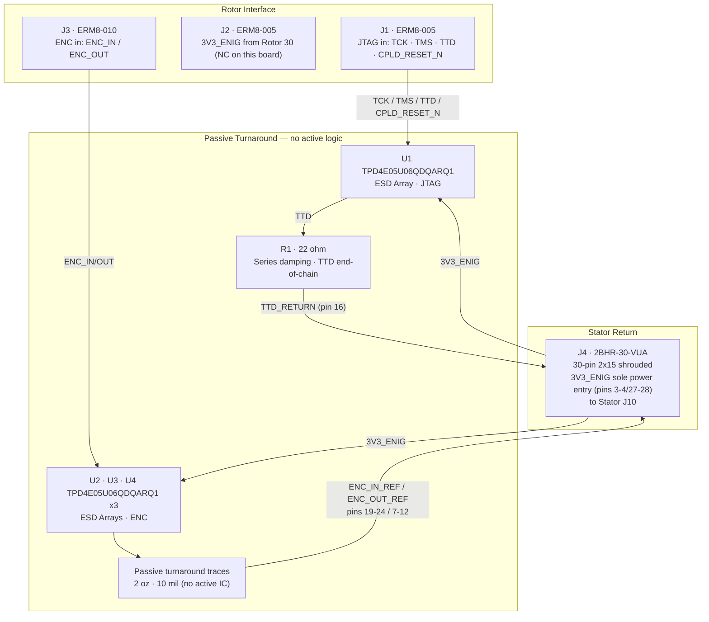

# Reflector Board (V1.0) Design Specification

**Status:** In Review
**Project:** Enigma-NG
**Author:** Izzyonstage & GitHub Copilot
**Version:** v.0.1.0
**Associated Hardware Revision:** Rev A
**Last Updated:** 2026-05-22

## 1. Overview

The Reflector Board sits at the far end of the rotor stack. Its primary role is to receive the signals
from the final rotor and return them back through the stack via a different electrical path.
It also acts as the passive JTAG end-of-chain turnaround and returns `TTD_RETURN` directly back to the
Stator so the Stator CPLD can keep all reflector-mapping ownership in one place without requiring a
second CPLD on the Reflector itself.

### Functional & Design Requirements

#### Functional Requirements

| ID | Functional Requirement | Notes | Satisfied By / Cross-Ref |
| :--- | :--- | :--- | :--- |
| FR-REF-01 | Terminate the JTAG daisy-chain at the end of the 30-rotor stack | Connects to Rotor 30 J4/J5/J6 outputs | §3 JTAG & Logic Hub; BOM J1-J3 (ERM8) |
| FR-REF-02 | Provide the mandatory physical turnaround path at the end of the rotor/extension chain while the selected reflection map is applied by the Stator CPLD | Passive turnaround board - no local CPLD required | §2 Architecture; BOM J1-J4 |
| FR-REF-03 | Return the JTAG TTD_RETURN signal from the end of the chain to the Stator | Via J4 → Stator J10 → Controller `J12` (JM BtB dock) → FT232H | §3 JTAG & Logic Hub; BOM J4 (30-pin 2x15 shrouded), R1 (22Ω) |
| FR-REF-04 | Provide end-of-chain JTAG signal damping | Prevents reflections in the serial chain | §3 JTAG & Logic Hub; BOM R1 (22Ω) |
| FR-REF-05 | Protect the J1 (JTAG) and J3 (ENC) rotor-facing BtB connector interfaces from ESD events during live rotor swap | J1 and J3 are exposed to operator handling during rotor insertion/removal; TVS/ESD arrays required on both connectors per DEC-048 | §5 Thermal & ESD; BOM U1-U4 |

#### Design Requirements

| ID | Design Requirement | Specification | Satisfied By / Cross-Ref |
| :--- | :--- | :--- | :--- |
| DR-REF-01 | PCB stackup | Stackup per `design/Standards/Global_Routing_Spec.md §2.3.1` | §6 PCB Fabrication & Stackup |
| DR-REF-02 | Input connectors | J1 = ERM8-005 (JTAG, plugs into Rotor 30 J4), J2 = ERM8-005 (Power, Rotor 30 J5), J3 = ERM8-010 (ENC, Rotor 30 J6) | §4 Rotor Interface Connectors; BOM J1-J3 |
| DR-REF-03 | TTD_RETURN output | J4 connector (mates with Stator J10); `TTD_RETURN` on J4 pin 16; 30-pin 2x15 layout per DEC-053; `5V_MAIN` on pins 1-2/29-30 (not connected — present for cable family compatibility only); `3V3_ENIG` on pins 3-4/27-28 (sole power entry for this board); GND guard pairs at pins 5-6, 13-14, 17-18, 25-26 | §3 JTAG & Logic Hub; BOM J4 (30-pin 2x15 shrouded) |
| DR-REF-04 | End-of-chain damping | R1 = 22 Ω, 0603, on TTD line | §3 JTAG & Logic Hub; BOM R1 (22Ω) |
| DR-REF-05 | Active logic | None - passive turnaround board only; reflector-map selection remains Stator-owned | §2 Architecture |
| DR-REF-06 | ESD protection - rotor-facing BtB connectors | U1 (J1 JTAG, 1x TPD4E05U06QDQARQ1 covering TCK, TMS, TTD, CPLD_RESET_N) + U2-U4 (J3 ENC, 3x TPD4E05U06QDQARQ1 covering ENC_IN[5:0] + ENC_OUT[5:0]); placed within 3mm of connector mating edge per DEC-048 | §5 Thermal & ESD; BOM U1-U4 |
| DR-REF-07 | Mounting holes | MH1–MH4 shall be M3 PTH (Ø3.2 mm drill) mounting holes bonded to `GND_CHASSIS` per `design/Standards/Global_Routing_Spec.md §4`. No BOM entry — plain chassis mounting holes. Placement follows GRS §4.3 Pattern B (D-shaped board): MH1 bottom-left corner, MH2 bottom-right corner, MH3 board-centre, MH4 top-centre arc midpoint — all at 7 mm inset from nearest edge. Exact XY coordinates TBD at PCB layout. | §6 PCB Fabrication & Stackup; `design/Standards/Global_Routing_Spec.md §4.3` |

### Component Block Diagram

## 2. Architecture

* **PCB:** 4-Layer / 2oz Copper per `design/Standards/Global_Routing_Spec.md §2.3.1` / ENIG Gold / 2.0mm Filleted Corners.
* **Standard:** Includes Inverted White Data Plate on bottom layer.

### System Role: The "Turnaround"

* **Logic Type:** Passive turnaround.
* **Routing Logic:** All signal mapping is handled remotely by the **Intel MAX II EPM570T100I5N CPLD**
  located on the Stator Board. The active reflection-map configuration is selected via the Settings
  Board panel switches (Bank 2, SW_B2[5:0]) read by User Settings Module `U1` @ 0x23 and driven to
  the Stator CPLD by `U8` @ 0x22 - see DEC-032.
* **CPLD support:** None on this PCB; the board only provides the mandatory return path.
* **Signal Path:** Final rotor/extension outputs → Reflector J1-J3 (ERM8 male) → passive turnaround traces
  → ENC cipher data returned toward the Stator; `TTD_RETURN` exits via J4 (30-pin header, pin 16) → Stator J10.

## 3. JTAG & Logic Hub

* **Interconnect:** 30-pin (2x15) 2.54mm Shrouded Box Header (Vertical). Per DEC-053.
  > **Connector Definition Owner:** `Stator/Board_Layout.md - J10`.
  > This board uses the mating connector as J4 (Adam Tech 2BHR-30-VUA - see BOM). The authoritative
  > pinout is defined on the Stator; `TTD_RETURN` on pin 16, `CPLD_RESET_N` on pin 15,
  > `ENC_OUT_REF[5:0]` on pins 7-12, `ENC_IN_REF[5:0]` on pins 19-24, `3V3_ENIG` on pins 3-4/27-28,
  > `5V_MAIN` on pins 1-2/29-30, GND guard pairs at pins 5-6, 13-14, 17-18, 25-26.
  > **KiCAD footprint:** `Connector_IDC:IDC-Header_2x15_P2.54mm_Vertical` (standard KiCAD library — no separate download required).

> **Compatibility note:** J4 pin allocation matches Stator J10 (30-pin 2x15). `3V3_ENIG` on pins
> 3-4/27-28 is the sole power entry for this board. `5V_MAIN` on pins 1-2/29-30 is not connected —
> present for cable family compatibility only.

* Decoupling and bulk entry capacitor requirements per `design/Standards/Global_Routing_Spec.md §3`.
* **Termination:**R1 (22Ω) is a series damping resistor on the TTD return line (end-of-chain
  signal from Rotor 30). It provides impedance damping at the final rotor output before the signal
  re-enters the Stator via the J4 return ribbon cable.

> ⚠️ **JTAG chain END - important for future reviewers:** The JTAG daisy-chain terminates at this
> passive board. TCK, TMS, and TDI arrive via BtB connectors (J1-J3, ERM8 plugging into Rotor 30
> J4-J6) and stop here as end-of-chain signals. They do NOT continue past this board, and they are
> not consumed by any local CPLD because the Reflector has no active logic.
>
> The J4 ribbon cable (Reflector J4 → Stator J10) carries:
>
> * **Pin 16 - TTD_RETURN:** JTAG TDO return only - completes the chain back to the FT232H. This is
>   the ONLY JTAG signal on J4.
> * **Pins 7-12 - `ENC_OUT_REF[5:0]`; Pins 19-24 - `ENC_IN_REF[5:0]`:** Bidirectional Stator CPLD interface
>   (simultaneous, using Stator-owned aliases). `ENC_OUT_REF[5:0]` (pins 7-12): return-pass signal
>   driven by the Stator CPLD to the Reflector chain after optional plugboard insertion (Step 2
>   drive). `ENC_IN_REF[5:0]` (pins 19-24): reflected signal returned from passive Reflector
>   turnaround to the Stator CPLD (Step 2 receive). **These are NOT JTAG signals.**
>   See `Stator/Design_Spec.md §3 CPLD Signal Routing Matrix` for full signal flow details.
> * **Pin 15 - CPLD_RESET_N**, **Pins 3-4 and 27-28 - 3V3_ENIG**, **Pins 5-6, 13-14, 17-18, 25-26 - GND.**
> * **Pins 1-2 and 29-30 - `5V_MAIN`:** Present for shared cable compatibility only; unused on the passive Reflector.
>
> **Note:** TMS and TDI pull-up resistors (R2/R3) previously listed in this section have been removed.
> TMS and TDI are NOT routed on J4 (pin 16 = TTD_RETURN only for JTAG; pins 7-12 = ENC_OUT_REF; pins 19-24 = ENC_IN_REF; pin 15 = CPLD_RESET_N).
> Pull-up termination for TMS and TDI is already provided by the Stator (R3/R4) and Encoder boards (R3/R4) where those signals originate.

* **JTAG Trace Width Rule:** All JTAG signal traces on L1 (TTD_RETURN and any in-board JTAG
  routing) shall be routed at the width specified in GRS §2.3.1 and JLCPCB_Manufacturing.md §1.1 over the L2 GND plane, targeting
  **50 Ω controlled impedance**. Stackup upgraded to 4-Layer per DEC-017.
  See `design/Electronics/JTAG_Module/JTAG_Integrity.md` and DEC-016.
* **JTAG Return:** TDO from Rotor 30 is routed to Pin 16 (TTD_RETURN) for return to the Stator.
* **Loopback:** Directly routes the 6-bit `ENC_OUT_REF` turnaround into the returned 6-bit `ENC_IN_REF`
  path via 2oz 10-mil traces.
* **Cross-ref:** For interconnect pinouts on power (3V3_ENIG/GND), `ENC_OUT_REF` / `ENC_IN_REF`, and
  JTAG TTD_RETURN lines used for reflector loopback/plugboard mapping, See:
  * `Stator/Design_Spec.md`
  * `Extension/Design_Spec.md`

## 4. Rotor Interface Connectors

The Reflector connects to the **output side** of Rotor 30 using the same ERM8 male header family used
on each Rotor's output side (J4/J5/J6). One set of three connectors per the Rotor interface definition:

> **Connector Definition Owner:** `Rotor/Design_Spec.md §3.4`.
> This board provides ERM8 male headers that plug into Rotor 30's J4/J5/J6 ERF8 female output sockets.

| Ref | Type | Signal Group | Part Series | MPN |
| --- | ---- | ------------ | ----------- | --- |
| J1 | ERM8-005 (10-pin, **male**) | JTAG (TCK, TMS, TTD, CPLD_RESET_N + GND) | Samtec ERM8 | ERM8-005-05.0-S-DV-K-TR |
| J2 | ERM8-005 (10-pin, **male**) | Power (3V3_ENIG x 5, GND x 5) - **power pins NC on this board** | Samtec ERM8 | ERM8-005-05.0-S-DV-K-TR |
| J3 | ERM8-010 (20-pin, **male**) | ENC data (ENC_IN[5:0], ENC_OUT[5:0] + GND interleave) | Samtec ERM8 | ERM8-010-05.0-S-DV-K-TR |

> **J2 power pins (3V3_ENIG and GND) are not connected to the board power plane.** J2 is present for
> mechanical engagement with Rotor 30 J5 only. The Reflector's sole power entry is J4 (ribbon cable,
> pins 3-4 and 27-28 = 3V3_ENIG, GND on pins 5-6/13-14/17-18/25-26). This prevents a parallel power path / ground loop through the
> rotor daisy-chain and the direct ribbon cable return. C1-C5 decouple at the J4 power entry.

**Orientation:** Facing the rotor output side (Rotor 30 top face), perpendicular to the rotor stack axis.
The ERM8 header pitch (0.8mm) is physically incompatible with 2.54mm connectors - label accordingly on silkscreen.

> **Rotor interface note:** The Reflector rotor interface uses the 40 active contacts
> (10 + 10 + 20) on J1-J3.

Per `design/Standards/Global_Routing_Spec.md §5`, the Reflector implements a local `GND_CHASSIS`
net tied to its mounting holes and any deliberate enclosure-contact features, but it does **not**
implement a local GND-to-GND_CHASSIS bond. The system's only galvanic GND ↔ GND_CHASSIS bond is
defined on the Power Module at the common power-entry point immediately before the eFuse, so J4
GND pins (5-6, 13-14, 17-18, 25-26) are treated as signal/power return only and must not be bridged locally to chassis on the
Reflector.

## 5. Thermal & ESD

* **Thermal:** No active cooling required. Passive-only board. Relies on chassis airflow.
* **ESD - rotor-facing connectors (TVS required):**
  J1 (JTAG, ERM8-005) and J3 (ENC, ERM8-010) are exposed to operator handling during live rotor insertion and removal.
  Per DEC-045 and DEC-048, TVS/ESD protection is mandatory on both connector interfaces:
  * **U1** - 1x TPD4E05U06QDQARQ1 on J1 (JTAG); channels: TCK, TMS, TTD, CPLD_RESET_N.
  * **U2, U3, U4** - 3x TPD4E05U06QDQARQ1 on J3 (ENC); 12 channels: ENC_IN[5:0] + ENC_OUT[5:0].
  All arrays shall be placed within 3mm of their respective connector mating edge on L1.
  * **Working voltage note:** The TPD4E05U06QDQARQ1 maximum continuous working voltage is **5.5V**
    per datasheet. On the `3V3_ENIG` rail (3.3V ±5% = max 3.465V), all U1-U4 devices are well within the 5.5V rated continuous working voltage with a ≥2.0V margin.
  * **Operating voltage:** U1–U4 are powered from `3V3_ENIG` (the sole power rail on this board). `5V_MAIN` is not connected on the Reflector (J4 pins 1-2/29-30 are NC per DR-REF-03).
* **ESD - all other connectors (no TVS required):**
  * J2 (Power, ERM8-005): power rail (3V3_ENIG / GND) only - no signal protection required.
  * J4 (TTD_RETURN ribbon, 2BHR-30-VUA): internal ribbon connector; not accessible during live rotor swap.
  Per `design/Standards/Global_Routing_Spec.md §9`.

## 6. PCB Fabrication & Stackup

* **Stackup:** 4-layer standard per `design/Standards/Global_Routing_Spec.md §2.3.1`.
* **Contacts:** ERM8-005 (x2, 10-pin, JTAG and Power) + ERM8-010 (x1, 20-pin, ENC Data) - male headers on J1-J3.
* **Fillets:** 2.0mm Rounded PCB corners for consistent "Museum-Grade" enclosure fit.
* **Routing:** Global **0.5mm Fixed-Radius Circular Arcs** for all loopback traces.
* **Mounting Holes:** 4× M3 through-holes (MH1–MH4) tied to GND_CHASSIS per GRS §4 and positioned per GRS §4.3 Pattern B (D-shaped board). No BOM entry required for chassis mounting holes.

## 7. Branding & Traceability

* **Data Plate:** Per `design/Standards/Global_Routing_Spec.md §6` on Layer L4, Revision Block text: `REFLEKTOR [Reflector] V1.0`.
* **Connector Pin-1 Markers:** J1–J4 silkscreen pin-1 markers (arrow, chamfer, or dot) are required per `design/Standards/Global_Routing_Spec.md §7.1`.

## 8. Bill of Materials

| RefDes | Specification | MPN | Manufacturer | DigiKey PN | Mouser PN | JLCPCB PN | Alt Supplier + PN | Notes | Footprint Available | Footprint Downloaded | Qty |
| --- | --- | --- | --- | --- | --- | --- | --- | --- | --- | --- | --- |
| C1-C5 | 10µF X7R 50V 1206 | CL31B106KBK6PJE | Samsung | 1276-CL31B106KBK6PJECT-ND | 187-CL31B106KBK6PJE | C43935922 | – | – | ✔ | ✔ | 5 |
| J1-J2 | 10-pin 2x5 0.8mm male SMT | ERM8-005-05.0-S-DV-K-TR | Samtec | 612-ERM8-005-05.0-S-DV-K-TRCT-ND | 200-ERM8005050SDVKTR | C3649741 | - | - | ✔ | ✔ | 2 |
| J3 | 20-pin 2x10 0.8mm male SMT | ERM8-010-05.0-S-DV-K-TR | Samtec | SAM8610CT-ND | 200-ERM8010050SDVKTR | C374877 | - | - | ✔ | ✔ | 1 |
| J4 | 30-pin 2x15 2.54mm shrouded THT | 2BHR-30-VUA | Adam Tech | 2057-2BHR-30-VUA-ND | 737-2BHR-30-VUA | C17346400 | - | - | ✔ | ✔ | 1 |
| R1 | 22Ω 1% 0603 | ERJ-3EKF2200V | Panasonic | P220HCT-ND | 667-ERJ-3EKF2200V | C403073 | - | - | ✔ | ✔ | 1 |
| U1-U4 | 4-ch bidirectional ESD array USON-10 | TPD4E05U06QDQARQ1 | Texas Instruments | 296-40696-1-ND | 595-PD4E05U06QDQARQ1 | C81353 | - | - | ✔ | ✔ | 4 |
