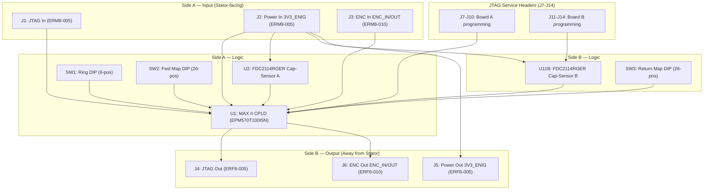

# Rotor Board (V1.0) Design Specification

**Status:** In Review
**Project:** Enigma-NG
**Author:** Izzyonstage & GitHub Copilot
**Version:** v.0.1.0
**Associated Hardware Revision:** Rev A
**Last Updated:** 2026-09-02

## 1. Overview

The Enigma-NG uses a 30-rotor stack. Unlike the original mechanical rotors, these are **Smart Digital Rotors**
where the internal scrambled wiring is emulated by a dedicated logic chip on each module.

Each rotor assembly consists of **two circular PCBs** (Board A and Board B), each **Ø92mm**,
inside an aluminium shroud (Ø100mm outer face, 4mm radial wall). The two boards are separated
by an ~11.8mm gap and connected by **4 connectors per rotor side** (Board A has J7, J8, J11, J14;
Board B has J9, J10, J12, J13; 8 single-row 2.54mm THT headers total; 44 pins; mixed gender for
physical keying) on
their inner (facing) surfaces. Total rotor thickness is ~15mm, matching original Enigma rotor
proportions. These internal headers are manually assembled post-JLCPCB SMT pick-and-place.

**Board A (input side):** Carries the CPLD (U1), FDC2114 U2 (Track A encoder), SW1 (ring
setting), SW2 (forward map select), and J1-J3 (ERM8 male, input connectors).

**Board B (output side):** Carries FDC2114 U11B (Track B encoder, N=64 only), SW3 (return map
select), and J4-J6 (ERF8 female, output connectors).

The aluminium shroud is retained by **rolling-pin style cylindrical bearings** around the
circumference with **ceramic or nylon rolling elements** (electrically isolating). The shroud
must remain **electrically floating** - not connected to circuit ground. Gray code position
slots are milled into the inner faces of the shroud flanges (dish side for Track A, Board A;
cover side for Track B, Board B). Bare copper electrode pads on the PCB flat face at r≈44mm
sense the pattern capacitively. Characters are engraved on the outer cylindrical face of the
shroud at r=50mm.

The current position of the outer ring is detected using a **dual-track absolute capacitive
encoder** (N=64) or **single-track STGC encoder** (N=26). For N=64, 3+3 sensor electrodes on
Board A and Board B read a 6-bit standard reflected Gray code with zero multi-bit transitions.
For N=26, all 5 STGC electrodes are on Board A only (U11B on Board B is not populated).

Two rotor variants are defined: the **26-character variant** (5-bit STGC, compatible with
original Enigma rotors I-VIII, Beta, Gamma) and the **64-character variant** (6-bit dual-track
Gray code, supporting the extended Enigma-NG character set). Both variants use identical PCB
footprints, connector pinouts, and DIP switch mechanisms for full interoperability within a
mixed stack. Variant-specific details are in
`design/Electronics/Rotor/Rotor_26_Char_Design.md` and
`design/Electronics/Rotor/Rotor_64_Char_Design.md`.

For mechanical dimensions, tolerances, shroud specification, and encoder slot geometry, see
`design/Mechanical/Rotor/Design_Spec.md`.

### GND_CHASSIS Single-Point Bond

Per `design/Standards/Global_Routing_Spec.md §5`, each rotor PCB implements a local
`GND_CHASSIS` net tied to its M3 alignment holes and any stationary mechanical chassis-contact
features, but it does **not** implement a local GND-to-GND_CHASSIS bond. The system's only
galvanic GND ↔ GND_CHASSIS bond remains on the Power Module at the common power-entry point
immediately before the eFuse. The rotating aluminium shroud remains electrically floating and must
not be used as a local chassis-bond point.

### Functional & Design Requirements

#### Functional Requirements

| ID | Functional Requirement | Notes | Satisfied By / Cross-Ref |
| :--- | :--- | :--- | :--- |
| FR-ROT-01 | Emulate the substitution cipher wiring of a historical Enigma rotor in real-time | 21 forward maps in CPLD UFM; direction bit doubles to 42 configs; see variant design files | §2.2 Logic & Transposition; BOM U1 (EPM570T100I5N) |
| FR-ROT-02 | Detect rotor angular position using a capacitive encoder; N=64: dual-track 3+3 bit reflected Gray code (Board A and Board B); N=26: single-track 5-bit STGC (Board A only) | N=64: zero multi-bit transitions, XOR-chain decode; N=26: STGC lookup table, invalid codes flagged as fault | §2.1 Position Sensing; BOM U2/U11A (Board A), U11B (Board B, N=64 only) |
| FR-ROT-03 | Pass JTAG chain signals to the next rotor in the stack (or to the Reflector at position 30) | Serial daisy-chain; each rotor is one JTAG device | §3.3 Signal Integrity; BOM J1 (ERM8-005 JTAG in), J4 (ERF8-005 JTAG out) |
| FR-ROT-04 | Receive 3V3_ENIG power from the upstream board and forward to the downstream board | Passive power pass-through via J2/J5 | §3.1 Power Management; BOM J2 (ERM8-005 power in), J5 (ERF8-005 power out) |
| FR-ROT-05 | Apply cipher substitution at each rotor hop via CPLD; forward and return paths processed independently using SW2/SW3 selected maps | J3 ENC_IN → CPLD (SW2 map+dir) → J6 ENC_OUT; J6 ENC_IN → CPLD (SW3 map+dir) → J3 ENC_OUT; see §3.2 | §3.2 Communication Bus; BOM J3 (ERM8-010), J6 (ERF8-010) |
| FR-ROT-06 | Be individually removable for maintenance or reconfiguration without tools | Samtec ERM8/ERF8 high-cycle connectors | §2.3 Mechanical Details; BOM J1-J6 (Samtec ERM8/ERF8) |
| FR-ROT-07 | Store 21 forward cipher maps in CPLD UFM; SW2 (input side) and SW3 (output side) each independently select map index [4:0] and direction bit [5] (0=forward, 1=reverse), giving 42 effective configurations per side without reprogramming | Same mechanism and switch count for both variants | §2.2 Logic & Transposition; BOM U1 (EPM570T100I5N), SW2, SW3 |
| FR-ROT-08 | Implement ring setting via SW1 (6 switches, Board A input side only); CPLD sums SW1[5:0] with decoded position (mod N) to determine notch/turnover trigger position | Input side only; N=26 for 26-char variant, N=64 for 64-char variant | §2.3 Mechanical Details; BOM SW1; cross-ref: design/Mechanical/Rotor/Design_Spec.md |
| FR-ROT-09 | Expose effective rotor position (decoded position + SW1 ring offset, mod N) via Intel Virtual JTAG (ALTERA_VIRTUAL_JTAG megafunction, USER0 instruction) as a 6-bit UDR; readable by JM FT232H without interrupting cipher operation | 26-char variant: bits [4:0] valid, bit [5]=0; 64-char: all 6 bits; cipher logic operates independently on CPLD system clock | §2.2 Logic & Transposition; §3.3 Signal Integrity; cross-ref: DEC-027, JM Design_Spec |
| FR-ROT-10 | The rotor boards shall be assembled by JLCPCB SMT (one side each, outward-facing); the internal headers (J7-J14) shall be manually assembled post-SMT | Mixed-gender header arrangement (J11/J14 male on Board A, J7/J8 female on Board A; J12/J13 male on Board B, J9/J10 female on Board B) provides physical keying | §3.4 Connector Pinouts; BOM J7-J14 |

#### Design Requirements

| ID | Design Requirement | Specification | Satisfied By / Cross-Ref |
| :--- | :--- | :--- | :--- |
| DR-ROT-01 | PCB stackup | Stackup per `design/Standards/Global_Routing_Spec.md §2.3.1` | §4 PCB Fabrication & Stackup |
| DR-ROT-02 | CPLD | Intel MAX II EPM570T100I5N (TQFP-100); 570 LEs; 21 UFM forward maps; SW2/SW3 direction bit gives 42 effective configs; character width in variant design files | §2.2 Logic & Transposition; BOM U1 (EPM570T100I5N) |
| DR-ROT-03 | Position sensor | Split dual-track capacitive encoder: FDC2114RGHR U2 on Board A (Track A, r≈44mm, bits[5:3] N=64 or STGC bits[3:0] N=26, addr 0x2A); FDC2114RGHR U11A on Board A (addr 0x2B, CH0 = STGC bit[4] - N=26 builds only; not populated for N=64); FDC2114RGHR U11B on Board B (Track B, r≈44mm, bits[2:0] N=64 only - not populated for N=26, addr 0x2B); PCB Ø=92mm; track patterns in variant design files | §2.1 Position Sensing; BOM U2/U11A (Board A), U11B (Board B, N=64 only) |
| DR-ROT-04 | Input connectors (Board A) | J1 = ERM8-005 (JTAG in), J2 = ERM8-005 (Power in), J3 = ERM8-010 (ENC in) | §3.4 Connector Pinouts; BOM J1-J3 |
| DR-ROT-05 | Output connectors (Board B) | J4 = ERF8-005 (JTAG out), J5 = ERF8-005 (Power out), J6 = ERF8-010 (ENC out) | §3.4 Connector Pinouts; BOM J4-J6 |
| DR-ROT-06 | Power consumption | ≈54.2 mA typical per rotor from 3V3_ENIG (design budget: 55 mA) | §3.1 Power Management |
| DR-ROT-07 | Stack quantity | 30 rotor boards in the complete system | §1 Overview |
| DR-ROT-08 | Mechanical retention | 4x M3 PTH (plated through-hole) mounting holes, Ø3.2mm clearance, per rotor assembly (2x on Board A + 2x on Board B), positioned at the 4 corners of the inscribed square in the Ø92mm circular footprint (approx. ±32.5 mm from board centre); electrical connection: `GND_CHASSIS`; designators: MH1A, MH2A (Board A); MH1B, MH2B (Board B); no BOM entry required — plain chassis mounting holes, no components to fit; 8mm solid metal support rod (non-threaded) through all 30 rotors for alignment and connector stress relief; stack is horizontal | §2.3 Mechanical Details; `design/Electronics/Rotor/Board_Layout.md §9`; `design/Standards/Global_Routing_Spec.md §4` |
| DR-ROT-09 | Ring setting DIP switches (SW1) | 6-position DIP switch on input side only; SW1[5:0] summed mod N with CPLD STGC-decoded position to yield effective rotor position | §2.3 Mechanical Details; BOM SW1 |
| DR-ROT-10 | Map selection DIP switches (SW2 / SW3) | 6-position DIP on each face: bits [4:0] = map index (0-20 valid), bit [5] = direction (0=forward, 1=reverse); identical mechanism on both variants | §2.2 Logic & Transposition; BOM SW2, SW3 |
| DR-ROT-11 | Internal connectors (J7-J14) | **4 connectors per rotor side**: Board A has J7 (1x5 female RS1-05-G), J8 (1x5 female RS1-05-G), J11 (1x5 male PH1-05-UA), J14 (1x7 male PH1-07-UA); Board B has J9 (1x5 female RS1-05-G), J10 (1x7 female RS1-07-G), J12 (1x5 male PH1-05-UA), J13 (1x5 male PH1-05-UA). Board A connectors mate with Board B connectors (J7↔J12, J8↔J13, J11↔J9, J14↔J10); 8 total headers; 44 total pins; mixed gender provides physical keying; manually assembled post-JLCPCB SMT. | §3.4 Connector Pinouts; BOM J7-J14 |
| DR-ROT-12 | Two-PCB assembly | Board A and Board B together constitute one logical rotor board; all BOM entries, reference designators, and design rules apply to the combined two-PCB assembly | §1 Overview |

### Component Block Diagram



## 2. Core Design

### 2.1 Position Sensing (Dual-Track Capacitive Encoder)

The rotor outer ring position is detected contactlessly using a **dual-track absolute capacitive
encoder** (N=64) or **single-track STGC encoder** (N=26). All active components reside on the
rotor PCBs; the rotating aluminium shroud requires only milled slot patterns on its inner
flanges - no conductive ink, no magnets, and no mechanical contacts.

#### Physical Arrangement

* **PCB diameter:** 92 mm (45 mm radius).
* **Sensor electrodes:** Bare copper electrode pads on the PCB flat face (inner face of each
  board, facing the shroud flanges). No SMT components are placed on the electrode pads.
* **Electrode radius:** r ≈ 44 mm from board centre on both Board A and Board B.
* **Shroud slots:** Gray code patterns are milled as slots/pockets into the inner faces of the
  aluminium shroud flanges. Solid aluminium over an electrode = high capacitance (logic 1 from
  FDC2114); milled slot over an electrode = low capacitance (logic 0).
* **Gap:** 0.5mm ±0.15mm (0.35mm min - 0.65mm max) between PCB electrode and shroud flange inner face (controlled by bearing
  precision).
* **Shroud isolation:** The shroud must remain electrically **floating** (not connected to
  circuit ground). Rolling-pin cylindrical bearings with ceramic or nylon rolling elements
  provide the required electrical isolation.

#### Sensing ICs

Each rotor variant populates **two Texas Instruments FDC2114RGHR** (4-channel
capacitive-to-digital converter, I²C, 3.3 V, 16-VQFN), but the second device differs by variant:

* **U2 (Board A)** - senses Track A (bits[5:3] for N=64; STGC bits[3:0] for N=26); I²C address 0x2A.
  Track A slots milled into the inner face of the shroud **dish** flange (Board A side).
* **U11A (Board A, N=26 only)** - second FDC2114 for the N=26 variant, addr 0x2B. CH0 = STGC bit[4]; CH1-CH3 unused
  (each carries a dummy LC tank - same 18 µH + 33 pF **in parallel** between INxA/INxB - per TI app note;
  GND-tie causes oscillation instability). **U11A is not populated for N=64**. N=26 variant: U2
  (addr 0x2A) reads STGC bits[3:0], U11A (addr 0x2B, Board A) reads STGC bit[4].
* **U11B (Board B, N=64 only)** - senses Track B (bits[2:0] for N=64 only); I²C address 0x2B.
  Track B slots milled into the inner face of the shroud **cover** flange (Board B side).
  **U11B is not populated for N=26 rotors.** Unused channels carry a dummy LC tank (18 µH + 33 pF
  **in parallel** between INxA/INxB) per TI app note; GND-tie causes oscillation instability.

The CPLD implements a simple I²C master and polls U2 and U11A (N=26) or U2 and U11B (N=64) at power-up and after
each detected position change. Each channel reports HIGH (solid aluminium) or LOW (milled slot).

The local FDC2114 bus requires one external pull-up on `SDA` and one on `SCL` to `3V3_ENIG`; these
are captured in the Board A BOM so the same pull-up pair serves the common local bus in both variants
(`U2` + `U11A` on Board A for N=26, or `U2` on Board A plus `U11B` over `J11` for N=64). Per the
in-repo TI FDC2114 family datasheet power-supply recommendation, each populated FDC2114 also carries
its own local `0.1 µF` + `1 µF` `VDD` bypass pair. These support parts are separate from the resonant
front-end and unused-channel support components, which are fully specified in §2.1 (Resonant Front-End Topology).

#### CPLD Position Decode

**N=64 (dual-track, 6-bit reflected Gray code):**
The 6 sensor readings (G[5:3] from U2 Track A, G[2:0] from U11B Track B) form a 6-bit standard
reflected Gray code. The CPLD decodes via XOR chain:

```text
B5 = G5 ; B4 = B5 XOR G4 ; B3 = B4 XOR G3
B2 = B3 XOR G2 ; B1 = B2 XOR G1 ; B0 = B1 XOR G0
```

No lookup table required. All 64 codes are valid. Zero multi-bit transitions at any position
including the 63→0 wrap. Full decode detail in `Rotor_64_Char_Design.md §7`.

**N=26 (single-track, 5-bit STGC):**
The 5 sensor readings (U2 STGC bits[3:0] and U11A STGC bit[4], both on Board A) form a 5-bit STGC code. A **combinational
lookup table** in the CPLD VHDL maps each valid code to its corresponding binary position
(0 to 25). Invalid codes flag a between-character fault. Standard Gray code is not achievable
for N=26 (not a power of 2); the lookup table is retained. Full decode detail in
`Rotor_26_Char_Design.md §7`.

The decoded binary position feeds directly into the SW1 modulo-N adder (§2.3).

Variant-specific track bit patterns and full decode tables are defined in:

* `design/Electronics/Rotor/Rotor_26_Char_Design.md` §7
* `design/Electronics/Rotor/Rotor_64_Char_Design.md` §7

#### Resonant Front-End Topology

Each active FDC2114 channel drives a resonant LC tank to detect the aluminium shroud segment. The
tank consists of an **18 µH unshielded SMD inductor (Bourns CWF1610A-180K)** and a **33 pF C0G/NP0 ±1% capacitor** connected
**in parallel** between the channel's INxA and INxB pins (single-ended mode; `CHx_FIN_SEL = 0b10`).
Nominal resonant frequency: **~6.5 MHz**.

* **Clock source:** CLKIN tied to GND - FDC2114 uses its internal oscillator (~43.35 MHz). No
  external crystal required.
* **IDRIVE baseline:** `0b01111` (register `DRIVE_CURRENT_CHx` = 0x7800; bit 10 is reserved and must be 0). Lab validation required;
  see `design/Procedures/Lab_Tests.md` **LT-001**.
* **Deglitch setting:** `0b101` = 10 MHz (register `MUX_CONFIG` deglitch field = 0x0005). Lab
  validation required; see `design/Procedures/Lab_Tests.md` **LT-002**.
* **Unused channels:** Each unused channel carries a **dummy LC tank** (same 18 µH + 33 pF in
  parallel between INxA/INxB). Tying unused INx pins directly to GND causes oscillation
  instability in active channels per TI application note; the dummy load is required.
* **FDC2114 firmware:** None. The FDC2114 has no user-programmable firmware. All register
  configuration is performed at runtime by the CPLD I²C master (VHDL bitstream). JTAG programs
  the CPLD only. Full I²C register table in `design/Software/CPLD_Logic/Rotor_Logic.md`.

### 2.2 Logic & Transposition

* **Logic:** The **Intel MAX II EPM570T100I5N CPLD** performs real-time cipher substitution for
  both the forward and return signal paths simultaneously.
* **Role:** Applies the active cipher map to incoming ENC\_IN data and outputs the substituted
  value as ENC\_OUT. The forward-pass and return-pass maps are selected independently by SW2 and
  SW3 respectively:
  * **Forward path:** J3 ENC\_IN[0:W-1] → CPLD applies SW2-selected map → J6 ENC\_OUT[0:W-1]
  * **Return path:** J6 ENC\_IN[0:W-1] → CPLD applies SW3-selected map → J3 ENC\_OUT[0:W-1]
  * W = 5 for 26-character variant; W = 6 for 64-character variant.
    Note: N denotes alphabet size (26 or 64) throughout this document; W denotes ENC bus active bit width.
* **Memory:** The CPLD UFM stores 21 forward-direction cipher maps in the common 64-entry x 6-bit format (384 bits per map, 21 maps x 384 = 8,064 bits, within the 8,192-bit UFM).
  Both rotor variants use this identical map count and selection mechanism; the actual map data
  is variant-specific. The EPM570T100I5N is required (570 LEs): a 64-character map needs
  384 flip-flops for the loaded register table plus ~80 LEs for combinational decode, totalling
  ~464 LEs - exceeding the EPM240's 240 LEs. Same TQFP-100 footprint; drop-in at PCB level.
* **Map selection (SW2 / SW3):** Each 6-position DIP switch encodes:
  * Bits [4:0] - map index, selecting one of the 21 stored forward maps (indices 0-20 valid;
    21-31 reserved).
  * Bit [5] - direction: `0` = apply map forward (map[input] = output);
    `1` = apply map in reverse (find input such that map[input] = output, i.e. inverse lookup).
  * This direction bit effectively doubles the usable configurations to **42 per side** without
    requiring additional UFM storage.
  * SW2 and SW3 are independent - in normal Enigma operation they are set to a matched
    forward/inverse pair (same index, opposite directions), but the hardware does not enforce this.
* **Latency:** At power-up the CPLD serially reads the selected map(s) from UFM into internal
  flip-flop registers (~40 µs per 384-bit map at the 10 MHz UFM clock - well under 1 ms total,
  invisible to the user). At runtime, cipher substitution is applied combinationally from the
  loaded registers; typical latency is **~20-50 ns per rotor hop**. The full 30-rotor round-trip
  completes in ~1.2-3 µs - far below any practical timing constraint.
* **Configuration:** SW2 and SW3 are read at power-up only. A power cycle is required after
  changing either switch. The CPLD is programmed once via JTAG; map selection at runtime uses
  SW2/SW3 exclusively. See `design/Electronics/Rotor/Rotor_26_Char_Design.md` and
  `design/Electronics/Rotor/Rotor_64_Char_Design.md` for map data definitions and character-set
  details.
* Decoupling and bulk entry capacitor requirements per `design/Standards/Global_Routing_Spec.md §3`.

### 2.3 Mechanical Details

* **Mounting:** Each rotor PCB has two **M3 mounting holes**: Board A uses **MH1A** and **MH2A**; Board B uses **MH1B** and **MH2B** (per DR-ROT-08 and `design/Electronics/Rotor/Board_Layout.md §9`).
* **Stack Orientation:** The rotor stack is oriented **horizontally** (matching original Enigma
  machine aesthetics). In this orientation, rotor weight does not bear on the ERM8/ERF8 connector
  engagement faces.
* **Support Rod:** An **8mm solid metal support rod (non-threaded)** passes through the centre of
  all 30 rotors. The rod provides mechanical alignment and relieves stress on the ERM8/ERF8
  connectors during assembly and handling. It is not a retention mechanism; individual rotors
  remain removable by sliding them off the rod.
* **Hot-Swappable:** The Samtec ERM8 Edge-Rate connectors are rated for high mating cycles,
  allowing individual rotors to be pulled for reconfiguration without tools.
* **Connector Configuration:** Each rotor carries **3 separate ERM8 connectors** (JTAG, Power,
  ENC\_DATA) mating into matching ERF8 female sockets on the next rotor (or Stator for Rotor 1,
  Reflector for Rotor 30). Physical separation of connector types provides keying - it is
  mechanically impossible to mismate a power connector into a JTAG socket.

#### Ring Setting DIP Switches (SW1 - Input Side Only)

Each rotor carries a **6-position DIP switch (SW1)** on the input face that sets the ring
setting (Ringstellung), emulating the ring and notch position of an original Enigma rotor.

* **Location:** Input side only. SW1 is not present on or accessible from the output face.
* **Function:** The CPLD continuously sums SW1[5:0] with the decoded capacitive encoder position
  reading, modulo N (N = 26 for 26-char variant; N = 64 for 64-char variant), to produce the
  **effective position**. When this matches the notch trigger value for the active map, the CPLD
  signals the next rotor in the stack to advance one position (turnover).
* **Cross-reference:** See `design/Mechanical/Rotor/Design_Spec.md` for the
  ring gear, notch wheel, and mechanical turnover engagement mechanism.

#### Map Selection DIP Switches (SW2 / SW3)

A **6-position DIP switch** is mounted on each face of the rotor PCB for cipher map selection:

* **SW2 (input face):** Selects the map and direction for the **forward-pass** (J3 → J6).
* **SW3 (output face):** Selects the map and direction for the **return-pass** (J6 → J3).
  Completely independent of SW2.
* **Bit encoding (both SW2 and SW3):**
  * Bits [4:0] - map index: selects one of the 21 UFM forward maps (indices 0-20 valid).
  * Bit [5] - direction: `0` = forward; `1` = reverse (CPLD computes inverse lookup on the fly).
* **Effective configurations:** 21 maps x 2 directions = **42 per side**.
* **Normal operation:** SW2 and SW3 are set to the same map index with opposite directions
  (one forward, one reverse), emulating the linked forward/return wiring of an original Enigma
  rotor. The hardware does not enforce this - non-matching maps are valid.
* Both rotor variants use the **identical** SW2/SW3 footprint and encoding.

## 3. Electrical Requirements

### 3.1 Power Management

* **Input:** 3.3V/**~54.2mA typical per rotor** (design budget: **55mA/rotor**) sourced from the
  **Power Module** `3V3_ENIG` rail, routed through Controller Board → Stator Board → Rotor stack via
  the active Stator logic dock.
  See `design/Electronics/Power_Budgets.md` for full budget - 30 rotors draw **1.63A typical / 1.65A budget**; the 150mA/rotor figure previously used was a conservative overestimate.
* **Filtering:** Local **10uF X7R** bulk entry bank on each rotor; upstream rail filtering uses the **Stator ferrite bead bank** to suppress stack switching noise.
* Decoupling and bulk entry capacitor requirements per `design/Standards/Global_Routing_Spec.md §3`.
* Decoupling assignment: C1–C8 are CPLD VCC/VCCIO bypass caps; C9 is FDC2114 (0x2A) VDD bypass cap;
  C10–C14 are CPLD VCC/VCCIO bulk decoupling caps; C15 is FDC2114 (0x2A) VDD bulk decoupling cap. See GRS §3.2.

### 3.2 Communication Bus

* **The ENC Data Path:** The cipher bus passes through every rotor in the stack (Stator → Rotor 1
  → ... → Rotor 30 → Reflector forward; reverse for the return path). At **each rotor the CPLD
  applies the active cipher substitution** - data is NOT passed through transparently:
  * **Forward path:** J3 ENC\_IN[0:W-1] → CPLD applies SW2-selected map (direction per SW2[5])
    → J6 ENC\_OUT[0:W-1]
  * **Return path:** J6 ENC\_IN[0:W-1] → CPLD applies SW3-selected map (direction per SW3[5])
    → J3 ENC\_OUT[0:W-1]
  * W = 5 for 26-character variant; W = 6 for 64-character variant (N denotes alphabet size; W denotes ENC bus active bit width).
  * All connectors carry 6 bits (ENC[5:0]) regardless of variant to maintain a common pinout
    across mixed stacks. The 26-character variant leaves ENC[5] as NC.
  * This path is entirely separate from the JTAG TTD\_RETURN signal.
* **JTAG TTD\_RETURN Path:** After the Reflector processes the cipher reversal, `TTD_RETURN` travels
  separately: Reflector J4 → Stator J10 → Controller `J12` (JM BtB dock) → FT232H on JM (JTAG
  chain closure only).
* **Control:** Each rotor has a local I²C bus for position sensing (FDC2114 U2/U11B for N=64; U2/U11A for N=26). The CPLD acts as I²C master; no I²C signals are exposed on J1-J6.
* **JTAG:** Pass-through lines allow the **USB Blaster** on the Controller Board to program the
  entire 30-rotor stack in one daisy-chain operation. Under normal operation JTAG is idle; cipher
  maps are selected via SW2/SW3 without reprogramming.

### 3.3 Signal Integrity

* **Impedance:** 50Ω single-ended traces for JTAG and data lines to prevent reflections.
* **Layer Stack:** 4-layer standard per `design/Standards/Global_Routing_Spec.md §2.3.1`; layer
  assignments as defined there.
* **JTAG Trace Width Rule:** All JTAG signal traces on L1 shall be routed at the CI width specified in
  `design/Standards/Global_Routing_Spec.md §2.3.1`, targeting **50 Ω controlled impedance**
  (physical properties in `design/Production/JLCPCB_Manufacturing.md §1.1`). See `design/Electronics/JTAG_Module/JTAG_Integrity.md §3.1`.
* **TTD path policy:** The rotor-stack `TTD` path is a direct board-to-board chain. No series resistor is
  placed at each rotor hop; `TTD` exits the CPLD and continues straight to J4 pin 6. Cable-driving
  damping is reserved for the ribbon-port interfaces on the Stator / Encoder boards, while the
  Reflector retains the single 22 Ω end-of-chain damping resistor on `TTD_RETURN` (per DEC-081).
* **Pull Resistors (R1-R4, 10kΩ, per CPLD):**
  * **TMS (R1):** 10kΩ pull-up to 3V3_ENIG - ensures JTAG TAP resets to Test-Logic-Reset on power-up.
  * **TDI (R2):** 10kΩ pull-up to 3V3_ENIG - holds TDI at logic-1 (BYPASS) when not actively driven.
  * **TCK (R3):** 10kΩ pull-down to GND - prevents spurious clocking when TCK is floating.
  * **SYS\_RESET\_N (R4):** 10kΩ pull-up to 3V3_ENIG - active-low; pull-up holds CPLD out of reset by default.
  These are present on every rotor board. With 30 rotors, 30 sets of pull resistors exist in the full stack;
  this is intentional and consistent with making each rotor independently safe in any stack position.
  The aggregate 30× 10kΩ parallel load on `CPLD_RESET_N` (333Ω effective) was analysed in DEC-078,
  which identified a GPIO overload condition and resolved it by adding a BSS138 MOSFET buffer (Q1) on
  the Stator — the `CPLD_RESET_N` net is driven by Q1's drain, with the 3V3_ENIG rail providing
  pull-high via the distributed rotor pull-ups. No change to individual Rotor pull-up values is required.
* **Shielding:** 4-layer PCB with solid GND plane (L2) to isolate digital switching from the high-accuracy capacitive encoder.

#### JTAG Net Name Mapping

The Rotor board uses T-prefix design net names for JTAG signals. The following table maps JTAG
standard pin names to design net names as used on the Rotor PCB schematic and netlists. There is
no net named `TTC` anywhere in this design. See `design/Standards/Global_Routing_Spec.md §10` for
the full net-naming convention.

| JTAG Standard Name | Direction (per board) | Design Net Name | Notes |
| :--- | :--- | :--- | :--- |
| TDI | In — J1 pin 6 | `TTD` | Incoming serial data from the previous board's TDO output |
| TDO | Out — J4 pin 6 | `TTD` | Outgoing serial data to the next board's TDI input |
| TCK | In/pass-through — J1 pin 2 → J4 pin 2 | `TCK` | JTAG clock; unmodified throughout the chain |
| TMS | In/pass-through — J1 pin 4 → J4 pin 4 | `TMS` | JTAG mode select; unmodified throughout the chain |
| TRST (optional) | In — J1 pin 8 | `CPLD_RESET_N` | System-wide active-low reset; also resets the JTAG TAP; ESD-protected via U3 ch4 (Board A) and U7 ch4 (Board B); driven via Q1 (BSS138) open-drain buffer on Stator per DEC-078 (see `Stator/Design_Spec.md §3`) |

> **Vendor pin name note — `DEV_CLRN` → `DEV_CLR_N`:** The Intel MAX II EPM570T100I5N vendor pin name for the
> device-clear input is `DEV_CLRN` (no underscore separator). Per `design/Standards/Global_Routing_Spec.md §10`,
> this is renamed to `DEV_CLR_N` in the Enigma-NG net-naming convention. On the Rotor, this net is further
> labelled `CPLD_RESET_N` to distinguish it as a system-level reset signal.
> Cross-reference: `design/Electronics/Rotor/Board_Layout.md §6.1`.
>
> **TTD inter-board net name:** `TTD` (JTAG Transmission Data) is the net name for the
> TDO-to-TDI board-to-board trace. Because the trace is simultaneously the TDO output of one
> Rotor board and the TDI input of the next, neither `TDI` nor `TDO` alone correctly describes it.
> The unified name `TTD` is therefore used on both J1 pin 6 (input connector) and J4 pin 6
> (output connector). Cross-reference: `design/Standards/Global_Routing_Spec.md §10`.

### 3.4 Connector Pinouts (Rotor Interface - Authority Document)
>
> This section is the **authoritative pinout definition** for all Rotor-to-Stator connectors.
> All other boards (Stator) cross-reference this section. See DEC-018 for ownership rationale.
>
#### J1 - JTAG Interface (ERM8-005, 10-pin 2x5, 0.8mm pitch)

| Pin | Row A | Pin | Row B |
| :--- | :--- | :--- | :--- |
| 1 | GND | 2 | TCK |
| 3 | GND | 4 | TMS |
| 5 | GND | 6 | TTD |
| 7 | GND | 8 | SYS\_RESET\_N |
| 9 | GND | 10 | spare/GND |

> **TTD Net Name:** The JTAG serial chain data pin is designated **TTD** (JTAG Transmission Data) at pin 6
> on both input and output connectors. On J1 (input side), TTD carries incoming TDI; on J4 (output side),
> TTD carries outgoing TDO to the next rotor's TDI. This unified net name avoids the TDI/TDO direction
> confusion when viewing connector pinouts in isolation. Consistent with the T-prefix JTAG signal naming
> convention (TCK, TMS, TDI, TDO → TTD).
>
#### J2 - Power Interface (ERM8-005, 10-pin 2x5, 0.8mm pitch)

| Pin | Row A | Pin | Row B |
| :--- | :--- | :--- | :--- |
| 1 | 3V3\_ENIG | 2 | GND |
| 3 | 3V3\_ENIG | 4 | GND |
| 5 | 3V3\_ENIG | 6 | GND |
| 7 | 3V3\_ENIG | 8 | GND |
| 9 | 3V3\_ENIG | 10 | GND |

> 5 pins x 0.5 A/pin = **2.5 A capacity** - far exceeds the 50 mA/rotor requirement. (Samtec ERM8-005 datasheet: 1.0 A/pin rated; 0.5 A/pin de-rated in this design.)
> 5 power + 5 GND ensures fully balanced current return paths.
>
#### J3 - Encoder Data Interface (ERM8-010, 20-pin 2x10, 0.8mm pitch)

| Pin | Row A | Pin | Row B |
| :--- | :--- | :--- | :--- |
| 1 | ENC\_IN\[0\] | 2 | ENC\_OUT\[0\] |
| 3 | ENC\_IN\[1\] | 4 | ENC\_OUT\[1\] |
| 5 | ENC\_IN\[2\] | 6 | ENC\_OUT\[2\] |
| 7 | ENC\_IN\[3\] | 8 | ENC\_OUT\[3\] |
| 9 | ENC\_IN\[4\] | 10 | ENC\_OUT\[4\] |
| 11 | ENC\_IN\[5\] | 12 | ENC\_OUT\[5\] |
| 13 | ACTUATE\_REQUEST\_IN\_N | 14 | ACTUATE\_REQUEST\_OUT\_N |
| 15 | GND | 16 | GND |
| 17 | GND | 18 | GND |
| 19 | GND | 20 | GND |

> 12 ENC signal pins + 2 ACTUATE_REQUEST pins (per DEC-093) + 6 GND fill pins. All remaining
> spare pins assigned as GND for improved EMI shielding and signal return paths around the
> encoder data bus. Both ENC_IN and ENC_OUT on J3 are active simultaneously:
> ENC_IN receives forward-pass data from upstream; ENC_OUT carries the CPLD SW3-map return-pass result back upstream.
> The 26-character variant uses ENC[0:4] only; ENC[5] = NC on those boards.
> `ACTUATE_REQUEST_IN_N` (pin 13) receives the actuation-trigger signal from the upstream stage
> (Stack-Input, or the previous Rotor); `ACTUATE_REQUEST_OUT_N` (pin 14) carries this board's own
> return-pass signal back upstream — both wired to CPLD U1 (see §6.1). This connector carries
> these signals rather than J1 (JTAG) since they are logically part of the ENC/actuation control
> group, not JTAG. See DEC-093.
>
#### J4 - JTAG Interface Output (ERF8-005, 10-pin 2x5, 0.8mm pitch, FEMALE socket)

Mates with the next rotor's J1 (ERM8-005 male header) or Reflector J1.

| Pin | Row A | Pin | Row B |
| :--- | :--- | :--- | :--- |
| 1 | GND | 2 | TCK |
| 3 | GND | 4 | TMS |
| 5 | GND | 6 | TTD |
| 7 | GND | 8 | SYS\_RESET\_N |
| 9 | GND | 10 | spare/GND |

> Pin 6 = TTD (CPLD TDO output - feeds next stage's J1 pin 6 TTD input). Pin 10 = spare/GND (no TTD_RETURN path here; return travels via Reflector → Extension Port → Stator J10).
>
#### J5 - Power Interface Output (ERF8-005, 10-pin 2x5, 0.8mm pitch, FEMALE socket)

Mates with the next rotor's J2 (ERM8-005 male header) or Reflector J2.

| Pin | Row A | Pin | Row B |
| :--- | :--- | :--- | :--- |
| 1 | 3V3\_ENIG | 2 | GND |
| 3 | 3V3\_ENIG | 4 | GND |
| 5 | 3V3\_ENIG | 6 | GND |
| 7 | 3V3\_ENIG | 8 | GND |
| 9 | 3V3\_ENIG | 10 | GND |

> Power pass-through from J2 input side. 3V3_ENIG and GND rails continue to the next rotor in the stack.
>
#### J6 - Encoder Data Interface Output (ERF8-010, 20-pin 2x10, 0.8mm pitch, FEMALE socket)

Mates with the next rotor's J3 (ERM8-010 male header) or Reflector J3.

| Pin | Row A | Pin | Row B |
| :--- | :--- | :--- | :--- |
| 1 | ENC\_IN\[0\] | 2 | ENC\_OUT\[0\] |
| 3 | ENC\_IN\[1\] | 4 | ENC\_OUT\[1\] |
| 5 | ENC\_IN\[2\] | 6 | ENC\_OUT\[2\] |
| 7 | ENC\_IN\[3\] | 8 | ENC\_OUT\[3\] |
| 9 | ENC\_IN\[4\] | 10 | ENC\_OUT\[4\] |
| 11 | ENC\_IN\[5\] | 12 | ENC\_OUT\[5\] |
| 13 | ACTUATE\_REQUEST\_IN\_N | 14 | ACTUATE\_REQUEST\_OUT\_N |
| 15 | GND | 16 | GND |
| 17 | GND | 18 | GND |
| 19 | GND | 20 | GND |

> ENC_OUT carries the CPLD SW2-map forward-pass substitution result downstream; ENC_IN receives return-pass data from downstream for SW3-map processing.
> Both directions are applied by the CPLD - this is NOT a pass-through. The 26-character variant uses ENC[0:4] only; ENC[5] = NC on those boards.
> `ACTUATE_REQUEST_OUT_N` (pin 14) carries this board's own forward-pass actuation-trigger signal
> downstream (to the next Rotor, or into Stack-Output for the last rotor in a mini-stack);
> `ACTUATE_REQUEST_IN_N` (pin 13) receives the return-pass signal from downstream — both wired to
> CPLD U1 (see §6.1). Per DEC-093.
>
#### J_INT - Board A ↔ Board B Internal Interconnect (8x single-row 2.54mm THT headers, 44 pins total)

Fitted on the **inner (facing) surface** of both Board A and Board B. Physical keying is achieved
by **mixed gender** - Board A carries J11 and J14 as male (PH1-UA) and J7 and J8 as
female (RS1-G); Board B carries the inverse, with J12 and J13 as male (PH1-UA) and J9 and
J10 as female (RS1-G). The unique 7-pin footprint of J10/J14 makes incorrect board orientation
geometrically impossible. All 8 headers are **manually soldered/assembled AFTER JLCPCB SMT
pick-and-place** and are NOT part of the JLCPCB SMT order.

Placement: equally spaced around the inner face at a radius halfway between the outer Samtec
connectors and the PCB edge, to maximise mechanical rigidity of the two-board assembly.

> **Assembly note:** Eight connectors per rotor assembly (4 per board x 2 boards = 8; 30 rotors
> x 8 = 240 total connectors across the full stack; 120 on Board A, 120 on Board B).
>
##### J10/J14 - Return Map Select (1x7, 7-pin)

Board B (J10): **RS1-07-G** (female) · Board A (J14): **PH1-07-UA** (male)

| Pin | Signal | Direction | Notes |
| :--- | :--- | :--- | :--- |
| 1 | SW3[0] | B→A | DIP SW3 bit 0 state |
| 2 | SW3[1] | B→A | DIP SW3 bit 1 state |
| 3 | SW3[2] | B→A | DIP SW3 bit 2 state |
| 4 | SW3[3] | B→A | DIP SW3 bit 3 state |
| 5 | SW3[4] | B→A | Map select bit 4 (Board B SW3 → Board A CPLD) |
| 6 | SW3[5] | B→A | Map direction bit (Board B SW3 → Board A CPLD) |
| 7 | GND | - | Ground reference |

> **SW3 bit coverage note:** All 6 SW3 DIP switch bits reach the CPLD on Board A via J14:
> pins 1-4 carry SW3[3:0]; pins 5-6 carry SW3[5:4].
>
##### J7/J12 - Power Distribution (1x5, 5-pin)

Board A (J7): **RS1-05-G** (female) · Board B (J12): **PH1-05-UA** (male)

| Pin | Signal | Direction | Notes |
| :--- | :--- | :--- | :--- |
| 1 | 3V3_ENIG | A→B | Power |
| 2 | 3V3_ENIG | A→B | Power |
| 3 | 3V3_ENIG | A→B | Power |
| 4 | 3V3_ENIG | A→B | Power |
| 5 | GND | - | Ground |

##### J8/J13 - JTAG Pass-Through (1x5, 5-pin)

Board A (J8): **RS1-05-G** (female) · Board B (J13): **PH1-05-UA** (male)

Compact internal transfer of the four JTAG/reset nets plus one shared ground between Board A and Board B.

| Pin | Signal | Direction | Notes |
| :--- | :--- | :--- | :--- |
| 1 | TCK | A→B | JTAG clock |
| 2 | GND | - | Shared signal return |
| 3 | TMS | A→B | JTAG mode select |
| 4 | CPLD_RESET_N | A→B | Active-low reset forwarded to Board B and onward to J4 pin 8 |
| 5 | TTD | A→B | JTAG serial data (Board A J1 pin 6 input → Board B J4 pin 6 output path) |

##### J9/J11 - Board B Sensor Interface (1x5, 5-pin)

Board B (J9): **RS1-05-G** (female) · Board A (J11): **PH1-05-UA** (male)

Carries the local I²C link used by the Board A CPLD to poll FDC2114 U11B on Board B. U11B measurement
results return over I²C; no dedicated POS_B parallel readback wires are required. The remaining pins
are reserved so the same 1x5 keyed header footprint can be retained across both rotor variants.

| Pin | Signal | Direction | Notes |
| :--- | :--- | :--- | :--- |
| 1 | SDA | A→B | I²C data (CPLD master → U11B FDC2114 on Board B) |
| 2 | SCL | A→B | I²C clock (CPLD master → U11B FDC2114 on Board B) |
| 3 | GND | - | Ground return for I²C bus |
| 4 | GND | - | Ground return |
| 5 | GND | - | Ground return |

> **Variant note:** N=64 builds populate U11B on Board B and use SDA/SCL plus the GND return pins.
> N=26 builds do not populate U11B; SDA/SCL and GND pins remain wired but unused in both variants.
>
## 4. PCB Fabrication & Stackup

* **Stackup:** 4-layer standard per `design/Standards/Global_Routing_Spec.md §2.3.1`.
* **Finish:** ENIG (Gold) for the edge-rate connector pads.
* **Aesthetics:** Dark Green Solder Mask with Typewriter font labeling (e.g., `WALZE-64`).

---

## 5. Bill of Materials

| RefDes | Specification | MPN | Manufacturer | DigiKey PN | Mouser PN | JLCPCB PN | Alt Supplier + PN | Notes | Footprint Available | Footprint Downloaded | Qty |
| --- | --- | --- | --- | --- | --- | --- | --- | --- | --- | --- | --- |
| C1-C9 | 100nF X7R 50V 0402 | CL05B104KB5NNNC | Samsung | 1276-CL05B104KB5NNNCCT-ND | 187-CL05B104KB5NNNC | C960916 | - | see GRS §3.2 | ✔ | ✔ | 9 |
| C10-C14 | 10µF X7R 50V 1206 | CL31B106KBK6PJE | Samsung | 1276-CL31B106KBK6PJECT-ND | 187-CL31B106KBK6PJE | C43935922 | – | see GRS §3.2 | ✔ | ✔ | 5 |
| C15 | 1µF X7R ±10% 10V AEC-Q200 0402 | KAM05CR71A105KH | Kyocera AVX | 478-KAM05CR71A105KHCT-ND | 581-KAM05CR71A105KH | - | Global sourcing | see GRS §3.2 | ✔ | ✔ | 1 |
| C16-C19 | 33pF C0G/NP0 ±1% 50V AEC-Q200 0402 | AC0402FRNPO9BN330 | YAGEO | 13-AC0402FRNPO9BN330CT-ND | 603-0402FRNPO9BN330 | C1852937 | - | - | ✔ | Pending | 4 |
| J1-J2 | 10-pin 2x5 0.8mm male SMT | ERM8-005-05.0-S-DV-K-TR | Samtec | 612-ERM8-005-05.0-S-DV-K-TRCT-ND | 200-ERM8005050SDVKTR | C3649741 | - | - | ✔ | ✔ | 2 |
| J3 | 20-pin 2x10 0.8mm male SMT | ERM8-010-05.0-S-DV-K-TR | Samtec | SAM8610CT-ND | 200-ERM8010050SDVKTR | C374877 | - | - | ✔ | Pending | 1 |
| J4-J5 | 10-pin 2x5 0.8mm female SMT | ERF8-005-05.0-S-DV-K-TR | Samtec | SAM13517CT-ND | 200-ERF8005050SDVKTR | C7273978 | - | - | ✔ | ✔ | 2 |
| J6 | 20-pin 2x10 0.8mm female SMT | ERF8-010-05.0-S-DV-K-TR | Samtec | SAM8618CT-ND | 200-ERF8010050SDVKTR | C3646170 | - | - | ✔ | ✔ | 1 |
| J7-J9 | 1x5 2.54mm female socket THT | RS1-05-G | Adam Tech | 2057-RS1-05-G-ND | 737-RS1-05-G | C3321119 | - | manually-fit | ✔ | ✔ | 3 |
| J10 | 1x7 2.54mm female socket THT | RS1-07-G | Adam Tech | 2057-RS1-07-G-ND | 737-RS1-07-G | C3321543 | - | manually-fit | ✔ | Pending | 1 |
| J11-J13 | 1x5 2.54mm male pin header THT | PH1-05-UA | Adam Tech | 2057-PH1-05-UA-ND | 737-PH1-05-UA | C5374051 | - | manually-fit | ✔ | ✔ | 3 |
| J14 | 1x7 2.54mm male pin header THT | PH1-07-UA | Adam Tech | 2057-PH1-07-UA-ND | 737-PH1-07-UA | C3331618 | - | manually-fit | ✔ | ✔ | 1 |
| L1-L4 | 18µH ±10% SRF 28MHz 0603 | CWF1610A-180K | Bourns | 118-CWF1610A-180KCT-ND | 652-CWF1610A-180K | - | Global sourcing | - | ✔ | ✔ | 4 |
| R1-R4 | 10kΩ ±1% 0402 | ERJ-2RKF1002X | Panasonic | P10.0KLCT-ND | 667-ERJ-2RKF1002X | C191123 | - | - | ✔ | ✔ | 4 |
| R5-R6 | 4.7kΩ ±1% AEC-Q200 0402 | SG73S1ERTTP4701F | KOA Speer | 2019-SG73S1ERTTP4701FTR-ND | 660-SG73S1ERTTP4701F | C6483673 | - | - | ✔ | Pending | 2 |
| SW1-SW3 | 6-pos DIP switch 2.54mm THT | 219-6LPSTR | CTS | 119-219-6LPSTRCT-ND | 774-2196LPSTR | C2842671 | - | - | ✔ | ✔ | 3 |
| U1 | MAX II 570 LEs CPLD TQFP-100 | EPM570T100I5N | Intel (Altera) | 544-2281-ND | 989-EPM570T100I5N | C27319 | - | - | ✔ | ✔ | 1 |
| U2 | 4-ch cap sensor I²C 0x2A 16-VQFN | FDC2114RGHR | Texas Instruments | FDC2114RGHR-ND | 595-FDC2114RGHR | C2652079 | - | JLCPCB MOQ 2 | ✔ | ✔ | 1 |
| U3-U10 | 4-ch ESD ±15kV USON-10 | TPD4E05U06QDQARQ1 | Texas Instruments | 296-40696-1-ND | 595-PD4E05U06QDQARQ1 | C81353 | - | - | ✔ | ✔ | 8 |
| U12-U13 | 4-ch ESD ±15kV USON-10 | TPD4E05U06QDQARQ1 | Texas Instruments | 296-40696-1-ND | 595-PD4E05U06QDQARQ1 | C81353 | - | ACTUATE_REQUEST_IN_N/OUT_N ESD protection (U12: J3/Board A, U13: J6/Board B; 2 channels used, 2 spare each). Per DEC-093. | ✔ | ✔ | 2 |

> **Variant-specific components:** N=26 rotor variant components (C20A, C21A, C22A-C25A, L5A-L8A, U11A) are
> listed in **`design/Electronics/Rotor/Rotor_26_Char_Design.md`** §8. N=64 rotor variant components
> (C20B, C21B, C22B-C25B, L5B-L8B, U11B) are listed in **`design/Electronics/Rotor/Rotor_64_Char_Design.md`** §8.
>
> **Support-network scope note:** `R5/R6` and `C9` and `C15` capture the local I²C-bias and `VDD`-bypass
> requirements for the populated FDC2114 devices. Resonant front-end parts (`L1-L4`, `C16-C19`)
> are fully sourced above (Bourns CWF1610A-180K 18 µH inductors and YAGEO AC0402FRNPO9BN330 33 pF
> resonant capacitors; dummy LC tanks on all unused FDC2114 channels per TI application note).
> ESD protection arrays `U3`-`U10`, `U12`-`U13` (TPD4E05U06QDQARQ1) are sourced above; 5 per
> board, placed close to connector body per DEC-045, `Global_Routing_Spec.md §9`, and DEC-093.

---

## 6. Thermal & ESD

### 6.1. ESD Protection - Samtec ERM8/ERF8 Connectors

The Samtec ERM8/ERF8 rotor connectors (`J1`-`J3` on Board A, `J4`-`J6` on Board B) are external,
hot-swappable interfaces per **DEC-045** (see `design/Design_Log/DEC-045_rotor-samtec-erm8erf8-connectors-require-esd-protection.md`). All signal lines entering or
leaving the board via these connectors must be ESD-protected with TVS arrays placed close to the
connector body, before any series resistors or downstream logic (see `Global_Routing_Spec.md §9`).

**Connectors requiring ESD protection:**

| Connector | Board | Interface | Signal Lines Requiring TVS |
| :--- | :---: | :--- | :--- |
| J1 | A | JTAG input (ERM8-005 male) | `TTD`, `TMS`, `TCK`, `CPLD_RESET_N` - 4 lines |
| J3 | A | Encoder data input (ERM8-010 male) | `ENC_IN[5:0]`, `ENC_OUT[5:0]`, `ACTUATE_REQUEST_IN_N`, `ACTUATE_REQUEST_OUT_N` - 14 lines (per DEC-093) |
| J4 | B | JTAG output (ERF8-005 female) | `TTD`, `TMS`, `TCK`, `CPLD_RESET_N` - 4 lines |
| J6 | B | Encoder data output (ERF8-010 female) | `ENC_IN[5:0]`, `ENC_OUT[5:0]`, `ACTUATE_REQUEST_OUT_N`, `ACTUATE_REQUEST_IN_N` - 14 lines (per DEC-093) |

> Power rail connectors `J2` (Board A) and `J5` (Board B) do not require dedicated TVS devices;
> board-level bulk decoupling capacitors (C10-C14) provide adequate `3V3_ENIG` rail protection.

**ESD device requirements:**

* Working voltage: ≥ 3.3 V (signal lines operate on `3V3_ENIG` only - no `5V_MAIN` on Rotor)
* Clamping voltage: ≤ 6.0 V at rated peak current
* IEC 61000-4-2 Level 4 capability (±8 kV contact, ±15 kV air discharge)
* Multi-line array preferred to minimise board area; low capacitance (≤ 1 pF/ch) to preserve signal integrity
* Place as close as physically possible to the connector body, before any series resistors or downstream logic

**Selected device:** Texas Instruments **TPD4E05U06QDQARQ1** - 4-channel, 0.5 pF/ch, ±15 kV
IEC 61000-4-2 Level 4, USON-10 (U-DFN-10). Same part as `D3` (PM) and `U4`-`U6` (CTL);
no new part numbers required. Placement per `Global_Routing_Spec.md §9` with DEC-045 hot-swap exception.

**Device placement - 10x per rotor pair (5 Board A + 5 Board B), 300x system total:**

| Ref | Board | Protects | Channels used |
| :--- | :---: | :--- | :--- |
| U3 | A | J1 JTAG input | `TTD`, `TMS`, `TCK`, `CPLD_RESET_N` |
| U4 | A | J3 encoder input (array 1 of 4) | `ENC_IN[3:0]` |
| U5 | A | J3 encoder input (array 2 of 4) | `ENC_IN[5:4]`, `ENC_OUT[1:0]` |
| U6 | A | J3 encoder input (array 3 of 4) | `ENC_OUT[5:2]` |
| U12 | A | J3 encoder input (array 4 of 4) | `ACTUATE_REQUEST_IN_N`, `ACTUATE_REQUEST_OUT_N` (2 spare). Per DEC-093. |
| U7 | B | J4 JTAG output | `TTD`, `TMS`, `TCK`, `CPLD_RESET_N` |
| U8 | B | J6 encoder output (array 1 of 4) | `ENC_IN[3:0]` |
| U9 | B | J6 encoder output (array 2 of 4) | `ENC_IN[5:4]`, `ENC_OUT[1:0]` |
| U10 | B | J6 encoder output (array 3 of 4) | `ENC_OUT[5:2]` |
| U13 | B | J6 encoder output (array 4 of 4) | `ACTUATE_REQUEST_OUT_N`, `ACTUATE_REQUEST_IN_N` (2 spare). Per DEC-093. |

---

## 7. Mechanical & Silkscreen

* **Data Plate:** Per `design/Standards/Global_Routing_Spec.md §6` on Layer L4, Revision Block text: `WALZE-{variant} [Rotor] V1.0` where `{variant}` is the rotor variant suffix (`26` for the 26-character variant; `64` for the 64-character variant), e.g. `WALZE-26 [Rotor] V1.0` or `WALZE-64 [Rotor] V1.0`. The suffix `-A` or `-B` may be appended at board level if required, e.g. `WALZE-64-A [Rotor] V1.0`.
