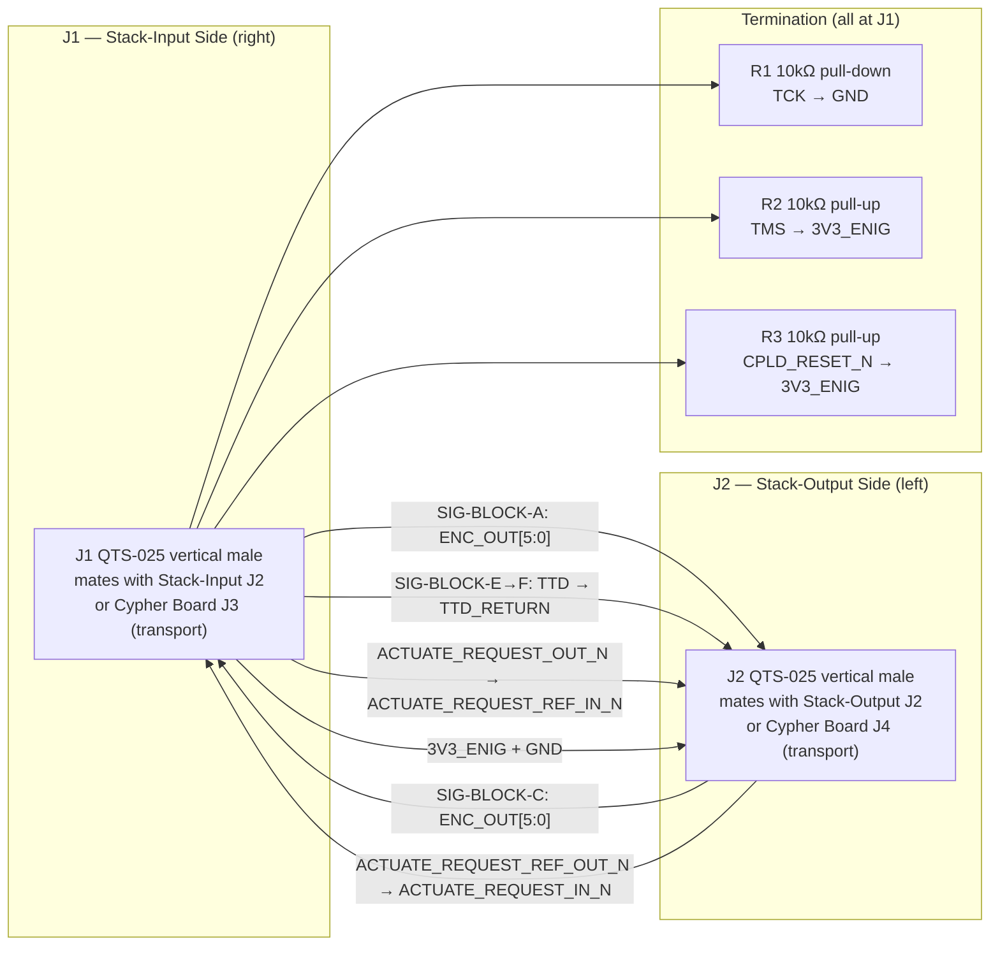

# Stack-Blanking Board (V1.0) Design Specification

**Status:** Draft
**Project:** Enigma-NG
**Author:** Izzyonstage & GitHub Copilot
**Version:** v.0.1.0
**Associated Hardware Revision:** Rev A
**Last Updated:** 2026-09-02

## 1. Overview

The Stack-Blanking Board is a passive signal-routing board that terminates the end of the Rotor
Mini-Stack chain. It fits on the rear face of the last Rotor Mini-Stack, mating with Stack-Input
Board J2 (rear stacking connector) and Stack-Output Board J2 (rear stacking connector).

| Responsibility | Description |
| :--- | :--- |
| **Signal bridging** | Routes SIG-BLOCK-A (ENC_DATA forward) → SIG-BLOCK-B (return), SIG-BLOCK-C (ENC reflector) → SIG-BLOCK-D (return), SIG-BLOCK-E (TTD outbound) → SIG-BLOCK-F (TTD_RETURN), and the two `ACTUATE_REQUEST` turnarounds (STA-chain → REF-chain, and REF-chain → STA-chain reverse) across the two connectors — per DEC-096 |
| **Chain termination** | Provides idle-state bias resistors only for the JTAG spoke signals that genuinely dead-end at this board: TCK, TMS, CPLD_RESET_N |
| **EMC shielding** | 4-layer board with GND pour on L1 (top) and L4 (bottom); all signal routing on inner layers L2/L3 |

The board carries two vertical male Samtec QTS-025 connectors, one on each side. In normal
operation J1 mates with Stack-Input Board J2 and J2 mates with Stack-Output Board J2. For
transport or bench testing without any Rotor Mini-Stacks fitted, J1 and J2 can be plugged
directly into Cypher Board J3 and J4 respectively to complete the signal loop.

> **Minimum system configuration:** At least 1 Rotor Mini-Stack is required during cipher
> operation. The direct Cypher Board connection is for transport and bench testing only.

### Functional Requirements

| ID | Functional Requirement | Notes | Satisfied By / Cross-Ref |
| :--- | :--- | :--- | :--- |
| FR-SBLK-01 | Terminate the Rotor Mini-Stack chain at the rear of the last mini-stack | J1 mates with Stack-Input J2; J2 mates with Stack-Output J2 | §4 Interconnects; BOM J1, J2 |
| FR-SBLK-02 | Bridge SIG-BLOCK-A to SIG-BLOCK-B — ENC data forward end-of-chain turnaround | ENC_OUT[5:0] from J1 (Stack-Input J2 OUT) routed to J2 ENC_IN[5:0] IN (Stack-Output J2) | §3 Signal Routing |
| FR-SBLK-03 | Bridge SIG-BLOCK-C to SIG-BLOCK-D — ENC reflector data return into last mini-stack | ENC_OUT[5:0] from J2 (Stack-Output J2 OUT) routed to J1 ENC_IN[5:0] IN (Stack-Input J2) | §3 Signal Routing |
| FR-SBLK-04 | Bridge SIG-BLOCK-E to SIG-BLOCK-F — rename TTD as TTD_RETURN at chain end | TTD from J1 (Stack-Input J2 OUT) routed to J2 TTD_RETURN ×2 IN (Stack-Output J2) | §3 Signal Routing |
| FR-SBLK-05 | Terminate JTAG spoke signals (TCK, TMS, CPLD_RESET_N) at end of chain | Idle-state bias resistors R1–R3; per existing JTAG design intent (DEC-016) | §3 Termination; BOM R1–R3 |
| FR-SBLK-06 | Bridge the STA-chain `ACTUATE_REQUEST_OUT_N` (arriving on J1) to the REF-chain `ACTUATE_REQUEST_REF_IN_N` (departing via J2) | First turnaround of the round-trip signal path (DEC-093 step 3); no local termination — the signal originates and terminates at the Cypher Board's own CPLD, not at this board | §3 Signal Routing; DEC-096 |
| FR-SBLK-07 | Bridge the REF-chain `ACTUATE_REQUEST_REF_OUT_N` (arriving on J2) to the STA-chain `ACTUATE_REQUEST_IN_N` (departing via J1, reverse direction) | Second turnaround of the round-trip signal path (DEC-093 step 6) | §3 Signal Routing; DEC-096 |
| FR-SBLK-08 | Leave 5V_MAIN (SIG-BLOCK-H) pins NC — no 5V_MAIN required on this board | SIG-BLOCK-H terminates at chain end | §3 Signal Routing |
| FR-SBLK-09 | Compatible with Cypher Board J3/J4 for transport and bench testing without mini-stacks | J1/J2 vertical male connectors mate with Cypher Board vertical female QSS-025 J3/J4 | §4 Interconnects |

### Design Requirements

| ID | Design Requirement | Specification | Satisfied By / Cross-Ref |
| :--- | :--- | :--- | :--- |
| DR-SBLK-01 | PCB stackup | 4-layer per `design/Standards/Global_Routing_Spec.md §2.3.1`; GND pour on L1 (top) and L4 (bottom) for shielding; signal routing on L2 and L3 only | §5 PCB Fabrication & Stackup |
| DR-SBLK-02 | Stack-Input mating connector (J1 — right side) | J1 = QTS-025-01-L-D-A-GP-K-TR (Samtec 50-contact vertical male SMT); same pinout as `Stack-Input/Board_Layout.md §1` (IC-STA-CHAIN, DEC-094); mates with Stack-Input J2 (QSS-025-01-L-D-RA-K right-angle female) in normal use, or Cypher Board J3 (QSS-025-01-L-D-A-GP-K vertical female) for transport | §4 Interconnects; BOM J1 |
| DR-SBLK-03 | Stack-Output mating connector (J2 — left side) | J2 = QTS-025-01-L-D-A-GP-K-TR (Samtec 50-contact vertical male SMT); same pinout as `Stack-Output/Board_Layout.md §1` (IC-REF-CHAIN, DEC-094); mates with Stack-Output J2 (QSS-025-01-L-D-RA-K right-angle female) in normal use, or Cypher Board J4 (QSS-025-01-L-D-A-GP-K vertical female) for transport | §4 Interconnects; BOM J2 |
| DR-SBLK-04 | Signal routing layers | All signal traces on L2 and L3 only; no signal traces on L1 or L4; GND pours on L1 and L4 must be uninterrupted except for pad fanout vias | §5 PCB Fabrication & Stackup |
| DR-SBLK-05 | Termination resistors | R1–R3: 10 kΩ 1% 0402; placed within 3mm of J1; R1 (TCK pull-down), R2 (TMS pull-up), R3 (CPLD_RESET_N pull-up) | §3 Termination; BOM R1–R3 |
| DR-SBLK-06 | 5V_MAIN NC | All 5V_MAIN contact positions on J1 and J2 are NC; no trace connection to 5V_MAIN | §3 Signal Routing |
| DR-SBLK-07 | 3V3_ENIG continuity | 3V3_ENIG and GND are connected between J1 and J2 (power continuity across the board); 3V3_ENIG also supplies pull-up resistors R2/R3 | §3 Signal Routing |
| DR-SBLK-08 | Mounting holes | MH1–MH4: M3 PTH (3.2mm drill) tied to GND_CHASSIS per GRS §4. No BOM entry. | §5 PCB Fabrication; GRS §4.3 |

### Component Block Diagram

## 2. Architecture

- **PCB:** 4-layer per `design/Standards/Global_Routing_Spec.md §2.3.1`. ENIG Gold.
  2.0mm filleted corners.
- **Assembly:** Single-sided; passive components only (3× 0402 resistors).
- **Manufacturer:** JLCPCB (standard 4-layer).

### GND_CHASSIS Single-Point Bond

Per GRS §5: local `GND_CHASSIS` net tied to mounting holes; no local GND to GND_CHASSIS bond.
System's only galvanic bond remains on the Power Module.

## 3. Signal Routing and Termination

### Bridged signals (J1 ↔ J2 routed traces on L2/L3)

| Signal(s) | Source at J1 | Destination at J2 | Signal Block transition |
| :--- | :--- | :--- | :--- |
| ENC_OUT[5:0] | In from Stack-Input J2 (SIG-BLOCK-A fwd) | Out to Stack-Output J2 ENC_IN[5:0] (SIG-BLOCK-B return start) | A → B |
| ENC_OUT[5:0] (reflector) | In from Stack-Output J2 (SIG-BLOCK-C) via J2 | Out to Stack-Input J2 ENC_IN[5:0] (SIG-BLOCK-D return start) | C → D |
| TTD | In from Stack-Input J2 (SIG-BLOCK-E end) | Out to Stack-Output J2 TTD_RETURN ×2 (SIG-BLOCK-F start) | E → F (renamed) |
| `ACTUATE_REQUEST_OUT_N` | In from Stack-Input J2 (STA-chain forward-pass terminus) | Out to Stack-Output J2 as `ACTUATE_REQUEST_REF_IN_N` (REF-chain start) | First turnaround (DEC-093 step 3) |
| `ACTUATE_REQUEST_REF_OUT_N` | In from Stack-Output J2 (REF-chain second-forward-pass terminus) | Out to Stack-Input J2 as `ACTUATE_REQUEST_IN_N` (STA-chain reverse start) | Second turnaround (DEC-093 step 6) |
| 3V3_ENIG, GND | J1 bottom power section | J2 bottom power section | SIG-BLOCK-I passthrough |

### Terminated signals (dead-end at this board — J1 only)

| RefDes | Signal | Termination | Rationale |
| :--- | :--- | :--- | :--- |
| R1 | TCK | 10 kΩ pull-down to GND | Prevents spurious clocking at JTAG spoke end |
| R2 | TMS | 10 kΩ pull-up to 3V3_ENIG | Holds JTAG TAP in Test-Logic-Reset at spoke end |
| R3 | CPLD_RESET_N | 10 kΩ pull-up to 3V3_ENIG | Holds CPLDs out of reset at chain end |

### NC signals

| Signal | Reason |
| :--- | :--- |
| 5V_MAIN (SIG-BLOCK-H) | No 5V_MAIN required; SIG-BLOCK-H terminates at chain end with all pins NC on both J1 and J2 |

## 4. Interconnects

### J1 — Stack-Input Mating Connector (QTS-025-01-L-D-A-GP-K-TR)

**Connector definition owner: `Stack-Input/Board_Layout.md §1`** (IC-STA-CHAIN, per DEC-094).
Same signal pinout as every Stack-Input `J1`/`J2`.

- **MPN:** QTS-025-01-L-D-A-GP-K-TR (Samtec 50-contact vertical male SMT)
- **Normal use:** mates with Stack-Input Board J2 (QSS-025-01-L-D-RA-K right-angle female)
- **Transport / bench:** mates with Cypher Board J3 (QSS-025-01-L-D-A-GP-K vertical female)
- **Fully 50-pin allocated per DEC-090/DEC-093** — see `Stack-Input/Board_Layout.md §1` for the
  full canonical pin map: ENC data + JTAG (TCK, TMS, TTD, CPLD_RESET_N terminating or bridging
  here), `3V3_ENIG`/`5V_MAIN` (NC), GND, `ACTUATE_REQUEST_OUT_N`/`ACTUATE_REQUEST_IN_N`
  (bridged to/from J2 — see §3 Signal Routing, not terminated).

> **Pinout:** see `Board_Layout.md §1`.

### J2 — Stack-Output Mating Connector (QTS-025-01-L-D-A-GP-K-TR)

**Connector definition owner: `Stack-Output/Board_Layout.md §1`** (IC-REF-CHAIN, per DEC-094).
Same signal pinout as every Stack-Output `J1`/`J2`.

- **MPN:** QTS-025-01-L-D-A-GP-K-TR (Samtec 50-contact vertical male SMT)
- **Normal use:** mates with Stack-Output Board J2 (QSS-025-01-L-D-RA-K right-angle female)
- **Transport / bench:** mates with Cypher Board J4 (QSS-025-01-L-D-A-GP-K vertical female)
- **Fully 50-pin allocated per DEC-092/DEC-093** — see `Stack-Output/Board_Layout.md §1` for the
  full canonical pin map: ENC data return + TTD_RETURN, `ACTUATE_REQUEST_REF_IN_N`/
  `ACTUATE_REQUEST_REF_OUT_N` (bridged to/from J1 — see §3 Signal Routing).
- **Bottom power region:** 3V3_ENIG + GND

> **Pinout:** see `Board_Layout.md §2`.

## 5. PCB Fabrication & Stackup

- **Stackup:** 4-layer per `design/Standards/Global_Routing_Spec.md §2.3.1`.

| Layer | Function | Notes |
| :--- | :--- | :--- |
| L1 (top) | GND pour — shielding | Continuous copper pour; no signal traces |
| L2 | Signal routing | All bridging traces and 3V3_ENIG distribution |
| L3 | Signal routing | Additional routing as required |
| L4 (bottom) | GND pour — shielding | Continuous copper pour; no signal traces |

- **Manufacturer:** JLCPCB. Single-sided assembly.
- **Fillets:** 2.0mm rounded PCB corners.
- **Mounting Holes:** MH1–MH4, M3 PTH (3.2mm drill), tied to GND_CHASSIS per GRS §4. No BOM entry.
- **Signal trace width:** JTAG and ENC data traces on L2/L3 routed at CI width per
  `design/Standards/Global_Routing_Spec.md §2.3.1`, targeting 50 Ohm controlled impedance.

## 6. Thermal & ESD

- **Thermal:** No active ICs. No thermal concerns.
- **ESD:** No ESD protection devices required. This board is not accessible during live mini-stack
  insertion or rotor swap — it is fitted once to the last mini-stack and not removed during
  normal operation. Per `design/Standards/Global_Routing_Spec.md §9`.

## 7. Branding & Traceability

- **Data Plate:** Per GRS §6 on Layer L4. Revision block:
  `ABSCHLUSSBLENDE [Stack-Blanking] V1.0`.
- **Connector Pin-1 Markers:** J1 and J2 silkscreen pin-1 markers required per GRS §7.1.

## 8. Bill of Materials

| RefDes | Specification | MPN | Manufacturer | DigiKey PN | Mouser PN | JLCPCB PN | Alt Supplier + PN | Notes | Footprint Available | Footprint Downloaded | Qty |
| --- | --- | --- | --- | --- | --- | --- | --- | --- | --- | --- | --- |
| J1, J2 | 50-contact vertical male SMT | QTS-025-01-L-D-A-GP-K-TR | Samtec | QTS-025-01-L-D-A-GP-K-TR-ND | 200-QTS02501LDAGPKTR | C5714677 | – | J1: mates with Stack-Input J2 or Cypher J3 (transport); J2: mates with Stack-Output J2 or Cypher J4 (transport) | ✔ | ✔ | 2 |
| R1 | 10kΩ 1% 0402 | ERJ-2RKF1002X | Panasonic | P10.0KLCT-ND | 667-ERJ-2RKF1002X | C191123 | – | TCK pull-down to GND — JTAG spoke end termination | ✔ | ✔ | 1 |
| R2, R3 | 10kΩ 1% 0402 | ERJ-2RKF1002X | Panasonic | P10.0KLCT-ND | 667-ERJ-2RKF1002X | C191123 | – | R2: TMS pull-up to 3V3_ENIG; R3: CPLD_RESET_N pull-up to 3V3_ENIG — JTAG spoke end termination | ✔ | ✔ | 2 |
