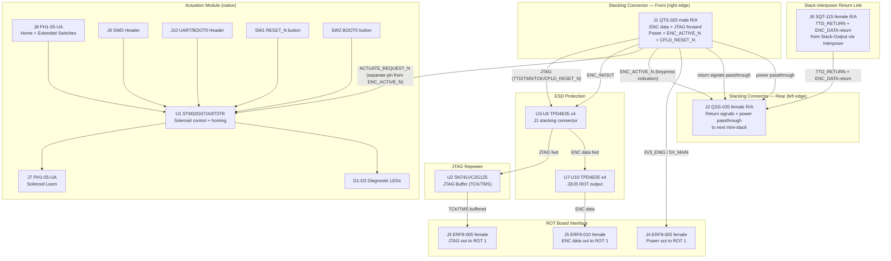

# Stack-Input Board (V1.0) Design Specification

**Status:** Draft
**Project:** Enigma-NG
**Author:** Izzyonstage & GitHub Copilot
**Version:** v.0.1.0
**Associated Hardware Revision:** Rev A
**Last Updated:** 2026-07-05

## 1. Overview

The Stack-Input Board is the input-side board of the Rotor Mini-Stack assembly. It fulfils the input-side responsibilities of the Extension Board and natively hosts
the Actuation Module circuitry as an on-board circuit (not a plug-in module).

| Circuit Responsibility | Board Role | Key Component |
| :--- | :--- | :--- |
| **Mini-Stack Cypher Input** | JTAG signal repeater; ENC data forward path; power distribution; rotor interface to first ROT board of mini-stack | U2 — SN74LVC2G125 JTAG buffer |
| **Solenoid Actuation (native)** | Solenoid actuation for rotor position stepping; one step per ACTUATE_REQUEST_N trigger | U1 — STM32G071K8T3TR |

The right edge (front face when viewed from the front of the mini-stack assembly) carries a keyed Samtec QTS-025 male right-angle connector (J1) that mates with the Cypher Board J3 or
the rear of the previous Rotor Mini-Stack (J2). The left edge (rear face) carries a matching QSS-025 female right-angle connector (J2) for chaining to the next mini-stack (J1) or Stack-Blanking Board.
ROT boards connect to J3–J5 (ERF8 female sockets) on the rotor-facing face. Return signals arrive from the Stack-Output Board via the Stack-Interposer Board at J6 (SQT-115 right-angle female).

### Functional Requirements

| ID | Functional Requirement | Notes | Satisfied By / Cross-Ref |
| :--- | :--- | :--- | :--- |
| FR-EXT-01 | Act as a JTAG signal repeater for the 5 ROT boards within the mini-stack | Restores TCK/TMS drive strength; one Stack-Input Board per mini-stack | §3 JTAG; BOM U2 (SN74LVC2G125DCUR) |
| FR-EXT-02 | Buffer TCK and TMS signals to compensate for capacitive loading of the 5-rotor chain | Dual-channel buffer preserves timing margins; 5x EPM570 loads per mini-stack | §3 JTAG; BOM U2, C11 |
| FR-EXT-03 | Pass 3V3_ENIG and 5V_MAIN power and ENC data forward into the mini-stack ROT chain | Power: J1 bottom power section → J4 (3V3_ENIG × 5 + GND × 5 to ROT 1); ENC data: J1 top → J5 | §5 Power; BOM J3–J5 |
| FR-EXT-04 | Connect on the input side to the Cypher Board or the previous Rotor Mini-Stack | J1 = QTS-025-01-L-D-RA-P male right-angle (front edge) | §6 Interconnects; BOM J1 |
| FR-EXT-05 | Connect on the output side to the first ROT board of this mini-stack | J3/J4/J5 = ERF8 female sockets | §6 Interconnects; BOM J3–J5 |
| FR-EXT-06 | Host Actuation Module circuitry natively to provide per-mini-stack rotor position stepping | AM circuits are native on-board (STM32G071 + solenoid loom); triggered by ACTUATE_REQUEST_N from J1 | §4 Actuation Module; BOM U1 |
| FR-EXT-07 | Protect stacking connector J1 and ROT-facing output connectors J3/J5 from ESD events | J1 and J3/J5 accessible during live mini-stack or rotor swap | §8 Thermal & ESD; BOM U3–U10 |
| FR-SIN-01 | Connect to the next Rotor Mini-Stack or Stack-Blanking Board via rear stacking connector | J2 = QSS-025-01-L-D-RA-K female right-angle (rear edge) | §6 Interconnects; BOM J2 |
| FR-SIN-02 | Receive return signals (TTD_RETURN + ENC_DATA return) from Stack-Output Board via Stack-Interposer | J6 = SQT-115-01-L-D-RA (30-pin right-angle female); Stack-Interposer Board connects J6 to Stack-Output Board | §6 Interconnects; BOM J6 |
| FR-SIN-03 | Receive ACTUATE_REQUEST_N from stacking connector and trigger native AM solenoid actuation | ACTUATE_REQUEST_N is a dedicated pin on J1 (separate from ENC_ACTIVE_N); Cypher Board initially ties this to GND so mini-stack 1 always actuates; subsequent mini-stacks receive ACTUATE_REQUEST_N from the last ROT carry mechanism via the previous mini-stack J2 | §4 Actuation Module; §6 Interconnects |
| FR-SIN-04 | Output ACTUATE_REQUEST_N on rear stacking connector J2 to trigger the next mini-stack | Signal sourced from last ROT board carry mechanism in this mini-stack; propagated to next mini-stack via J2; details TBD alongside ROT board carry signal definition | §6 Interconnects; BOM J2 |

### Design Requirements

| ID | Design Requirement | Specification | Satisfied By / Cross-Ref |
| :--- | :--- | :--- | :--- |
| DR-EXT-01 | PCB stackup | 4-layer standard per `design/Standards/Global_Routing_Spec.md §2.3.1` | §7 PCB Fabrication & Stackup |
| DR-EXT-02 | Front stacking connector (input side) | J1 = QTS-025-01-L-D-RA-P (Samtec 50-contact right-angle male SMT); top 26 contacts: ENC data + JTAG forward; bottom 24 contacts: 3V3_ENIG, 5V_MAIN, GND, ENC_ACTIVE_N, CPLD_RESET_N, ACTUATE_REQUEST_N; full allocation pending `merge-cypher-board-j3j6-pinouts` | §6 Interconnects; BOM J1 |
| DR-EXT-03 | ROT output connectors | J3 = ERF8-005 (JTAG out), J4 = ERF8-005 (Power out), J5 = ERF8-010 (ENC data out); receive first ROT board J1/J2/J3 ERM8 inputs | §6 Interconnects; BOM J3–J5 |
| DR-EXT-04 | JTAG buffer | U2 = SN74LVC2G125DCUR (dual-channel; TCK and TMS only; TDI passes unbuffered) | §3 JTAG; BOM U2 |
| DR-EXT-05 | Buffer output pin assignment | TCK → J3 pin 2; TMS → J3 pin 4 (per DEC-018 rotor pinout) | §3 JTAG; DEC-018 |
| DR-EXT-06 | Buffer bypass capacitor | C11 = 100nF 0402 X7R; placement per GRS §3.2 | §7 PCB Fabrication; BOM C11 |
| DR-EXT-07 | System quantity | 1 per Rotor Mini-Stack; up to 6 per system (30 rotor positions total) | §1 Overview |
| DR-EXT-11 | 5V_MAIN entry decoupling bank | C6–C10 (5x 10µF X7R 50V 1206) at 5V_MAIN entry (J1 bottom power pins) per GRS §3 star/spoke pattern | §5 Power; BOM C6–C10 |
| DR-EXT-12 | ESD protection — stacking connector J1 | U3 (JTAG: TTD, TMS, TCK, CPLD_RESET_N) + U4–U6 (ENC: ENC_IN[5:0] + ENC_OUT[5:0]); within 3mm of J1 mating edge per DEC-048 | §8 Thermal & ESD; BOM U3–U6 |
| DR-EXT-12 | ESD protection — ROT output connectors J3/J5 | U7 (JTAG: J3) + U8–U10 (ENC: J5); within 3mm of connector mating edge per DEC-048 | §8 Thermal & ESD; BOM U7–U10 |
| DR-EXT-13 | 3V3_ENIG entry decoupling bank | C1–C5 (5x 10µF X7R 50V 1206) at 3V3_ENIG entry (J1 bottom power pins) per GRS §3 | §5 Power; BOM C1–C5 |
| DR-EXT-14 | Mounting holes | MH1–MH4: M3 PTH (3.2mm drill) tied to GND_CHASSIS per GRS §4; placement per GRS §4.3 Pattern B. No BOM entry. | §7 PCB Fabrication; GRS §4.3 |
| DR-SIN-01 | Rear stacking connector (output/chain side) | J2 = QSS-025-01-L-D-RA-K (Samtec 50-contact right-angle female SMT); mirrors J1 signal set with I/O inverted; bottom 24 contacts include ACTUATE_REQUEST_N output (from last ROT carry) and power passthrough; full allocation pending `merge-cypher-board-j3j6-pinouts` | §6 Interconnects; BOM J2 |
| DR-SIN-02 | Stack-Interposer return link connector | J6 = SQT-115-01-L-D-RA (Samtec 30-pin 2×15 right-angle female shrouded); receives TTD_RETURN + ENC_DATA return from Stack-Output Board via Stack-Interposer Board; pinout TBD at Stack-Interposer Board spec | §6 Interconnects; BOM J6 |
| DR-SIN-03 | Native Actuation Module MCU | U1 = STM32G071K8T3TR LQFP-32; same circuit as former standalone Actuation Module; firmware updated for solenoid drive and dual homing switches | §4 Actuation Module; BOM U1 |
| DR-SIN-04 | Solenoid loom header | J7 = PH1-05-UA 1x5 2.54mm THT; pins 1-3 active (5V_MAIN, GND, SOLENOID_DRIVE); solenoid driver circuit details TBD (future discussion merge) | §4 Actuation Module; BOM J7 |
| DR-SIN-05 | Homing switch loom header — dual switch | J8 = PH1-05-UA 1x5 2.54mm THT; pin 1 = ACTUATION_HOME_N (retracted position), pin 2 = GND; pin 3 = ACTUATION_EXTENDED_N (fully-extended position), pin 4 = GND; solenoid has two detectable positions | §4 Actuation Module; BOM J8 |
| DR-SIN-06 | SWD service header | J9 = PH1-05-UA 1x5 2.54mm THT; VTref, SWCLK, GND, SWDIO, RESET_N | §4 Actuation Module; BOM J9 |
| DR-SIN-07 | UART bootloader header | J10 = PH1-05-UA 1x5 2.54mm THT; GND, 3V3, TX, RX, BOOT0 | §4 Actuation Module; BOM J10 |

### Component Block Diagram

## 2. Architecture

- **PCB:** 4-layer standard per `design/Standards/Global_Routing_Spec.md §2.3.1`. ENIG Gold.
  2.0mm filleted corners.
- **Assembly:** Single-sided where layout permits; dual-sided if native AM circuit density requires.
  Final determination at PCB layout phase.
- **Manufacturer:** JLCPCB (standard 4-layer; no special manufacturing constraints).

### GND_CHASSIS Single-Point Bond

Per GRS §5: local `GND_CHASSIS` net tied to mounting holes and enclosure-contact features; no
local GND to GND_CHASSIS bond. System's only galvanic bond remains on the Power Module.

## 3. JTAG Signal Repeater

The Stack-Input Board re-buffers TCK and TMS for the 5 ROT boards within its mini-stack. This
is the same function as the Extension Board U1 buffer, now serving the intra-stack ROT chain
rather than an inter-group chain.

- **Buffer IC:** SN74LVC2G125DCUR (U2, VSSOP-8). Dual-channel; TCK and TMS only. TDI passes
  unbuffered board-to-board throughout the ROT stack. OE# pins permanently tied to GND
  (always enabled — outputs active whenever board is powered; power-up transient at 10 MHz
  TCK with EPM570T input clamping is a known accepted design decision).
- **Load analysis:** 5 ROT boards x EPM570T100I5N input capacitance (~6pF) + connector
  capacitance ~= 30–40pF; well within timing margins at 10 MHz TCK.
- **TTD_RETURN:** Passes via J6 (Stack-Interposer return) → J2 (rear stacking connector); not
  buffered. End-of-chain damping at Cypher Board R50 (22 Ohm).
- **CPLD_RESET_N:** Received via J1 (stacking connector); broadcast to all 5 ROT CPLDs via J3.
- **JTAG trace width:** All JTAG traces on L1 shall be routed at the CI width per
  `design/Standards/Global_Routing_Spec.md §2.3.1`, targeting 50 Ohm controlled impedance.
  See `design/Electronics/JTAG_Module/JTAG_Integrity.md` and DEC-016.

## 4. Actuation Module (Native)

The Actuation Module circuits are hosted natively on the Stack-Input Board. Each mini-stack has one independent AM circuit set.

The actuator type has changed from servo to **solenoid**. The solenoid has two detectable positions — retracted (home) and fully-extended — each monitored by a dedicated homing switch.
Full solenoid driver circuit details (MOSFET or relay topology, current ratings) are TBD and will be defined in a future design discussion merge.
From the STM32G071 perspective the drive output (SOLENOID_DRIVE) is a digital GPIO (or PWM if hold-current control is adopted).

### Signal Source — ACTUATE_REQUEST_N

**ACTUATE_REQUEST_N is a dedicated pin on the stacking connector, separate from ENC_ACTIVE_N.**

| Signal | Source on J1 (front, in) | Propagated on J2 (rear, out) |
| :--- | :--- | :--- |
| ENC_ACTIVE_N | Keypress indication from ENC module via Cypher Board | Passed through to next mini-stack; this signal is ANDed with ACTUATE_REQUEST_N to ensure the Actuation Request only triggers when a button is depressed |
| ACTUATE_REQUEST_N | From Cypher Board (initially tied to GND = always request mini-stack 1 actuation); for mini-stack 2+ sourced from last ROT carry mechanism in the previous mini-stack | Sourced from last ROT carry mechanism in this mini-stack; triggers next mini-stack actuation |

> **ACTUATE_REQUEST_N contact allocation:** The full 50-contact assignment for J1/J2 is pending
> (see todo `merge-cypher-board-j3j6-pinouts`). ACTUATE_REQUEST_N will be assigned one of the
> 4 remaining undefined contacts on the QTS/QSS-025.

### STM32G071K8T3TR (U1)

Implements the actuation control state machine: power-up homing, ACTUATE_REQUEST_N latching, one-shot solenoid cycle, dual position switch monitoring, and LED diagnostics. Key parameters:

- **FR-AM-02:** `ACTUATE_REQUEST_N` received on J1 front stacking connector (the primary power and signal interface for this board, equivalent in role to the former AM host dock).
- **FR-AM-05:** Drives one external **solenoid** (not servo) via loom connector J7. SOLENOID_DRIVE is a STM32G071 GPIO output;
  a driver circuit (MOSFET or relay) between J7 pin 3 and the solenoid coil is required — driver topology TBD in a future design merge.
- **FR-AM-06:** Monitors **two** position switches via loom connector J8: `ACTUATION_HOME_N` (retracted, active-low) and `ACTUATION_EXTENDED_N` (fully-extended, active-low).
  Both use 10kΩ pull-up (R4, R6) to 3V3_ENIG and 1µF RC debounce (C12, C19; RC time constant ~10ms each).
- **FR-AM-08/FR-AM-09:** SWD (J9) and UART/BOOT0 (J10) service headers retained for firmware loading and bench-service access.
- **DR-AM-18:** `ACTUATE_REQUEST_N` idle-HIGH bias provided by STM32G071 internal GPIO pull-up (PUPDR = 0b01); no external pull-up required.
- **DR-AM-19:** LQFP-32 has a single combined VDD/VDDA pin (pin 4); C13, C14, C18 all target pin 4.

Firmware specification: see `design/Software/Actuation_Module/Design_Spec.md`.

### J7 — Solenoid Loom (PH1-05-UA)

Part: Adam Tech PH1-05-UA — 1×5 2.54mm male pin header, manually fitted post-PCBA.
SOLENOID_DRIVE is a STM32G071 GPIO output; a driver circuit (MOSFET or relay) between the
SOLENOID_DRIVE pin and the solenoid coil is required — driver topology TBD in a future design
discussion merge.

> **Pinout:** see `Board_Layout.md §5`.

### J8 — Position Switch Loom — Dual (PH1-05-UA)

Part: Adam Tech PH1-05-UA — 1×5 2.54mm male pin header, manually fitted post-PCBA.
ACTUATION_HOME_N: 10kΩ pull-up (R4) to 3V3_ENIG; 1µF C12 debounce (~10ms RC time constant).
ACTUATION_EXTENDED_N: 10kΩ pull-up (R6) to 3V3_ENIG; 1µF C19 debounce (same RC time constant).
Both switch signals use twisted-pair wiring (signal + GND return) for noise immunity.

> **Pinout:** see `Board_Layout.md §6`.

### J9 — SWD Header (PH1-05-UA)

Part: Adam Tech PH1-05-UA — 1×5 2.54mm male pin header, manually fitted. Common compact 5-pin
SWD flying-lead order; compatible with ST-LINK, J-Link, and similar SWD probes.

> **Pinout:** see `Board_Layout.md §7`.

### J10 — UART / BOOT0 Header (PH1-05-UA)

Part: Adam Tech PH1-05-UA — 1×5 2.54mm male pin header, manually fitted. BOOT0 pin is shared
with SW2 and connects to the STM32 BOOT0 pin via R5 (10kΩ series). STM32G071 internal
pull-down on PA14 (datasheet footnote 6) holds BOOT0 LOW when SW2 is open — no external
pull-down required.

ROM bootloader entry sequence: hold SW2 → press and release SW1 → release SW2.

> **Pinout:** see `Board_Layout.md §8`.

### SW1 — Local RESET_N Button (B3F-1070)

Omron B3F-1070 SPST NO tactile THT. Pulls RESET_N LOW momentarily.
C17 (100nF X7R 0402) on STM32 NRST pin to GND per STM32G071 datasheet Figure 23.

### SW2 — Local BOOT0 Button (B3F-1070)

Omron B3F-1070 SPST NO tactile THT. Asserts BOOT0 HIGH via R5 (10kΩ) while pressed.
Use with SW1 for ROM bootloader entry (see J10 above).

### D1–D3 — Diagnostic LEDs (150060VS75000)

Wurth 150060VS75000 green SMD 0603. Current-limit resistors R1–R3 = 330Ω 0402.
Placed at visible board edge for service observation.

| Ref | Function |
| :--- | :--- |
| D1 | PWR — board powered |
| D2 | HOMED — home/retracted position confirmed |
| D3 | ACT — actuation cycle in progress |

## 5. Power

- **Power entry:** 3V3_ENIG and 5V_MAIN received on J1 (front stacking connector, bottom power
  section). Both rails are distributed from this single entry point.
- **ROT chain power:** J4 carries 3V3_ENIG (×5 pins) and GND (×5 pins) to ROT 1, sourced from
  J1 bottom power section. J4 is the sole power distribution path to the ROT chain.
- **3V3_ENIG decoupling bank:** C1–C5 (5x 10µF X7R 50V 1206) at J1 3V3_ENIG entry; star/spoke topology per GRS §3.
- **5V_MAIN decoupling bank:** C6–C10 (5x 10µF X7R 50V 1206) at J1 5V_MAIN entry; star/spoke topology per GRS §3.
- **Power passthrough:** Both 3V3_ENIG and 5V_MAIN pass through to J2 (rear stacking connector, bottom power section) for the next mini-stack or Stack-Blanking Board.
- **AM local decoupling:** C12 (1µF X7R RC debounce for ACTUATION_HOME_N), C19 (1µF X7R RC
  debounce for ACTUATION_EXTENDED_N), C13–C14, C18 (100nF STM32 VDD/VDDA decoupling), C15
  (4.7µF 3V3_ENIG reservoir), C16 (10µF 5V_MAIN solenoid reservoir near J7), C17 (100nF
  RESET_N filter) — per DR-AM-15.

## 6. Interconnects

### J1 — Front Stacking Connector (QTS-025-01-L-D-RA-P)

**Connector definition owner: Cypher Board `Board_Layout.md §2`.**
Mates with Cypher Board J3 (first mini-stack) or previous mini-stack J2 (subsequent stacks).

- **MPN:** QTS-025-01-L-D-RA-P (Samtec 50-contact 0.635mm right-angle male SMT)
- **Top 26 contacts (ENC data + JTAG forward):** ENC_IN[5:0], ENC_OUT[5:0], TMS, TCK,
  TTD (TDI forward), CPLD_RESET_N, GND interleave — see `Cypher/Board_Layout.md §2`
- **Bottom 24 contacts (power + control):** 3V3_ENIG, 5V_MAIN, GND, ENC_ACTIVE_N,
  CPLD_RESET_N, ACTUATE_REQUEST_N (in) — full allocation pending `merge-cypher-board-j3j6-pinouts`

> **Pinout:** see `Board_Layout.md §1`.

### J2 — Rear Stacking Connector (QSS-025-01-L-D-RA-K)

**Connector definition owner: this board.** Mates with next mini-stack J1 (front stacking
male) or Stack-Blanking Board male connector.

- **MPN:** QSS-025-01-L-D-RA-K (Samtec 50-contact 0.635mm right-angle female SMT)
- **Top 26 contacts:** same signal set as J1 top region with I/O directions inverted (chain-through)
- **Bottom 24 contacts:** power passthrough (3V3_ENIG, 5V_MAIN, GND), ENC_ACTIVE_N passthrough,
  CPLD_RESET_N passthrough, ACTUATE_REQUEST_N (out, from last ROT carry mechanism) — full
  allocation pending `merge-cypher-board-j3j6-pinouts`

> **Pinout:** see `Board_Layout.md §2`.

### J3 / J4 / J5 — ROT Board Output Connectors

Mates with first ROT board in the mini-stack (ROT board J1/J2/J3 ERM8 male inputs).

> **Connector Definition Owner:** `Rotor/Design_Spec.md §3.4`.

| Ref | Type | Signal Group | MPN |
| :--- | :--- | :--- | :--- |
| J3 | ERF8-005 (10-pin, female) | JTAG (TCK, TMS, TTD, CPLD_RESET_N + GND) | ERF8-005-05.0-S-DV-K-TR |
| J4 | ERF8-005 (10-pin, female) | Power (3V3_ENIG x5, GND x5) — J1 power NC on board | ERF8-005-05.0-S-DV-K-TR |
| J5 | ERF8-010 (20-pin, female) | ENC data (ENC_IN[5:0], ENC_OUT[5:0] + GND interleave) | ERF8-010-05.0-S-DV-K-TR |

J4 carries 3V3_ENIG (×5 pins) and GND (×5 pins) to ROT 1, sourced from the J1 bottom power
section. J4 is the sole 3V3_ENIG distribution path from this board to the ROT chain.

### J6 — Stack-Interposer Return Link (SQT-115-01-L-D-RA)

> **Connector Definition Owner:** `Stack-Interposer/Board_Layout.md`.

Right-angle female shrouded 30-pin (2×15) connector on the bottom edge. Connects to the
Stack-Interposer Board which bridges this connector to the matching return connector on the
Stack-Output Board.

- **MPN:** SQT-115-01-L-D-RA (Samtec 30-position right-angle female shrouded SMT)
- **Signals carried:** TTD_RETURN (last ROT TDO) + ENC_DATA return (6-bit bus)
- **Mating male header on Interposer Board:** 2BHR-30-VUA (Adam Tech 30-pin 2×15 shrouded THT)
- **Pinout:** TBD — to be defined alongside `Stack-Interposer/Board_Layout.md`.

### J7–J10 — Service / Loom Headers

See §4 Actuation Module for full pin-by-pin detail of J7–J10.

## 7. PCB Fabrication & Stackup

- **Stackup:** 4-layer standard per `design/Standards/Global_Routing_Spec.md §2.3.1`.
- **Manufacturer:** JLCPCB. Assembly: single-sided (Spec-B) if layout permits; dual-sided if
  AM circuit density requires placement on both faces.
- **Fillets:** 2.0mm rounded PCB corners.
- **Mounting Holes:** MH1–MH4, M3 PTH (3.2mm drill), tied to GND_CHASSIS per GRS §4. No BOM entry.
- **Decoupling:** per `design/Standards/Global_Routing_Spec.md §3`.

## 8. Thermal & ESD

- **Thermal:** No active cooling required. U2 (SN74LVC2G125) dissipates < 10mW.
  U1 (STM32G071) dissipates well below 100mW. No heatsinking required.
- **ESD — J1 stacking connector (TVS required):**
  J1 is accessible during live mini-stack insertion/removal. Per DEC-045 and DEC-048:
  - **U3:** 1x TPD4E05U06QDQARQ1 — channels: TTD, TMS, TCK, CPLD_RESET_N (JTAG group)
  - **U4:** 1x TPD4E05U06QDQARQ1 — channels: ENC_IN[0–3]
  - **U5:** 1x TPD4E05U06QDQARQ1 — channels: ENC_IN[4–5] + ENC_OUT[0–1]
  - **U6:** 1x TPD4E05U06QDQARQ1 — channels: ENC_OUT[2–5]
  All U3–U6 placed within 3mm of J1 mating edge on L1.
- **ESD — J3/J5 ROT output connectors (TVS required):**
  J3 (JTAG) and J5 (ENC) are accessible during live ROT board swap. Per DEC-045 and DEC-048:
  - **U7:** 1x TPD4E05U06QDQARQ1 — channels: TTD, TMS, TCK, CPLD_RESET_N (J3 JTAG group)
  - **U8:** 1x TPD4E05U06QDQARQ1 — channels: ENC_IN[0–3] (J5 ENC group)
  - **U9:** 1x TPD4E05U06QDQARQ1 — channels: ENC_IN[4–5] + ENC_OUT[0–1]
  - **U10:** 1x TPD4E05U06QDQARQ1 — channels: ENC_OUT[2–5]
  All U7–U10 placed within 3mm of their respective connector mating edge on L1.
- **Working voltage note:** TPD4E05U06QDQARQ1 max continuous working voltage = 5.5V. On
  3V3_ENIG (max 3.465V), all U3–U10 within rated limits with >= 2.0V margin.
- **ESD — all other connectors (no TVS required):**
  J2 (rear stacking — chain side, not live-swap); J4 (power only, no signal); J6 (interposer,
  internal rigid assembly); J7–J10 (loom/service headers, not live-accessed).
  Per `design/Standards/Global_Routing_Spec.md §9`.

## 9. Branding & Traceability

- **Data Plate:** Per GRS §6 on Layer L4. Revision block: `STAPELEINGANG [Stack-Input] V1.0`.
- **Connector Pin-1 Markers:** J1–J10 silkscreen pin-1 markers required per GRS §7.1.
- **ERM8/ERF8 labelling:** 0.8mm pitch is physically incompatible with 2.54mm connectors;
  label distinctly on silkscreen.

## 10. Bill of Materials

| RefDes | Specification | MPN | Manufacturer | DigiKey PN | Mouser PN | JLCPCB PN | Alt Supplier + PN | Notes | Footprint Available | Footprint Downloaded | Qty |
| --- | --- | --- | --- | --- | --- | --- | --- | --- | --- | --- | --- |
| C1-C5 | 10µF X7R 50V 1206 | CL31B106KBK6PJE | Samsung | 1276-CL31B106KBK6PJECT-ND | 187-CL31B106KBK6PJE | C43935922 | – | 3V3_ENIG entry decoupling bank at J1 (from EXT C1-C5) | ✔ | ✔ | 5 |
| C6-C10 | 10µF X7R 50V 1206 | CL31B106KBK6PJE | Samsung | 1276-CL31B106KBK6PJECT-ND | 187-CL31B106KBK6PJE | C43935922 | – | 5V_MAIN entry decoupling bank at J1 (from EXT C7-C11) | ✔ | ✔ | 5 |
| C11 | 100nF X7R 50V 0402 | CL05B104KB5NNNC | Samsung | 1276-CL05B104KB5NNNCCT-ND | 187-CL05B104KB5NNNC | C960916 | - | U2 JTAG buffer bypass (from EXT C6) | ✔ | ✔ | 1 |
| C12, C19 | 1µF X7R 50V 0805 | C0805C105K5RACTU | Kemet | 399-C0805C105K5RACTUCT-ND | 80-C0805C105K5R | C3018567 | - | ACTUATION_HOME_N debounce (C12) + ACTUATION_EXTENDED_N debounce (C19); one per homing switch (from AM C1) | ✔ | ✔ | 2 |
| C13, C14, C18 | 100nF X7R 50V 0402 | CL05B104KB5NNNC | Samsung | 1276-CL05B104KB5NNNCCT-ND | 187-CL05B104KB5NNNC | C960916 | - | STM32 VDD/VDDA decoupling + RESET_N filter (from AM C2, C3, C7; C17 = RESET_N filter) | ✔ | ✔ | 3 |
| C15 | 4.7µF X7R 50V 1210 | CGA6P3X7R1H475K250AD | TDK | 445-10040-1-ND | 810-CGA6P3X7R1H475KD | C3877549 | - | 3V3_ENIG local reservoir (from AM C4) | ✔ | ✔ | 1 |
| C16 | 10µF X7R 50V 1206 | CL31B106KBK6PJE | Samsung | 1276-CL31B106KBK6PJECT-ND | 187-CL31B106KBK6PJE | C43935922 | – | 5V_MAIN solenoid reservoir near J7 (from AM C5) | ✔ | ✔ | 1 |
| C17 | 100nF X7R 50V 0402 | CL05B104KB5NNNC | Samsung | 1276-CL05B104KB5NNNCCT-ND | 187-CL05B104KB5NNNC | C960916 | - | RESET_N filter cap (from AM C6) | ✔ | ✔ | 1 |
| D1-D3 | Green SMD LED diagnostic 0603 | 150060VS75000 | Wurth Elektronik | 732-4980-1-ND | 710-150060VS75000 | C6848499 | - | PWR, HOMED, ACT indicators (from AM D1-D3) | ✔ | ✔ | 3 |
| J1 | 50-contact 0.635mm right-angle male SMT | QTS-025-01-L-D-RA-P | Samtec | QTS-025-01-L-D-RA-P-ND | 200-QTS02501LDRAP | C7267889 | - | Front stacking connector (mates with Cypher J3 or prev mini-stack J2) | ✔ | ✔ | 1 |
| J2 | 50-contact 0.635mm right-angle female SMT | QSS-025-01-L-D-RA-K | Samtec | QSS-025-01-L-D-RA-K-ND | 200-QSS02501LDRAK | C6156774 | - | Rear stacking connector (mates with next mini-stack J1 or blanking board) | ✔ | ✔ | 1 |
| J3, J4 | 10-pin 2x5 0.8mm female SMT | ERF8-005-05.0-S-DV-K-TR | Samtec | SAM13517CT-ND | 200-ERF8005050SDVKTR | C7273978 | - | ROT 1 JTAG (J3) and Power (J4) output sockets | ✔ | ✔ | 2 |
| J5 | 20-pin 2x10 0.8mm female SMT | ERF8-010-05.0-S-DV-K-TR | Samtec | SAM8618CT-ND | 200-ERF8010050SDVKTR | C3646170 | - | ROT 1 ENC data output socket | ✔ | ✔ | 1 |
| J6 | 30-position 2x15 right-angle female shrouded SMT | SQT-115-01-L-D-RA | Samtec | SAM1246-15-ND | 200-SQT11501LDRA | C7318577 | - | Stack-Interposer return link (TTD_RETURN + ENC_DATA return from Stack-Output) | ✔ | ✔ | 1 |
| J7-J10 | 1x5 2.54mm male THT | PH1-05-UA | Adam Tech | 2057-PH1-05-UA-ND | 737-PH1-05-UA | C5374051 | - | Solenoid loom (J7), dual homing switches (J8), SWD (J9), UART (J10); manually fitted | ✔ | ✔ | 4 |
| R1-R3 | 330Ω 1% 0402 | ERJ-2RKF3300X | Panasonic | P330LCT-ND | 667-ERJ-2RKF3300X | C278592 | - | LED current-limit resistors (from AM R1-R3) | ✔ | ✔ | 3 |
| R4-R6 | 10kΩ 1% 0402 | ERJ-2RKF1002X | Panasonic | P10.0KLCT-ND | 667-ERJ-2RKF1002X | C191123 | - | R4: ACTUATION_HOME_N pull-up; R5: BOOT0 series protection; R6: ACTUATION_EXTENDED_N pull-up | ✔ | ✔ | 3 |
| SW1, SW2 | SPST NO tactile THT | B3F-1070 | Omron | SW406-ND | 653-B3F-1070 | C726011 | - | RESET_N (SW1) and BOOT0 (SW2) buttons (from AM SW1, SW2) | ✔ | ✔ | 2 |
| U1 | STM32 MCU LQFP-32 | STM32G071K8T3TR | STMicroelectronics | 497-STM32G071K8T3TR-ND | 511-STM32G071K8T3TR | - | Global sourcing | Native AM solenoid controller; JLCPCB consignment only (from AM U1) | ✔ | ✔ | 1 |
| U2 | Dual 3-state buffer VSSOP-8 | SN74LVC2G125DCUR | Texas Instruments | 296-SN74LVC2G125DCURCT-ND | 595-SN74LVC2G125DCUR | C21404 | - | JTAG TCK/TMS buffer (from EXT U1) | ✔ | ✔ | 1 |
| U3-U10 | 4-ch bidirectional ESD array USON-10 | TPD4E05U06QDQARQ1 | Texas Instruments | 296-40696-1-ND | 595-PD4E05U06QDQARQ1 | C81353 | - | ESD protection: U3-U6 on J1, U7-U10 on J3/J5 (from EXT U2-U9) | ✔ | ✔ | 8 |
