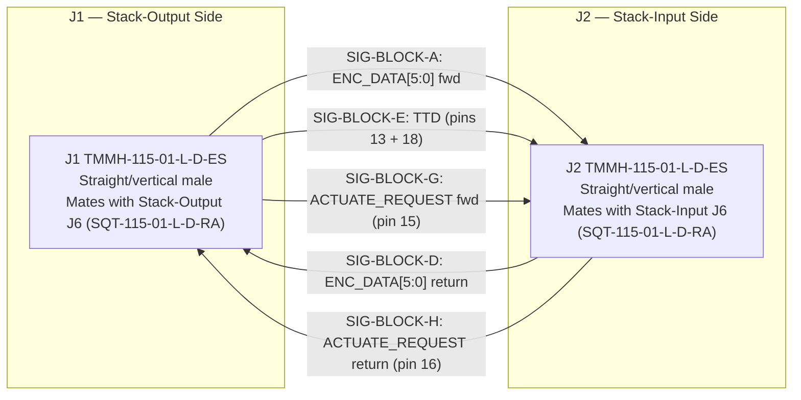

# Stack-Interposer Board (V1.0) Design Specification

**Status:** Draft
**Project:** Enigma-NG
**Author:** Izzyonstage & GitHub Copilot
**Version:** v.0.1.0
**Associated Hardware Revision:** Rev A
**Last Updated:** 2026-09-02

## 1. Overview

The Stack-Interposer Board is a passive rigid bridge board that sits horizontally at the base of
each Rotor Mini-Stack. It mechanically and electrically connects the bottom edge of the
Stack-Output Board (J6) to the bottom edge of the Stack-Input Board (J6), completing the
intra-stack signal return path without requiring a flexible ribbon cable.

| Responsibility | Description |
| :--- | :--- |
| **Signal bridge** | Routes SIG-BLOCK-A (ENC_DATA[5:0] forward), SIG-BLOCK-D (ENC_DATA[5:0] return direction), SIG-BLOCK-E (TTD), and SIG-BLOCK-G/H (ACTUATE_REQUEST forward/return, per DEC-093) between the Stack-Output Board and the Stack-Input Board via passive pin-to-pin trace connections |
| **GND shielding** | Interleaved GND contacts on both connectors isolate every signal line; GND pours on L1 and L4 provide plane-level EMI shielding |
| **Mechanical rigidity** | Rigid PCB-to-PCB join stiffens the mini-stack base, making the mini-stack assembly self-supporting without a flexible ribbon cable |

The board carries two straight/vertical 30-contact 2×15 connectors on its top surface: J1 mates
with Stack-Output Board J6 (bottom edge) and J2 mates with Stack-Input Board J6 (bottom edge).
Stack-Output and Stack-Input carry right-angle connectors on their bottom edges; the Stack-Interposer
uses straight (vertical) connectors since it lies horizontal at the base with the two vertical boards
rising on either side.

> **System configuration:** One Stack-Interposer Board is required per Rotor Mini-Stack (up to 6
> per system — 30 rotor positions total). The board has no function in isolation.

### Functional Requirements

| ID | Functional Requirement | Notes | Satisfied By / Cross-Ref |
| :--- | :--- | :--- | :--- |
| FR-SINT-01 | Provide a rigid mechanical and electrical bridge between the Stack-Output Board J6 (bottom edge) and the Stack-Input Board J6 (bottom edge) within each Rotor Mini-Stack | Replaces flexible ribbon cable; mechanically stiffens the mini-stack base | §4 Interconnects; BOM J1, J2 |
| FR-SINT-02 | Route SIG-BLOCK-A (ENC_DATA[5:0] forward) from Stack-Output Board J6 to Stack-Input Board J6 as a passive pin-to-pin connection | Forward-direction ENC data from last ROT board output; passed to Stack-Input for onward chain or blanking board handoff | §3 Signal Routing; BOM J1, J2 |
| FR-SINT-03 | Route SIG-BLOCK-D (ENC_DATA[5:0] return direction) from Stack-Input Board J6 to Stack-Output Board J6 as a passive pin-to-pin connection | Return-direction ENC data (post-reflector) entering Stack-Output ROT chain for left-to-right return traversal | §3 Signal Routing; BOM J1, J2 |
| FR-SINT-04 | Route SIG-BLOCK-E (TTD) from Stack-Output Board J6 to Stack-Input Board J6 as a passive pin-to-pin connection | Last ROT board TDO output; forwarded to Stack-Input for onward JTAG chain or blanking board handoff; TTD carried on two pins (13 and 18) with guard GND between | §3 Signal Routing; Board_Layout.md §3 |
| FR-SINT-05 | Provide interleaved GND contacts between all signal pairs on both connectors per the 2×15 pin map | One GND contact adjacent to each signal line; single guard GND remaining at SIG-BLOCK-E/G/H centre (pin 17) after DEC-093 | §3 Signal Routing; Board_Layout.md §3 |
| FR-SINT-06 | Route SIG-BLOCK-G (ACTUATE_REQUEST forward) from Stack-Output Board J6 to Stack-Input Board J6 as a passive pin-to-pin connection | Actuation-trigger forward pass, collected from this mini-stack's own Rotor chain via Stack-Output; forwarded to Stack-Input's rear connector | §3 Signal Routing; BOM J1, J2 |
| FR-SINT-07 | Route SIG-BLOCK-H (ACTUATE_REQUEST return) from Stack-Input Board J6 to Stack-Output Board J6 as a passive pin-to-pin connection | Actuation-trigger return pass, received on Stack-Input's rear connector; routed back through this mini-stack's Rotor chain via Stack-Output in reverse | §3 Signal Routing; BOM J1, J2 |

### Design Requirements

| ID | Design Requirement | Specification | Satisfied By / Cross-Ref |
| :--- | :--- | :--- | :--- |
| DR-SINT-01 | PCB stackup | 4-layer per `design/Standards/Global_Routing_Spec.md §2.3.1`; GND pour on L1 (top) and L4 (bottom) for EMI shielding; all signal routing on L2 and L3 only | §5 PCB Fabrication & Stackup |
| DR-SINT-02 | J1 — Stack-Output side mating connector | J1 = TMMH-115-01-L-D-ES (Samtec 30-position 2×15 straight/vertical male); mates with Stack-Output Board J6 (SQT-115-01-L-D-RA right-angle female) on the Stack-Output bottom edge; pin map defined in `Board_Layout.md §3` | §4 Interconnects; BOM J1 |
| DR-SINT-03 | J2 — Stack-Input side mating connector | J2 = TMMH-115-01-L-D-ES (Samtec 30-position 2×15 straight/vertical male); mates with Stack-Input Board J6 (SQT-115-01-L-D-RA right-angle female) on the Stack-Input bottom edge; pin map defined in `Board_Layout.md §3` | §4 Interconnects; BOM J2 |
| DR-SINT-04 | Pin map — pin-to-pin with mirror-aware trace routing | J1 pin n connects to J2 pin n (pin-to-pin passive continuity); no buffering or signal conditioning. Because J1 and J2 face upward with their pin-1 ends facing each other (Stack-Output and Stack-Input approach from opposite sides), the physical trace routes on L2 and L3 will need to be laid out as if mirrored — traces will cross as they route across the board. Rows are preserved (row 1 → row 1, row 2 → row 2). Signal assignments per connector defined in `Board_Layout.md §3` | §3 Signal Routing; §5 PCB Fabrication; Board_Layout.md §3 |
| DR-SINT-05 | Mounting holes | MH1–MH4: M3 PTH (3.2mm drill) tied to GND_CHASSIS per GRS §4. No BOM entry. | §5 PCB Fabrication |
| DR-SINT-06 | Signal trace width | All signal traces on L2/L3 routed at CI width per `design/Standards/Global_Routing_Spec.md §2.3.1`, targeting 50 Ω controlled impedance | §5 PCB Fabrication |
| DR-SINT-07 | System quantity | 1 per Rotor Mini-Stack; up to 6 per system (30 rotor positions total) | §1 Overview |

### Component Block Diagram

## 2. Architecture

- **PCB:** 4-layer per `design/Standards/Global_Routing_Spec.md §2.3.1`. ENIG Gold.
  2.0mm filleted corners.
- **Assembly:** Single-sided; passive components only (2× connectors).
- **Orientation:** Mounted horizontally at the base of the Rotor Mini-Stack. Stack-Output Board
  and Stack-Input Board stand vertically on either side with their right-angle J6 bottom-edge
  connectors mating down into the Stack-Interposer's upward-facing J1 and J2.
- **Manufacturer:** JLCPCB (standard 4-layer).

### GND_CHASSIS Single-Point Bond

Per GRS §5: local `GND_CHASSIS` net tied to mounting holes; no local GND to GND_CHASSIS bond.
System's only galvanic bond remains on the Power Module.

## 3. Signal Routing

This board is passive: all signals pass through as direct trace connections between J1
(Stack-Output side) and J2 (Stack-Input side). No buffering, level shifting, or conditioning.

### Signal direction

| Signal Block | Signals | Direction | Notes |
| :--- | :--- | :--- | :--- |
| SIG-BLOCK-A | ENC_DATA[5:0] | J1 → J2 | Forward-direction ENC data from last ROT board; forwarded to Stack-Input for next-stack or blanking board handoff |
| SIG-BLOCK-D | ENC_DATA[5:0] | J2 → J1 | Return-direction ENC data post-reflector; received from Stack-Input; enters Stack-Output ROT chain for left-to-right return traversal |
| SIG-BLOCK-E | TTD | J1 → J2 | Last ROT board TDO output; forwarded to Stack-Input for next-stack or blanking board handoff; carried on pins 13 and 18 |
| SIG-BLOCK-G | ACTUATE_REQUEST | J1 → J2 | Actuation-trigger forward pass, collected from this mini-stack's own Rotor chain via Stack-Output; forwarded to Stack-Input's rear connector; carried on pin 15. Per DEC-093. |
| SIG-BLOCK-H | ACTUATE_REQUEST | J2 → J1 | Actuation-trigger return pass, received on Stack-Input's rear connector; routed back through this mini-stack's Rotor chain via Stack-Output in reverse; carried on pin 16. Per DEC-093. |

### Pin map

The signal assignment is pin-to-pin: J1 pin n connects to J2 pin n. Signal assignments per
connector are defined in `Board_Layout.md §3`.

Due to the physical orientation of the assembly — J1 (Stack-Output side) and J2 (Stack-Input side)
both face upward, with the two mating boards approaching from opposite sides — the pin-1 ends of J1
and J2 face each other. As a result, the L2 and L3 trace routes will need to be laid out as if
mirrored: traces will cross as they run across the board between J1 and J2. The rows are preserved
(row 1 → row 1, row 2 → row 2). This is a PCB routing constraint, not a change to the electrical
pin mapping.

The 30 contacts are grouped as follows:

- **Pins 1–12 (SIG-BLOCK-A):** ENC_DATA[5:0] forward direction, interleaved with GND —
  one signal per odd/even pair alternating (signal, GND, GND, signal, ...).
- **Pins 13–18 (SIG-BLOCK-E/G/H):** TTD carried on both pins 13 and 18; `ACTUATE_REQUEST`
  forward (SIG-BLOCK-G) on pin 15 and return (SIG-BLOCK-H) on pin 16, per DEC-093; single guard
  GND remaining on pin 17.
- **Pins 19–30 (SIG-BLOCK-D):** ENC_DATA[5:0] return direction, interleaved with GND in the
  same alternating pattern as SIG-BLOCK-A but bit-reversed (ENC_DATA[5] at pin 19,
  ENC_DATA[0] at pin 30).

## 4. Interconnects

### J1 — Stack-Output Mating Connector (TMMH-115-01-L-D-ES)

> **Connector Definition Owner:** `Stack-Interposer/Board_Layout.md §1`.

Straight/vertical 30-contact 2×15 2.54mm pitch connector on the top surface, Stack-Output side.
The Stack-Output Board J6 (right-angle connector on the Stack-Output bottom edge) mates with J1
from above when the Stack-Output Board is assembled vertically alongside the Stack-Interposer.

- **MPN:** TMMH-115-01-L-D-ES (Samtec 30-position 2×15 straight/vertical male)
- **Mouser PN:** 200-TMMH11501LDES
- **DigiKey PN:** 612-TMMH-115-01-L-D-ES-ND
- **JLCPCB PN:** Global Sourcing
- **Signals carried (bidirectional):**
  - Stack-Output → Stack-Input: SIG-BLOCK-A ENC_DATA[5:0] (from Stack-Output J5), SIG-BLOCK-E
    TTD (from Stack-Output J3), and SIG-BLOCK-G ACTUATE_REQUEST forward (per DEC-093)
  - Stack-Input → Stack-Output: SIG-BLOCK-D ENC_DATA[5:0] return (into Stack-Output J5 for ROT
    chain return traversal) and SIG-BLOCK-H ACTUATE_REQUEST return (per DEC-093)
- **Mating connector on Stack-Output Board:** Stack-Output J6 (SQT-115-01-L-D-RA right-angle female)

> **Pinout:** see `Board_Layout.md §1`.

### J2 — Stack-Input Mating Connector (TMMH-115-01-L-D-ES)

> **Connector Definition Owner:** `Stack-Interposer/Board_Layout.md §2`.

Straight/vertical 30-contact 2×15 2.54mm pitch connector on the top surface, Stack-Input side.
The Stack-Input Board J6 (right-angle connector on the Stack-Input bottom edge) mates with J2
from above when the Stack-Input Board is assembled vertically alongside the Stack-Interposer.

- **MPN:** TMMH-115-01-L-D-ES (Samtec 30-position 2×15 straight/vertical male)
- **Mouser PN:** 200-TMMH11501LDES
- **DigiKey PN:** 612-TMMH-115-01-L-D-ES-ND
- **JLCPCB PN:** Global Sourcing
- **Signals carried (bidirectional):**
  - Stack-Output → Stack-Input: SIG-BLOCK-A ENC_DATA[5:0], SIG-BLOCK-E TTD, and SIG-BLOCK-G
    ACTUATE_REQUEST forward (per DEC-093)
  - Stack-Input → Stack-Output: SIG-BLOCK-D ENC_DATA[5:0] return and SIG-BLOCK-H
    ACTUATE_REQUEST return (per DEC-093)
- **Mating connector on Stack-Input Board:** Stack-Input J6 (SQT-115-01-L-D-RA right-angle female)

> **Pinout:** see `Board_Layout.md §2`.

## 5. PCB Fabrication & Stackup

- **Stackup:** 4-layer per `design/Standards/Global_Routing_Spec.md §2.3.1`.

| Layer | Function | Notes |
| :--- | :--- | :--- |
| L1 (top) | GND pour — shielding | Continuous copper pour; J1 and J2 land patterns on top surface; no signal traces |
| L2 | Signal routing | All J1-to-J2 pin-to-pin traces; because J1 and J2 face each other in mirrored orientation, the physical trace routes will need to cross as they run between the two connectors; GND fill where not routed |
| L3 | Signal routing | Additional routing capacity for traces that cannot be routed on L2 alone due to the crossing pattern; GND fill where not routed |
| L4 (bottom) | GND pour — shielding | Continuous copper pour; no signal traces |

- **Manufacturer:** JLCPCB. Single-sided assembly.
- **Fillets:** 2.0mm rounded PCB corners.
- **Mounting Holes:** MH1–MH4, M3 PTH (3.2mm drill), tied to GND_CHASSIS per GRS §4. No BOM entry.
- **Signal trace width:** All J1-to-J2 signal traces on L2/L3 routed at CI width per
  `design/Standards/Global_Routing_Spec.md §2.3.1`, targeting 50 Ω controlled impedance.

## 6. Thermal & ESD

- **Thermal:** No active ICs. No thermal concerns.
- **ESD:** No ESD protection devices required. The Stack-Interposer Board is internal to the
  Rotor Mini-Stack assembly and is not accessible during live mini-stack insertion or rotor swap.
  Per `design/Standards/Global_Routing_Spec.md §9`.

## 7. Branding & Traceability

- **Data Plate:** Per GRS §6 on Layer L4. Revision block:
  `STAPELBRUCKE [Stack-Interposer] V1.0` (printed on board as `STAPELBRÜCKE`).
- **Connector Pin-1 Markers:** J1 and J2 silkscreen pin-1 markers required per GRS §7.1.

## 8. Bill of Materials

| RefDes | Specification | MPN | Manufacturer | DigiKey PN | Mouser PN | JLCPCB PN | Alt Supplier + PN | Notes | Footprint Available | Footprint Downloaded | Qty |
| --- | --- | --- | --- | --- | --- | --- | --- | --- | --- | --- | --- |
| J1 | 30-position 2×15 straight/vertical male (Stack-Output side) | TMMH-115-01-L-D-ES | Samtec | 612-TMMH-115-01-L-D-ES-ND | 200-TMMH11501LDES | Global Sourcing | – | Stack-Output interposer link — mates with Stack-Output J6 (SQT-115-01-L-D-RA); per Board_Layout.md §3 | ✔ | ✔ | 1 |
| J2 | 30-position 2×15 straight/vertical male (Stack-Input side) | TMMH-115-01-L-D-ES | Samtec | 612-TMMH-115-01-L-D-ES-ND | 200-TMMH11501LDES | Global Sourcing | – | Stack-Input interposer link — mates with Stack-Input J6 (SQT-115-01-L-D-RA); per Board_Layout.md §3 | ✔ | ✔ | 1 |
