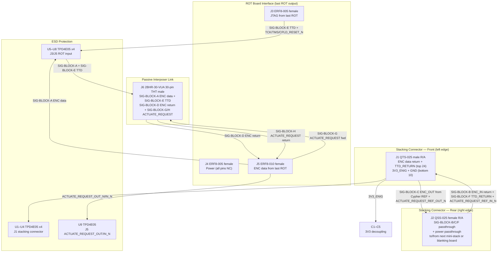

# Stack-Output Board (V1.0) Design Specification

**Status:** Draft
**Project:** Enigma-NG
**Author:** Izzyonstage & GitHub Copilot
**Version:** v.0.1.0
**Associated Hardware Revision:** Rev A
**Last Updated:** 2026-09-02

## 1. Overview

The Stack-Output Board is the output-side board of the Rotor Mini-Stack assembly. It fulfils the
output-side responsibilities of the Extension Board, receiving rotor-processed ENC data and TTD
signals from the last ROT board and routing them to the passive interposer link (toward Stack-Input)
and the Cypher Board return path.

| Circuit Responsibility | Board Role | Key Component |
| :--- | :--- | :--- |
| **Mini-Stack Cypher Output** | Receives ENC data and TTD from last ROT board; passes return signals (SIG-BLOCK-B/C/F) through stacking connectors toward Cypher Board; routes SIG-BLOCK-A/D/E via passive interposer link to Stack-Input | ERF8 ROT-facing input sockets + 2BHR-30-VUA interposer link |

The left edge (front face when viewed from the front of the mini-stack assembly) carries a keyed
Samtec QTS-025 male right-angle connector (J1) that mates with the Cypher Board J4 (REF side) or
the rear of the previous Rotor Mini-Stack (J2). The right edge (rear face) carries a matching
QSS-025 female right-angle connector (J2) for chaining to the next mini-stack (J1) or
Stack-Blanking Board.
ROT boards connect to J3–J5 (ERF8 female sockets) on the rotor-facing face, receiving signals from
the last ROT board in the mini-stack. Return signals are routed to Stack-Input via the passive
interposer link at J6 (SQT-115-01-L-D-RA right-angle female on the bottom edge), mating with the
Stack-Interposer Board.

### Functional Requirements

| ID | Functional Requirement | Notes | Satisfied By / Cross-Ref |
| :--- | :--- | :--- | :--- |
| FR-EXT-03 | Pass 3V3_ENIG power and ENC data signals across the mini-stack boundary | Power: received on J1 bottom power section (3V3_ENIG only; no 5V_MAIN); ENC data return: J5 → J6 interposer; ENC passthrough (SIG-BLOCK-B/C): J2 ↔ J1 | §5 Power; BOM J1, J2, J5, J6 |
| FR-EXT-05 | Connect on the output side to the last ROT board of this mini-stack | J3/J4/J5 = ERF8 female sockets receiving last ROT board ERM8 male output connectors | §6 Interconnects; BOM J3–J5 |
| FR-EXT-07 | Protect stacking connector J1 and ROT-facing input connectors J3/J5 from ESD events | J1 and J3/J5 accessible during live mini-stack or rotor swap | §8 Thermal & ESD; BOM U1–U9 |
| FR-SOUT-01 | Connect on the front side to the Cypher Board REF side or the rear of the previous Rotor Mini-Stack | J1 = QTS-025-01-L-D-RA-P male right-angle (front / left edge) | §6 Interconnects; BOM J1 |
| FR-SOUT-02 | Connect on the rear side to the next Rotor Mini-Stack or Stack-Blanking Board | J2 = QSS-025-01-L-D-RA-K female right-angle (rear / right edge) | §6 Interconnects; BOM J2 |
| FR-SOUT-03 | Receive JTAG TTD, TCK, TMS, CPLD_RESET_N and ENC data from the last ROT board of this mini-stack | J3 = ERF8-005 (JTAG); J4 = ERF8-005 (Power — all pins NC); J5 = ERF8-010 (ENC data) | §6 Interconnects; BOM J3–J5 |
| FR-SOUT-04 | Route SIG-BLOCK-A ENC data, SIG-BLOCK-E TTD, and SIG-BLOCK-G/H ACTUATE_REQUEST (per DEC-093) from the last ROT board to Stack-Input via the passive interposer link | J6 = 2BHR-30-VUA 30-pin THT male header; mates with Stack-Interposer Board SQT-115-01-L-D-RA female | §6 Interconnects; BOM J6 |
| FR-SOUT-05 | Receive SIG-BLOCK-D ENC data from Stack-Input via the passive interposer link and route it into the ROT chain return pass | J6 → J5; ROT chain traversal (left-to-right return direction) | §3 Signal Return Path; §6 Interconnects |
| FR-SOUT-06 | Pass SIG-BLOCK-B ENC return and SIG-BLOCK-F TTD_RETURN toward the Cypher Board via front stacking connector J1 | Signals sourced on J2 rear stacking (from blanking board / next Stack-Output passthrough); J2 → J1 internal passthrough per mini-stack | §3 Signal Return Path; §6 Interconnects |
| FR-SOUT-07 | Pass SIG-BLOCK-C ENC reflector signals rearward toward the Stack-Blanking Board via rear stacking connector J2 | Signals sourced on J1 (from Cypher Board REF output); J1 → J2 internal passthrough | §3 Signal Return Path; §6 Interconnects |
| FR-SOUT-08 | Terminate JTAG spoke signals at the end of the ROT-chain distribution | TCK, TMS, and CPLD_RESET_N terminate at Stack-Output; R1–R3 idle-state bias resistors (10 kΩ) mirror Cypher Board R3/R5/R6 pattern at spoke end; signals are not returned toward Cypher via the stacking connectors | §4 JTAG Termination; BOM R1–R3 |

### Design Requirements

| ID | Design Requirement | Specification | Satisfied By / Cross-Ref |
| :--- | :--- | :--- | :--- |
| DR-EXT-01 | PCB stackup | 4-layer standard per `design/Standards/Global_Routing_Spec.md §2.3.1` | §7 PCB Fabrication & Stackup |
| DR-EXT-07 | System quantity | 1 per Rotor Mini-Stack; up to 6 per system (30 rotor positions total) | §1 Overview |
| DR-EXT-12 | ESD protection — stacking connector J1 and ROT-facing connectors J3/J5 | U1–U4 (J1 signal region: 14 active signal lines + ACTUATE_REQUEST_REF_IN_N/OUT_N via U4's spare channels); U5–U8 (J3 JTAG + J5 ENC data); U9 (J5 ACTUATE_REQUEST_OUT_N/IN_N); within 3mm of connector mating edge per DEC-048/DEC-095 | §8 Thermal & ESD; BOM U1–U9 |
| DR-EXT-13 | 3V3_ENIG entry decoupling bank | C1–C5 (5x 10µF X7R 50V 1206) at 3V3_ENIG entry (J1 bottom power section) per GRS §3 star/spoke pattern | §5 Power; BOM C1–C5 |
| DR-EXT-14 | Mounting holes | MH1–MH4: M3 PTH (3.2mm drill) tied to GND_CHASSIS per GRS §4; placement per GRS §4.3 Pattern B. No BOM entry. | §7 PCB Fabrication; GRS §4.3 |
| DR-SOUT-01 | Front stacking connector (output/chain side) | J1 = QTS-025-01-L-D-RA-P (Samtec 50-contact right-angle male SMT); fully 50-pin allocated per DEC-092/DEC-093 (this board is the Definition Owner, DEC-094) — ENC data return + TTD_RETURN (SIG-BLOCK-B/C/F), 3V3_ENIG ×8, ACTUATE_REQUEST_REF_IN_N/OUT_N | §6 Interconnects; BOM J1 |
| DR-SOUT-02 | Rear stacking connector (chain side) | J2 = QSS-025-01-L-D-RA-K (Samtec 50-contact right-angle female SMT); mirrors J1 signal set with I/O directions inverted (passthrough chain); fully 50-pin allocated per DEC-092/DEC-093 | §6 Interconnects; BOM J2 |
| DR-SOUT-03 | ROT-facing input connectors | J3 = ERF8-005 (JTAG from last ROT), J4 = ERF8-005 (Power — all pins NC), J5 = ERF8-010 (ENC data from last ROT); mate with last ROT board ERM8 male output connectors | §6 Interconnects; BOM J3–J5 |
| DR-SOUT-04 | J4 power pins — 0Ω prototype links | J4 3V3_ENIG pins connected to local 3V3_ENIG plane via R4 (0Ω link); J4 GND pins connected to local GND plane via R5 (0Ω link); both links can be removed to revert to NC if prototype testing reveals EMI issues; see DEC-085 | §5 Power; BOM R4, R5 |
| DR-SOUT-05 | JTAG spoke termination | R1 = 10 kΩ TCK pull-down to GND; R2 = 10 kΩ TMS pull-up to 3V3_ENIG; R3 = 10 kΩ CPLD_RESET_N pull-up to 3V3_ENIG; placed within 3mm of J3; mirrors Cypher Board R3/R5/R6 idle-bias pattern; per DEC-016 | §4 JTAG Termination; BOM R1–R3 |
| DR-SOUT-06 | Passive interposer link connector | J6 = SQT-115-01-L-D-RA (Samtec 30-position 2×15 right-angle female shrouded SMT, bottom edge); mates with TMMH-115-01-L-D-ES straight/vertical male on Stack-Interposer Board J1; pin map defined in `Stack-Interposer/Board_Layout.md §3` | §6 Interconnects; BOM J6 |
| DR-SOUT-07 | Power rail | 3V3_ENIG only; no 5V_MAIN on this board; no AM circuits requiring 5V_MAIN | §5 Power |

### Component Block Diagram

## 2. Architecture

- **PCB:** 4-layer standard per `design/Standards/Global_Routing_Spec.md §2.3.1`. ENIG Gold.
  2.0mm filleted corners.
- **Assembly:** Single-sided; no high-density ICs requiring dual-side placement.
- **Manufacturer:** JLCPCB (standard 4-layer; no special manufacturing constraints).

### GND_CHASSIS Single-Point Bond

Per GRS §5: local `GND_CHASSIS` net tied to mounting holes and enclosure-contact features; no
local GND to GND_CHASSIS bond. System's only galvanic bond remains on the Power Module.

## 3. Signal Return Path

The Stack-Output Board provides passive return routing for the ENC data and JTAG signals within
the mini-stack chain. It has no active signal processing ICs; all routing is passive trace
continuity.

### SIG-BLOCK pass-through signals (J1 ↔ J2)

| Signal Block | Signals | Direction | Source on J2 (rear) | Destination on J1 (front) |
| :--- | :--- | :--- | :--- | :--- |
| SIG-BLOCK-B | ENC_IN[5:0] return | J2 → J1 | From blanking board or next Stack-Output rear | Toward Cypher REF side |
| SIG-BLOCK-C | ENC_OUT[5:0] reflector | J1 → J2 | From Cypher REF output | Toward blanking board or next Stack-Output front |
| SIG-BLOCK-F | TTD_RETURN | J2 → J1 | From blanking board or next Stack-Output rear | Toward Cypher JTAG Module TDO |
| — | `ACTUATE_REQUEST_REF_IN_N` | J2 → J1 | From blanking board or next Stack-Output rear | Toward Cypher `J4` `ACTUATE_REQUEST_REF_IN_N` (per DEC-093 step 3, first reflection) |
| — | `ACTUATE_REQUEST_REF_OUT_N` | J1 → J2 | From Cypher `J4` `ACTUATE_REQUEST_REF_OUT_N` (per DEC-093 step 5, second forward pass) | Toward blanking board or next Stack-Output front |

Every Stack-Output board has an internal J2 → J1 passthrough for SIG-BLOCK-B, SIG-BLOCK-F, and
`ACTUATE_REQUEST_REF_IN_N`, and a J1 → J2 passthrough for SIG-BLOCK-C and
`ACTUATE_REQUEST_REF_OUT_N`. These are passive trace routes with no buffering — this board has
no active ICs (see §8 Thermal & ESD). Per DEC-095.

### Interposer link signals (J3/J5 ↔ J6)

| Signal Block | Signals | Direction | Notes |
| :--- | :--- | :--- | :--- |
| SIG-BLOCK-A | ENC_DATA[5:0] | J5 → J6 | Forward-direction traversal result from last ROT board; forwarded to Stack-Input for next-stack or blanking board handoff |
| SIG-BLOCK-E (TTD) | TTD | J3 → J6 | Last ROT TDO — outbound JTAG chain end; forwarded to Stack-Input for next-stack or blanking board handoff |
| SIG-BLOCK-D | ENC_DATA[5:0] | J6 → J5 | Return-direction data post-reflector from Stack-Input; enters ROT chain for return traversal (left-to-right) |
| SIG-BLOCK-G | `ACTUATE_REQUEST` (forward) | J5 → J6 | Forward pass, collected from last ROT board's own carry mechanism (pin 14, `ACTUATE_REQUEST_OUT_N`, of Rotor's J6); forwarded to Stack-Input's rear connector via the Stack-Interposer Board |
| SIG-BLOCK-H | `ACTUATE_REQUEST` (return) | J6 → J5 | Return pass, received from the Stack-Interposer Board (originating at Stack-Input's rear connector); routed into the ROT chain (pin 13, `ACTUATE_REQUEST_IN_N`, of Rotor's J6) for reverse traversal |

Both passthroughs are passive trace routes, consistent with the existing SIG-BLOCK-A/D/E
handling on this same connector pair. Per DEC-093/DEC-095.

### TTD vs TTD_RETURN naming

Per `.copilot/discussions/cypher-system-discussion/extension-mechanical-usage.md` Entry 20:

- **TTD** on the interposer link (J6): the JTAG serial chain signal from the last ROT TDO output,
  forwarded to Stack-Input. Named **TTD** here — it is not yet renamed at this point in the chain.
- **TTD_RETURN** on stacking connectors (J1/J2): the signal renamed at the Stack-Blanking Board
  after the outbound TTD chain terminates. Propagates from blanking board forward through Stack-Output
  J2 rear → J1 front on each mini-stack back to the Cypher Board JTAG Module TDO pin.

## 4. JTAG Termination

TCK, TMS, and CPLD_RESET_N are distributed outbound from Cypher through all ROT boards in the
mini-stack and arrive at the Stack-Output J3 ERF8 JTAG connector. Stack-Output is the end of
these JTAG spoke distributions — they are not returned toward Cypher.

Idle-state bias resistors R1–R3 are placed at the end of each spoke. They mirror the pull-up and
pull-down resistors on the Cypher Board (R3/R5/R6) which hold the same signals in their defined
idle states at the source end. Having matching bias at both source and spoke end ensures defined
logic levels when a mini-stack is disconnected or powered down during assembly and test.
See `design/Electronics/JTAG_Module/JTAG_Integrity.md` and DEC-016 for system JTAG integrity
context.

| RefDes | Signal | Termination | Value | Rationale |
| :--- | :--- | :--- | :--- | :--- |
| R1 | TCK | Pull-down to GND | 10 kΩ | Prevents spurious clocking when spoke stub is floating |
| R2 | TMS | Pull-up to 3V3_ENIG | 10 kΩ | Holds JTAG TAP in Test-Logic-Reset state at spoke end |
| R3 | CPLD_RESET_N | Pull-up to 3V3_ENIG | 10 kΩ | Holds CPLDs out of reset at spoke end |

## 5. Power

- **Power entry:** 3V3_ENIG received on J1 (front stacking connector, bottom power section).
  3V3_ENIG only — no 5V_MAIN on this board.
- **Logic supply:** 3V3_ENIG supplies ESD protection ICs U1–U8 and pull-up resistors R2/R3 only.
  No active logic ICs.
- **ROT chain power (J4):** J4 3V3_ENIG pins are connected to the local 3V3_ENIG plane via R4
  (0Ω link); J4 GND pins are connected to the local GND plane via R5 (0Ω link). This provides
  parallel power and return-current paths within the mini-stack, reducing effective rail impedance
  and shortening ROT CPLD switching return paths. Both links can be removed to revert to NC if
  prototype testing reveals EMI issues. See DEC-085.
- **3V3_ENIG decoupling bank:** C1–C5 (5x 10µF X7R 50V 1206) at J1 3V3_ENIG entry; star/spoke
  topology per GRS §3.
- **Power passthrough:** 3V3_ENIG passes through J1 (front, bottom power section) to J2 (rear,
  bottom power section) for the next mini-stack or Stack-Blanking Board.

## 6. Interconnects

### J1 — Front Stacking Connector (QTS-025-01-L-D-RA-P)

**Connector definition owner: this board's own `Board_Layout.md §1` (IC-REF-CHAIN, per DEC-094).**
Mates with Cypher Board J4 (first mini-stack) or previous mini-stack J2 (subsequent stacks).

- **MPN:** QTS-025-01-L-D-RA-P (Samtec 50-contact 0.635mm right-angle male SMT)
- **Fully 50-pin allocated per DEC-092/DEC-093** — see `Board_Layout.md §1` for the full
  canonical pin map: ENC_IN[5:0] return (SIG-BLOCK-B out), ENC_OUT[5:0] (SIG-BLOCK-C in),
  TTD_RETURN (SIG-BLOCK-F out, pin 30), `3V3_ENIG` ×8, `ACTUATE_REQUEST_REF_IN_N`/
  `ACTUATE_REQUEST_REF_OUT_N` (pins 16/35 — passive J1↔J2 passthrough, see §3 Signal Return Path
  and DEC-095), GND fill.

> **Pinout:** see `Board_Layout.md §1`.

### J2 — Rear Stacking Connector (QSS-025-01-L-D-RA-K)

**Connector definition owner: this board's own `Board_Layout.md §1` (IC-REF-CHAIN, §1 above —
same template, I/O inverted, per DEC-094).** Mates with next mini-stack J1 (front stacking male)
or Stack-Blanking Board male connector.

- **MPN:** QSS-025-01-L-D-RA-K (Samtec 50-contact 0.635mm right-angle female SMT)
- **Fully 50-pin allocated per DEC-092/DEC-093** — same canonical pin map as J1, I/O inverted;
  see `Board_Layout.md §2`.

> **Pinout:** see `Board_Layout.md §2`.

### J3 / J4 / J5 — ROT Board Input Connectors

Mates with last ROT board in the mini-stack (ROT board ERM8 male output connectors on Board A side).

> **Connector Definition Owner:** `Rotor/Design_Spec.md §3.4`.

| Ref | Type | Signal Group | MPN |
| :--- | :--- | :--- | :--- |
| J3 | ERF8-005 (10-pin, female) | JTAG from last ROT (TTD, TCK, TMS, CPLD_RESET_N + GND) | ERF8-005-05.0-S-DV-K-TR |
| J4 | ERF8-005 (10-pin, female) | Power from last ROT — 3V3_ENIG ×5 + GND ×5; connected via R4/R5 0Ω links (see DEC-085) | ERF8-005-05.0-S-DV-K-TR |
| J5 | ERF8-010 (20-pin, female) | ENC data from last ROT, plus ACTUATE_REQUEST_OUT_N/IN_N (pins 13/14, per DEC-093); ESD via U9 (DEC-095) | ERF8-010-05.0-S-DV-K-TR |

J4 3V3_ENIG pins connect to the local 3V3_ENIG plane via R4 (0Ω link); J4 GND pins connect to
the local GND plane via R5 (0Ω link). Both links can be removed to revert to NC if prototype
testing reveals EMI issues (see DEC-085).

### J6 — Passive Interposer Link (SQT-115-01-L-D-RA)

> **Connector Definition Owner:** `Stack-Interposer/Board_Layout.md`.

Right-angle female shrouded 30-position (2×15) connector on the bottom edge. Connects to the
Stack-Interposer Board which bridges this connector to the matching return connector on the
Stack-Input Board.

- **MPN:** SQT-115-01-L-D-RA (Samtec 30-position right-angle female shrouded SMT)
- **Signals carried (bidirectional):**
  - Out to Stack-Input: SIG-BLOCK-A ENC_DATA[5:0] (from J5) + SIG-BLOCK-E TTD (from J3)
  - In from Stack-Input: SIG-BLOCK-D ENC_DATA[5:0] (return direction into ROT chain)
- **Mating connector on Interposer Board:** TMMH-115-01-L-D-ES (Samtec 30-position straight/vertical male)
- **Pinout:** see `Stack-Interposer/Board_Layout.md §3`.

## 7. PCB Fabrication & Stackup

- **Stackup:** 4-layer standard per `design/Standards/Global_Routing_Spec.md §2.3.1`.
- **Manufacturer:** JLCPCB. Single-sided assembly.
- **Fillets:** 2.0mm rounded PCB corners.
- **Mounting Holes:** MH1–MH4, M3 PTH (3.2mm drill), tied to GND_CHASSIS per GRS §4. No BOM entry.
- **Decoupling:** per `design/Standards/Global_Routing_Spec.md §3`.
- **JTAG trace width:** All JTAG traces on L1 shall be routed at the CI width per
  `design/Standards/Global_Routing_Spec.md §2.3.1`, targeting 50 Ohm controlled impedance.
  See `design/Electronics/JTAG_Module/JTAG_Integrity.md` and DEC-016.

## 8. Thermal & ESD

- **Thermal:** No active ICs on this board. No thermal concerns.
- **ESD — J1 stacking connector (TVS required):**
  J1 is accessible during live mini-stack insertion/removal. Per DEC-045 and DEC-048:
  - **U1:** 1x TPD4E05U06QDQARQ1 — channels: TTD_RETURN ×2 + ENC_OUT[0:1] (SIG-BLOCK-C)
  - **U2:** 1x TPD4E05U06QDQARQ1 — channels: ENC_OUT[2:5] (SIG-BLOCK-C)
  - **U3:** 1x TPD4E05U06QDQARQ1 — channels: ENC_IN[0:3] return (SIG-BLOCK-B)
  - **U4:** 1x TPD4E05U06QDQARQ1 — channels: ENC_IN[4:5] return, `ACTUATE_REQUEST_REF_IN_N`,
    `ACTUATE_REQUEST_REF_OUT_N`. Per DEC-095.
  All U1–U4 placed within 3mm of J1 mating edge on L1.
- **ESD — J3/J5 ROT input connectors (TVS required):**
  J3 (JTAG) and J5 (ENC) are accessible during live ROT board swap. Per DEC-045 and DEC-048:
  - **U5:** 1x TPD4E05U06QDQARQ1 — channels: TTD, TCK, TMS, CPLD_RESET_N (J3 JTAG group)
  - **U6:** 1x TPD4E05U06QDQARQ1 — channels: ENC_IN[0:3] (J5 ENC group)
  - **U7:** 1x TPD4E05U06QDQARQ1 — channels: ENC_IN[4:5] + ENC_OUT[0:1] (J5 ENC group)
  - **U8:** 1x TPD4E05U06QDQARQ1 — channels: ENC_OUT[2:5] (J5 ENC group)
  - **U9:** 1x TPD4E05U06QDQARQ1 — channels: `ACTUATE_REQUEST_OUT_N`, `ACTUATE_REQUEST_IN_N`
    (J5 group, mating with Rotor J6's pins 13/14; 2 channels used, 2 spare). Per DEC-095.
  All U5–U9 placed within 3mm of their respective connector mating edge on L1.
- **Working voltage note:** TPD4E05U06QDQARQ1 max continuous working voltage = 5.5V. On
  3V3_ENIG (max 3.465V), all U1–U9 within rated limits with >= 2.0V margin.
- **ESD — all other connectors (no TVS required):**
  J2 (rear stacking — chain side, not live-swap); J4 (power only, all pins NC); J6 (interposer,
  internal rigid assembly).
  Per `design/Standards/Global_Routing_Spec.md §9`.

## 9. Branding & Traceability

- **Data Plate:** Per GRS §6 on Layer L4. Revision block: `STAPELAUSGANG [Stack-Output] V1.0`.
- **Connector Pin-1 Markers:** J1–J6 silkscreen pin-1 markers required per GRS §7.1.
- **ERF8 labelling:** 0.8mm pitch is physically incompatible with 2.54mm connectors; label
  distinctly on silkscreen.

## 10. Bill of Materials

| RefDes | Specification | MPN | Manufacturer | DigiKey PN | Mouser PN | JLCPCB PN | Alt Supplier + PN | Notes | Footprint Available | Footprint Downloaded | Qty |
| --- | --- | --- | --- | --- | --- | --- | --- | --- | --- | --- | --- |
| C1–C5 | 10µF X7R 50V 1206 | CL31B106KBK6PJE | Samsung | 1276-CL31B106KBK6PJECT-ND | 187-CL31B106KBK6PJE | C43935922 | – | 3V3_ENIG entry decoupling bank at J1 | ✔ | ✔ | 5 |
| J1 | 50-contact 0.635mm right-angle male SMT | QTS-025-01-L-D-RA-P | Samtec | QTS-025-01-L-D-RA-P-ND | 200-QTS02501LDRAP | C7267889 | – | Front stacking connector (mates with Cypher J4 or prev mini-stack J2) | ✔ | ✔ | 1 |
| J2 | 50-contact 0.635mm right-angle female SMT | QSS-025-01-L-D-RA-K | Samtec | QSS-025-01-L-D-RA-K-ND | 200-QSS02501LDRAK | C6156774 | – | Rear stacking connector (mates with next mini-stack J1 or blanking board) | ✔ | ✔ | 1 |
| J3, J4 | 10-pin 2x5 0.8mm female SMT | ERF8-005-05.0-S-DV-K-TR | Samtec | SAM13517CT-ND | 200-ERF8005050SDVKTR | C7273978 | – | J3: JTAG from last ROT; J4: Power (all pins NC) | ✔ | ✔ | 2 |
| J5 | 20-pin 2x10 0.8mm female SMT | ERF8-010-05.0-S-DV-K-TR | Samtec | SAM8618CT-ND | 200-ERF8010050SDVKTR | C3646170 | – | ENC data from last ROT board | ✔ | ✔ | 1 |
| J6 | 30-position 2×15 right-angle female shrouded SMT | SQT-115-01-L-D-RA | Samtec | SAM1246-15-ND | 200-SQT11501LDRA | C7318577 | – | Passive interposer link — mates with Stack-Interposer J1 (TMMH-115-01-L-D-ES); per Stack-Interposer/Board_Layout.md §3 | ✔ | ✔ | 1 |
| R1 | 10kΩ 1% 0402 | ERJ-2RKF1002X | Panasonic | P10.0KLCT-ND | 667-ERJ-2RKF1002X | C191123 | – | TCK pull-down to GND — JTAG spoke end termination; prevents spurious clocking | ✔ | ✔ | 1 |
| R2, R3 | 10kΩ 1% 0402 | ERJ-2RKF1002X | Panasonic | P10.0KLCT-ND | 667-ERJ-2RKF1002X | C191123 | – | R2: TMS pull-up to 3V3_ENIG; R3: CPLD_RESET_N pull-up to 3V3_ENIG — JTAG spoke end termination; mirrors Cypher R3/R6 | ✔ | ✔ | 2 |
| R4 | 0Ω 0402 | ERJ-2GE0R00X | Panasonic | P0.0JCT-ND | 667-ERJ-2GE0R00X | C242160 | – | J4 3V3_ENIG bus → local 3V3_ENIG plane (0Ω link; remove to revert J4 3V3_ENIG to NC — see DEC-085) | – | ✘ | 1 |
| R5 | 0Ω 0402 | ERJ-2GE0R00X | Panasonic | P0.0JCT-ND | 667-ERJ-2GE0R00X | C242160 | – | J4 GND bus → local GND plane (0Ω link; remove to revert J4 GND to NC — see DEC-085) | – | ✘ | 1 |
| U1–U8 | 4-ch bidirectional ESD array USON-10 | TPD4E05U06QDQARQ1 | Texas Instruments | 296-40696-1-ND | 595-PD4E05U06QDQARQ1 | C81353 | – | ESD protection: U1–U4 on J1 signal region, U5–U8 on J3/J5 ROT-facing connectors | ✔ | ✔ | 8 |
| U9 | 4-ch bidirectional ESD array USON-10 | TPD4E05U06QDQARQ1 | Texas Instruments | 296-40696-1-ND | 595-PD4E05U06QDQARQ1 | C81353 | – | J5 ROT-facing ESD protection: ACTUATE_REQUEST_OUT_N/IN_N (2 channels used, 2 spare). Per DEC-095. | ✔ | ✔ | 1 |
