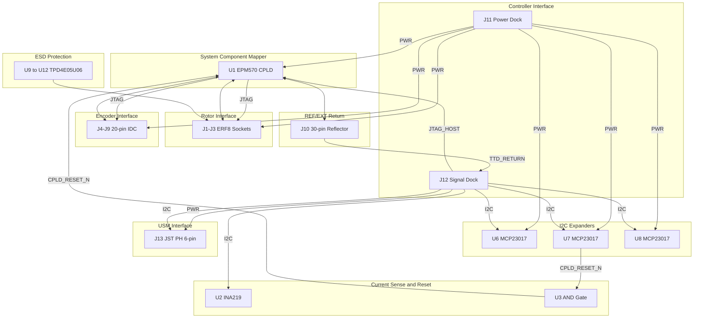

# Stator Board (V1.0) Design Specification

**Status:** In Review
**Project:** Enigma-NG
**Author:** Izzyonstage & GitHub Copilot
**Version:** v.0.1.0
**Associated Hardware Revision:** Rev A
**Last Updated:** 2026-05-22

The Stator Board is the mechanical and electrical backbone of the rotor stack. It provides the high-current distribution and signal routing for the 30 modular rotors.

## 1. Overview

* **Stackup:** 4-layer standard per `design/Standards/Global_Routing_Spec.md §2.3.1`.
* **Layer Mapping:** L1: Signal (JTAG/routing) | L2: GND | L3: 3V3_ENIG | L4: ENC Data.
* **Role:** Removable vertical daughterboard and master switchboard for the 30-rotor stack and peripheral encoder boards.

### Functional & Design Requirements

#### Functional Requirements

| ID | Functional Requirement | Notes | Satisfied By / Cross-Ref |
| :--- | :--- | :--- | :--- |
| FR-STA-01 | Serve as the removable mechanical and electrical backplane for the 30-rotor stack | Provides all power, JTAG, and data connectivity to rotors | §2 Core Features; BOM J1-J3 (ERF8 rotor sockets) |
| FR-STA-02 | Distribute 3V3_ENIG power to all 30 rotor slots simultaneously | Via 2oz copper pour on L3 | §2 Core Features; §3 Encryption & JTAG Hub; BOM L1-L4 (ferrite beads) |
| FR-STA-03 | Route the JTAG chain from the Controller Board through all 30 rotor slots in sequence | Serial daisy-chain; Stator CPLD is device 1 | §3 Encryption & JTAG Hub; BOM U1 (EPM570T100I5N) |
| FR-STA-04 | Receive `TTD_RETURN` from the Reflector and feed the reflector / extension service harness | Via J10 (Adam Tech `2BHR-30-VUA` 30-pin reflector / extension port) into the `J12` logic dock return path, while also exporting grouped `5V_MAIN` for Extension-local actuation | §3 Encryption & JTAG Hub; BOM J10, R2 (10kΩ pull-up) |
| FR-STA-05 | Interface with up to 6 Encoder Modules via IDC ribbon cables; route a single 6-bit `ENC_DATA[5:0]` service bus through one HID encode path, one HID decode path, and two configurable plugboard passes, plus a HID-local `ENC_ACTIVE_N` sideband | Bank 1 = `KBD_ENC` + `LBD_DEC`; Bank 2 = `PLG_PASS1_DEC` + `PLG_PASS1_ENC`; Bank 3 = `PLG_PASS2_DEC` + `PLG_PASS2_ENC`; Stator owns the fixed per-port aliases and forwards `ENC_ACTIVE_N` only for the HID bank | §3 Plugboard Routing; §4 Interconnects; BOM J4-J9 (20-pin IDC) |
| FR-STA-06 | Host a CPLD as the first device in the system JTAG chain | Intel MAX II EPM570 (570 LEs required for startup-loaded reflector map registers + routing matrix) | §3 Encryption & JTAG Hub; BOM U1 (EPM570T100I5N) |
| FR-STA-07 | Connect to the Controller Board via two hybrid blind-mate dock connectors | `J11` = 5V-biased power dock; `J12` = 3V3/JTAG/I2C dock | §4 Interconnects; BOM J11, J12 |
| FR-STA-08 | Select the active plugboard routing configuration from the User Settings Module user-intent bus via I²C; CM5 may override it with GUI-selected presets | User Settings Module `CFG_ROUTE[3:0]` provides 16 routing configurations; CM5 reads the User Settings Module user-intent expander, decides whether to forward user intent or apply an override, writes final `CFG_ROUTE[3:0]` to U8 GPA[3:0] (see `Controller/Design_Spec.md §4.1` for I²C address assignments), and pulses `CFG_APPLY_N` to reload the Stator CPLD | §3 Configuration Bank 1 (Routing); §4.2 I²C-1 Bus Devices; BOM U8, R13-R16 |
| FR-STA-09 | Select and apply a stored reflector substitution map at the reflection boundary while retaining the mandatory physical Reflector board as the electrical turnaround | User Settings Module `CFG_REFMAP[5:0]` provides a 6-bit reflector-map selection; CM5 may override it with GUI-selected presets; final `CFG_REFMAP[5:0]` is driven to the CPLD by U8 GPB[5:0] (see `Controller/Design_Spec.md §4.1` for I²C address assignments) | §3 Configuration Bank 2 (Reflector Mapping); §4.2 I²C-1 Bus Devices; BOM U8, R18-R23 |
| FR-STA-10 | Provide I²C GPIO expansion for CM5 virtual keypress injection, HID activity selection/monitoring, ENC service-bus monitoring, CPLD_RESET_N management, and CPLD configuration driving | Via three MCP23017 expanders: U6, U7, U8 on shared I²C-1 bus (see `Controller/Design_Spec.md §4.1` for I²C address assignments) | §4 I²C Devices; BOM U6, U7, U8 |
| FR-STA-11 | Select between the physical keyboard source and CM5 virtual key source before the cipher pipeline, including both the 6-bit bus and the HID activity sideband | External 7-channel 2:1 mux implementation at the `KBD_ENC` (`J4`) entry point; `KEY_CM5_ACTIVE` chooses the source, `CM5_KEY_DATA[5:0]` carries the CM5 value, `CM5_KEY_ACTIVE_N` carries the CM5 activity state, and the mux enable pin(s) are tied LOW so the selected path is always driven while the board is powered | §3 External Keyboard Source Mux |
| FR-STA-12 | Connect to User Settings Module via I²C-1 bus for user-intent configuration, `CFG_APPLY_N`, and LED status output | J13 = 6-pin JST PH 2.0mm connector (`3V3_ENIG`, `5V_MAIN`, `GND`, `SDA`, `SCL`, `GND`); User Settings Module expanders share the Stator I²C-1 bus (see `Controller/Design_Spec.md §4.1` for I²C address assignments) | §4.2 I²C-1 Bus Devices; BOM J13 |
| FR-STA-13 | Protect the J1 (JTAG) and J3 (ENC) rotor-facing BtB connector interfaces from ESD events during live rotor swap | J1 and J3 are operator-accessible during hot-swap; TVS/ESD arrays required on both connectors per DEC-048 | §8 Thermal & ESD; BOM U9-U12 |

#### Design Requirements

| ID | Design Requirement | Specification | Satisfied By / Cross-Ref |
| :--- | :--- | :--- | :--- |
| DR-STA-01 | PCB stackup | Stackup per `design/Standards/Global_Routing_Spec.md §2.3.1` | §7 PCB Fabrication & Stackup |
| DR-STA-02 | Layer mapping | L1 = Signal (JTAG/routing), L2 = GND, L3 = 3V3_ENIG, L4 = ENC Data | §1 Overview |
| DR-STA-03 | Rotor interface (per slot) | J1 = ERF8-005 (JTAG), J2 = ERF8-005 (Power), J3 = ERF8-010 (ENC); 1 slot set | §4 Interconnects; BOM J1-J3 (ERF8-005/ERF8-010) |
| DR-STA-04 | Encoder interface | J4/J5/J6/J7/J8/J9 = 20-pin 2x10 IDC (6 fixed-role encoder ports in 3 banks of 2) carrying generic Encoder `ENC_DATA[5:0]`, `ENC_ACTIVE_N`, and Stator-owned aliases | §4 Interconnects; BOM J4-J9 |
| DR-STA-05 | Reflector / Extension service connector | J10 = Adam Tech `2BHR-30-VUA` 30-pin 2x15 shrouded header; `TTD_RETURN` on pin 16, `CPLD_RESET_N` on pin 15, `ENC_OUT_REF[5:0]` on pins 7-12, `ENC_IN_REF[5:0]` on pins 19-24, `3V3_ENIG` on pins 3-4 and 27-28, `5V_MAIN` on pins 1-2 and 29-30. Per DEC-053 | §3 Encryption & JTAG Hub; BOM J10 |
| DR-STA-06 | Controller dock connectors | `J11/J12` = Molex `2195620015` hybrid plugs mating with Controller `2195630015` receptacles | §4 Interconnects; BOM J11, J12 |
| DR-STA-07 | CPLD | Intel MAX II EPM570T100I5N (TQFP-100); 570 LEs; same footprint as EPM240 (drop-in); 570 LEs required for startup-loaded 64-char reflector map (384 FFs) + routing matrix logic | §3 Encryption & JTAG Hub; §3 CPLD I/O Budget; BOM U1 (EPM570T100I5N) |
| DR-STA-08 | Power monitoring | INA219 current sensor; shunt R1 = KRL6432T4-M-R010-F-T1 (10mΩ 6432/2512 Kelvin 4-terminal), sized for the 2.05 A worst-case typical stack load | §5 Power Telemetry; BOM U2 (INA219AIDR), R1 (KRL 10mΩ shunt) |
| DR-STA-09 | Maximum 3V3_ENIG load | 2.05 A worst-case typical (30 rotors + Stator CPLD + all encoders) | §2 Core Features; §5 Power Telemetry |
| DR-STA-10 | Routing configuration selection | Logical `CFG_ROUTE[3:0]` inputs are driven by U8 GPA[3:0]; 4x 10kΩ pull-down resistors R13-R16 retained on CPLD inputs as power-up safe defaults (hold 0 when U8 is uninitialised) | §3 Configuration Bank 1 (Routing); BOM U8, R13-R16 |
| DR-STA-11 | Reflector map selection | Logical `CFG_REFMAP[5:0]` inputs are driven by U8 GPB[5:0]; 6x 10kΩ pull-down resistors R18-R23 retained on CPLD inputs as power-up safe defaults | §3 Configuration Bank 2 (Reflector Mapping); BOM U8, R18-R23 |
| DR-STA-12 | I²C GPIO expanders | U6 = MCP23017T-E/SO (A2=LOW, A1=LOW, A0=LOW; 0x20); U7 = MCP23017T-E/SO (A2=LOW, A1=LOW, A0=HIGH; 0x21); U8 = MCP23017T-E/SO; SOIC-28 package; on shared I²C-1 bus (see `Controller/Design_Spec.md §4.1` for I²C address assignments); each IC requires a dedicated /RESET pull-up: R36 (U6), R37 (U7), R38 (U8) - 10kΩ each to 3V3_ENIG; U7 cannot share CPLD_RESET_N for /RESET because U7 GPA[7] drives CPLD_RESET_N (circular dependency) | BOM U6, U7, U8, R36, R37, R38 |
| DR-STA-13 | U8 specification | U8 = MCP23017T-E/SO; SOIC-28; A2=LOW, A1=HIGH, A0=LOW; GPA[3:0] = `CFG_ROUTE[3:0]` outputs; GPA[6] = active-low `CFG_APPLY_N` Stator-only apply/reset output; GPB[5:0] = `CFG_REFMAP[5:0]` outputs | BOM U8 |
| DR-STA-14 | J13 connector | J13 = 6-pin JST PH 2.0mm B6B-PH-K-S(LF)(SN); pins: `3V3_ENIG`, `5V_MAIN`, `GND`, `SDA`, `SCL`, `GND`; connects to User Settings Module J1 via 6-wire harness. `5V_MAIN` is derived from the Controller-fed `J11` branch. | BOM J13 |
| DR-STA-15 | `CFG_APPLY_N` signal | `CFG_APPLY_N` = active-low Stator-only apply/reset pulse from U8 GPA[6]; combined with `CPLD_RESET_N` through U3 (`SN74LVC1G08DBVR`) so either signal can assert the Stator CPLD reset path; forcing `CFG_APPLY_N` LOW reloads `CFG_ROUTE[3:0]` and `CFG_REFMAP[5:0]` without resetting the wider system; R17 (10kΩ pull-up to 3V3_ENIG) holds `CFG_APPLY_N` deasserted at power-up when U8 is uninitialised | BOM U8, U3, R17; §3 Configuration Bank 1 (Routing) |
| DR-STA-16 | ESD protection - rotor-facing BtB connectors | U9 (J1 JTAG, 1x TPD4E05U06QDQARQ1 covering TCK, TMS, TTD, CPLD_RESET_N) + U10-U12 (J3 ENC, 3x TPD4E05U06QDQARQ1 covering ENC_IN[5:0] + ENC_OUT[5:0]); placed within 3mm of connector mating edge per DEC-048 | §8 Thermal & ESD; BOM U9-U12 |
| DR-STA-17 | Mounting holes | MH1–MH4 shall be 4× M3 PTH (Ø3.2 mm drill) mounting holes tied to `GND_CHASSIS` per GRS §4; ENIG annular ring per GRS §4. Placement follows GRS §4.3 Pattern B (D-shaped board): MH1 bottom-left corner, MH2 bottom-right corner, MH3 board-centre, MH4 top-centre arc midpoint — all at 7 mm inset from nearest edge. No BOM entry — plain chassis mounting holes, no components to fit. Exact XY coordinates TBD at PCB layout. | §2 (GND_CHASSIS bond note); `design/Standards/Global_Routing_Spec.md §4.3`; `design/Electronics/Stator/Board_Layout.md §12` |
| DR-STA-18 | CPLD_RESET_N open-drain buffer | Q1 = BSS138 N-ch MOSFET SOT-23; gate resistor R41 = 100 Ω 0402; drain = `CPLD_RESET_N` net; source = GND; driven by U7 GPA[7] (MCP23017, I²C addr 0x21); per DEC-078; prevents MCP23017 IOL overload from 30-rotor pull-up stack (30 × 330 µA = 9.90 mA > 8 mA I/O sink limit) | Q1, R41 BOM entries; §3 U7 description; `Stator/Board_Layout.md §7` |

### Component Block Diagram

## 2. Core Features

* **Modular Slots:** 1x Samtec ERF8 female socket set (3 connectors: ERF8-005 JTAG, ERF8-005 Power, ERF8-010 ENC\_DATA) mating with the ERM8 male headers on the Rotor.
* **Power Tree:** A 2oz copper pour for the `3V3_ENIG` rail to handle the **2.05A worst-case typical** load without voltage sag (see `design/Electronics/Power_Budgets.md`).
  The 5A figure previously quoted was a conservative design margin; the LDO hard limit is 3.0A.

### GND_CHASSIS Single-Point Bond

Per `design/Standards/Global_Routing_Spec.md §5`, the Stator implements a local `GND_CHASSIS` net
tied to its mounting holes and any deliberate enclosure-contact features, but it does **not**
implement a local GND-to-GND_CHASSIS bond. The system's only galvanic GND ↔ GND_CHASSIS bond is
defined on the Power Module at the common power-entry point immediately before the eFuse, so
`J11/J12` dock-entry GND remains signal/power return only and must not be bridged locally to
chassis on the Stator.

## 3. Encryption & JTAG Hub

* **CPLD:** Intel MAX II EPM570T100I5N CPLD (Logic Router & Reflector).

### CPLD Signal Routing Matrix

The Stator CPLD (U1) is the bidirectional ENC_DATA routing hub for the full encryption cycle.
It has four fixed external ENC_DATA service interfaces:

* `J4` = `KBD_ENC` (keyboard encode source)
* `J5` = `LBD_DEC` (lightboard decode destination)
* `J3` = Rotor 1 ENC connector
* `J10` = Reflector / Extension return connector

It also owns two configurable plugboard passes, each implemented as a paired decode/encode module:

* `J6` + `J7` = Plugboard Pass 1
* `J8` + `J9` = Plugboard Pass 2

The encryption signal passes through the CPLD at three defined interception points:

| Step | CPLD receives from | Optional plugboard insertion | CPLD drives to |
| :--- | :--- | :--- | :--- |
| **1 - Forward entry** | `J4 ENC_IN_KBD[5:0]` - keyboard keystroke | Pre-Rotor 1 position - Pass 1 and/or Pass 2 | `J3 ENC_OUT_ROT[5:0]` → Rotor 1 (starts forward pass through rotor stack) |
| **2 - Reflector return** | `J10 ENC_IN_REF[5:0]` - reflected signal returned from Reflector chain | At Reflector boundary - Pass 1 and/or Pass 2 | `J10 ENC_OUT_REF[5:0]` → Reflector chain → Rotor 30 (starts return pass back through rotor stack) |
| **3 - Final exit** | `J3 ENC_IN_ROT[5:0]` - Rotor 1 return-pass output | Post-Rotor 1 return position - Pass 1 and/or Pass 2 | `J5 ENC_OUT_LBD[5:0]` → Lightboard |

At each step the CPLD either passes the signal transparently (no plugboard) or routes it through
Plugboard Pass 1 (`J6` decode -> passive jackfield -> `J7` encode) and/or Plugboard Pass 2
(`J8` decode -> passive jackfield -> `J9` encode) before forwarding. `J4`-`J9` use Stator-owned
service aliases that map onto the remote Encoder board's generic `ENC_DATA[5:0]` pins. `J3` and
`J10` aliases are Stator-local names only; the downstream Rotor / Extension / Reflector chain keeps
its own generic `ENC_IN[5:0]` and `ENC_OUT[5:0]` definitions. The active insertion positions are
determined by the VHDL routing case statement selected by U8 GPA[3:0] written by the CM5 daemon
(see §3 Panel Switch Configuration and DEC-032; note: DEC-070 D6 corrects DEC-032 bullet 4 — CFG_APPLY_N is U8 GPA[6], not GPA[4]).

`ENC_ACTIVE_N` is intentionally **not** part of the wider cipher routing matrix. It is a HID-local
sideband only: the selected keyboard-source activity state is forwarded to `LBD_DEC` so the
lightboard can blank when no key event is active, but the signal is not propagated through the
plugboard, rotor, reflector, or extension interfaces.

#### Configuration Bank 1 - Plugboard Routing

User Settings Module toggle switches provide a 4-bit user-intent image of the logical `CFG_ROUTE[3:0]`
bus, selecting the active routing case from 16 configurations synthesised into the CPLD fabric. No
JTAG reprogramming is required to change configuration - only a single JTAG flash at initial
programming. `CFG_ROUTE[1:0]` encode **Plugboard Pass 1** position; `CFG_ROUTE[3:2]` encode
**Plugboard Pass 2** position.

The final applied `CFG_ROUTE[3:0]` value is driven to the CPLD by U8 GPA[3:0] via I²C. The
CM5 daemon decides whether that final value is the forwarded User Settings Module user-intent image or a
CM5-defined override. `CFG_ROUTE_CM5_ACTIVE` is the corresponding User Settings Module indicator state:
LOW = user-intent forwarded, HIGH = CM5-defined override active. Pull-down resistors R13-R16 hold
each CPLD input at logic-0 when U8 is uninitialised (power-up safe default).

| `CFG_ROUTE` Index (`CFG_ROUTE[3]:CFG_ROUTE[2]:CFG_ROUTE[1]:CFG_ROUTE[0]`) | Plugboard Pass 1 (`J6/J7`) insertion point | Plugboard Pass 2 (`J8/J9`) insertion point | Historical reference |
| :--- | :--- | :--- | :--- |
| 0 (0000) | None | None | No plugboard - straight through |
| 1 (0001) | Pre-Rotor 1 | None | Single pre-Rotor 1 pass |
| 2 (0010) | At Reflector | None | Later Enigma models (single reflector pass) |
| 3 (0011) | Post-Rotor 1 return | None | Single post-Rotor 1 pass |
| 4 (0100) | None | Pre-Rotor 1 | - |
| 5 (0101) | Pre-Rotor 1 | Pre-Rotor 1 | Cascaded pre-Rotor 1 |
| 6 (0110) | At Reflector | Pre-Rotor 1 | - |
| 7 (0111) | Post-Rotor 1 return | Pre-Rotor 1 | - |
| 8 (1000) | None | At Reflector | - |
| 9 (1001) | Pre-Rotor 1 | At Reflector | - |
| 10 (1010) | At Reflector | At Reflector | Cascaded at Reflector |
| 11 (1011) | Post-Rotor 1 return | At Reflector | - |
| 12 (1100) | None | Post-Rotor 1 return | - |
| 13 (1101) | Pre-Rotor 1 | Post-Rotor 1 return | Original Enigma (pre-war) |
| 14 (1110) | At Reflector | Post-Rotor 1 return | - |
| 15 (1111) | Post-Rotor 1 return | Post-Rotor 1 return | Cascaded post-Rotor 1 |

#### Configuration Bank 2 - Reflector Mapping

User Settings Module toggle switches provide a 6-bit user-intent image of the logical `CFG_REFMAP[5:0]`
bus used by the Stator CPLD to select the reflector-map index at the reflection boundary. The
physical Reflector board remains mandatory and always provides the electrical turnaround at the end
of the rotor/extension chain; Bank 2 only selects which stored involutory map the Stator applies
before the returned signal re-enters the stack.

The final applied `CFG_REFMAP[5:0]` value is driven to the CPLD by U8 GPB[5:0] via I²C. The
CM5 daemon decides whether that final value is the forwarded User Settings Module user-intent image or a
CM5-defined override. `CFG_REFMAP_CM5_ACTIVE` is the corresponding User Settings Module indicator state:
LOW = user-intent forwarded, HIGH = CM5-defined override active. After writing the final config,
CM5 may assert `CFG_APPLY_N` LOW to force a Stator-only reload.

| Bit | User Settings Module toggle | Function |
| :--- | :--- | :--- |
| `CFG_REFMAP[5:0]` | SW_B2[5:0] | **6-bit map index** (0-63): selects which involutory reflector map to load from UFM at configuration load; indices 0-20 are currently allocated |

Pull-down resistors R18-R23 on the Stator CPLD `CFG_REFMAP[5:0]` input pins hold each input at
logic-0 when U8 is uninitialised (default map index = 0).

When Bank 2 is latched, the CPLD serially reads the indexed map from UFM into internal flip-flop
registers (~40 µs). At the reflection boundary (Step 2 in the routing matrix), the CPLD applies the
loaded map combinationally while the mandatory Reflector board provides the physical return path on
J10. `ENC_OUT_REF[5:0]` and `ENC_IN_REF[5:0]` therefore remain part of the active signal path in all
supported configurations.

Bank 1 (routing matrix) and Bank 2 (reflector mode) are fully independent; all 16 Bank 1
configurations are valid regardless of the Bank 2 setting.

**UFM map storage:** 21 involutory (self-inverse) reflector maps; same 64-entry x 6-bit format as
Rotor UFM maps (384 bits per map; 21 x 384 = 8,064 bits ≤ 8,192-bit UFM). Maps are involutory by
definition: applying the same map twice returns the original character, preserving Enigma cipher
symmetry. Pre-loaded indices:

| Index | Map | Notes |
| :--- | :--- | :--- |
| 0 | UKW-A equivalent | Historical Enigma Reflector A (26-char; entries 26-63 = identity for 64-char variant) |
| 1 | UKW-B equivalent | Historical Enigma Reflector B - most common WWII Enigma variant |
| 2 | UKW-C equivalent | Historical Enigma Reflector C - later wartime variant |
| 3-20 | Custom | Available for user-defined involutory maps via JTAG programming |

* Decoupling and bulk entry capacitor requirements per `design/Standards/Global_Routing_Spec.md §3`.
* **Ferrite Bead Rule:** Use **4x ferrite beads** (one per 3V3_ENIG rotor feed) between the `J12` dock entry and rotor power distribution to isolate switching transients from Controller logic.
* **Current Margin Check:** Rotor rail is budgeted at **1.65A** (30 rotors x 55mA budget - see `design/Electronics/Power_Budgets.md`);
  with 4 parallel feeds this is ~**413mA per bead** nominal sharing,
  well within the **3.5A** bead rating. Total 3V3_ENIG worst case including all CPLDs and encoders: 2.05A (~32% headroom vs 3.0A LDO).
* **JTAG Return:** Includes 10kΩ pull-up on TTD_RETURN at the `J12` logic-dock entry/exit boundary (R2).
* **JTAG Pull Resistors (x4, placed near Stator CPLD U1):**
  * **TMS:** 10kΩ pull-up to 3V3_ENIG (R3) - ensures JTAG TAP resets to Test-Logic-Reset on power-up and when controller is idle.
  * **TDI:** 10kΩ pull-up to 3V3_ENIG (R4) - holds TDI at logic-1 (BYPASS) when not actively driven by the Controller.
  * **TCK:** 10kΩ pull-down to GND (R5) - prevents spurious clocking when TCK line is floating.
  * **CPLD_RESET_N:** 10kΩ pull-up to 3V3_ENIG (R6) - active-low signal; pull-up ensures CPLD remains
    out of reset by default.
* **JTAG Trace Width Rule:** All JTAG signal traces on L1 (TCK, TMS, TDI, TDO) shall
  be routed at the width specified in GRS §2.3.1 and JLCPCB_Manufacturing.md §1.1 over the L2 GND plane, targeting **50 Ω controlled
  impedance**. See `design/Electronics/JTAG_Module/JTAG_Integrity.md` and DEC-016.
* **JTAG Series Termination at Encoder Port Outputs:** 75 Ω series resistors placed within 2 mm of
  each encoder-port connector pad **on the Stator PCB**, targeting 95 Ω source impedance to match
  the ~100 Ω IDC ribbon cable:
  * **R7-R12:** TCK -> J4, J5, J6, J7, J8, J9 respectively.
  * **R30-R35:** TMS -> J4, J5, J6, J7, J8, J9 respectively.
  * **R24:** Stator CPLD TDO -> J4 TDI.
  * **R25:** J4 TDO return -> J5 TDI.
  * **R26:** J5 TDO return -> J6 TDI.
  * **R27:** J6 TDO return -> J7 TDI.
  * **R28:** J7 TDO return -> J8 TDI.
  * **R29:** J8 TDO return -> J9 TDI.
  * All TDI-chain resistors are **Stator-side** resistors - no series resistors are required at the
    Encoder cable inputs.

**Net name convention — `/RESET` vs `CPLD_RESET_N`:** Within the Stator design, `/RESET` is the
MCP23017 vendor pin name (active-low chip reset, pin 9). It is **not** the same as the project
net `CPLD_RESET_N`:

| Vendor / Schematic Notation | Scope | Project Net / Note |
| :--- | :--- | :--- |
| `/RESET` (MCP23017 pin 9, active-LOW chip reset) | U6, U7, U8 chip-reset pins only | Chip-local; pull-up to `3V3_ENIG` (R36, R37, R38); **NOT** connected to `CPLD_RESET_N` |
| `CPLD_RESET_N` | Board-level active-low system reset | Driven by U7 GPA[7]; connects to Stator CPLD `DEV_CLR_N` via external AND gate |

* **MCP23017 /RESET pull-ups (R36, R37, R38 - 10kΩ to 3V3_ENIG, placed near U6, U7, U8 respectively):**
  Each MCP23017 /RESET pin (active-low, pin 9) is held deasserted (HIGH) by a dedicated pull-up.
  Separate pull-ups are required for each IC because U7 GPA[7] drives `CPLD_RESET_N`; connecting U7
  /RESET back to `CPLD_RESET_N` would create a circular dependency.
* **Reset / Apply path:** `CPLD_RESET_N` remains the active-low global reset. `CFG_APPLY_N` is a
  separate active-low Stator-only apply/reset pulse driven by U8 GPA[6]. A dedicated external
  `SN74LVC1G08DBVR` 2-input AND gate combines `CPLD_RESET_N` and `CFG_APPLY_N` into the Stator CPLD
  `DEV_CLR_N` path so a low on either signal resets the Stator CPLD. R17 (10kΩ pull-up to 3V3_ENIG)
  holds `CFG_APPLY_N` deasserted (HIGH) at power-up when U8 GPA[6] is uninitialised, preventing an
  inadvertent CPLD reset at startup.

#### Device-to-Design Net Name Mapping

The following table maps vendor device pin names to Stator design net names where the two names differ
or could cause confusion when cross-referencing the schematic against board-level net names.
See `design/Standards/Global_Routing_Spec.md §10`.

| Component Pin Name | Design Net Name | Notes |
| :--- | :--- | :--- |
| `/RESET` (MCP23017 pin 9, U6, U7, U8) | — (chip-local) | Active-low chip reset; held HIGH via R36 (U6), R37 (U7), R38 (U8) 10kΩ pull-ups to `3V3_ENIG`; **NOT** connected to `CPLD_RESET_N` |
| `DEV_CLR_N` (EPM570T100I5N U1) | `AND(CPLD_RESET_N, CFG_APPLY_N)` | Dedicated CPLD device-clear input; driven by AND gate U3 (SN74LVC1G08DBVR) — either `CPLD_RESET_N` or `CFG_APPLY_N` asserted LOW clears the CPLD routing matrix. Intel vendor pin name is `DEV_CLRN`; GRS §10 mandates `DEV_CLR_N` throughout all design documentation. |
| `TDI` (EPM570T100I5N U1) | `TTD` (inbound from J12) | Incoming JTAG serial data from the Controller JTAG chain; `TTD` is the unified T-prefix net name for JTAG data throughout the rotor stack (see `Rotor/Design_Spec.md §3.4`) |
| `TDO` (EPM570T100I5N U1) | — (Stator-local; via R24 → J4 TDI) | CPLD TDO exits via series resistor R24 into the first encoder JTAG chain at J4; the chain eventually returns as `TTD_RETURN` on J12 |

#### External Keyboard Source Mux

The Stator shall use an external 7-channel 2:1 mux implementation at the `J4` keyboard-source entry
point (Step 1 - Forward entry in the routing matrix). `KEY_CM5_ACTIVE` chooses which keyboard-source
bundle is forwarded:

* 6 data lines: physical `KBD_ENC` bus or `CM5_KEY_DATA[5:0]`
* 1 activity line: physical `ENC_ACTIVE_KBD_N` or `CM5_KEY_ACTIVE_N`

The implementation uses `U4` and `U5`, both `74HC157PW-Q100,118` quad 2:1 mux devices, with both
`E` pins tied to GND so the mux path remains enabled whenever the board is powered:

* **`KEY_CM5_ACTIVE=0` (default):** the physical keyboard bundle is forwarded. `ENC_IN_KBD[5:0]`
  enters the cipher pipeline and `ENC_ACTIVE_KBD_N` becomes the selected activity state. Normal
  operator use.
* **`KEY_CM5_ACTIVE=1`:** the CM5 virtual-key bundle is forwarded instead. `CM5_KEY_DATA[5:0]`
  enters the cipher pipeline and `CM5_KEY_ACTIVE_N` becomes the selected activity state, enabling
  CM5 autonomous / virtual-key mode.

The selected activity state is routed to `J5 ENC_ACTIVE_LBD_N` so `LBD_DEC` can blank its outputs
whenever the keyboard source is idle. The same selected activity state is also monitored through U7
for GUI / telemetry visibility.

U7 GPA[7] is used for `CPLD_RESET_N` in this implementation, which fully populates the GPA port.
`U7 GPB[0]` is allocated to `CM5_KEY_ACTIVE_N` and `U7 GPB[1]` is allocated to the selected
`KEY_SRC_ACTIVE_N` monitoring input, leaving `U7 GPB[7:2]` spare/reserved. The mux enable function
remains hard-wired active and `KEY_CM5_ACTIVE` continues to occupy GPA[6].

#### CPLD I/O Budget

The EPM570T100I5N (U1) provides **76 user I/O pins** in the TQFP-100 package (100 total pins; remaining
pins are dedicated JTAG inputs, device clear, power, and ground). 70 are allocated, 6 spare for future use.
Dedicated pins — TCK, TMS, TDI, TDO (JTAG) and `DEV_CLR_N` (device clear) — are not part of the user
I/O budget (see §3 Device-to-Design Net Name Mapping for `DEV_CLR_N` details).

| Signal Group | Count | Direction |
| :--- | :--- | :--- |
| J3 Rotor 1 encode (`ENC_OUT_ROT[5:0]`) | 6 | Output |
| J3 Rotor 1 decode (`ENC_IN_ROT[5:0]`) | 6 | Input |
| J4 `KBD_ENC` encode input (`ENC_IN_KBD[5:0]`) | 6 | Input |
| J5 `LBD_DEC` decode output (`ENC_OUT_LBD[5:0]`) | 6 | Output |
| J6 `PLG_PASS1_DEC` decode output | 6 | Output |
| J7 `PLG_PASS1_ENC` encode input | 6 | Input |
| J8 `PLG_PASS2_DEC` decode output | 6 | Output |
| J9 `PLG_PASS2_ENC` encode input | 6 | Input |
| J10 Reflector output (`ENC_OUT_REF[5:0]`) | 6 | Output |
| J10 Reflector input (`ENC_IN_REF[5:0]`) | 6 | Input |
| **ENC routing subtotal** | **60** | — |
| U8 routing config input (`CFG_ROUTE[3:0]`) | 4 | Input |
| U8 reflector map input (`CFG_REFMAP[5:0]`) | 6 | Input |
| **Config subtotal** | **10** | — |
| **Total user I/O** | **70 / 76** | — |

> **Notes:**
>
> * `ENC_ACTIVE_N` sidebands are **not** in the CPLD I/O budget — activity signals are handled by the
>   external mux (U4/U5) and routed through U7 MCP23017 GPIO; see §3 External Keyboard Source Mux.
> * J6–J9 signal groups use port role names (`PLG_PASS1_DEC`, etc.); the downstream `ENC_DATA[5:0]`
>   alias on the connected Encoder board is generic and is not the same bus name.

### EPM570T100I5N Power Rail Assignments

The EPM570T100I5N TQFP-100 has two supply domains; on the Stator both connect to `3V3_ENIG`:

| Domain | Description | Pin count (TQFP-100) | Connected to | Bypass caps |
| :--- | :--- | :--- | :--- | :--- |
| VCCINT | Core supply (3.3 V MultiVolt) | 8 | `3V3_ENIG` | C1–C8 (100 nF 0402 × 8, one per pin) |
| VCCIO | I/O supply (3.3 V) | 8 | `3V3_ENIG` | C14–C21 (100 nF 0402 × 8, one per pin) |

> All bypass capacitors shall be placed within 1 mm of their respective supply pin per GRS §3.2.
> Both supply domains connect to the same `3V3_ENIG` rail; the Intel MAX II EPM570T100I5N
> MultiVolt core can operate with VCCINT = 3.3 V. Exact TQFP-100 package pin numbers: see
> `design/Datasheets/Intel-EPM570T100I5N-datasheet.md`.

## 4. Interconnects

* **Controller Dock:** The Stator plugs into the Controller through two Molex EXTreme Guardian HD hybrid connectors.
  * **J11 (5V-biased dock):** `4 x 5V_MAIN` blades, `1 x GND` blade, signal field allocated to extra `GND` returns / guards.
  * **J12 (3V3 / logic dock):** `4 x 3V3_ENIG` blades, `1 x GND` blade, guarded `TCK`, `TMS`, `TDI`, `TTD_RETURN`, `I2C_SDA`, and `I2C_SCL`; all remaining signal contacts tied to `GND`.
  * **Controller mating part:** Molex `2195630015` receptacle. **Stator plug:** Molex `2195620015`.
  * **Cross-ref:** See `Controller/Design_Spec.md` §2 and `Controller/Board_Layout.md` for the active dock allocation.
  * **Reference datasheets:** [`Molex-2195630015-datasheet.md`](../../Datasheets/Molex-2195630015-datasheet.md),
    [`Molex-2195630015-drawings.md`](../../Datasheets/Molex-2195630015-drawings.md),
    [`Molex-2195620015-datasheet.md`](../../Datasheets/Molex-2195620015-datasheet.md),
    [`Molex-2195620015-drawings.md`](../../Datasheets/Molex-2195620015-drawings.md),
    [`Molex-ExtremeGuardianHD-2141130000-PS-000-specification.md`](../../Datasheets/Molex-ExtremeGuardianHD-2141130000-PS-000-specification.md)
* **User Settings Module Interconnect:** `J13` is the 6-pin JST PH 2.0mm harness from the Stator to the
  User Settings Module `J1` connector.
  * **Signals:** `3V3_ENIG`, `5V_MAIN`, `GND`, `SDA`, `SCL`, `GND`.
  * **Power role:** `5V_MAIN` is fanned out from the incoming `J11` branch to `J13` as a
    pass-through LED supply only.
* **Encoder Interconnects:** 20-pin (2x10) 2.54mm shrouded box headers (power, `ENC_DATA[5:0]`,
  `ENC_ACTIVE_N`, JTAG).
* **Plugboard Routing - Configurable Signal Chain Positions:**
  The Stator CPLD implements a configurable routing matrix (see §3 CPLD Signal Routing Matrix) with
  three plugboard insertion positions in the full encryption cycle. The active configuration is
  selected via the User Settings Module user-intent `CFG_ROUTE[3:0]` image, read by CM5
  and driven to the CPLD by U8 GPA[3:0] (16 pre-defined configurations - no JTAG
  reprogramming required for configuration changes). The six encoder ports are arranged as three
  banks of two, with one fixed HID bank and two configurable plugboard-pass banks:

  | Port | Default role | Plugboard signal chain position |
  | :--- | :--- | :--- |
  | **J4** | `KBD_ENC` | Fixed: keyboard source (not used as a plugboard pass) |
  | **J5** | `LBD_DEC` | Fixed: lightboard destination (not used as a plugboard pass) |
  | **J6 / J7** | Plugboard Pass 1 (`DEC` / `ENC`) | Configurable: pre-Rotor 1 / At Reflector / post-Rotor 1 return (set by SW_B1[1:0]) |
  | **J8 / J9** | Plugboard Pass 2 (`DEC` / `ENC`) | Configurable: pre-Rotor 1 / At Reflector / post-Rotor 1 return (set by SW_B1[3:2]) |

  The Stator CPLD implements all 16 configurations as synthesised VHDL case logic. See
  `design/Electronics/Stator/Board_Layout.md` and `design/Electronics/Encoder/Design_Spec.md §1`
  for further detail.
* **Reflector/Extension Interconnect:** 30-pin (2x15) Vertical Shrouded Header (symmetric pinout: `5V_MAIN` outer pair, `3V3_ENIG` inner pair, signal group flanked by GND guard pairs). Per DEC-053.
  * **KiCAD footprint:** `Connector_IDC:IDC-Header_2x15_P2.54mm_Vertical` (standard KiCAD library).
  * **Routing:** Cables secured to the chassis floor with conductive EMI tape.
  * Extension boards enable daisy chaining this interconnect (to enable multi-stack rotor configurations).
  * **Cross-ref:** For matching interconnect pinouts on power (3V3_ENIG/GND), CPLD_RESET_N,
    `ENC_OUT_REF[5:0]`, `ENC_IN_REF[5:0]`, and JTAG TTD_RETURN lines used for reflector
    loopback/plugboard mapping, See:
    * `Extension/Design_Spec.md`
    * `Reflector/Design_Spec.md`
  * **Reflector boundary aliases (bidirectional - simultaneous):** J10 carries the Stator-owned
    reflector aliases on two separate pin groups simultaneously. `ENC_IN_REF[5:0]` (pins 19-24)
    returns the reflected signal from the Reflector chain to the Stator CPLD (Step 2 receive in the
    routing matrix). `ENC_OUT_REF[5:0]` (pins 7-12) carries the return-pass signal driven by the
    Stator CPLD back to the Reflector chain after optional plugboard insertion (Step 2 drive - starts
    the return pass through the rotor stack).
* **Rotor Interconnect:** The Stator provides 1 rotor slot (Rotor 1 input side) using 3 ERF8 female sockets.
  * **J1 — JTAG:** ERF8-005-05.0-S-DV-K-TR (10-pin 2×5, 0.8mm pitch) — TCK, TMS, TTD (TDI function on input side),
    SYS\_RESET\_N with interleaved GND. **J1 pin 6 = TTD** (outgoing TDI to Rotor 1).
    Pin 10 = spare/GND (TDO does NOT return via this connector — it returns via J10 pin 16).

    | Pin | Row A | Pin | Row B |
    | :--- | :--- | :--- | :--- |
    | 1 | GND | 2 | TCK |
    | 3 | GND | 4 | TMS |
    | 5 | GND | 6 | TTD |
    | 7 | GND | 8 | SYS\_RESET\_N |
    | 9 | GND | 10 | spare/GND |

  * **J2 — Power:** ERF8-005-05.0-S-DV-K-TR (10-pin 2×5, 0.8mm pitch) — 5× 3V3\_ENIG, 5× GND. Same part as J1.

    | Pin | Row A | Pin | Row B |
    | :--- | :--- | :--- | :--- |
    | 1 | 3V3\_ENIG | 2 | GND |
    | 3 | 3V3\_ENIG | 4 | GND |
    | 5 | 3V3\_ENIG | 6 | GND |
    | 7 | 3V3\_ENIG | 8 | GND |
    | 9 | 3V3\_ENIG | 10 | GND |

  * **J3 — ENC DATA (bidirectional):** ERF8-010-05.0-S-DV-K-TR (20-pin 2×10, 0.8mm pitch).
    Row A carries `ENC_OUT_ROT[5:0]` (CPLD drives to Rotor 1, forward pass — Step 1 drive);
    Row B carries `ENC_IN_ROT[5:0]` (CPLD receives from Rotor 1, return pass — Step 3 receive); 8× GND fill.
    Both directions are active simultaneously.

    | Pin | Row A (Stator output) | Pin | Row B (Stator input) |
    | :--- | :--- | :--- | :--- |
    | 1 | ENC\_OUT\_ROT\[0\] | 2 | ENC\_IN\_ROT\[0\] |
    | 3 | ENC\_OUT\_ROT\[1\] | 4 | ENC\_IN\_ROT\[1\] |
    | 5 | ENC\_OUT\_ROT\[2\] | 6 | ENC\_IN\_ROT\[2\] |
    | 7 | ENC\_OUT\_ROT\[3\] | 8 | ENC\_IN\_ROT\[3\] |
    | 9 | ENC\_OUT\_ROT\[4\] | 10 | ENC\_IN\_ROT\[4\] |
    | 11 | ENC\_OUT\_ROT\[5\] | 12 | ENC\_IN\_ROT\[5\] |
    | 13 | GND | 14 | GND |
    | 15 | GND | 16 | GND |
    | 17 | GND | 18 | GND |
    | 19 | GND | 20 | GND |

  * **Cross-ref:** Authoritative pinout is defined in `Rotor/Design_Spec.md §3.4` (DEC-018 ownership).
    The tables above are a Stator-perspective quick reference; the Rotor spec is the primary definition.
  * **Note:** Rotor-to-rotor connections beyond Rotor 1 are direct (each Rotor J4/J5/J6 output mates with
    the next Rotor J1/J2/J3 input); Extension boards provide inter-group bridging at group boundaries in
    the serial chain (Stator → Rotor 1 → ... → Rotor 30 → Reflector J1-J3).

### 4.2 I²C-1 Bus Devices

The devices listed below are the Stator-local devices on the shared I²C-1 bus. The authoritative
full-system I²C allocation is defined in `Controller/Design_Spec.md §4.1`.

| Device | Ref | Function |
| :--- | :--- | :--- |
| MCP23017 | U6 | ENC service-bus monitoring (16 GPIO) |
| MCP23017 | U7 | `CM5_KEY_DATA[5:0]`, `KEY_CM5_ACTIVE`, `CPLD_RESET_N`, `CM5_KEY_ACTIVE_N`, `KEY_SRC_ACTIVE_N`, spare GPIO (16 GPIO) |
| MCP23017 | U8 | CPLD configuration output driver: `CFG_ROUTE[3:0]` + `CFG_REFMAP[5:0]` + `CFG_APPLY_N` (16 GPIO) (per DEC-070) |
| INA219 | U2 | Rotor stack current/power telemetry |

### U6 - MCP23017T-E/SO @ 0x20

Monitors the HID cipher path: keyboard-source input bus (post keyboard-source mux) and
lightboard output bus, plus their respective activity sidebands. All active pins are inputs.

**Address:** 0x20 - MCP23017 base 0x20; A2=LOW, A1=LOW, A0=LOW → 0x20 | 0b000 = 0x20

| Port | Pin | Signal | Direction | Notes |
| :--- | :--- | :--- | :--- | :--- |
| GPA | [0] | `ENC_IN[0]` | Bidirectional(Input) | Monitor: cipher input bit 0 — post keyboard-source mux, forward path to CPLD |
| GPA | [1] | `ENC_IN[1]` | Bidirectional(Input) | Monitor: cipher input bit 1 |
| GPA | [2] | `ENC_IN[2]` | Bidirectional(Input) | Monitor: cipher input bit 2 |
| GPA | [3] | `ENC_IN[3]` | Bidirectional(Input) | Monitor: cipher input bit 3 |
| GPA | [4] | `ENC_IN[4]` | Bidirectional(Input) | Monitor: cipher input bit 4 |
| GPA | [5] | `ENC_IN[5]` | Bidirectional(Input) | Monitor: cipher input bit 5 |
| GPA | [6] | `ENC_ACTIVE_KBD_N` | Bidirectional(Input) | Monitor: selected keyboard-source activity sideband (active-LOW) |
| GPA | [7] | NC | Output | MCP23017 silicon restriction: GPA[7] output-only (DS20001952D §1); NC |
| GPB | [0] | `ENC_OUT[0]` | Bidirectional(Input) | Monitor: cipher output bit 0 — CPLD return path to lightboard |
| GPB | [1] | `ENC_OUT[1]` | Bidirectional(Input) | Monitor: cipher output bit 1 |
| GPB | [2] | `ENC_OUT[2]` | Bidirectional(Input) | Monitor: cipher output bit 2 |
| GPB | [3] | `ENC_OUT[3]` | Bidirectional(Input) | Monitor: cipher output bit 3 |
| GPB | [4] | `ENC_OUT[4]` | Bidirectional(Input) | Monitor: cipher output bit 4 |
| GPB | [5] | `ENC_OUT[5]` | Bidirectional(Input) | Monitor: cipher output bit 5 |
| GPB | [6] | `ENC_ACTIVE_LBD_N` | Bidirectional(Input) | Monitor: lightboard output activity sideband (active-LOW) |
| GPB | [7] | NC | Output | MCP23017 silicon restriction: GPB[7] output-only (DS20001952D §1); NC |

> **Silicon note:** GPA[7] and GPB[7] on the MCP23017 I²C variant are output-only (DS20001952D §1);
> this restriction applies to pin 7 of each port only — all other 14 GPIO (GPA[0:6] and GPB[0:6])
> are fully bidirectional. Both GPA[7] and GPB[7] are NC on U6. All 14 active
> monitoring signals (ENC_IN[5:0] + ENC_ACTIVE_KBD_N + ENC_OUT[5:0] + ENC_ACTIVE_LBD_N) occupy
> GPA[0:6] and GPB[0:6] only — no violation.

### U7 - MCP23017T-E/SO @ 0x21

Handles CM5 virtual-key injection into the keyboard-source mux, mux-select control, board-level
`CPLD_RESET_N` output, and CM5 activity sideband monitoring.

**Address:** 0x21 — MCP23017 base 0x20; A2=LOW, A1=LOW, A0=HIGH → 0x20 | 0b001 = 0x21

| Port | Pin | Signal | Direction | Notes |
| :--- | :--- | :--- | :--- | :--- |
| GPA | [0] | `CM5_KEY_DATA[0]` | Bidirectional(Output) | CM5 virtual-key bus bit 0 — driven to keyboard-source mux (U4/U5) input |
| GPA | [1] | `CM5_KEY_DATA[1]` | Bidirectional(Output) | CM5 virtual-key bus bit 1 |
| GPA | [2] | `CM5_KEY_DATA[2]` | Bidirectional(Output) | CM5 virtual-key bus bit 2 |
| GPA | [3] | `CM5_KEY_DATA[3]` | Bidirectional(Output) | CM5 virtual-key bus bit 3 |
| GPA | [4] | `CM5_KEY_DATA[4]` | Bidirectional(Output) | CM5 virtual-key bus bit 4 |
| GPA | [5] | `CM5_KEY_DATA[5]` | Bidirectional(Output) | CM5 virtual-key bus bit 5 |
| GPA | [6] | `KEY_CM5_ACTIVE` | Bidirectional(Output) | Mux select: LOW = physical keyboard forwarded; HIGH = CM5 virtual-key forwarded |
| GPA | [7] | `CPLD_RESET_N` | Output | Board-level active-low system reset; drives Stator CPLD `DEV_CLR_N` via AND gate U3; GPA[7] is output-only on I²C variant (DS20001952D §1) — Output assignment is silicon-compatible |
| GPB | [0] | `CM5_KEY_ACTIVE_N` | Bidirectional(Output) | CM5 virtual-key activity sideband (active-LOW); forwarded by mux when `KEY_CM5_ACTIVE`=HIGH |
| GPB | [1] | `KEY_SRC_ACTIVE_N` | Bidirectional(Input) | Selected keyboard-source activity state monitoring (post-mux, active-LOW) |
| GPB | [6:2] | NC | Bidirectional | Reserved future use |
| GPB | [7] | NC | Output | MCP23017 silicon restriction: GPB[7] output-only (DS20001952D §1); NC |

> **Silicon note:** GPA[7] and GPB[7] on the MCP23017 I²C variant are output-only (DS20001952D §1);
> this restriction applies to pin 7 of each port only — all other 14 GPIO (GPA[0:6] and GPB[0:6])
> are fully bidirectional. GPA[7] is assigned `CPLD_RESET_N` (Output) — silicon-compatible; no
> violation. GPB[7] is NC.

### U8 - MCP23017T-E/SO @ 0x22

CPLD configuration output driver: delivers final routing configuration (`CFG_ROUTE[3:0]`), reflector
substitution map (`CFG_REFMAP[5:0]`), and configuration apply pulse (`CFG_APPLY_N`) to the Stator CPLD
(per DEC-070).
Pull-down resistors R13–R16 (`CFG_ROUTE`) and R18–R23 (`CFG_REFMAP`) hold CPLD inputs at
logic-0 when U8 is uninitialised; pull-up R17 holds `CFG_APPLY_N` deasserted at power-up.

**Address:** 0x22 — MCP23017 base 0x20; A2=LOW, A1=HIGH, A0=LOW → 0x20 | 0b010 = 0x22

| Port | Pin | Signal | Direction | Notes |
| :--- | :--- | :--- | :--- | :--- |
| GPA | [0] | `CFG_ROUTE[0]` | Bidirectional(Output) | CPLD routing config bit 0; 10kΩ pull-down R13 on CPLD input |
| GPA | [1] | `CFG_ROUTE[1]` | Bidirectional(Output) | CPLD routing config bit 1; 10kΩ pull-down R14 on CPLD input |
| GPA | [2] | `CFG_ROUTE[2]` | Bidirectional(Output) | CPLD routing config bit 2; 10kΩ pull-down R15 on CPLD input |
| GPA | [3] | `CFG_ROUTE[3]` | Bidirectional(Output) | CPLD routing config bit 3; 10kΩ pull-down R16 on CPLD input |
| GPA | [5:4] | NC | Bidirectional | Reserved future use |
| GPA | [6] | `CFG_APPLY_N` | Bidirectional(Output) | Active-low Stator-only config apply/reload pulse; combined with `CPLD_RESET_N` through AND gate U3 to drive CPLD `DEV_CLR_N`; 10kΩ pull-up R17 to `3V3_ENIG` |
| GPA | [7] | NC | Output | MCP23017 silicon restriction: GPA[7] output-only (DS20001952D §1); NC |
| GPB | [0] | `CFG_REFMAP[0]` | Bidirectional(Output) | CPLD reflector map bit 0; 10kΩ pull-down R18 on CPLD input |
| GPB | [1] | `CFG_REFMAP[1]` | Bidirectional(Output) | CPLD reflector map bit 1; 10kΩ pull-down R19 on CPLD input |
| GPB | [2] | `CFG_REFMAP[2]` | Bidirectional(Output) | CPLD reflector map bit 2; 10kΩ pull-down R20 on CPLD input |
| GPB | [3] | `CFG_REFMAP[3]` | Bidirectional(Output) | CPLD reflector map bit 3; 10kΩ pull-down R21 on CPLD input |
| GPB | [4] | `CFG_REFMAP[4]` | Bidirectional(Output) | CPLD reflector map bit 4; 10kΩ pull-down R22 on CPLD input |
| GPB | [5] | `CFG_REFMAP[5]` | Bidirectional(Output) | CPLD reflector map bit 5; 10kΩ pull-down R23 on CPLD input |
| GPB | [6] | NC | Bidirectional | Reserved future use |
| GPB | [7] | NC | Output | MCP23017 silicon restriction: GPB[7] output-only (DS20001952D §1); NC |

> **Silicon note:** GPA[7] and GPB[7] on the MCP23017 I²C variant are output-only (DS20001952D §1);
> this restriction applies to pin 7 of each port only — all other 14 GPIO (GPA[0:6] and GPB[0:6])
> are fully bidirectional. Both GPA[7] and GPB[7] are NC on U8. All 11 active signals
> (`CFG_ROUTE[3:0]` + `CFG_APPLY_N` + `CFG_REFMAP[5:0]`) occupy GPA[0:3], GPA[6] and GPB[0:5] only — no violation.

## 5. Power Telemetry (The "Encryption Load")

* **Purpose:** Provides real-time current/voltage data for the 30-rotor stack to the CM5 GUI.
* **Sensor:** TI INA219 Zero-Drift Power Monitor (see `Controller/Design_Spec.md §4.1` for I²C address assignments) — dedicated rotor-stack usage telemetry.
* **Placement:** Inserted on L1 (Top Layer) connected to the 3V3_ENIG rail immediately before the rotor stack.
  * Minimum 15mm isolation from Intel MAX II EPM570T100I5N CPLD logic core.
* **Shunt:** KRL6432T4-M-R010-F-T1 (10mΩ ±1% 2W, 6432/2512 Kelvin 4-terminal) rotor-stack shunt resistor. Stator R1 instance.
  (PM R10 + PM R16 are the first and second system shunt; total build qty: 3 - see `Power_Budgets.md`.)
* **Interface:** I2C-1 Telemetry Bus (via `J12`, shared with the Power Module and User Settings Module).
* **Filtering:** 0.1µF VCC decoupling (C14) and RC input filter on IN+/IN-: R39 (10Ω RF1, series on IN+), R40 (10Ω RF2, series on IN-),
  C21 (100nF CF, differential across IN+/IN-); f_3dB ≈ 80kHz (differential). Suppresses electromechanical rotor noise at INA219 ADC sampling harmonics.
  See INA219 datasheet Figure 14.
* **Local bypassing:** C14-C20 provide one 100nF local VDD bypass capacitor for each Stator-local IC
  U2-U8; U8 placement remains subject to `Stator/Board_Layout.md §6`.
* **Rail entry decoupling:** C9–C13 provide 5 × 10µF X7R 25V bulk decoupling for the `5V_MAIN` rail
  at the `J11` power entry region; C22–C26 provide 5 × 10µF X7R 25V bulk decoupling for the
  `3V3_ENIG` rail at the `J12` power entry region, per `design/Standards/Global_Routing_Spec.md §3`
  Bulk Entry Bank Rule. Placement is inferred from board topology (J11 power entry (5V_MAIN) and J12 power entry (3V3_ENIG))
  and RefDes grouping; confirm exact positions against the schematic when available.

## 6. EMI & Mechanical

* **Shield Mount:** No local `GND_CHASSIS` landing strip is implemented on the Stator; any internal
  cable clamping or shielding features remain within the signal/power GND domain unless a later
  EMC-focused decision explicitly introduces a justified exception.
* **Clamping:** Dual 3.2mm PTH anchors per cable for Galvanised Steel Bar compression.
* **Data Plate:** Per `design/Standards/Global_Routing_Spec.md §6` on Layer L4, Revision Block text: `STATOR [Stator] V1.0`.

---

## 7. PCB Fabrication & Stackup

* **Stackup:** 4-layer standard per `design/Standards/Global_Routing_Spec.md §2.3.1`. Physical properties: see `design/Production/JLCPCB_Manufacturing.md §1.1`.

## 8. Thermal & ESD

* **Thermal:** No active cooling required. Low-power passive components only. Relies on chassis airflow.
* **ESD - rotor-facing connectors (TVS required):** J1 (JTAG, ERF8-005) and J3 (ENC, ERF8-010) are exposed to operator handling during live rotor insertion and removal.
  Per DEC-045 and DEC-048, TVS/ESD protection is mandatory on both connector interfaces:
  * **U9** - 1x TPD4E05U06QDQARQ1 on J1 (JTAG); channels: TCK, TMS, TTD, CPLD_RESET_N.
  * **U10, U11, U12** - 3x TPD4E05U06QDQARQ1 on J3 (ENC); 12 channels: ENC_IN[5:0] + ENC_OUT[5:0].
  All arrays shall be placed within 3mm of their respective connector mating edge on L1.
* **ESD - all other connectors (no TVS required):**
  * J2 (Power, ERF8-005): power rail (3V3_ENIG / GND) only - no signal protection required.
  * J4-J9 (Encoder ribbon IDC ports): internal connectors; not accessible during live rotor swap.
  * J10 (Extension Port ribbon, 2BHR-30-VUA): internal; not accessible during live rotor swap.
  * J11, J12 (Controller dock, Molex 2195620015): blind-mate dock; not operator-accessible under live conditions.
  * J13 (Settings harness, JST PH): internal harness; not accessible during live rotor swap.
  Per `design/Standards/Global_Routing_Spec.md §9`.

## 9. Bill of Materials

| RefDes | Specification | MPN | Manufacturer | DigiKey PN | Mouser PN | JLCPCB PN | Alt Supplier + PN | Notes | Footprint Available | Footprint Downloaded | Qty |
| --- | --- | --- | --- | --- | --- | --- | --- | --- | --- | --- | --- |
| C1-C8, C14-C21 | 100nF X7R 50V 0402 | CL05B104KB5NNNC | Samsung | 1276-CL05B104KB5NNNCCT-ND | 187-CL05B104KB5NNNC | C960916 | - | - | ✔ | ✔ | 16 |
| C9-C13, C22-C26 | 10µF X7R 50V 1206 | CL31B106KBK6PJE | Samsung | 1276-CL31B106KBK6PJECT-ND | 187-CL31B106KBK6PJE | C43935922 | – | – | ✔ | ✔ | 10 |
| J1, J2 | 10-pin 2x5 0.8mm female SMT | ERF8-005-05.0-S-DV-K-TR | Samtec | SAM13517CT-ND | 200-ERF8005050SDVKTR | C7273978 | - | - | ✔ | ✔ | 2 |
| J3 | 20-pin 2x10 0.8mm female SMT | ERF8-010-05.0-S-DV-K-TR | Samtec | SAM8618CT-ND | 200-ERF8010050SDVKTR | C3646170 | - | - | ✔ | ✔ | 1 |
| J4-J9 | 20-pin 2x10 2.54mm shrouded THT | BHR-20-VUA | Adam Tech | 2057-BHR-20-VUA-ND | 737-BHR-20-VUA | C17340054 | - | - | ✔ | ✔ | 6 |
| J10 | 30-pin 2x15 2.54mm shrouded THT | 2BHR-30-VUA | Adam Tech | 2057-2BHR-30-VUA-ND | 737-2BHR-30-VUA | C17346400 | - | - | ✔ | ✔ | 1 |
| J11, J12 | 5 power + 15 signal hybrid plug | 2195620015 | Molex | 900-2195620015-ND | 538-219562-0015 | - | Global sourcing | - | ✔ | Pending | 2 |
| J13 | 6-pin JST PH 2.0mm THT | B6B-PH-K-S(LF)(SN) | JST | 455-1708-ND | 306-B6B-PH-K-SLFSN | C131342 | - | - | ✔ | ✔ | 1 |
| L1-L4 | 120Ω @100MHz 4.0A 1206 | HI1206P121R-10 | Laird Performance Materials | 240-2410-1-ND | 875-HI1206P121R-10 | C2442103 | - | - | ✔ | ✔ | 4 |
| R1 | 10mΩ ±1% 2W 6432 (2512) Kelvin 4-terminal shunt | KRL6432T4-M-R010-F-T1 | Susumu | KRL6432T4-M-R010-F-T1 | 754-KRL6432T4MR010FT | C4076514 | - | - | ✔ | ✔ | 1 |
| R2-R6, R13-R23, R36-R38 | 10kΩ 1% 0402 | ERJ-2RKF1002X | Panasonic | P10.0KLCT-ND | 667-ERJ-2RKF1002X | C191123 | - | - | ✔ | ✔ | 19 |
| R7-R12, R24-R35 | 75Ω 1% 0402 | ERJ-2RKF75R0X | Panasonic | P75.0LCT-ND | 667-ERJ-2RKF75R0X | C413061 | - | - | ✔ | ✔ | 18 |
| R39, R40 | 10Ω 1% Thin-Film 0402 | ERJ-2RKF10R0X | Panasonic | P10.0LCT-ND | 667-ERJ-2RKF10R0X | C413044 | - | - | ✔ | ✔ | 2 |
| U1 | MAX II 570 LEs CPLD TQFP-100 | EPM570T100I5N | Intel (Altera) | 544-2281-ND | 989-EPM570T100I5N | C27319 | - | - | ✔ | ✔ | 1 |
| U2 | Current monitor I²C SOIC-8 | INA219AIDR | Texas Instruments | 296-23978-1-ND | 595-INA219AIDR | C138706 | - | - | ✔ | ✔ | 1 |
| U3 | Single AND gate SOT-23-5 | SN74LVC1G08DBVR | Texas Instruments | 296-11601-1-ND | 595-SN74LVC1G08DBVR | C7666 | - | - | ✔ | ✔ | 1 |
| U4, U5 | Quad 2-to-1 mux TSSOP-16 | 74HC157PW-Q100,118 | Nexperia | 1727-74HC157PW-Q100,118CT-ND | 771-74HC157PWQ100118 | C546614 | - | - | ✔ | ✔ | 2 |
| U6-U8 | I²C GPIO expander SOIC-28 | MCP23017T-E/SO | Microchip Technology | MCP23017T-E/SOCT-ND | 579-MCP23017T-E/SO | C47023 | - | - | ✔ | ✔ | 3 |
| U9-U12 | 4-ch unidirectional ESD array USON-10 | TPD4E05U06QDQARQ1 | Texas Instruments | 296-40696-1-ND | 595-PD4E05U06QDQARQ1 | C81353 | - | - | ✔ | ✔ | 4 |
| Q1 | BSS138 N-ch MOSFET SOT-23 | BSS138LT1G | ON Semiconductor | BSS138LT1GOSCT-ND | 863-BSS138LT1G | C6568483 | - | - | ✔ | Pending | 1 |
| R41 | 100 Ω 1% 0402 | ERJ-2RKF1000X | Panasonic | P100LCT-ND | 667-ERJ-2RKF1000X | C25190 | - | - | ✔ | Pending | 1 |
