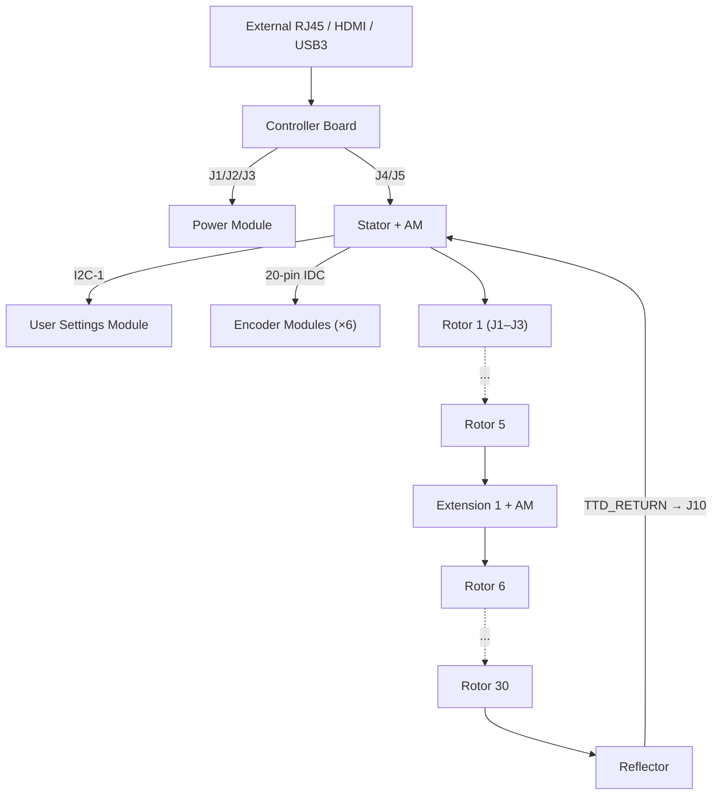
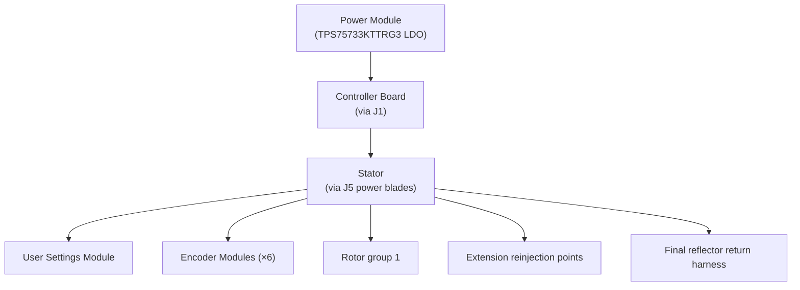
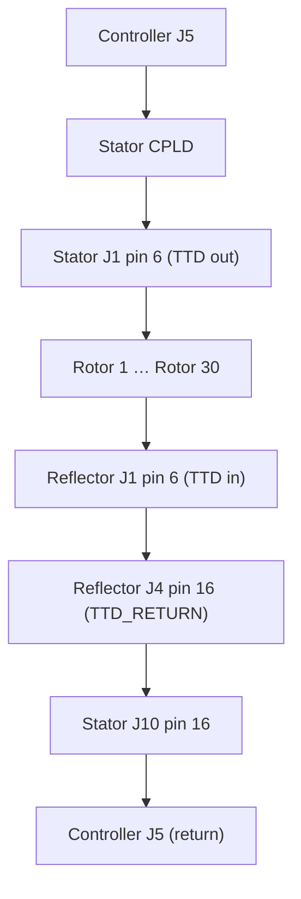

# Enigma-NG System Architecture

**Status:** Draft
**Project:** Enigma-NG
**Author:** Izzyonstage & GitHub Copilot
**Version:** v.0.1.0
**Associated Hardware Revision:** Rev A
**Last Updated:** 2026-08-12

---

## 1. Board Hierarchy and Physical Structure

The Enigma-NG system comprises the following boards:

- **Controller Board (CM5)** - Raspberry Pi CM5 carrier and the mechanical motherboard of the machine.
  Hosts the external RJ45, Ethernet ESD/magnetics, PoE front-end, HDMI, USB 3.0, the dock
  interfaces to both the Power Module and the Stator, and the host dock for the primary Actuation
  Module.
- **Power Module** - Removable power-conditioning / UPS cartridge. Accepts local USB-C and battery
  inputs plus a regulated PoE-derived auxiliary feed from the Controller; generates `5V_MAIN` and
  `3V3_ENIG`, manages hold-up energy, and remains the only intentional `GND` ↔ `GND_CHASSIS` bond.
- **Stator** - Removable vertical daughterboard mounted from the enclosure wall. Receives power and
  logic from the Controller through two hybrid blind-mate connectors; fans power and JTAG into the
  rotor stack and hosts the routing / reflector CPLD.
- **User Settings Module** - Panel-mount switch and RGB indicator board on the shared Stator `I2C-1` bus;
  provides user-facing routing/reflector configuration input.
- **Rotors (x30)** - Arranged in groups of 5, chaining directly output-to-input. An Extension Board sits
  between each group of 5 to re-buffer broadcast signals.
- **Extension Board (up to x5 within Rev A power budget)** - Bridges between rotor groups;
  re-buffers TCK and TMS, passes the reflector-boundary service harness, and hosts one local
  Actuation Module. Minimum configuration: Stator → [5 Rotors] → Reflector (0 Extensions,
  5 rotors). Full build: 6 groups of 5 rotors separated by 5 Extension boards, terminated by the
  Reflector (30 rotors total).
- **Actuation Module (x1 Controller-local + up to x5 Extension-local)** - Shared service board that
  performs local servo homing, one-shot request capture, and servo PWM generation.
- **Reflector** - Mandatory end-of-chain turnaround board after the final rotor; provides the physical
  `ENC` return path and routes `TTD_RETURN` back to the Stator while the selected reflection map is
  applied by the Stator CPLD.
- **Encoder Modules (x6)** - 1 `KBD_ENC`, 1 `LBD_DEC`, and 4 plugboard modules
  (`PLG_PASS1_DEC`, `PLG_PASS1_ENC`, `PLG_PASS2_DEC`, `PLG_PASS2_ENC`). Connect to the Stator in
  three banks of two identical 20-pin IDC ports.
- **JTAG Module** - USB Blaster II implementation for programming CPLDs.

### Physical Chain

The Power Module and Stator are both removable daughtercards. The Controller is the fixed
mechanical reference that mates to both boards and owns all enclosure-edge I/O.

---

## 2. Interconnect Architecture

### 2.1 Controller ↔ Power Module

The Controller ↔ Power Module dock uses three 10-position TE 2.5 mm board-to-board connectors:

| Link | Function | Controller side | Power Module side |
| :--- | :--- | :--- | :--- |
| J1 | Main regulated rails (`5V_MAIN`, `3V3_ENIG`, `GND`) | TE `1-1674231-1` receptacle | TE `1123684-7` plug |
| J2 | Regulated PoE-derived auxiliary input (`VIN_POE_12V` + `GND`) | TE `1-1674231-1` receptacle | TE `1123684-7` plug |
| J3 | Low-speed control / telemetry (`I2C-1`, `PM_IO_INT_N`, `PWR_GD`, `ROTOR_EN_N`, `PWR_BUT_N`, `LED_PWR_N`) | TE `1-1674231-1` receptacle | TE `1123684-7` plug |

Functional allocation:

- **J1:** `3 x 5V_MAIN`, `2 x 3V3_ENIG`, `5 x GND`
- **J2:** `3 x VIN_POE_12V`, `7 x GND`
- **J3:** `I2C_SDA`, `I2C_SCL`, `PM_IO_INT_N`, `PWR_GD`, `ROTOR_EN_N`, `PWR_BUT_N`, `LED_PWR_N`, `3 x GND`

**Reference datasheets:** [`TE-1-1674231-1-datasheet.md`](../Datasheets/TE-1-1674231-1-datasheet.md),
[`TE-1123684-7-datasheet.md`](../Datasheets/TE-1123684-7-datasheet.md)

### 2.2 Controller ↔ Stator

The Controller ↔ Stator dock uses two Molex EXTreme Guardian HD hybrid connectors:

| Link | Function | Controller side | Stator side |
| :--- | :--- | :--- | :--- |
| J4 | 5V-biased power dock | Molex `2195630015` receptacle | Molex `2195620015` plug |
| J5 | 3V3/JTAG/I2C dock | Molex `2195630015` receptacle | Molex `2195620015` plug |

Functional allocation:

- **J4 power blades:** `4 x 5V_MAIN`, `1 x GND`
- **J4 signal field:** additional `GND` returns / guards
- **J5 power blades:** `4 x 3V3_ENIG`, `1 x GND`
- **J5 signal field:** guarded `TCK`, `TMS`, `TDI`, `TTD_RETURN`, `I2C_SDA`, `I2C_SCL`, with all
  remaining signal contacts tied to `GND`

The small signal contacts are valid current-carrying return paths as well as guards; the family
specification rates them at 4.5 A/contact.

**Reference datasheets:** [`Molex-2195630015-datasheet.md`](../Datasheets/Molex-2195630015-datasheet.md),
[`Molex-2195630015-drawings.md`](../Datasheets/Molex-2195630015-drawings.md),
[`Molex-2195620015-datasheet.md`](../Datasheets/Molex-2195620015-datasheet.md),
[`Molex-2195620015-drawings.md`](../Datasheets/Molex-2195620015-drawings.md),
[`Molex-ExtremeGuardianHD-2141130000-PS-000-specification.md`](../Datasheets/Molex-ExtremeGuardianHD-2141130000-PS-000-specification.md)

### 2.3 Rotor-Stack Connectors

All rotor-stack interconnects remain on the Samtec Edge-Rate series 0.8 mm board-to-board connectors:

- **ERM8** - male header (originating / input side of a connection)
- **ERF8** - female socket (receiving / output side of a connection)

These connectors are used only for the rotor / extension / reflector chain.

---

## 3. Power Architecture

The Power Module produces two rails from three upstream sources:

- **Controller-fed PoE auxiliary:** `VIN_POE_12V` enters the PM from the Controller after the RJ45,
  PoE PD, transformer, and cable-entry EMI/ESD stages.
- **Local USB-C PD input:** handled on the Power Module.
- **Local smart-battery input:** handled on the Power Module.

Generated rails:

- **5V_MAIN** - Up to 12A; dual-phase interleaved `LMQ61460-Q1`
- **3V3_ENIG** - Clean 3.3V; `TPS75733KTTRG3` LDO post-regulator

### Grounding Rule

The Controller may implement local shield/chassis handling for enclosure-entry connectors such as RJ45,
but the only intentional DC bond between `GND` and `GND_CHASSIS` remains on the Power Module at the
main power-entry boundary before the eFuse. No second bond is permitted on the Controller or Stator.

### 3V3_ENIG Power Flow

---

## 4. JTAG Serial Chain (TTD Net)

### TTD Net Name

The JTAG serial chain data pin is designated **TTD** (JTAG Transmission Data) at **pin 6** on all
rotor-stack JTAG connectors. This unified name avoids TDI/TDO direction confusion:

- On the **input side** (J1 pin 6): TTD carries incoming TDI from the previous stage.
- On the **output side** (J4 pin 6): TTD carries outgoing TDO to the next stage's TDI.

### Serial Chain Path (Controller -> Reflector -> TTD_RETURN)

### TCK and TMS - Broadcast Signals

**TCK** and **TMS** are broadcast signals. They leave the Controller via the Stator `J5` logic dock
and then propagate through the rotor chain in parallel.

### Extension Board Signal Buffering

Every 5 rotors, an Extension board re-buffers **TCK** and **TMS** using a `74LVC2G125` dual-buffer IC
(U1). **TTD is NOT buffered at Extensions** - it is a serial chain signal and must pass uninterrupted
through each CPLD.

### Signal Integrity

| Component | Location | Value | Purpose |
| :--- | :--- | :--- | :--- |
| TTD path | Rotor stack board-to-board hops | Direct | No per-rotor series resistor on the BtB chain |
| R1 | Reflector TTD input | 22Ω series | Reflector end-of-chain TTD termination |
| R2 | Each Rotor | 10kΩ pull-up | TMS default-high |
| R3 | Each Rotor | 10kΩ pull-up | TDI default-high |
| R4 | Each Rotor | 10kΩ pull-down | TCK default-low |
| R5 | Each Rotor | 10kΩ pull-up | CPLD_RESET_N default-high (inactive) |

---

## 5. I2C Topology

All system management devices remain on the single shared `I2C-1` bus.

> **Authoritative I2C address table:** see `Controller/Design_Spec.md §4.1` for the full list of
> device addresses, locations, and functions across all boards sharing the `I2C1` bus (Power
> Module, Stator, User Settings Module, Cypher-Input). This section documents topology only, to
> avoid duplicating a table that must otherwise be kept in sync in two places.

The PM-local expander uses the address block adjacent to the PM INA219 so PM devices remain grouped in
`i2cdetect` output.
