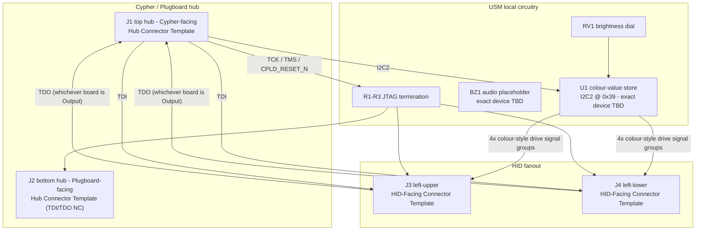

# User Settings Module (V1.0) Design Specification

**Status:** In Review
**Project:** Enigma-NG
**Author:** Izzyonstage & GitHub Copilot
**Version:** v.0.1.0
**Associated Hardware Revision:** Rev A
**Last Updated:** 2026-09-21

---

## 1. Overview

The User Settings Module (USM) is the shared LED-illumination-colour, audio-placeholder, and
JTAG/I2C spine board for the local Cypher HID assembly. It connects upward to the Cypher Board,
downward to Cypher-Plugboard, and leftward to whichever Cypher-Input and Cypher-Output boards are
installed (either order). USM stores four independent CM5-configured RGB colour styles on a
dedicated Cypher-peripherals I2C bus, retains the physical brightness dial, broadcasts all four
colour styles' drive signals to both HID boards, hosts a reserved audio-warning output, and
provides the JTAG broadcast/return routing and idle-state termination between Cypher and the HID
pair. The board carries no `ENC_DATA` signals and performs no real-time per-key logic itself -
applying colour values to actual LEDs, and deciding which colour style applies to a given key/lens
in real time, is entirely each HID board's own local responsibility.

| Circuit Responsibility | Board Role | Key Component |
| :--- | :--- | :--- |
| Colour-style store | Holds four CM5-written RGB colour values and drives their signals onto both HID connectors | `U1` - colour-value store, exact device TBD |
| Brightness control | User-facing dial setting the shared illumination level | `RV1` - Bourns `3310P-001-503L` |
| Audio warning (placeholder) | Reserved output for CM5-triggered warning tones; part selection deferred | `BZ1` - exact device TBD |
| Cypher-facing hub connector | Relays `3V3_ENIG`, JTAG, and `I2C2` to/from the Cypher Board | `J1` |
| Plugboard-facing hub connector | Identical template to `J1` | `J2` |
| HID-facing connectors | Relay `3V3_ENIG`, `I2C2`, JTAG, and all four colour-style signal groups to whichever HID board is installed | `J3`, `J4` |
| JTAG idle termination | Local pull network for the broadcast JTAG signals | `R1`-`R3` |

### Functional Requirements

| ID | Functional Requirement | Notes | Satisfied By / Cross-Ref |
| :--- | :--- | :--- | :--- |
| FR-USM-01 | Store four CM5-configured RGB colour styles for the HID lighting system | Exact device remains open; the initial system configuration uses only 3 of the 4 styles - see Section 2 | Section 2; BOM `U1` |
| FR-USM-02 | Broadcast all four colour styles' drive signals to both HID boards regardless of their physical order | `RED_DRIVE_{n}_N`/`GREEN_DRIVE_{n}_N`/`BLUE_DRIVE_{n}_N`/`ILLUMINATION_DRIVE_{n}_N` (n = 1-4) are carried identically on `J3` and `J4` | Section 2; `Board_Layout.md §3`; BOM `J3`, `J4` |
| FR-USM-03 | Provide the shared physical brightness dial for the HID lighting system | `RV1`; exact interaction with the four colour styles is a HID-board-local decision | Section 2; BOM `RV1` |
| FR-USM-04 | Relay `3V3_ENIG`, the dedicated Cypher-peripherals I2C bus, and HID JTAG between the Cypher Board and the HID pair | Cypher uses the top hub connector (`J1`); HID boards use the two left connectors (`J3`/`J4`); the bottom connector (`J2`) carries an identical template | Section 4; `Board_Layout.md §2`-`§3`; BOM `J1`-`J4` |
| FR-USM-05 | Terminate the broadcast JTAG nets locally on the spine board | `TCK` pull-down, `TMS` pull-up, and `CPLD_RESET_N` pull-up | Section 4; BOM `R1`-`R3` |
| FR-USM-06 | Reserve an audio output path for a later buzzer/speaker decision | Part selection remains deferred to `.copilot/todos/usm-buzzer-audio-options.md` | Section 3; BOM `BZ1` |

### Design Requirements

| ID | Design Requirement | Specification | Satisfied By / Cross-Ref |
| :--- | :--- | :--- | :--- |
| DR-USM-01 | PCB stackup | 4-layer standard per `design/Standards/Global_Routing_Spec.md §2.3.1` | Section 6 |
| DR-USM-02 | Cypher-facing hub connector | `J1` = `QTS-025-01-L-D-RA-P`, top edge, Hub Connector Template pin map | `Board_Layout.md §2`; BOM `J1` |
| DR-USM-03 | Plugboard-facing hub connector | `J2` = `QSS-025-01-L-D-RA-K`, bottom edge, Hub Connector Template pin map identical to `J1`; `TDI`/`TDO` left NC on this connector since no active JTAG device is present beyond it | `Board_Layout.md §2`; BOM `J2` |
| DR-USM-04 | HID-facing connectors | `J3` and `J4` = `QSS-025-01-L-D-RA-K`, left edge, HID-Facing Connector Template pin map, identical wiring on both | `Board_Layout.md §3`; BOM `J3`, `J4` |
| DR-USM-05 | Brightness dial | `RV1` = `3310P-001-503L`, the shared HID brightness control source | Section 2; BOM `RV1` |
| DR-USM-06 | JTAG termination resistors | `R1` = `TCK` 10 kOhm pull-down to GND; `R2` = `TMS` 10 kOhm pull-up to `3V3_ENIG`; `R3` = `CPLD_RESET_N` 10 kOhm pull-up to `3V3_ENIG` | Section 4; BOM `R1`-`R3` |
| DR-USM-07 | Colour-value store address reservation | `U1` reserved at `0x39` on the dedicated Cypher-peripherals I2C bus (bus naming/numbering TBD - see `.copilot/todos/cypher-input-led-independent-rgb-pwm-review.md`) | Section 2 |
| DR-USM-08 | Colour-value-store implementation status | Exact colour-store IC, and how many colour styles the initial system configuration actually uses (3 of the 4 provisioned), remain tracked in `.copilot/todos/cypher-input-led-independent-rgb-pwm-review.md` | Section 2; BOM `U1` |
| DR-USM-09 | Audio placeholder status | `BZ1` remains a placeholder-only BOM position pending `.copilot/todos/usm-buzzer-audio-options.md` | Section 3; BOM `BZ1` |
| DR-USM-10 | 3V3 entry decoupling bank | `C1`-`C5` = 5x 10uF X7R 50V 1206 at the USM `3V3_ENIG` entry nodes per the bulk-entry rule in `design/Standards/Global_Routing_Spec.md §3` | Section 6; BOM `C1`-`C5` |
| DR-USM-11 | Local logic bypass | `C6` = 100nF X7R 50V 0402 local logic bypass capacitor | Section 6; BOM `C6` |
| DR-USM-12 | Mounting holes | `MH1`-`MH4`: M3 PTH tied to `GND_CHASSIS` per GRS Section 4 | Section 6 |

### Component Block Diagram

---

## 2. Colour-Value Store & Brightness Control

USM stores **four independent RGB colour styles**, written by CM5 over the dedicated
Cypher-peripherals I2C bus (distinct from the system `I2C1` bus). The initial system
configuration only uses three of the four styles:

| Style | Initial-configuration meaning |
| :--- | :--- |
| Colour1 | Idle / static baseline illumination |
| Colour2 | Standard key-press indicator |
| Colour3 | Shifted key-press indicator |
| Colour4 | Reserved for future use - not consumed by any board in the initial configuration |

`U1` is the colour-value store: it holds the four styles and drives their signals onto both `J3`
and `J4` identically (see `Board_Layout.md §3` for the pin map). The exact IC/mechanism for this
store has not been chosen - see DR-USM-08 and
`.copilot/todos/cypher-input-led-independent-rgb-pwm-review.md`
for the open decision and its dependency on the wider LED implementation PoC. `U1` is reserved at
I2C address `0x39` (DR-USM-07); this address and the bus it sits on are provisional pending that
same review.

`RV1` (Bourns `3310P-001-503L`) is the single shared brightness control for the whole HID
assembly. Exactly how the dial's setting interacts with the four colour styles (e.g. a single
shared illumination scaling applied by each HID board's own local drive stage) is not yet
determined and is tracked in the same LED-implementation review.

---

## 3. Audio Warning (Placeholder)

USM reserves a single audio-output position (`BZ1`) for CM5-triggered warning tones (e.g. invalid
plugboard configuration, invalid HID component combination). The choice between a simple piezo
buzzer and a speaker+amplifier stage - and the associated volume-control requirement - remains
open and is tracked in `.copilot/todos/usm-buzzer-audio-options.md`. No part is selected and no
drive circuit is specified yet.

---

## 4. JTAG / I2C Spine

USM sits inline in the JTAG chain between Cypher and the HID pair, and relays the dedicated
Cypher-peripherals I2C bus between them as well.

- **`TDI`** arriving at `J1` from Cypher (ultimately from the FT232H JTAG bridge) is broadcast
  internally to both `J3`'s and `J4`'s `TDI_INPUT` pin. Whichever HID board self-identifies (via
  its own `BOARD_ROLE_ID`) as the Input-role board consumes this as its own real JTAG TDI.
- **`TDO`**: whichever HID board self-identifies as the Output-role board drives its own real TDO
  onto whichever connector (`J3` or `J4`) it is plugged into, on that connector's `TDO_OUTPUT` pin.
  USM routes this internally, directly to `J1`'s own `TDO` pin - closing the loop straight back to
  Cypher without the signal ever reaching `J2`/Cypher-Plugboard.
- **`J2`'s own `TDI`/`TDO`** are left NC - Cypher-Plugboard has no active JTAG device and is not
  part of the JTAG data chain.
- **`TMS`/`TCK`/`CPLD_RESET_N`** are broadcast (forked, not chained) across `J1`, both HID
  connectors, and `J2` identically. USM hosts the idle-state termination for these three signals
  locally:

  | RefDes | Signal | Termination |
  | :--- | :--- | :--- |
  | `R1` | `TCK` | 10 kOhm pull-down to GND |
  | `R2` | `TMS` | 10 kOhm pull-up to `3V3_ENIG` |
  | `R3` | `CPLD_RESET_N` | 10 kOhm pull-up to `3V3_ENIG` |

- **`I2C_SDA`/`I2C_SCL`** (the dedicated Cypher-peripherals bus) arrive at `J1` from Cypher and are
  relayed to both `J3` and `J4`, and also feed `U1` (the local colour-value store) directly.

---

## 5. Connectors

USM owns two connector pin-map templates.

- **`J1`/`J2` - Hub Connector Template:** `J1` (top edge, mates the Cypher Board)
  and `J2` (bottom edge, mates Cypher-Plugboard) share an identical pin map, carrying `3V3_ENIG`,
  the dedicated Cypher-peripherals I2C bus, and JTAG. `TDI`/`TDO` are left NC on `J2` (see Section
  4). Full pin map: `Board_Layout.md §2`.
- **`J3`/`J4` - HID-Facing Connector Template:** `J3` (left-upper edge) and `J4`
  (left-lower edge) share an identical pin map, each carrying `3V3_ENIG`, the dedicated
  Cypher-peripherals I2C bus, JTAG, and all four colour-style signal groups
  (`RED`/`GREEN`/`BLUE`/`ILLUMINATION_DRIVE_{1,2,3,4}_N`). Either HID board may occupy either
  connector. Full pin map: `Board_Layout.md §3`.

---

## 6. PCB Fabrication & Stackup

- **Stackup:** 4-layer standard per `design/Standards/Global_Routing_Spec.md §2.3.1`.
- **Manufacturer:** JLCPCB, standard SMT PCBA.
- **Rail entry decoupling (Bulk Entry Bank Rule per GRS §3):** `C1`-`C5` = 5x 10uF X7R 50V 1206 at
  `J1` `3V3_ENIG` entry. `C6` = local logic bypass.
- **Mounting Holes:** `MH1`-`MH4`, M3 PTH, tied to `GND_CHASSIS` per GRS Section 4. Placement per
  GRS Section 4.3. Exact XY positions TBD at PCB layout; this board's exact mechanical mounting
  location/method is deferred to
  `.copilot/todos/usm-3-part-hid-module-mechanical-review.md`.

## 7. Thermal & ESD

- **Thermal:** No active cooling required. All fitted components are low-power logic/analog
  devices.
- **ESD - connectors:** No TVS/ESD protection required. `J1`-`J4` are internal board-to-board
  connectors, not hot-swapped or externally accessible during normal servicing, per
  `design/Standards/Global_Routing_Spec.md §9`.
- **ESD - `RV1` (open item):** `RV1` is operator-accessible through the enclosure (exact mounting
  method deferred to `.copilot/todos/usm-3-part-hid-module-mechanical-review.md`). GRS Section 9
  scopes its ESD/TVS requirement to connectors only and does not address operator-touched
  non-connector components such as a potentiometer knob; there is no established precedent
  elsewhere in this design for this case. Whether `RV1` needs its own ESD protection remains open
  and should be resolved once the mechanical mounting method (and knob material) is settled.

## 8. Branding & Traceability

- **Data Plate:** Per GRS Section 6, Revision Block text: `EINSTELLWERK [Settings] V1.0`.
- **Connector Pin-1 Markers:** `J1`-`J4` silkscreen pin-1 markers required per GRS Section 7.1.

## 9. Bill of Materials

> `U1` (colour-value store) and `BZ1` (audio placeholder) are placeholder-only BOM positions -
> exact devices remain open, see DR-USM-08/DR-USM-09. Do not source either without explicit user
> confirmation.

| RefDes | Specification | MPN | Manufacturer | DigiKey PN | Mouser PN | JLCPCB PN | Alt Supplier + PN | Notes | Footprint Available | Footprint Downloaded | Qty |
| --- | --- | --- | --- | --- | --- | --- | --- | --- | --- | --- | --- |
| `C1`-`C5` | 10uF X7R 50V 1206 | CL31B106KBK6PJE | Samsung | 1276-CL31B106KBK6PJECT-ND | 187-CL31B106KBK6PJE | C43935922 | - | `3V3_ENIG` entry decoupling bank at `J1` | ✔ | ✔ | 5 |
| `C6` | 100nF X7R 50V 0402 | CL05B104KB5NNNC | Samsung | 1276-CL05B104KB5NNNCCT-ND | 187-CL05B104KB5NNNC | C960916 | - | Local logic bypass | ✔ | ✔ | 1 |
| `J1`, `J3`, `J4` | 50-contact 0.635mm right-angle male SMT | QTS-025-01-L-D-RA-P | Samtec | QTS-025-01-L-D-RA-P-ND | 200-QTS02501LDRAP | C7267889 | - | `J1` Cypher-facing hub connector | ✔ | ✔ | 1 |
| `J2` | 50-contact 0.635mm right-angle female SMT | QSS-025-01-L-D-RA-K | Samtec | QSS-025-01-L-D-RA-K-ND | 200-QSS02501LDRAK | C6156774 | - | Plugboard-facing hub connector | ✔ | ✔ | 1 |
| `R1`-`R3` | 10kOhm 1% 0402 | ERJ-2RKF1002X | Panasonic | P10.0KLCT-ND | 667-ERJ-2RKF1002X | C191123 | - | `R1`: `TCK` pull-down to GND; `R2`: `TMS` pull-up to `3V3_ENIG`; `R3`: `CPLD_RESET_N` pull-up to `3V3_ENIG` | ✔ | ✔ | 3 |
| `RV1` | 0-50 kOhm linear rotary potentiometer | 3310P-001-503L | Bourns | 3310P-001-503L-ND | 652-3310P-001-503L | C5891432 | - | Shared HID brightness dial | ✔ | ✔ | 1 |
| `U1` | I2C colour-value store, exact device TBD | TBD | TBD | - | - | - | - | Reserved at `0x39` on the dedicated Cypher-peripherals I2C bus; see DR-USM-08 | - | - | 1 |
| `BZ1` | Audio output, exact device TBD | TBD | TBD | - | - | - | - | Piezo vs speaker+amp decision deferred to `.copilot/todos/usm-buzzer-audio-options.md` | - | - | 1 |

> **Sourcing status:** `J1`-`J4`, `R1`-`R3`, `RV1`, and the decoupling capacitors have confirmed
> sourcing (reused from already-approved parts elsewhere in the design). `U1` and `BZ1` remain
> open sourcing items - do not source either without explicit user confirmation.
