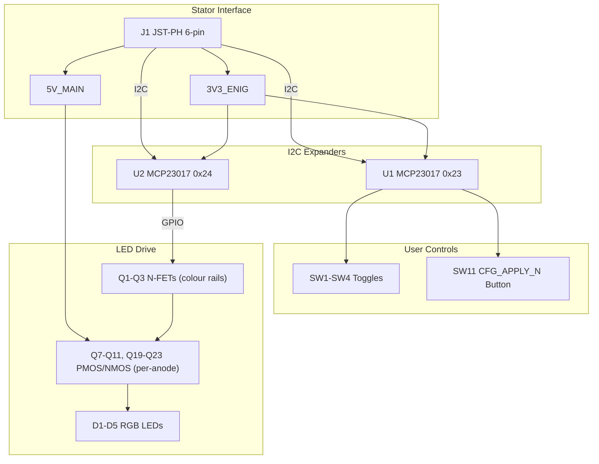

# User Settings Module (V1.0) Design Specification

**Status:** In Review
**Project:** Enigma-NG
**Author:** Izzyonstage & GitHub Copilot
**Version:** v.0.1.0
**Associated Hardware Revision:** Rev A
**Last Updated:** 2026-08-16

---

## 1. Overview

The User Settings Module is a panel-mount PCB providing user-accessible hardware configuration controls
for the Enigma-NG system. It replaces the DIP switches previously located on the Stator Board with
4 sub-miniature SPDT toggle switches plus 5 discrete RGB status LEDs, mounted through the right
side of the enclosure top face near the rotors. A momentary active-low `CFG_APPLY_N` pushbutton
captures the user's configuration intent; the CM5 firmware then mirrors that request onto the
Stator-side apply/reset path.

> **Interim reduction (2026-08-16):** the former Bank 2 (`CFG_REFMAP[5:0]` reflector-map selection)
> hardware - switches, LEDs, and the dedicated U3 expander - has been removed from this board. The
> reflector map is expected to move to a CM5-configuration-time scheme instead of a hardwired
> switch bank, since the Stator CPLD does not have room for a useful on-device map dictionary
> anyway. This is an **interim state** pending a fuller redesign discussion (related to Cypher
> Board `BOARD_ROLE_ID` comparator pin-budget work) - see `.copilot/todos/usm-cfg-refmap-removal-
> review.md`. RefDes gaps left by this removal (SW5-SW10, D6-D12, U3, Q4-Q6, Q12-Q18, Q24-Q30, and
> the corresponding resistor sub-ranges) are **intentionally not renumbered** in this pass; full
> renumbering is deferred to that future review, once the final Bank 2 replacement architecture is
> confirmed.

The User Settings Module communicates with the Stator Board exclusively via a 6-wire I²C harness
(J1 → Stator J13), sharing the Stator I²C-1 bus. It hosts two MCP23017 GPIO expanders:

* **U1 (@ 0x23):** Reads the 4 toggle-switch states and the `CFG_APPLY_N` momentary button.
* **U2 (@ 0x24):** Drives Bank 1 LED anodes (1 source-status LED + 4 config LEDs) and RGB bank-rail low-side switches.

No JTAG chain is present on this board. All configuration logic is handled by the CM5 enigma
daemon over I²C.

* **Location:** Right side of enclosure top face, near rotors.
* **Mounting:** Panel-mount switches through enclosure panel; PCB mounted behind panel.
* **Stackup:** 4-layer standard per `design/Standards/Global_Routing_Spec.md §2.3.1`.
* **Role:** User-accessible configuration panel; I²C peripheral to Stator Board.

### Functional & Design Requirements

#### Functional Requirements

| ID | Functional Requirement | Notes | Satisfied By / Cross-Ref |
| :--- | :--- | :--- | :--- |
| FR-USM-01 | Provide 4 user-accessible toggle switches with matching RGB status LEDs for hardware configuration without opening the enclosure | 4 toggles for routing config, plus 1 RGB source-status LED; panel-mount through enclosure top face. Was 10 toggles/2 status LEDs prior to the 2026-08-16 Bank 2/`CFG_REFMAP` removal - see §1 | §3 Configuration Bank Descriptions; §4 I²C Devices |
| FR-USM-02 | Allow CM5 firmware / GUI presets to override the user-intent configuration on a per-bank basis | CM5 decides authority in software, drives the final applied config on the Stator, and reflects source state back to the Settings indicators via `CFG_ROUTE_CM5_ACTIVE` | §5 LED Control Logic; `design/Electronics/Stator/Design_Spec.md` FR-STA-08/09 |
| FR-USM-03 | Provide visual feedback via RGB LED illumination showing configuration source and active bit state | Green = user-intent forwarded; Red = CM5-defined override active; per-bank shared colour rails + per-bit individual LED anode drive with per-colour cathode-return resistors | §5 LED Control Logic |
| FR-USM-04 | Provide a momentary `CFG_APPLY_N` pushbutton that requests Stator CPLD configuration reload | CM5 daemon polls U1 GPA[6]; active-low; 10kΩ pull-up + 100nF X7R 0402 debounce cap. A board-mounted tactile switch actuated through the enclosure is acceptable; the switch itself need not be panel-mount. | §6 `CFG_APPLY_N` Button |
| FR-USM-05 | Connect to the Stator Board via a 6-wire I²C harness (`3V3_ENIG`, `5V_MAIN`, 2x `GND`, `SDA`, `SCL`) | J1 = 6-pin JST PH 2.0mm connector; shares Stator I²C-1 bus; `5V_MAIN` powers the indicator LEDs | §7 Interconnects; BOM J1 |

#### Design Requirements

| ID | Design Requirement | Specification | Satisfied By / Cross-Ref |
| :--- | :--- | :--- | :--- |
| DR-USM-01 | PCB stackup | Stackup per `design/Standards/Global_Routing_Spec.md §2.3.1` | §8 PCB Fabrication |
| DR-USM-02 | Switch + indicator type | 4x E-Switch 200MSP1T2B4M2QE panel-mount SPDT latching toggle switches plus 5x Kingbright WP154A4SEJ3VBDZGW/CA common-anode RGB through-hole LEDs; 4 LEDs mirror config bits and 1 LED indicates CM5-vs-user authority | §3 Configuration Bank Descriptions; BOM SW1-SW4, D1-D5 |
| DR-USM-03 | Switch input expander | U1 = MCP23017T-E/SO @ 0x23; SOIC-28; contiguous after the Stator expander block | §4 I²C Devices - U1; BOM U1 |
| DR-USM-04 | LED control expander | U2 = MCP23017T-E/SO @ 0x24 (Bank 1); SOIC-28; per-indicator anodes plus shared RGB bank rail. U3 (former Bank 2/`CFG_REFMAP` LED driver, @ 0x25) removed 2026-08-16 - see §1 | §4 I²C Devices - U2; §5 LED Control Logic; BOM U2 |
| DR-USM-05 | LED colour-rail transistors | 3x BSS138 SOT-23 N-channel MOSFETs (`Q1-Q3`); gate driven via 1kΩ resistor; GPIO HIGH = transistor ON | §5 LED Control Logic; BOM Q1-Q3 |
| DR-USM-06 | LED power supply | `5V_MAIN` from the Stator via J1 pin 2; full RGB operation at 5V uses 150Ω red and 100Ω green/blue series resistors; LED anodes connect to `5V_MAIN` via per-anode PMOS high-side switches (Q19-Q23) - see DR-USM-10 | §7 Interconnects - J1; §5 LED Control Logic; BOM R18-R22, R30-R39, Q7-Q11, Q19-Q23, R54-R58, R66-R70 |
| DR-USM-07 | `CFG_APPLY_N` button | SW11 = Omron B3F-1070 or equivalent SPST NO through-hole tactile switch, active-low; mounted on the User Settings Module and actuated through the enclosure by a mechanical plunger/cap; 10kΩ pull-up to 3V3_ENIG + 100nF debounce cap; U1 GPA[6] | §6 `CFG_APPLY_N` Button; BOM SW11, R1, C4 |
| DR-USM-08 | I²C connector | J1 = 6-pin JST PH 2.0mm B6B-PH-K-S(LF)(SN); pins: `3V3_ENIG`, `5V_MAIN`, `GND`, `SDA`, `SCL`, `GND`; harness to Stator J13 | §7 Interconnects; BOM J1 |
| DR-USM-09 | Switch input wiring | Each SPDT toggle (SW1–SW4): NC terminal to GND, NO terminal to 3V3_ENIG, COM terminal via 330Ω series resistor (R2–R5) to U1 input (GPA[3:0]); both throws hard-terminated; GPIO HIGH when switch ON, LOW when OFF. GPB[5:0] (former `CFG_REFMAP` switch inputs) is now fully spare - see §4 U1 | §4 I²C Devices - U1; BOM SW1-SW4, R2-R5 |
| DR-USM-10 | Per-anode LED high-side switch | 5x two-stage per-anode high-side switch: MCP23017 GPIO → 1 kΩ gate resistor (R54-R58) → BSS138 NMOS pre-driver (Q7-Q11); BSS138 drain pulls PMOS gate low; 47 kΩ pull-up (R66-R70) from PMOS gate to `5V_MAIN`; PMOS source at `5V_MAIN`, drain to LED anode; GPIO HIGH → LED ON (non-inverted logic); this topology isolates the MCP23017 3.3 V GPIO from direct-driving 5 V LED anodes | §5 LED Control Logic; BOM Q7-Q11, Q19-Q23, R54-R58, R66-R70 |
| DR-USM-11 | Mounting holes | MH1–MH4 shall be M3 PTH (Ø3.2 mm drill) mounting holes (KiCAD built-in `MountingHole` footprint; no purchasable BOM component), bonded to `GND_CHASSIS` per `design/Standards/Global_Routing_Spec.md §4`. Placement follows GRS §4.3 Pattern A (rectangular board): MH1 bottom-left, MH2 bottom-right, MH3 top-right, MH4 top-left — all at 7 mm inset from both nearest edges. Exact XY coordinates TBD at PCB layout. | §2 Core Features (GND_CHASSIS section); `design/Standards/Global_Routing_Spec.md §4.3` |
| DR-USM-12 | Per-IC bypass capacitors | Per-IC bypass capacitor rule applies per `design/Standards/Global_Routing_Spec.md §3.2`. C1 and C2 are the bypass capacitors for U1 and U2 respectively. C3 (former U3 bypass) removed 2026-08-16 - see §1 | §10 BOM (C1-C2); §12 Component Count Summary; `design/Standards/Global_Routing_Spec.md §3.2` |
| DR-USM-13 | MCP23017 /RESET pull-up resistors | U1, U2 /RESET (pin 17, active-low) each pulled to 3V3_ENIG via 10 kΩ 0402 resistor: R96 (U1), R97 (U2). When 3V3_ENIG is unpowered (0 V), /RESET = 0 V → device held in reset; when 3V3_ENIG rises, pull-up de-asserts /RESET → clean power-on reset sequencing. The MCP23017 internal weak pull-up (~60 kΩ) is insufficient for reliable operation over PCB leakage paths during rail ramp conditions (MCP23017 datasheet §2.3). /RESET must NOT be connected to CPLD_RESET_N, which is a CPLD-only signal driven by the Stator and not valid until after CM5 boot. Consistent with Stator DR-STA-12 (R36/R37/R38 for STA U6/U7/U8). R98 (former U3 /RESET pull-up) removed 2026-08-16 - see §1 | §4 I²C Devices; BOM R96-R97; MCP23017 datasheet §2.3 |

### Component Block Diagram

---

## 2. Core Features

* **4 Panel-Mount Toggle Switches + 5 RGB LEDs:** E-Switch 200 series SPDT toggles provide the
  user-intent configuration inputs; one discrete Kingbright common-anode RGB LED is mounted beside
  each config position, plus one additional RGB source-status LED. Bank 1 (`CFG_ROUTE`) has 4
  config toggles + 5 LEDs total. The former Bank 2 (`CFG_REFMAP`, 6 toggles + 7 LEDs) was removed
  2026-08-16 - see §1.
* **Two-Expander Architecture:** U1 reads all switch states, while U2 drives the remaining
  indicator bank. Separate expanders prevent LED drive state from interfering with switch
  read-back and keep the Settings address block contiguous after the Stator.
* **Bank CM5-Active Status:** Bank 1 has a CM5-owned logical state (`CFG_ROUTE_CM5_ACTIVE`)
  reflected by the bank's source-status LED and shared colour rail. LOW = the CM5 is forwarding
  user-intent config. HIGH = the CM5 is applying a GUI-selected or automated override.
* **RGB LED Feedback:** Green = switch-defined active; Red = CM5-defined override. Blue remains
  available for CM5-controlled status, boot, or fault states. Per-bit anode control illuminates
  only set bits. The shared bank RGB rail simplifies wiring (3 low-side sink MOSFETs total).
* **`CFG_APPLY_N` Button:** Momentary pushbutton requests a Stator-only configuration reload via the
  CM5 daemon. CM5 reads the user-intent switch state, writes the final config to U8 on the
  Stator, and pulses the Stator-side `CFG_APPLY_N` output low.
* **I²C-Only Interface:** 6-wire harness to Stator (`3V3_ENIG`, `5V_MAIN`, `GND`, `SDA`, `SCL`, `GND`) - no parallel signal wiring.

### GND_CHASSIS Single-Point Bond

Per `design/Standards/Global_Routing_Spec.md §5`, the User Settings Module implements a local
`GND_CHASSIS` net tied to its mounting holes and any panel-contact mechanical features, but it does
**not** implement a local GND-to-GND_CHASSIS bond. The system's only galvanic GND ↔ GND_CHASSIS
bond is defined on the Power Module at the common power-entry point immediately before the eFuse.
J1 pin 3 is therefore **logic GND return only**, and must not be repurposed as a local
chassis-bond point.

---

## 3. Configuration Bank Descriptions

### Bank 1 - Plugboard Routing (`CFG_ROUTE[3:0]` + `CFG_ROUTE_CM5_ACTIVE`)

Bank 1 provides a 4-bit user-intent image of the logical `CFG_ROUTE[3:0]` bus, selecting the active
routing case from 16 configurations synthesised into the Stator CPLD fabric. `CFG_ROUTE[1:0]`
encode **Plugboard Pass 1** (`J6/J7`) insertion position; `CFG_ROUTE[3:2]` encode **Plugboard Pass
2** (`J8/J9`) insertion position.

The CM5 daemon decides whether the applied `CFG_ROUTE[3:0]` value is the forwarded User Settings Module
user-intent image or a CM5-defined override. `CFG_ROUTE_CM5_ACTIVE` is the CM5-owned status state
used to colour the Bank 1 indicators: LOW = user-intent forwarded (green), HIGH = CM5-defined
override active (red).

Each Bank 1 toggle switch uses dual-terminated SPDT wiring per DEC-071: the NO (normally open) contact connects to `3V3_ENIG` via a 330Ω series resistor, and the NC (normally closed) contact connects to GND. This gives a defined logic-0 default when the switch is open (NC→GND) and logic-1 when activated (NO→3V3_ENIG), without requiring external pull-down resistors. The Stator CFG_ROUTE[3:0] CPLD input pins receive the switch states directly via I²C from U1 (MCP23017).

The final applied `CFG_ROUTE[3:0]` value is driven to the Stator CPLD by U8 GPA[3:0] via I²C.
After CM5 writes the final value, it may assert the Stator-side `CFG_APPLY_N` output low to force a
Stator-only configuration reload.

| `CFG_ROUTE` Index (`CFG_ROUTE[3]:CFG_ROUTE[2]:CFG_ROUTE[1]:CFG_ROUTE[0]`) | Plugboard Pass 1 (`J6/J7`) insertion point | Plugboard Pass 2 (`J8/J9`) insertion point | Historical reference |
| :--- | :--- | :--- | :--- |
| 0 (0000) | None | None | No plugboard - straight through |
| 1 (0001) | Pre-Rotor 1 | None | Single pre-Rotor 1 pass |
| 2 (0010) | At Reflector | None | Later Enigma models (single reflector pass) |
| 3 (0011) | Post-Rotor 1 return | None | Single post-Rotor 1 pass |
| 4 (0100) | None | Pre-Rotor 1 | - |
| 5 (0101) | Pre-Rotor 1 | Pre-Rotor 1 | Cascaded pre-Rotor 1 |
| 6 (0110) | At Reflector | Pre-Rotor 1 | - |
| 7 (0111) | Post-Rotor 1 return | Pre-Rotor 1 | - |
| 8 (1000) | None | At Reflector | - |
| 9 (1001) | Pre-Rotor 1 | At Reflector | - |
| 10 (1010) | At Reflector | At Reflector | Cascaded at Reflector |
| 11 (1011) | Post-Rotor 1 return | At Reflector | - |
| 12 (1100) | None | Post-Rotor 1 return | - |
| 13 (1101) | Pre-Rotor 1 | Post-Rotor 1 return | Original Enigma (pre-war) |
| 14 (1110) | At Reflector | Post-Rotor 1 return | - |
| 15 (1111) | Post-Rotor 1 return | Post-Rotor 1 return | Cascaded post-Rotor 1 |

### Bank 2 - Reflector Mapping (removed 2026-08-16)

> **Removed:** the former Bank 2 (`CFG_REFMAP[5:0]` + `CFG_REFMAP_CM5_ACTIVE`, SW5-SW10, D6-D12,
> U3) hardware has been removed from this board. The 6-bit reflector-map index is expected to
> move to a CM5-configuration-time scheme instead of a hardwired switch bank - the Stator CPLD
> does not have room for a useful on-device map dictionary, making a physical selector switch bank
> of limited value. This section, and the corresponding Stator CPLD `CFG_REFMAP[5:0]` input path,
> are pending a fuller redesign - see `.copilot/todos/usm-cfg-refmap-removal-review.md`. The
> historical UFM map storage table (21 involutory maps) is unaffected by this change and remains
> defined in `design/Electronics/Stator/Design_Spec.md §3`.

---

## 4. I²C Devices

All User Settings Module I²C devices share the Stator I²C-1 bus via J1 → Stator J13.

### U1 - MCP23017T-E/SO @ 0x23

Reads the 4 toggle-switch states and the active-low `CFG_APPLY_N` momentary button.

**Address:** 0x23 - MCP23017 base 0x20; A2=LOW, A1=HIGH, A0=HIGH → 0x20 | 0b011 = 0x23

| Port | Pin | Signal | Direction | Pull | Description |
| :--- | :--- | :--- | :--- | :--- | :--- |
| GPA | [0] | `CFG_ROUTE[0]` | Bidirectional(Input) | 330Ω series (R2–R5) | Routing config bit 0 |
| GPA | [1] | `CFG_ROUTE[1]` | Bidirectional(Input) | 330Ω series (R2–R5) | Routing config bit 1 |
| GPA | [2] | `CFG_ROUTE[2]` | Bidirectional(Input) | 330Ω series (R2–R5) | Routing config bit 2 |
| GPA | [3] | `CFG_ROUTE[3]` | Bidirectional(Input) | 330Ω series (R2–R5) | Routing config bit 3 |
| GPA | [5:4] | NC | Bidirectional | - | Spare (reserved future use) |
| GPA | [6] | `CFG_APPLY_N` | Bidirectional(Input) | 10kΩ pull-up to 3V3_ENIG | Active-low momentary; 100nF X7R debounce cap to GND |
| GPA | [7] | NC | Output | — | MCP23017 silicon restriction: GPA[7] is output-only on I²C variant (DS20001952D §1) |
| GPB | [5:0] | NC | Bidirectional | - | Former `CFG_REFMAP[5:0]` switch inputs - spare since the 2026-08-16 Bank 2 removal (see §1); fully free for a future redesign |
| GPB | [6] | NC | Bidirectional | - | Spare (reserved future use) |
| GPB | [7] | NC | Output | — | MCP23017 silicon restriction: GPB[7] is output-only on I²C variant (DS20001952D §1) |

> **Silicon note:** GPA[7] and GPB[7] on the MCP23017 I²C variant are output-only (DS20001952D §1);
> this restriction applies to pin 7 of each port only — all other 14 GPIO (GPA[0:6] and GPB[0:6])
> are fully bidirectional. GPA[5:4], GPA[7] and GPB[7:0] are NC.
>
> Toggle-switch signal inputs (GPA[3:0]) are switch-terminated: NC terminal to GND, NO terminal
> to 3V3_ENIG, COM terminal via 330Ω series resistor (R2–R5) to GPIO. `CFG_APPLY_N` (GPA[6]) uses
> 10kΩ pull-up (R1): active button press = logic-0.
>
> Each `200MSP1T2B4M2QE` toggle is a 3-terminal SPDT: NC terminal to GND, NO terminal to 3V3_ENIG,
> COM terminal to the named `CFG_*` signal net. Both throws are hard-terminated; neither switch
> position leaves the COM terminal floating. Panel orientation shall make the lever-up / marked-ON
> position select the `3V3_ENIG` throw so the asserted state always reads logic-1.
>
> **/RESET (pin 17, active-low):** R96 = 10 kΩ 0402 pull-up to 3V3_ENIG. Holds U1 in reset while
> 3V3_ENIG is unpowered; de-asserts on rail rise for clean power-on sequencing. See DR-USM-13.
>
> **GPB[5:0] not populated with any switch/resistor hardware in this revision** - the former
> `CFG_REFMAP[5:0]` switch-series resistors R6-R11 are removed (RefDes gap retained, not
> renumbered - see §1).
>> **INTA / INTB (pins 11 / 10, open-drain):** NC by design. The MCP23017 interrupt outputs are
> not connected. The CM5 daemon polls U1 via I²C on its main loop, which is sufficient for the
> low-frequency configuration switch and button inputs; interrupt-driven notification would add CM5
> GPIO routing and firmware complexity without meaningful benefit.
>
### U2 - MCP23017T-E/SO @ 0x24

Drives Bank 1 LED high-side switch trigger signals (1 source-status LED + 4 config LEDs) via dedicated
BSS138 NMOS pre-drivers (Q7-Q11), and Bank 1 RGB colour-rail low-side transistor gates (Q1-Q3).

**Address:** 0x24 - MCP23017 base 0x20; A2=HIGH, A1=LOW, A0=LOW → 0x20 | 0b100 = 0x24

| Port | Pin | Signal | Direction | Description |
| :--- | :--- | :--- | :--- | :--- |
| GPA | [0] | LED_B1_SRC_A | Bidirectional(Output) | Bank 1 source-status LED high-side switch trigger; HIGH drives Q7 gate (BSS138 ON → Q19 PMOS ON → anode at 5V) |
| GPA | [1] | LED_B1_0_A | Bidirectional(Output) | Bank 1 bit 0 LED high-side switch trigger; HIGH drives Q8 gate (BSS138 ON → Q20 PMOS ON → anode at 5V) |
| GPA | [2] | LED_B1_1_A | Bidirectional(Output) | Bank 1 bit 1 LED high-side switch trigger; HIGH drives Q9 gate (BSS138 ON → Q21 PMOS ON → anode at 5V) |
| GPA | [3] | LED_B1_2_A | Bidirectional(Output) | Bank 1 bit 2 LED high-side switch trigger; HIGH drives Q10 gate (BSS138 ON → Q22 PMOS ON → anode at 5V) |
| GPA | [4] | LED_B1_3_A | Bidirectional(Output) | Bank 1 bit 3 LED high-side switch trigger; HIGH drives Q11 gate (BSS138 ON → Q23 PMOS ON → anode at 5V) |
| GPA | [5] | BNK1_R | Bidirectional(Output) | Bank 1 red cathode rail; drives gate of Q1; HIGH = red rail active |
| GPA | [6] | BNK1_G | Bidirectional(Output) | Bank 1 green cathode rail; drives gate of Q2; HIGH = green rail active |
| GPA | [7] | BNK1_B | Output | Bank 1 blue cathode rail; drives gate of Q3; HIGH = blue rail active |
| GPB | [6:0] | NC | Bidirectional | Reserved future use |
| GPB | [7] | NC | Output | MCP23017 silicon restriction: GPB[7] is output-only on I²C variant (DS20001952D §1) |

> **Silicon note:** GPA[7] and GPB[7] on the MCP23017 I²C variant are output-only (DS20001952D §1);
> this restriction applies to pin 7 of each port only — all other 14 GPIO (GPA[0:6] and GPB[0:6])
> are fully bidirectional. GPA[7] is assigned `BNK1_B` (Output) — silicon-compatible; no violation.
> GPB[7:0] are NC.
>
> LED anode signals drive the gates of BSS138 NMOS pre-drivers (Q7-Q11) through 1 kΩ gate resistors
> (R54-R58). Each BSS138 drain pulls down the gate of a PMOS high-side switch (Q19-Q23); 47 kΩ pull-ups
> (R66-R70) hold the PMOS gates HIGH when the BSS138 is OFF, keeping the PMOS OFF and the anode
> floating. GPIO HIGH → BSS138 ON → PMOS gate ≈0 V → PMOS ON → LED anode driven to `5V_MAIN`. Each
> LED's red, green, and blue cathodes return through current-limiting resistors (`R_LED_R` = 150Ω,
> `R_LED_G` = 100Ω, `R_LED_B` = 100Ω) to the shared bank colour rails switched by Q1-Q3.
> 100 kΩ pull-down resistors (R84-R88 on Q7-Q11 gates; R78-R80 on Q1-Q3 gates) hold BSS138 gates LOW
> during GPIO Hi-Z at power-up, preventing spurious transistor turn-on.
>
> **/RESET (pin 17, active-low):** R97 = 10 kΩ 0402 pull-up to 3V3_ENIG. See DR-USM-13.
>
> **INTA / INTB (pins 11 / 10, open-drain):** NC by design. U2 is a pure output driver; no input
> state changes occur on any port, so the interrupt outputs serve no function.

---

## 5. LED Control Logic

### Colour Scheme

Full RGB capability with software-selectable colors per bank:

| CM5_ACTIVE State | Primary Colour | Meaning |
| :--- | :--- | :--- |
| LOW (`CFG_ROUTE_CM5_ACTIVE` deasserted) | Green (BNK1_G transistor ON) | Configuration source = User Settings Module user intent |
| HIGH (`CFG_ROUTE_CM5_ACTIVE` asserted) | Red (BNK1_R transistor ON) | Configuration source = CM5 firmware / GUI override |
| Special modes | Blue (BNK1_B transistor ON) | Future use: status, bootloader, error states |

> Software can select any RGB color by enabling the appropriate color-rail transistor. Only one
> color is active at any time, so the definitive worst-case indicator-rail budget is
> **100mA total**: Bank 1 = 5 LEDs x 20mA = 100mA max. (Was 240mA total with Bank 2's additional
> 140mA prior to the 2026-08-16 removal - see §1.)
>
### Per-Bit Illumination

* Bank 1 has one always-on source-status LED anode plus individual config-bit LED anodes, all
  driven by U2.
* CM5 daemon sets each anode HIGH to illuminate that bit's LED when the corresponding bit in the
  active configuration is set (= 1) and the correct bank colour rail is enabled.
* Unset bits (= 0) have their anode held LOW (LED off); only active configuration bits are
  illuminated.

### Bank Source-Status LED

The first LED (`D1`) is a source-status indicator rather than a switch-paired LED. Its anode is
driven HIGH whenever the bank is active, while the shared RGB rail colour communicates whether the
applied configuration is user-intent forwarded (green) or CM5-defined (red).

### Low-Side Colour-Rail Circuit

The three colour-rail sink stages on this board (`BNK1_R/G/B`) follow the common RGB
sink-stage rule defined in `design/Standards/Global_Routing_Spec.md §3.1`.

On the User Settings Module this pattern is applied as one `BSS138` low-side sink per bank colour rail,
with gates driven by `U2`.

Each LED uses three dedicated series resistors: one in each red, green, and blue cathode path.
This allows the three dice to be balanced independently under nominal 5V operation.

When the GPIO output is HIGH, the transistor turns ON, sinking the selected colour rail to GND and
illuminating any LEDs in that bank whose anode outputs are HIGH. GPIO LOW = transistor OFF = colour
rail disabled.

---

## 6. `CFG_APPLY_N` Button

SW11 is a board-mounted momentary tactile switch (SPST, active-low) connected to
U1 GPA[6]. The switch itself does not need to be panel-mount; the enclosure may use a
simple plunger or cap to mechanically actuate the switch through the panel opening.

* **Pull-up:** 10kΩ to 3V3_ENIG (R1) - idle state = logic HIGH.
* **Debounce:** 100nF X7R 0402 capacitor to GND (C4; RC τ = 1ms).
* **Operation:** CM5 enigma daemon polls GPA[6] during its main loop. On detecting LOW (button
  pressed, after debounce), the daemon:
  1. Reads U1 (full 16-bit state).
  2. Determines whether Bank 1 should forward User Settings Module user intent or apply a CM5 override.
  3. Writes final configuration to U8 GPA[3:0] on the Stator Board.
  4. Pulses the Stator-side `CFG_APPLY_N` output (U8 GPA[6]) LOW then HIGH to trigger a
     Stator-only configuration reload.
  5. Updates U2 outputs to reflect the new configuration source and state.

This button provides operator-initiated explicit configuration commit without relying solely on
automatic polling intervals.

---

## 7. Interconnects

### J1 - I²C Connector to Stator Board

| Pin | Signal | Notes |
| :--- | :--- | :--- |
| 1 | 3V3_ENIG | Power from Stator; powers User Settings Module logic (MCP23017 ICs) |
| 2 | 5V_MAIN | Indicator power supply from Stator; powers LED anodes only |
| 3 | GND | Logic ground return only; no local GND_CHASSIS bond on User Settings Module |
| 4 | SDA | I²C data; shared Stator I²C-1 bus |
| 5 | SCL | I²C clock; shared Stator I²C-1 bus |
| 6 | GND | LED cathode ground return; high-current return path |

**Connector:** JST B6B-PH-K-S(LF)(SN) - 6-pin JST PH 2.0mm THT
(Mouser: 306-B6B-PH-K-SLFSN, DigiKey: 455-1708-ND, JLCPCB: C131342)

**Cable:** 6-wire harness (100mm recommended); matching JST PHR-6 crimp housing on both ends. Use 28AWG for pins 2 and 6 (power path) and 30AWG for pins 1, 3, 4, 5 (logic/signals).

**Mating connector on Stator:** J13 - same JST PH 2.0mm 6-pin part.

**Why 2x GND pins?**

* Pin 3 (GND): Low-current logic return for MCP23017s (~50mA total)
* Pin 6 (GND): High-current LED return (up to 100mA max, ~60mA typical)
* Separating logic and power grounds reduces noise coupling into I²C signals

---

## 8. PCB Fabrication

* **Stackup:** 4-layer standard per `design/Standards/Global_Routing_Spec.md §2.3.1`. Physical properties: see `design/Production/JLCPCB_Manufacturing.md §1.1`.
* **JTAG chain:** None — User Settings Module is not in any JTAG chain.
* **Data Plate:** Per `design/Standards/Global_Routing_Spec.md §6` on Layer L4, Revision Block text: `EINSTELLWERK [Settings] V1.0`.

### 8.1 Manually Fitted Components

Per `design/Production/JLCPCB_Manufacturing.md §3.2`, all THT components require manual fitting after
JLCPCB PCBA and are excluded from the JLCPCB SMT assembly BOM.

| RefDes | Description | Package |
| :--- | :--- | :--- |
| D1-D5 | Kingbright WP154A4SEJ3VBDZGW/CA 5mm common-anode RGB LED | THT |
| J1 | JST B6B-PH-K-S(LF)(SN) 6-pin PH 2.0 mm connector | THT |
| SW1-SW4 | E-Switch 200MSP1T2B4M2QE SPDT latching toggle | THT panel-mount |
| SW11 | Omron B3F-1070 SPST NO tactile | THT |

---

## 9. Thermal & ESD

* **Thermal:** No active cooling required on the User Settings Module. No high-power components are fitted; thermal dissipation is well within passive limits.
* **ESD:** All connectors on the User Settings Module are internal. J1 (JST PH 6-pin harness to Stator J13) is a PCB-to-harness connection; it is not operator-accessible during live operation.
  No TVS protection is required per `design/Standards/Global_Routing_Spec.md §9`.

---

## 10. Bill of Materials

| RefDes | Specification | MPN | Manufacturer | DigiKey PN | Mouser PN | JLCPCB PN | Alt Supplier + PN | Notes | Footprint Available | Footprint Downloaded | Qty |
| --- | --- | --- | --- | --- | --- | --- | --- | --- | --- | --- | --- |
| C1, C2, C4 | 100nF X7R 50V 0402 | CL05B104KB5NNNC | Samsung | 1276-CL05B104KB5NNNCCT-ND | 187-CL05B104KB5NNNC | C960916 | - | C3 (former U3 bypass) removed 2026-08-16, RefDes gap retained - see §1 | ✔ | ✔ | 3 |
| C5-C14 | 10µF X7R 50V 1206 | CL31B106KBK6PJE | Samsung | 1276-CL31B106KBK6PJECT-ND | 187-CL31B106KBK6PJE | C43935922 | – | – | ✔ | ✔ | 10 |
| D1-D5 | 5mm common-anode RGB THT | WP154A4SEJ3VBDZGW/CA | Kingbright | 754-2029-ND | 604-WP154A43VBDZGWCA | C7151795 | - | D6-D12 (former Bank 2 LEDs) removed 2026-08-16, RefDes gap retained - see §1 | ✔ | ✔ | 5 |
| J1 | 6-pin JST PH 2.0mm THT | B6B-PH-K-S(LF)(SN) | JST | 455-1708-ND | 306-B6B-PH-K-SLFSN | C131342 | - | - | ✔ | ✔ | 1 |
| Q1-Q3, Q7-Q11 | N-MOSFET 50V 200mA SOT-23 | BSS138 | onsemi | BSS138CT-ND | 512-BSS138 | C52895 | - | Q4-Q6, Q12-Q18 (former Bank 2) removed 2026-08-16, RefDes gaps retained - see §1 | ✔ | ✔ | 8 |
| Q19-Q23 | P-MOSFET AEC-Q101 SOT-23 | SQ2319ADS-T1_BE3 | Vishay | 742-SQ2319ADS-T1_BE3CT-ND | 78-SQ2319ADS-T1_BE3 | C3280190 | - | Q24-Q30 (former Bank 2) removed 2026-08-16, RefDes gap retained - see §1 | ✔ | ✔ | 5 |
| R1 | 10kΩ 1% 0603 | ERJ-3EKF1002V | Panasonic | P10.0KHCT-ND | 667-ERJ-3EKF1002V | C191124 | - | - | ✔ | ✔ | 1 |
| R2-R5 | 330Ω 1% 0402 | ERJ-2RKF3300X | Panasonic | P330LCT-ND | 667-ERJ-2RKF3300X | C278592 | - | R6-R11 (former Bank 2 switch series) removed 2026-08-16, RefDes gap retained - see §1 | ✔ | ✔ | 4 |
| R12-R14, R54-R58 | 1kΩ 1% 0402 | ERJ-2RKF1001X | Panasonic | P1.00KLCT-ND | 667-ERJ-2RKF1001X | C242161 | - | R15-R17, R59-R65 (former Bank 2) removed 2026-08-16, RefDes gaps retained - see §1 | ✔ | ✔ | 8 |
| R18-R22 | 150Ω 1% 0603 | ERJ-3EKF1500V | Panasonic | P150HCT-ND | 667-ERJ-3EKF1500V | C400650 | - | R23-R29 (former Bank 2) removed 2026-08-16, RefDes gap retained - see §1 | ✔ | ✔ | 5 |
| R30-R39 | 100Ω 1% 0603 | ERJ-3EKF1000V | Panasonic | P100HCT-ND | 667-ERJ-3EKF1000V | C193336 | - | R40-R53 (former Bank 2) removed 2026-08-16, RefDes gap retained - see §1 | ✔ | ✔ | 10 |
| R66-R70 | 47kΩ ±0.5% AEC-Q200 0402 | SG73S1ERTTP4702D | KOA Speer | 2019-SG73S1ERTTP4702DTR-ND ⚠️ MOQ 10000 | 660-SG73S1ERTTP4702D | C5915648 ⚠️ MOQ 40 | - | JLCPCB MOQ 40; R71-R77 (former Bank 2) removed 2026-08-16, RefDes gap retained - see §1 | ✔ | ✔ | 5 |
| R78-R80, R84-R88 | 100kΩ 1% 0402 | ERJ-2RKF1003X | Panasonic | P100KLCT-ND | 667-ERJ-2RKF1003X | Global sourcing / consignment | Global sourcing | no JLCPCB stock; R81-R83, R89-R95 (former Bank 2) removed 2026-08-16, RefDes gaps retained - see §1 | ✔ | ✔ | 8 |
| R96-R97 | 10kΩ 1% 0402 | ERJ-2RKF1002X | Panasonic | P10.0KLCT-ND | 667-ERJ-2RKF1002X | C191123 | - | MCP23017 /RESET pull-up to 3V3_ENIG; R96=U1, R97=U2; see DR-USM-13. R98 (former U3 /RESET pull-up) removed 2026-08-16, RefDes gap retained - see §1 | ✔ | ✔ | 2 |
| SW1-SW4 | SPDT latching toggle panel-mount THT | 200MSP1T2B4M2QE | E-Switch | EG5525-ND | 612-200MSP1T2B4M2QE | C5491263 | - | SW5-SW10 (former Bank 2 toggles) removed 2026-08-16, RefDes gap retained - see §1 | ✔ | ✔ | 4 |
| SW11 | SPST NO tactile THT | B3F-1070 | Omron | SW406-ND | 653-B3F-1070 | C726011 | - | - | ✔ | ✔ | 1 |
| U1-U2 | I²C GPIO expander SOIC-28 | MCP23017T-E/SO | Microchip Technology | MCP23017T-E/SOCT-ND | 579-MCP23017T-E/SO | C47023 | - | U3 (former Bank 2 LED controller) removed 2026-08-16, RefDes gap retained - see §1 | ✔ | ✔ | 2 |

---

## 11. Power Budget

### 3V3_ENIG (Logic Rail)

| Component | Typical (mA) | Max (mA) | Notes |
| :--- | :---: | :---: | :--- |
| U1 (MCP23017 @ 0x23) | 25 | 50 | Switch input reader; 16 GPIO inputs |
| U2 (MCP23017 @ 0x24) | 25 | 50 | Bank 1 LED controller; low-side MOSFET drivers |
| **Total 3V3_ENIG** | **50 mA** | **100 mA** | Well within Stator J13 capacity. U3 (former Bank 2 controller, 25/50mA) removed 2026-08-16 - see §1 |

### 5V_MAIN (Indicator Rail Allocation)

| Load | Typical (mA) | Max (mA) | Notes |
| :--- | :---: | :---: | :--- |
| Bank 1 LEDs (5x @ 20mA) | 60 | 100 | Typical assumes ~12mA per LED average; max = 5 x 20mA = 100mA with one active colour rail |
| **Total indicator rail** | **60 mA** | **100 mA** | Definitive max = 100mA; one active colour, all 5 LEDs illuminated. Bank 2's former 84/140mA removed 2026-08-16 - see §1 |

**User Settings Module 5V_MAIN Allocation:**

* User Settings Module indicator rail: **100mA max**
* This board uses `5V_MAIN` only for LED anode power.

---

## 12. Component Count Summary

| Category | Quantity | Notes |
| :--- | :---: | :--- |
| **Toggle Switches** | 4 | E-Switch 200MSP1T2B4M2QE - SPDT latching panel-mount |
| **RGB LEDs** | 5 | Kingbright WP154A4SEJ3VBDZGW/CA - 5mm common-anode THT |
| **MCP23017 I²C Expanders** | 2 | U1, U2. U3 (former Bank 2 controller) removed 2026-08-16 - see §1 |
| **BSS138 MOSFETs (colour-rail low-side)** | 3 | Q1/G/B - shared colour-rail cathode switches |
| **BSS138 MOSFETs (per-anode pre-driver)** | 5 | Q7-Q11 - one per LED anode; drives PMOS high-side gate |
| **PMOS MOSFETs (per-anode high-side switch)** | 5 | Q19-Q23 - Vishay SQ2319ADS-T1_BE3; source at 5V_MAIN, drain to LED anode |
| **0603 LED path resistors** | 15 | 5x red (150Ω), 5x green (100Ω), 5x blue (100Ω) |
| **0603 Resistors** | 1 | R1: 10kΩ |
| **0402 Resistors (switch series)** | 4 | R2-R5: ERJ-2RKF3300X 330Ω |
| **0402 Resistors (colour-rail gate)** | 3 | R12-R14: 1kΩ colour-rail MOSFET gate resistors |
| **0402 Resistors (per-anode gate)** | 5 | R54-R58: 1kΩ BSS138 pre-driver gate resistors |
| **0402 Resistors (PMOS pull-up)** | 5 | R66-R70: KOA Speer SG73S1ERTTP4702D 47 kΩ ±0.5% PMOS gate pull-ups |
| **0402 Resistors (BSS138 gate pull-down)** | 8 | R78-R80, R84-R88: 100kΩ Panasonic ERJ-2RKF1003X - holds gates LOW at power-up Hi-Z |
| **0402 Resistors (MCP23017 /RESET pull-up)** | 2 | R96-R97: 10kΩ ERJ-2RKF1002X - /RESET to 3V3_ENIG for U1/U2; see DR-USM-13 |
| **0402 Capacitors (bypass / debounce)** | 3 | C1, C2: MCP23017 VDD decoupling; C4: `CFG_APPLY_N` debounce (see §6) |
| **0805 Capacitors (power-entry bulk)** | 10 | C5-C14: 10µF X7R 50V Samsung CL31B106KBK6PJE - 5x on `3V3_ENIG`, 5x on `5V_MAIN` power-entry nodes; satisfies §3 bulk-entry bank rule |
| **JST PH Connectors** | 1 | J1: 6-pin B6B-PH-K-S(LF)(SN) to Stator |
| **Pushbutton Switch** | 1 | SW11 - Omron B3F-1070 SPST NO through-hole tactile switch |

**Total unique part numbers:** ~21 (unchanged - Bank 2 reused the same part numbers as Bank 1, just at higher quantity)
**Total component count:** 82 (down from 169 prior to the 2026-08-16 Bank 2/`CFG_REFMAP` removal - see §1)

---

## 13. Design Notes

### LED Control Architecture

The User Settings Module uses a **hybrid topology**: shared colour-rail low-side switches for RGB selection
combined with per-anode high-side switches for individual LED illumination control:

* **Colour-rail low-side stage (Q1-Q3):** 3x BSS138 N-channel MOSFETs switch each RGB cathode rail to
  GND (red, green, blue) for the remaining Bank 1. MCP23017 GPIO drives gate directly through 1 kΩ
  resistors (R12-R14). GPIO HIGH = transistor ON = colour rail active. (Q4-Q6/R15-R17, formerly
  Bank 2's colour rail, removed 2026-08-16 - see §1.)

* **Per-anode high-side stage (Q7-Q11, Q19-Q23):** 5x two-stage circuits (one per LED anode) consisting of:
  1. BSS138 NMOS pre-driver (Q7-Q11) - gate driven by MCP23017 GPIO through 1 kΩ resistor (R54-R58)
  2. PMOS high-side switch (Q19-Q23) - gate held HIGH by 47 kΩ pull-up (R66-R70) to `5V_MAIN`;
     BSS138 drain pulls gate LOW to enable PMOS. PMOS source at `5V_MAIN`, drain to LED anode.

  GPIO HIGH → BSS138 ON → PMOS gate ≈0 V → PMOS ON → LED anode at `5V_MAIN`. Logic is non-inverted;
  no firmware inversion required. (Q12-Q18/Q24-Q30 and their gate/pull-up resistors, formerly
  Bank 2's anode stages, removed 2026-08-16 - see §1.)

* **Root cause note:** Kingbright WP154A4SEJ3VBDZGW/CA LEDs have typical Vf = 3.3 V (blue/green).
  The MCP23017 GPIO output maximum is 3.3 V and cannot source current into a 5 V-supply anode directly.
  The two-stage high-side topology resolves this without requiring firmware changes or rail compromise.

* **Power-up behaviour:** 100 kΩ pull-down resistors (R78-R80, R84-R88) hold all 8 remaining BSS138
  gates LOW during MCP23017 Hi-Z at power-up, preventing spurious transistor turn-on and ensuring
  LED anodes remain de-energised until the CM5 drives the expanders.

### 5V Power Routing

Indicator power is provided on `J1` pin 2 as `5V_MAIN` from the Stator `J13` harness.

On the User Settings Module, this rail powers the LED anodes only (100mA max) and is not used by the
logic supply, which remains on `3V3_ENIG`.

### I²C Address Selection

The User Settings Module uses the `0x23`-`0x24` block immediately after the Stator's
`0x20`-`0x22` expanders (`0x25`, formerly U3/Bank 2, is currently unused following the 2026-08-16
removal - see §1). This keeps the shared Settings/Stator GPIO devices grouped together on the
bus. The authoritative full-system I²C allocation is defined in `design/Electronics/Controller/Design_Spec.md §4.1`.
