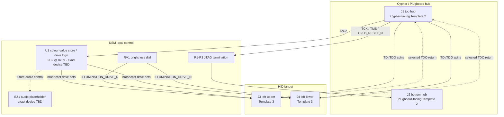

# User Settings Module (V1.0) Design Specification

**Status:** In Review
**Project:** Enigma-NG
**Author:** Izzyonstage & GitHub Copilot
**Version:** v.0.1.0
**Associated Hardware Revision:** Rev A
**Last Updated:** 2026-09-17

---

## 1. Overview

The User Settings Module (USM) is the shared LED-illumination, audio-placeholder, and JTAG/I2C
spine board for the local Cypher HID assembly. It connects upward to the Cypher Board, downward to
Cypher-Plugboard, and leftward to whichever Cypher-Input and Cypher-Output boards are installed.
USM stores three CM5-configured RGB colour values on a dedicated Cypher-peripherals I2C bus,
retains the physical brightness dial, broadcasts `RED_DRIVE_N`, `GREEN_DRIVE_N`, `BLUE_DRIVE_N`,
and `ILLUMINATION_DRIVE_N` to both HID boards, and provides the JTAG broadcast / return routing
between Cypher and the HID pair. The board carries no `ENC_DATA` signals.

| Circuit Responsibility | Board Role | Key Component |
| :--- | :--- | :--- |
| Shared HID colour hub | Holds CM5-written colour values and distributes the active LED-drive signals to both HID boards | `U1` - colour-value store / drive logic, exact device TBD |
| Shared HID brightness control | User brightness dial driving `ILLUMINATION_DRIVE_N` | `RV1` - Bourns `3310P-001-503L` |
| HID JTAG / I2C spine | Routes `TDI`/`TDO`, broadcasts `TCK`/`TMS`/`CPLD_RESET_N`, and fans out the dedicated `I2C2` bus | `J1`-`J4` |
| JTAG idle termination | Local pull network for the broadcast JTAG signals | `R1`-`R3` |
| Audio placeholder | Reserved buzzer / speaker path for a later hardware decision | `BZ1` - exact device TBD |

### Functional Requirements

| ID | Functional Requirement | Notes | Satisfied By / Cross-Ref |
| :--- | :--- | :--- | :--- |
| FR-USM-01 | Store three CM5-configured RGB colour values for the HID lighting system | Exact device remains open; address reservation and behavioural contract are defined now | Section 3; Section 4; BOM `U1` |
| FR-USM-02 | Broadcast shared LED drive and brightness signals to both HID boards regardless of their physical order | `RED_DRIVE_N`, `GREEN_DRIVE_N`, `BLUE_DRIVE_N`, `ILLUMINATION_DRIVE_N` are carried on both left connectors with identical pin maps | Section 3; Section 5; BOM `J3`, `J4`, `RV1` |
| FR-USM-03 | Relay `3V3_ENIG`, dedicated Cypher-peripherals I2C, and HID JTAG between the Cypher Board and the HID pair | Cypher uses the top hub connector; HID boards use the two left connectors; Plugboard receives only the broadcast JTAG nets on the bottom hub connector | Section 4; Section 5; BOM `J1`-`J4` |
| FR-USM-04 | Terminate the broadcast JTAG nets locally on the spine board | `TCK` pull-down, `TMS` pull-up, and `CPLD_RESET_N` pull-up move onto USM | Section 4; BOM `R1`-`R3` |
| FR-USM-05 | Reserve an audio output path for a later buzzer / speaker decision | Part selection remains deferred | Section 3; BOM `BZ1` |

### Design Requirements

| ID | Design Requirement | Specification | Satisfied By / Cross-Ref |
| :--- | :--- | :--- | :--- |
| DR-USM-01 | PCB stackup | 4-layer standard per `design/Standards/Global_Routing_Spec.md §2.3.1` | Section 6 |
| DR-USM-02 | Cypher-facing hub connector | `J1` = `QTS-025-01-L-D-RA-P`, top edge, Template 2 pin map | Section 5; BOM `J1` |
| DR-USM-03 | Plugboard-facing hub connector | `J2` = `QSS-025-01-L-D-RA-K`, bottom edge, Template 2 pin map; `TDI`/`TDO` left NC on this connector | Section 5; BOM `J2` |
| DR-USM-04 | HID-facing connectors | `J3` and `J4` = `QSS-025-01-L-D-RA-K`, left edge, Template 3 pin map, identical wiring | Section 5; BOM `J3`, `J4` |
| DR-USM-05 | Brightness dial | `RV1` = `3310P-001-503L`, retained as the shared HID brightness control source for `ILLUMINATION_DRIVE_N` | Section 3; BOM `RV1` |
| DR-USM-06 | JTAG termination resistors | `R1` = `TCK` 10 kOhm pull-down to GND; `R2` = `TMS` 10 kOhm pull-up to `3V3_ENIG`; `R3` = `CPLD_RESET_N` 10 kOhm pull-up to `3V3_ENIG` | Section 4; BOM `R1`-`R3` |
| DR-USM-07 | Colour-value store address reservation | `U1` reserved at `0x39` on `I2C2` (`Cypher-peripherals`) | Section 3 |
| DR-USM-08 | Colour-value-store implementation status | Exact colour-store IC and the local logic that maps stored values onto the four broadcast drive nets remain TBD; this contract is tracked in `.copilot/todos/cypher-input-led-independent-rgb-pwm-review.md` | Section 3; BOM `U1` |
| DR-USM-09 | Audio placeholder status | `BZ1` remains a placeholder-only BOM position pending `.copilot/todos/usm-buzzer-audio-options.md` | Section 3; BOM `BZ1` |
| DR-USM-10 | 3V3 entry decoupling bank | `C1`-`C5` = 5x 10uF X7R 50V 1206 at the USM `3V3_ENIG` entry nodes per the bulk-entry rule in `design/Standards/Global_Routing_Spec.md §3` | Section 6; BOM `C1`-`C5` |
| DR-USM-11 | Local logic bypass | `C6` = 100nF X7R 50V 0402 local logic bypass capacitor | Section 6; BOM `C6` |
| DR-USM-12 | Mounting holes | `MH1`-`MH4`: M3 PTH tied to `GND_CHASSIS` per GRS Section 4 | Section 2; Section 6 |

### Component Block Diagram

## 2. Architecture

- **Placement role:** USM is a board-to-board module in the local HID assembly. It is not a
  panel-mount switch panel.
- **Power rails:** USM carries `3V3_ENIG` only. The board has no `5V_MAIN` distribution.
- **Signal scope:** USM carries JTAG broadcast / return, the dedicated `I2C2` Cypher-peripherals
  bus, and the shared LED drive signals. It carries no `ENC_DATA` signals.
- **Mechanical deferral:** final enclosure attachment and combined Cypher-Input / Cypher-Output /
  USM packaging remain deferred to `.copilot/todos/usm-3-part-hid-module-mechanical-review.md`.

### GND_CHASSIS Single-Point Bond

Per `design/Standards/Global_Routing_Spec.md §5`, USM ties its mounting holes to
`GND_CHASSIS` but does not create a local `GND_CHASSIS` to GND bond.

## 3. Colour Store, Brightness, and Audio Placeholder

`U1` reserves the shared HID colour-store / drive-logic function on `I2C2` at address `0x39`.
The implementation shall support three independent CM5-written RGB colour values and the
broadcast of the current `RED_DRIVE_N`, `GREEN_DRIVE_N`, `BLUE_DRIVE_N`, and
`ILLUMINATION_DRIVE_N` nets to both HID boards. The exact device, buffering method, and any local
latch / DAC / PWM arrangement remain open and are tracked in
`.copilot/todos/cypher-input-led-independent-rgb-pwm-review.md`.

`RV1` remains the physical brightness dial. Its output is the shared source for
`ILLUMINATION_DRIVE_N` on both left connectors.

`BZ1` is a placeholder-only position covering the future USM buzzer / speaker decision tracked in
`.copilot/todos/usm-buzzer-audio-options.md`.

## 4. JTAG and I2C Spine Behaviour

- `TCK`, `TMS`, and `CPLD_RESET_N` are common broadcast nets across `J1`, `J2`, `J3`, and `J4`.
- `R1`-`R3` provide the USM-local idle termination for those broadcast nets.
- `TDI` from Cypher enters USM on `J1` pin 33 and is fanned out internally to both HID-facing
  `TDI_INPUT` paths on Template 3. The HID board that identifies as Cypher-Input consumes that
  path as its real TDI.
- The HID board that identifies as Cypher-Output returns its real TDO to USM on Template 3
  `TDO_OUTPUT`, and USM routes that return directly to `J1` pin 34 (`TDO`).
- `J2` pin 33 (`TDI`) and pin 34 (`TDO`) are NC on the Plugboard-facing connector.
- `I2C_SDA` / `I2C_SCL` on Template 2 and Template 3 are the dedicated `I2C2` Cypher-peripherals
  bus. USM hosts `U1` on that bus and fans the bus out to both HID-facing connectors.

## 5. Interconnects

### J1 / J2 - Hub Connector Template

Template 2 pin map:

| Top Row Signal | Top Pin# | Bottom Pin# | Bottom Row Signal |
| :--- | :---: | :---: | :--- |
| `3V3_ENIG` | 1 | 2 | `3V3_ENIG` |
| `3V3_ENIG` | 3 | 4 | `3V3_ENIG` |
| GND | 5 | 6 | GND |
| GND | 7 | 8 | GND |
| GND | 9 | 10 | GND |
| GND | 11 | 12 | GND |
| GND | 13 | 14 | GND |
| GND | 15 | 16 | GND |
| GND | 17 | 18 | `I2C_SDA` |
| GND | 19 | 20 | GND |
| `CPLD_RESET_N` | 21 | 22 | `I2C_SCL` |
| GND | 23 | 24 | GND |
| GND (bar) | 25 | 26 | GND (bar) |
| GND | 27 | 28 | GND |
| `TMS` | 29 | 30 | `TCK` |
| GND | 31 | 32 | GND |
| `TDI` | 33 | 34 | `TDO` |
| GND | 35 | 36 | GND |
| GND | 37 | 38 | GND |
| GND | 39 | 40 | GND |
| GND | 41 | 42 | GND |
| GND | 43 | 44 | GND |
| GND | 45 | 46 | GND |
| `3V3_ENIG` | 47 | 48 | `3V3_ENIG` |
| `3V3_ENIG` | 49 | 50 | `3V3_ENIG` |

- **J1 (top, Cypher-facing):** right-angle male `QTS-025-01-L-D-RA-P`, mates Cypher `J6`.
- **J2 (bottom, Plugboard-facing):** right-angle female `QSS-025-01-L-D-RA-K`, mates
  Cypher-Plugboard `J2`.
- **J1 wiring:** `3V3_ENIG` entry, `I2C2` entry, broadcast `TCK`/`TMS`/`CPLD_RESET_N`, `TDI`
  source from Cypher, `TDO` return to Cypher.
- **J2 wiring:** `3V3_ENIG`, GND, and the broadcast JTAG nets are present; `TDI` and `TDO` are
  NC on this connector.

### J3 / J4 - HID-Facing Left Connector Template

Template 3 pin map:

| Top Row Signal | Top Pin# | Bottom Pin# | Bottom Row Signal |
| :--- | :---: | :---: | :--- |
| `3V3_ENIG` | 1 | 2 | `3V3_ENIG` |
| `3V3_ENIG` | 3 | 4 | `3V3_ENIG` |
| GND | 5 | 6 | GND |
| GND | 7 | 8 | `TCK` |
| `I2C_SDA` | 9 | 10 | GND |
| GND | 11 | 12 | `TMS` |
| `I2C_SCL` | 13 | 14 | GND |
| GND | 15 | 16 | `TDO_OUTPUT` |
| `RED_DRIVE_N` | 17 | 18 | GND |
| `GREEN_DRIVE_N` | 19 | 20 | `TDI_OUTPUT` |
| `BLUE_DRIVE_N` | 21 | 22 | GND |
| `ILLUMINATION_DRIVE_N` | 23 | 24 | `CPLD_RESET_N` |
| GND (bar) | 25 | 26 | GND (bar) |
| `CPLD_RESET_N` | 27 | 28 | `ILLUMINATION_DRIVE_N` |
| GND | 29 | 30 | `BLUE_DRIVE_N` |
| `TDI_INPUT` | 31 | 32 | `GREEN_DRIVE_N` |
| GND | 33 | 34 | `RED_DRIVE_N` |
| `TDO_INPUT` | 35 | 36 | GND |
| GND | 37 | 38 | `I2C_SCL` |
| `TMS` | 39 | 40 | GND |
| GND | 41 | 42 | `I2C_SDA` |
| `TCK` | 43 | 44 | GND |
| GND | 45 | 46 | GND |
| `3V3_ENIG` | 47 | 48 | `3V3_ENIG` |
| `3V3_ENIG` | 49 | 50 | `3V3_ENIG` |

- **J3 (left-upper):** right-angle female `QSS-025-01-L-D-RA-K`, mates whichever HID board is in
  the upper position.
- **J4 (left-lower):** right-angle female `QSS-025-01-L-D-RA-K`, mates whichever HID board is in
  the lower position.
- `3V3_ENIG`, `I2C_SDA`, `I2C_SCL`, `CPLD_RESET_N`, `TMS`, `TCK`, `RED_DRIVE_N`,
  `GREEN_DRIVE_N`, `BLUE_DRIVE_N`, and `ILLUMINATION_DRIVE_N` are tied column-for-column across
  both rows and across both connectors.
- `TDI_INPUT` / `TDO_INPUT` are consumed by whichever connected board identifies as
  Cypher-Input.
- `TDI_OUTPUT` / `TDO_OUTPUT` are consumed by whichever connected board identifies as
  Cypher-Output.

## 6. PCB Fabrication & Stackup

- **Stackup:** 4-layer standard per `design/Standards/Global_Routing_Spec.md §2.3.1`.
- **Routing:** keep the `I2C2` pair short from `J1` to `U1`; place `R1`-`R3` near the broadcast
  JTAG fanout point; keep the two left connectors identical.
- **Bulk entry decoupling:** `C1`-`C5` provide the local `3V3_ENIG` entry reservoir bank.
- **Mounting holes:** `MH1`-`MH4`, M3 PTH, tied to `GND_CHASSIS`.

## 7. Thermal & ESD

- **Thermal:** no active cooling required.
- **ESD:** `J1`-`J4` are internal board-to-board connectors; no TVS devices are required by
  GRS Section 9.

## 8. Bill of Materials

| RefDes | Specification | MPN | Manufacturer | DigiKey PN | Mouser PN | JLCPCB PN | Alt Supplier + PN | Notes | Footprint Available | Footprint Downloaded | Qty |
| --- | --- | --- | --- | --- | --- | --- | --- | --- | --- | --- | --- |
| `C1-C5` | 10uF X7R 50V 1206 | CL31B106KBK6PJE | Samsung | 1276-CL31B106KBK6PJECT-ND | 187-CL31B106KBK6PJE | C43935922 | - | `3V3_ENIG` bulk-entry bank | ✔ | ✔ | 5 |
| `C6` | 100nF X7R 50V 0402 | CL05B104KB5NNNC | Samsung | 1276-CL05B104KB5NNNCCT-ND | 187-CL05B104KB5NNNC | C960916 | - | Local logic bypass | ✔ | ✔ | 1 |
| `J1` | 50-contact 0.635mm right-angle male SMT | QTS-025-01-L-D-RA-P | Samtec | QTS-025-01-L-D-RA-P-ND | 200-QTS02501LDRAP | C7267889 | - | Top hub connector to Cypher `J6` | ✔ | ✔ | 1 |
| `J2-J4` | 50-contact 0.635mm right-angle female SMT | QSS-025-01-L-D-RA-K | Samtec | QSS-025-01-L-D-RA-K-ND | 200-QSS02501LDRAK | C6156774 | - | `J2` bottom hub to Plugboard; `J3`/`J4` left HID connectors | ✔ | ✔ | 3 |
| `R1-R3` | 10kOhm 1% 0402 | ERJ-2RKF1002X | Panasonic | P10.0KLCT-ND | 667-ERJ-2RKF1002X | C191123 | - | `R1`=`TCK`; `R2`=`TMS`; `R3`=`CPLD_RESET_N` | ✔ | ✔ | 3 |
| `RV1` | 0-50 kOhm linear rotary potentiometer, panel-mount | 3310P-001-503L | Bourns | 3310P-001-503L-ND | 652-3310P-001-503L | C5891432 | - | Shared HID brightness dial | ✔ | ✔ | 1 |
| `U1` | Colour-value store / drive logic, I2C, exact device TBD | TBD | TBD | - | - | - | - | Reserved at `I2C2` address `0x39`; see `.copilot/todos/cypher-input-led-independent-rgb-pwm-review.md` | - | - | 1 |
| `BZ1` | Audio transducer / driver path, exact device TBD | TBD | TBD | - | - | - | - | Placeholder only; see `.copilot/todos/usm-buzzer-audio-options.md` | - | - | 1 |
